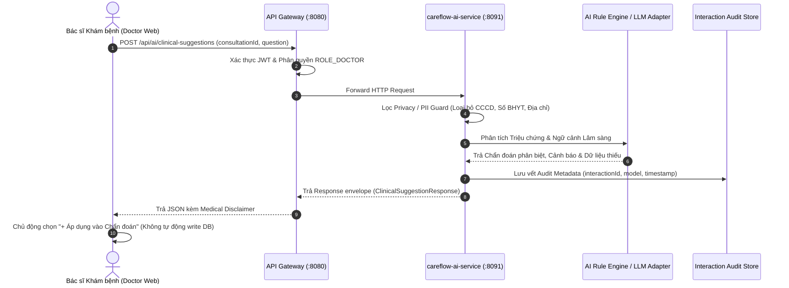

# Vòng Đời Yêu Cầu (Request Lifecycle & Data Flow) — AI Clinical Assistant Service

Tài liệu mô tả chi tiết Vòng đời xử lý một Yêu cầu Lâm sàng (Request Lifecycle) từ lúc Bác sĩ thao tác trên Frontend Doctor Web đến khi AI Service phản hồi kết quả và lưu vết Audit Metadata.

---

## 1. Sơ đồ Luồng Vòng Đời Yêu Cầu (Request Sequence Workflow)



---

## 2. Chi tiết 6 Giai đoạn trong Vòng Đời Request

### Giai đoạn 1: Khởi tạo Yêu cầu (Request Initiation)
- **Hành động**: Bác sĩ bấm nút gợi ý nhanh (*"💡 Gợi ý Chẩn đoán Phân biệt"*) hoặc gõ câu hỏi tại tab **🤖 Trợ lý AI Lâm sàng** trên trang `/consultation/[id]`.
- **Payload**:
  ```json
  {
    "consultationId": "35df361e-f4b3-4113-ad0d-0ed853fe61fc",
    "question": "Gợi ý các khả năng chẩn đoán phân biệt cần cân nhắc"
  }
  ```

---

### Giai đoạn 2: Định tuyến & Bảo mật (Gateway Routing & Auth Guard)
- **API Gateway (`:8080`)**:
  1. Kiểm tra Token JWT trong Header `Authorization: Bearer <token>`.
  2. Xác minh vai trò người dùng có chứa quyền `ROLE_DOCTOR`.
  3. Định tuyến HTTP Request tới service đích: `lb://ai-service` (Port `8091`).

---

### Giai đoạn 3: Lọc Ngữ cảnh & Quyền riêng tư (Context Filtering & Privacy Guard)
- **`careflow-ai-service` (`:8091`)**:
  1. Tiếp nhận DTO `ClinicalSuggestionRequest`.
  2. Áp dụng bộ lọc thông tin cá nhân (PII Removal Guard): Loại bỏ hoàn toàn mã BHYT, CCCD, Địa chỉ nhà của bệnh nhân trước khi đưa vào mô hình phân tích.
  3. Đảm bảo chống Prompt Injection từ dữ liệu ghi chú lâm sàng.

---

### Giai đoạn 4: Phân tích & Sinh Phản hồi (Rule Engine / Model Execution)
- **Engine Execution**:
  1. Mô hình phân tích các cụm từ khóa triệu chứng (*tim mạch, nhi khoa, sốt, tiêu hóa...*).
  2. Khai thác dữ liệu sinh hiệu & tiền sử dị ứng (`CRITICAL` / `WARNING`).
  3. Gắn thẻ Bằng chứng thật (`EvidenceRef`) trỏ trực tiếp đến `sourceType` (`CONSULTATION`, `EMR`, `LAB`).
  4. Đính kèm **Medical Disclaimer bắt buộc**:
     > *"Gợi ý hỗ trợ lâm sàng từ CareFlow AI. Bác sĩ chịu trách nhiệm hoàn toàn đối với quyết định chẩn đoán và chỉ định điều trị."*

---

### Giai đoạn 5: Lưu vết Kiểm toán (Audit Metadata Logging)
- **Interaction Audit**:
  1. Sinh `interactionId` ngẫu nhiên (UUID).
  2. Ghi nhận thời gian phát sinh `generatedAt`, model name (`careflow-clinical-v1`), mode (`MOCK_RULE_BASED`).
  3. Lưu vết Interaction vào bộ nhớ để hỗ trợ truy vết pháp lý qua API `GET /api/ai/interactions/{interactionId}`.

---

### Giai đoạn 6: Phản hồi & Xác nhận của Bác sĩ (Response & Human-in-the-Loop)
- **Phản hồi Frontend**: Trả về giao diện Doctor Web danh sách gợi ý kèm thẻ Bằng chứng và nút bấm chọn.
- **Nguyên tắc An toàn Y tế (Guardrail)**: AI **KHÔNG BAO GIỜ tự động gọi API ghi dữ liệu (Write API)** vào Đơn thuốc hay Chẩn đoán. Bác sĩ là người duy nhất bấm nút **`[ + Áp dụng vào Chẩn đoán ]`** để đưa thông tin chính thức vào Hồ sơ bệnh án.
