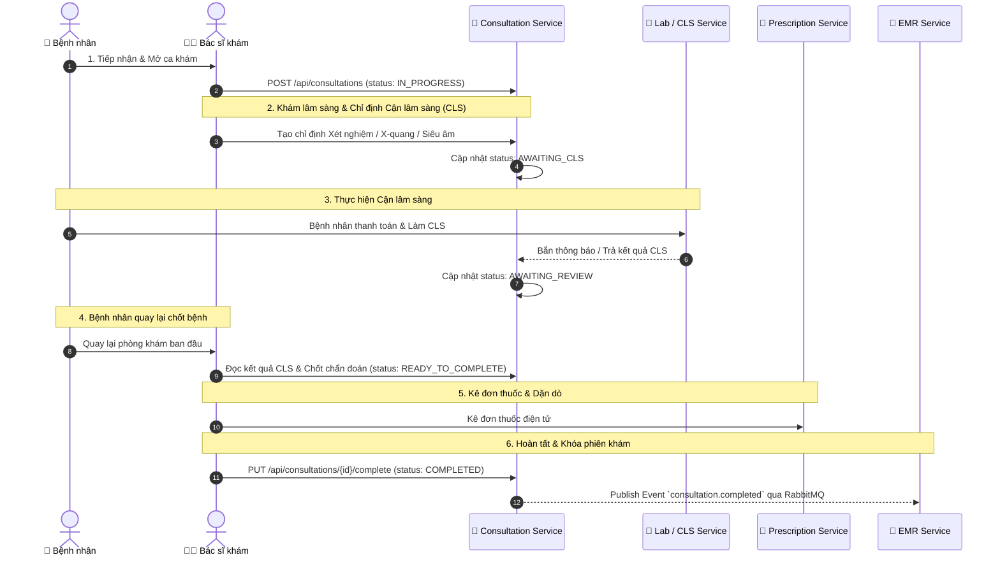

# CareFlow Consultation Service - Nghiệp vụ Khám bệnh Chi tiết

## 1. Mục đích
Nghiệp vụ khám bệnh dùng để bác sĩ thực hiện đánh giá lâm sàng cho bệnh nhân trong một lượt khám cụ thể, ghi nhận sinh hiệu, triệu chứng, nhận định, chỉ định cận lâm sàng (CLS/Lab), chẩn đoán xác định và các kê đơn thuốc tiếp theo. Kết quả của nghiệp vụ này là một phiên khám hợp lệ, được lưu vào EMR và làm đầu vào cho kê đơn thuốc (`careflow-prescription-service`) cũng như quản lý Bệnh án điện tử.

## 2. Mô hình Database (DBML)
Sơ đồ thiết kế CSDL chi tiết được quản lý tại: [.planning/consultation-service/consultation-db.dbml](file:///home/levi/Desktop/careflow/.planning/consultation-service/consultation-db.dbml).

---

## 3. Quy trình Khám bệnh Thực tế (Real-world Clinical Journey)

Trong thực tế bệnh viện, quy trình không chỉ đơn thuần là "Khám ➔ Kê đơn ➔ Xong", mà là một trục trung tâm điều phối hành trình bệnh nhân:

---

## 4. State Machine - Quản lý Trạng thái Ca khám

Hệ thống quản lý trạng thái ca khám theo mô hình State Machine linh hoạt sát với thực tế bệnh viện:

| Trạng thái (Status) | Ý nghĩa Nghiệp vụ | Mô tả Chi tiết |
| :--- | :--- | :--- |
| **`IN_PROGRESS`** | Đang khám ban đầu | Bác sĩ mở ca khám, hỏi bệnh sử, khám lâm sàng & đo sinh hiệu. |
| **`AWAITING_CLS`** | Chờ làm Cận lâm sàng | Đã phát ra chỉ định (Xét nghiệm, Siêu âm, X-quang). Bệnh nhân đi thanh toán & làm CLS. |
| **`AWAITING_REVIEW`** | Chờ bác sĩ duyệt kết quả | Đã có kết quả CLS từ phòng Lab. Bệnh nhân quay lại chờ bác sĩ xem và kết luận. |
| **`READY_TO_COMPLETE`**| Đủ dữ liệu chốt chẩn đoán | Đã có đầy đủ lâm sàng + CLS, bác sĩ đã nhập chẩn đoán xác định ICD-10. |
| **`COMPLETED`** | Hoàn tất ca khám | Đã kê đơn xong, khóa dữ liệu ca khám và đẩy Event sang EMR. |
| **`CANCELLED`** | Hủy ca khám | Bệnh nhân bỏ về hoặc hủy ca khám giữa chừng. |
| **`TRANSFERRED`** | Chuyển viện / Chuyển khoa | Chuyển bệnh nhân sang khoa khác hoặc tuyến trên. |

---

## 5. Các bước xử lý trong ca khám (Chi tiết 6 Bước)

1. **Mở phiên khám**: Bác sĩ chọn ca khám từ danh sách chờ. Hệ thống chuyển trạng thái `status` thành `IN_PROGRESS` và ghi nhận `started_at = NOW()`.
2. **Ghi nhận Sinh hiệu & Khám sơ bộ**: Nhập nhiệt độ, huyết áp, nhịp tim, SpO2, chiều cao, cân nặng và triệu chứng ban đầu.
3. **Chỉ định Cận lâm sàng (nếu cần)**: Nếu cần xét nghiệm/chẩn đoán hình ảnh, bác sĩ tạo đơn chỉ định. Ca khám chuyển sang trạng thái `AWAITING_CLS`.
4. **Đọc kết quả & Chốt chẩn đoán**: Khi phòng Lab/CLS trả kết quả, ca khám chuyển `AWAITING_REVIEW`. Bệnh nhân quay lại phòng khám, bác sĩ đọc kết quả, chốt chẩn đoán ICD-10 (`icd10_code`, `icd10_name`) và chuyển `READY_TO_COMPLETE`.
5. **Kê đơn thuốc**: Bác sĩ tạo đơn thuốc điện tử liên thông với `careflow-prescription-service`.
6. **Hoàn tất ca khám**: Cập nhật `status = COMPLETED` và `completed_at = NOW()`. Khóa dữ liệu và đồng bộ tự động sang EMR qua RabbitMQ Event.

---

## 6. Quy tắc đồng bộ DB
Khi bổ sung trường mới hoặc enum trạng thái mới vào JPA Entity `Consultation.java`, lập tức cập nhật file `consultation-db.dbml` tương ứng.
