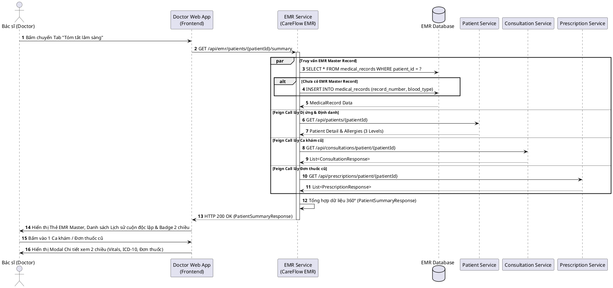
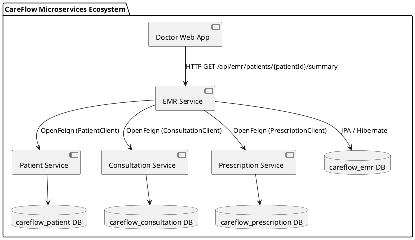

# Báo cáo Đặc tả Use Case UC6 — Tra cứu Hồ sơ Bệnh án Điện tử (EMR)

Tài liệu này cung cấp báo cáo chi tiết về Use Case UC6, bao gồm **Mô tả nghiệp vụ tổng quan**, **Đặc tả Use Case hoàn chỉnh theo chuẩn SRS/Bảng chuẩn**, và **Code DBML thiết kế cơ sở dữ liệu** phục vụ báo cáo đồ án / nghiệm thu tài liệu kiến trúc phần mềm CareFlow.

---

## I. Mô tả Nghiệp vụ Use Case UC6

### 1. Giới thiệu tổng quan
**Use Case 6 – Tra cứu Hồ sơ Bệnh án Điện tử (UC6)** là nghiệp vụ trung tâm của dịch vụ `careflow-emr-service`. Tính năng này cung cấp cho **Bác sĩ** một góc nhìn toàn diện 360° (Patient Summary / Chart Summary) về lịch sử y tế của bệnh nhân ngay tại thời điểm khám bệnh.

### 2. Kiến trúc Liên thông (API Aggregation Pattern)
Hệ thống không lưu duplicate lịch sử ca khám hay đơn thuốc tại EMR Database, mà sử dụng **API Aggregation Pattern**:
- **EMR Service**: Lưu trữ & cung cấp Hồ sơ Bệnh án Chủ (`medical_records`: Mã EMR `record_number`, Nhóm máu `blood_type`, Tiền sử bệnh nền `medical_history`).
- **Patient Service**: Cung cấp Thông tin định danh & Danh sách Cảnh báo Dị ứng cấu trúc 3 Mức (`patient_allergies`: Critical, Warning, Info).
- **Consultation Service**: Cung cấp Lịch sử các ca khám cũ (Sinh hiệu, Triệu chứng, Chẩn đoán ICD-10).
- **Prescription Service**: Cung cấp Lịch sử đơn thuốc đã kê & danh mục thuốc đính kèm.

---

## II. Bảng Đặc tả Use Case UC6 (Use Case Specification)

| Mục | Nội dung chi tiết |
| :--- | :--- |
| **Mã Use Case** | **UC6** |
| **Tên Use Case** | **Tra cứu Hồ sơ Bệnh án Điện tử (View Electronic Medical Record)** |
| **Tác nhân chính (Actor)** | **Bác sĩ (Doctor)** |
| **Tác nhân phụ** | Patient Service, Consultation Service, Prescription Service (System Actors) |
| **Mô tả ngắn gọn** | Bác sĩ tra cứu toàn bộ hồ sơ bệnh án điện tử của bệnh nhân đang khám bao gồm: Mã EMR master, Nhóm máu, Tiền sử bệnh nền, Cảnh báo dị ứng 3 mức, Lịch sử các phiên khám cũ và Đơn thuốc đính kèm. |
| **Tiền điều kiện (Preconditions)** | 1. Bác sĩ đã đăng nhập thành công vào Doctor Web App.<br>2. Bác sĩ đang trong phiên khám của một bệnh nhân cụ thể (`/consultation/[id]`).<br>3. Bệnh nhân đã có bản ghi tồn tại trong hệ thống. |
| **Hậu điều kiện (Postconditions)** | 1. Toàn bộ hồ sơ tổng hợp (Patient Summary 360°) được hiển thị trên giao diện Web.<br>2. Hệ thống ghi nhận Audit Log hành vi tra cứu hồ sơ bệnh án của bác sĩ. |
| **Luồng sự kiện chính (Main Flow)** | **1.** Bác sĩ chọn Tab **"4. Tóm tắt lâm sàng"** trên giao diện phòng khám.<br>**2.** Frontend (`doctor-web`) gửi yêu cầu HTTP GET `/api/emr/patients/{patientId}/summary` tới EMR Service (thông qua API Gateway).<br>**3.** EMR Service tiếp nhận yêu cầu và đồng thời (Parallel Execution):<br>&nbsp;&nbsp;&nbsp;&nbsp;a. Truy vấn bảng `medical_records` trong EMR DB (nếu chưa có, tự động tạo mới EMR Master Record).<br>&nbsp;&nbsp;&nbsp;&nbsp;b. Gọi Feign Client `PatientClient` lấy thông tin cá nhân & dị ứng 3 mức.<br>&nbsp;&nbsp;&nbsp;&nbsp;c. Gọi Feign Client `ConsultationClient` lấy lịch sử các phiên khám trước.<br>&nbsp;&nbsp;&nbsp;&nbsp;d. Gọi Feign Client `PrescriptionClient` lấy danh sách đơn thuốc đã kê.<br>**4.** EMR Service tổng hợp dữ liệu thành `PatientSummaryResponse` và trả về cho Frontend.<br>**5.** Frontend hiển thị:<br>&nbsp;&nbsp;&nbsp;&nbsp;- Thẻ **EMR Master Record** (Mã EMR, Nhóm máu, Bệnh nền).<br>&nbsp;&nbsp;&nbsp;&nbsp;- **Lịch sử khám bệnh gần đây** (có con lăn cuộn độc lập, nhãn đính kèm đơn thuốc).<br>&nbsp;&nbsp;&nbsp;&nbsp;- **Đơn thuốc đã dùng gần đây** (có con lăn cuộn độc lập, nhãn mã ICD-10).<br>**6.** Bác sĩ bấm vào 1 ca khám hoặc đơn thuốc cũ $\rightarrow$ Hệ thống hiển thị **Modal Chi tiết xem 2 chiều** (không làm chuyển trang). |
| **Luồng thay thế (Alternate Flows)** | **A1. Bệnh nhân chưa có EMR Master Record:**<br>Tại bước 3a, EMR Service tự động khởi tạo hồ sơ EMR mới với `record_number` sinh tự động (dạng `EMR-YYYY-XXXXXX`) và nhóm máu mặc định "Chưa rõ", sau đó tiếp tục luồng chính.<br>**A2. Một trong các microservice liên thông phản hồi chậm / lỗi:**<br>Tại bước 3b/3c/3d, EMR Service bắt ngoại lệ (try-catch fallback), vẫn trả về các dữ liệu khả dụng còn lại kèm theo ghi nhận log warning. |
| **Luồng ngoại lệ (Exception Flows)** | **E1. Không tìm thấy ID Bệnh nhân:**<br>Hệ thống trả về HTTP Status `404 Not Found` kèm thông báo "Không tìm thấy dữ liệu bệnh nhân".<br>**E2. Lỗi mất kết nối hệ thống:**<br>Frontend hiển thị thông báo lỗi nhẹ nhàng và cho phép bấm thử lại. |
| **Quy định Giao diện (UI/UX Rules)** | 1. **Dị ứng > Nhóm máu > Mã EMR** (Về độ ưu tiên lâm sàng an toàn kê đơn).<br>2. **Header gọn gàng**: Chỉ giữ định danh + Banner Cảnh báo Dị ứng 3 Mức.<br>3. **Subtle Rounded Design System**: Các component sử dụng bo góc nhẹ (`rounded-lg` / `rounded-md`) hiện đại.<br>4. **Không dùng Emoji thô kịch**: Loại bỏ các icon emoji viên thuốc hay hình ảnh không đạt chuẩn y tế. |

---

## III. Thiết kế Cơ sở Dữ liệu (DBML Code)

Dưới đây là mã nguồn DBML thiết kế cơ sở dữ liệu cho `careflow-emr-service` (`emr-db.dbml`). Bạn có thể copy trực tiếp mã này vào công cụ [dbdocs.io](https://dbdocs.io) hoặc [dbdiagram.io](https://dbdiagram.io) để sinh sơ đồ ERD.

```dbml
// CareFlow - EMR (Electronic Medical Record) Service Database Design
// Schema: careflow_emr

Project CareFlow_EMR_Service {
  database_type: 'PostgreSQL'
  note: 'Database Schema cho dịch vụ Bệnh án Điện tử liên thông (CareFlow EMR Service)'
}

Table medical_records {
  id uuid [pk, note: 'Khóa chính UUID ngẫu nhiên']
  patient_id uuid [not null, unique, note: 'Khóa ngoại tham chiếu bệnh nhân (Patient Service)']
  record_number varchar(50) [not null, unique, note: 'Mã số hồ sơ bệnh án duy nhất (Format: EMR-YYYY-XXXXXX)']
  blood_type varchar(10) [note: 'Nhóm máu (A, B, AB, O, Rh+, Rh-)']
  medical_history text [note: 'Tiền sử bệnh bản thân & gia đình (Ghi chú: Dị ứng cấu trúc hóa lưu tại Patient Service)']
  created_at timestamptz [not null, note: 'Thời điểm tạo hồ sơ bệnh án']
  updated_at timestamptz [not null, note: 'Thời điểm cập nhật gần nhất']

  indexes {
    patient_id [name: 'idx_emr_patient', unique, note: 'Index Unique tra cứu hồ sơ theo bệnh nhân']
    record_number [name: 'uk_emr_record_number', unique, note: 'Index Unique mã số hồ sơ EMR']
  }
}
```

---

## V. Sơ đồ PlantUML (PlantUML Code Diagrams)

### 1. Sơ đồ Tuần tự (Sequence Diagram — UC6 Tra cứu Hồ sơ EMR 360°)


### 2. Sơ đồ Kiến trúc Thành phần (Component Diagram — Microservices Interaction)


