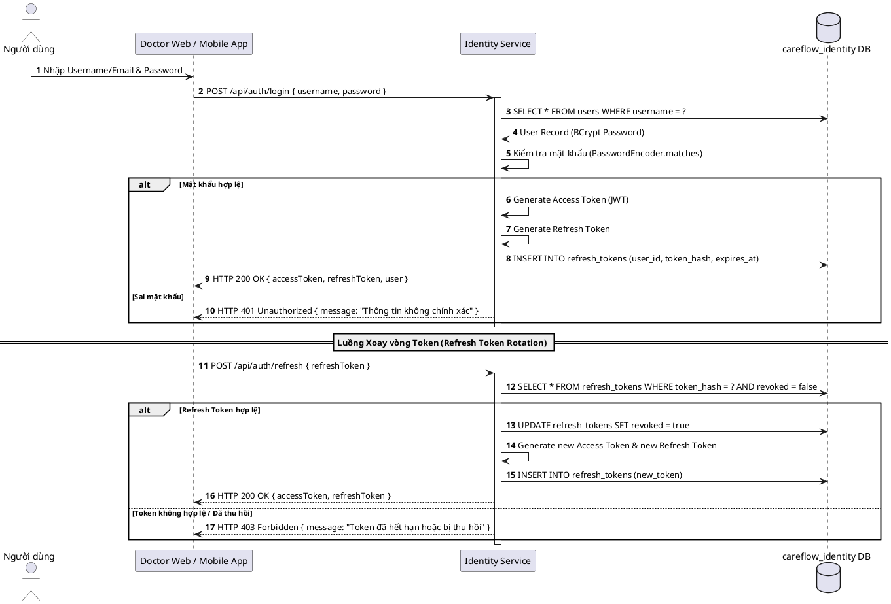

# Báo cáo Đặc tả Use Case UC1 — Đăng nhập & Quản lý Định danh (Identity Service)

---

## I. Mô tả Nghiệp vụ Use Case UC1

### 1. Giới thiệu tổng quan
**Identity Service** đảm nhiệm vai trò trung tâm trong việc quản lý tài khoản người dùng, xác thực (Authentication), phân quyền (Authorization), cấp phát Access Token (JWT) và xoay vòng Refresh Token (Refresh Token Rotation).

---

## II. Bảng Đặc tả Use Case UC1 (Use Case Specification)

| Mục | Nội dung chi tiết |
| :--- | :--- |
| **Mã Use Case** | **UC1** |
| **Tên Use Case** | **Đăng nhập & Quản lý Định danh (User Authentication & Identity Management)** |
| **Tác nhân chính (Actor)** | **Người dùng hệ thống (Bác sĩ / Nhân viên y tế / Bệnh nhân)** |
| **Mô tả ngắn gọn** | Cho phép người dùng đăng nhập bằng tài khoản (Username/Email & Password), nhận mã Access Token (JWT) để gọi API và Refresh Token để duy trì phiên làm việc an toàn. |
| **Tiền điều kiện** | Tài khoản đã được tạo và kích hoạt trên bảng `identity.users`. |
| **Hậu điều kiện** | Cấp Access Token (có hạn 1h) và Refresh Token (có hạn 7 ngày, lưu trữ hash mã hóa). |
| **Luồng sự kiện chính** | **1.** Người dùng nhập Email/Username & Mật khẩu trên Web/Mobile.<br>**2.** Frontend gửi `POST /api/auth/login`.<br>**3.** Identity Service kiểm tra thông tin đăng nhập và băm BCrypt mật khẩu.<br>**4.** Tạo Access Token (JWT) chứa thông tin `userId`, `role`, `email`.<br>**5.** Tạo Refresh Token ngẫu nhiên, lưu hash vào DB bảng `refresh_tokens`.<br>**6.** Trả về cặp Token cho Frontend. |

---

## III. Sơ đồ PlantUML (PlantUML Diagrams)

### 1. Sơ đồ Tuần tự (Sequence Diagram — Authentication & Token Rotation)


---

## IV. Mã DBML Cơ sở dữ liệu (`identity-db.dbml`)

```dbml
// CareFlow - Identity Service Database Design
// Schema: careflow_identity

Project CareFlow_Identity_Service {
  database_type: 'PostgreSQL'
  note: 'Database Schema cho dịch vụ Quản lý Định danh & Tài khoản (CareFlow Identity Service)'
}

Table users {
  id uuid [pk, note: 'Khóa chính UUID ngẫu nhiên']
  username varchar(50) [not null, unique, note: 'Tên đăng nhập duy nhất']
  email varchar(100) [not null, unique, note: 'Địa chỉ Email duy nhất']
  password_hash varchar(255) [not null, note: 'Mật khẩu đã băm bằng BCrypt']
  full_name varchar(100) [not null, note: 'Họ và tên người dùng']
  role varchar(20) [not null, note: 'Vai trò: DOCTOR, PATIENT, ADMIN, PHARMACIST']
  phone_number varchar(20) [note: 'Số điện thoại liên hệ']
  status varchar(20) [not null, default: 'ACTIVE', note: 'Trạng thái: ACTIVE, INACTIVE, BLOCKED']
  created_at timestamptz [not null, note: 'Thời điểm tạo tài khoản']
  updated_at timestamptz [not null, note: 'Thời điểm cập nhật gần nhất']

  indexes {
    username [name: 'uk_user_username', unique]
    email [name: 'uk_user_email', unique]
  }
}

Table refresh_tokens {
  id uuid [pk, note: 'Khóa chính UUID ngẫu nhiên']
  user_id uuid [not null, note: 'Khóa ngoại tham chiếu users.id']
  token_hash varchar(255) [not null, unique, note: 'Mã băm token để kiểm tra an toàn']
  revoked boolean [not null, default: false, note: 'Đã bị thu hồi chưa']
  expires_at timestamptz [not null, note: 'Thời điểm hết hạn token']
  created_at timestamptz [not null, note: 'Thời điểm phát hành token']

  indexes {
    user_id [name: 'idx_refresh_token_user']
    token_hash [name: 'uk_refresh_token_hash', unique]
  }
}

Ref: refresh_tokens.user_id > users.id [delete: cascade]
```
