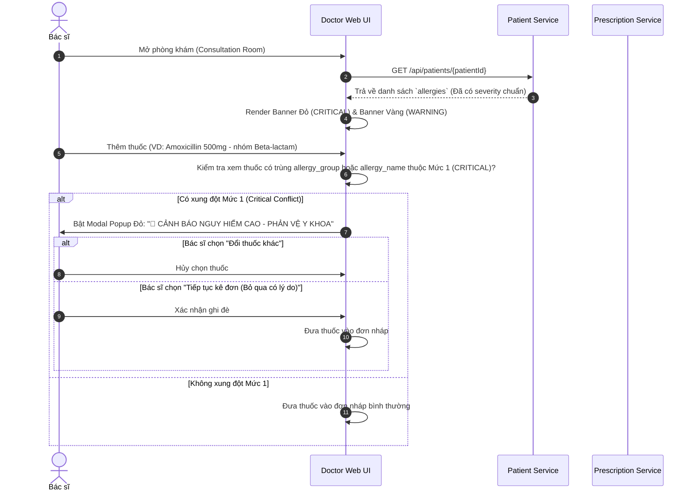

# ĐẶC TẢ HỆ THỐNG CẢNH BÁO DỊ ỨNG & CHẶN KÊ ĐƠN AN TOÀN LÂM SÀNG (3-LEVEL CLINICAL ALLERGY GUARDRAIL)

Tài liệu này mô tả chi tiết kiến trúc dữ liệu, quy tắc phân loại 3 mức độ dị ứng chuẩn y tế và cơ chế kiểm tra an toàn kê đơn theo thời gian thực (Real-time Active Drug Safety Intercept) trong phân hệ **Doctor Consultation Service** và **Doctor Web App**.

---

## 1. TỔNG QUAN KIẾN TRÚC DỮ LIỆU CẤU TRÚC HÓA

Thay vì sử dụng các chuỗi text thô tự do (`free text`) hoặc phân tích từ khóa ở Frontend (gây thiếu nhất quán và rủi ro bỏ sót lâm sàng), hệ thống **CareFlow** quản lý dị ứng bệnh nhân dưới dạng các bản ghi cấu trúc hóa trong PostgreSQL (`patient-service`).

### Sơ đồ Bảng Database: `patient_allergies`

```sql
CREATE TABLE patient_allergies (
    id UUID PRIMARY KEY DEFAULT gen_random_uuid(),
    patient_id UUID NOT NULL REFERENCES patients(id) ON DELETE CASCADE,
    allergy_name VARCHAR(100) NOT NULL,      -- Tên chất dị ứng (VD: Penicillin, Phấn hoa)
    allergy_group VARCHAR(100),              -- Nhóm dược lý / môi trường (VD: Beta-lactam, NSAID, Environment)
    severity VARCHAR(20) NOT NULL,            -- Mức độ nghiêm trọng: 'CRITICAL', 'WARNING', 'INFO'
    reaction VARCHAR(255),                    -- Phản ứng lâm sàng (VD: Nổi mề đai, sốc phản vệ)
    confirmed_by VARCHAR(100),                -- Bác sĩ / Nguồn xác nhận
    created_at TIMESTAMP WITH TIME ZONE DEFAULT CURRENT_TIMESTAMP,
    updated_at TIMESTAMP WITH TIME ZONE DEFAULT CURRENT_TIMESTAMP
);
```

---

## 2. PHÂN LOẠI 3 MỨC ĐỘ NGUY HIỂM (3-LEVEL SEVERITY RULES)

Hệ thống phân tách cảnh báo thành **3 cấp độ rõ ràng** để tối ưu hóa khả năng nhận biết của bác sĩ, đồng thời tránh tình trạng **Alert Fatigue (Mệt mỏi cảnh báo)**:

| Mức độ (Severity) | Tên gọi & Nguy cơ | Thiết kế Giao diện Bác sĩ (Doctor Web UI) | Hành vi khi Kê đơn Thuốc (Prescription Behavior) |
| :--- | :--- | :--- | :--- |
| **Mức 1 — CRITICAL** | **Dị ứng nặng & Phản vệ**<br>*(Ví dụ: Sốc phản vệ Penicillin, co thắt phế quản NSAID)* | **Banner Đỏ Nổi bật (`bg-red-600 text-white`)**<br>Icon 🚨 nhấp nháy, sticky trên cùng phòng khám. | **CHẶN CHỦ ĐỘNG (Hard Intercept)**:<br>Khi bác sĩ chọn thuốc chứa nhóm dị ứng $\rightarrow$ Bật **Modal Cảnh báo Đỏ** ép xác nhận lý do hoặc chọn thuốc khác. |
| **Mức 2 — WARNING** | **Cần lưu ý & Môi trường**<br>*(Ví dụ: Dị ứng phấn hoa, hải sản, mẩn ngứa nhẹ)* | **Banner Vàng Amber (`bg-amber-50 border-amber-300`)**<br>Icon ⚠️ nằm phía dưới Banner Mức 1. | **CẢNH BÁO NHẸ (Soft Alert)**:<br>Hiển thị ghi chú cảnh báo màu vàng, **không chặn** thao tác kê đơn. |
| **Mức 3 — INFO** | **Thông tin bệnh nền**<br>*(Ví dụ: Tiền sử Tăng huyết áp, Đái tháo đường)* | **Card xám-xanh** trong Tab **"Tổng quan & Tiền sử"**. | **KHÔNG CAN THIỆP** luồng kê đơn. Chỉ phục vụ tham khảo lâm sàng. |

---

## 3. LUỒNG KIỂM TRA AN TOÀN KÊ ĐƠN (DRUG SAFETY INTERCEPT WORKFLOW)



---

## 4. DỮ LIỆU MẪU ĐÃ ĐƯỢC SEED ĐỂ TEST TÍNH NĂNG

Hệ thống đã được seed sẵn dữ liệu dị ứng cấu trúc hóa cho các bệnh nhân thử nghiệm trong `careflow-patient-service`:

1. **Bệnh nhân Phạm Đức Anh** (`f0000001-0000-0000-0000-000000000004`):
   - 🔴 **CRITICAL**: `Penicillin` (Nhóm: `Beta-lactam`) — *Nổi mề đai, sưng môi, nguy cơ sốc phản vệ*.
   - 🟡 **WARNING**: `Phấn hoa` (Nhóm: `Environment`) — *Hắt hơi, ngứa mũi, chảy nước mắt*.

2. **Bệnh nhân Nguyễn Thị Mai** (`f0000001-0000-0000-0000-000000000001`):
   - 🔴 **CRITICAL**: `Penicillin` (Nhóm: `Beta-lactam`) — *Nổi mề đai nặng toàn thân*.
   - 🟡 **WARNING**: `Hải sản (tôm, cua)` (Nhóm: `Food`) — *Mẩn ngứa da ngực*.

3. **Bệnh nhân Lê Thị Hoa** (`f0000001-0000-0000-0000-000000000003`):
   - 🔴 **CRITICAL**: `Aspirin / NSAID` (Nhóm: `NSAID`) — *Đau bụng cấp, sưng phù nếp mi*.

---

## 5. HƯỚNG DẪN KIỂM THỬ TÍNH NĂNG (HOW TO TEST)

1. Khởi chạy ứng dụng: `./start.sh`
2. Mở trình duyệt Web Doctor: `http://localhost:3000`
3. Vào danh sách hàng đợi $\rightarrow$ Bấm **"Gọi khám"** bệnh nhân **Phạm Đức Anh**.
4. Quan sát Header ca khám:
   - Thấy **Banner Đỏ Mức 1**: `Penicillin (Nổi mề đai, sưng môi, nguy cơ sốc phản vệ)`.
   - Thấy **Banner Vàng Mức 2**: `Phấn hoa (Hắt hơi, ngứa mũi, chảy nước mắt)`.
5. Mở Kê đơn thuốc $\rightarrow$ Chọn **Amoxicillin 500mg** (hoặc **Cephalexin 500mg** thuộc nhóm Beta-lactam) $\rightarrow$ Bấm **"Thêm vào đơn"**.
6. **Kết quả**: Modal Popup đỏ cảnh báo nguy cơ phản vệ lập tức bật ra chặn lại, đúng như thiết kế lâm sàng!
