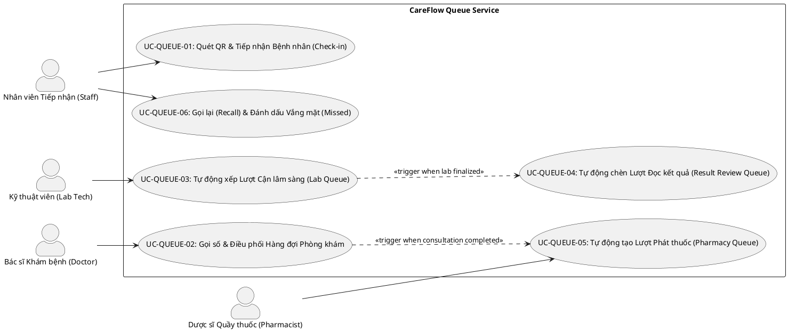

# BÁO CÁO PHÂN TÍCH ĐẶC TẢ USE CASE: QUEUE SERVICE (PHÂN HỆ HÀNG ĐỜI & ĐIỀU PHỐI)

* **Tên dự án:** Hệ thống Quản lý Bệnh viện & Phòng khám CareFlow
* **Phân hệ:** Queue Service (Dịch vụ Điều phối Hàng đợi & Số thứ tự)
* **Liên kết DBML:** [.planning/queue-service/queue-db.dbml](file:///home/levi/Desktop/Projects/careflow/.planning/queue-service/queue-db.dbml)

---

## 1. TỔNG QUAN VÀ PHẠM VI (OVERVIEW & SCOPE)

Phân hệ **Queue Service** quản lý toàn bộ vòng đời phiếu khám (`Visit Ticket`), mã QR bảo mật, số thứ tự khám (`Queue Number`) và luồng điều phối bệnh nhân qua các khu vực trong bệnh viện. Dịch vụ đảm nhận trách nhiệm tiếp nhận bệnh nhân (`CHECKED_IN`), điều phối hàng chờ phòng khám bác sĩ (`ROOM-01`), hàng chờ khu Cận lâm sàng (`LAB-HEMATOLOGY-01`), hàng chờ Đọc kết quả (`RESULT_REVIEW`), và hàng chờ Quầy phát thuốc (`PHARMACY-MAIN-01`).

---

## 2. SƠ ĐỒ USE CASE TỔNG THỂ (PLANTUML USE CASE DIAGRAM)

---

## 3. ĐẶC TẢ CHI TIẾT CÁC USE CASE

### UC-QUEUE-01: Quét QR & Tiếp nhận Bệnh nhân (`CHECKED_IN`)

| Mục | Nội dung Đặc tả |
| :--- | :--- |
| **Mã Use Case** | **UC-QUEUE-01** |
| **Tên Use Case** | Tiếp nhận Bệnh nhân vào Hàng đợi Active |
| **Tác nhân chính** | Nhân viên Tiếp nhận (`UserRole.STAFF`, `ADMIN`) |
| **Mô tả** | Nhân viên chọn phòng khám và nhập/quét mã QR phiếu khám của bệnh nhân, hoặc duyệt trực tiếp bệnh nhân từ danh sách lịch hẹn trong ngày. Hệ thống chuyển trạng thái `WAITING / TICKET_ISSUED → CHECKED_IN`. |
| **Luồng sự kiện chính** | 1. Nhân viên mở giao diện Tiếp nhận `/staff/checkin`. 2. Chọn phòng khám tiếp nhận (mặc định `ROOM-01`). 3. Quét mã QR hoặc gõ mã phiếu khám / bấm **"Duyệt vào hàng chờ"** trực tiếp trên danh sách. 4. Hệ thống kiểm tra mã QR, nếu hợp lệ chuyển trạng thái `CHECKED_IN` và cấp số thứ tự khám. 5. Bệnh nhân chính thức xuất hiện trên Active Queue của phòng khám. |
| **Hậu điều kiện** | Lượt khám kích hoạt thành công, sẵn sàng cho Bác sĩ gọi số. |

---

### UC-QUEUE-02: Gọi số & Điều phối Hàng đợi Phòng khám (`Doctor Web`)

| Mục | Nội dung Đặc tả |
| :--- | :--- |
| **Mã Use Case** | **UC-QUEUE-02** |
| **Tên Use Case** | Bác sĩ Gọi số & Khởi tạo Lượt khám |
| **Tác nhân chính** | Bác sĩ Khám bệnh (`UserRole.DOCTOR`) |
| **Mô tả** | Bác sĩ xem danh sách hàng đợi phòng khám realtime và bấm "Gọi số" để gọi bệnh nhân tiếp theo theo thuật toán ưu tiên Round-Robin 1:1:1. |
| **Luồng sự kiện chính** | 1. Bác sĩ mở `/dashboard/queue`. 2. Bấm nút **"Gọi số"** (`POST /api/queues/rooms/{roomId}/call-next`). 3. Hệ thống áp dụng thuật toán ưu tiên (Ưu tiên → Đọc kết quả → Lịch hẹn → Vãng lai). 4. Chuyển trạng thái lượt khám `CHECKED_IN → CALLED → IN_PROGRESS`. 5. Mở giao diện phiên khám lâm sàng `/consultation/{id}`. |
| **Hậu điều kiện** | Bệnh nhân được gọi vào phòng khám, ca khám bắt đầu. |

---

### UC-QUEUE-03: Tự động xếp Lượt Cận lâm sàng & Gọi thực hiện (`Lab Tech Web`)

| Mục | Nội dung Đặc tả |
| :--- | :--- |
| **Mã Use Case** | **UC-QUEUE-03** |
| **Tên Use Case** | Điều phối & Thực hiện Xét nghiệm Cận lâm sàng |
| **Tác nhân chính** | Kỹ thuật viên CLS (`UserRole.LAB_TECHNICIAN`) |
| **Mô tả** | Khi Bác sĩ tạo Lab Order, hệ thống tự động tạo lượt `LAB_EXECUTION` tại điểm dịch vụ (`LAB-HEMATOLOGY-01`). KTV gọi số, thực hiện và phát hành kết quả. |
| **Luồng sự kiện chính** | 1. KTV mở giao diện `/lab/queue`, chọn điểm dịch vụ `LAB-HEMATOLOGY-01`. 2. KTV bấm **"Gọi số"** (`callNextAtServicePoint`). 3. KTV bấm **"Bắt đầu"** (`startOrder`), tiến hành lấy mẫu / xét nghiệm. 4. KTV nhập chỉ số xét nghiệm và bấm **"Phát hành kết quả"** (`finalizeOrder`). 5. Hệ thống chuyển trạng thái Lab Order sang `RESULT_AVAILABLE`. |
| **Hậu điều kiện** | Kết quả CLS được duyệt phát hành, kích hoạt luồng Đọc kết quả. |

---

### UC-QUEUE-04: Tự động chèn Lượt Đọc kết quả (`RESULT_REVIEW`)

| Mục | Nội dung Đặc tả |
| :--- | :--- |
| **Mã Use Case** | **UC-QUEUE-04** |
| **Tên Use Case** | Tự động Chèn Lượt Đọc kết quả sau CLS |
| **Tác nhân chính** | Hệ thống (System Automatic Event Handler) |
| **Mô tả** | Ngay khi phòng Lab phát hành đủ kết quả, hệ thống tự động kích hoạt lượt `RESULT_REVIEW` cho bệnh nhân và chèn vào hàng chờ Bác sĩ ngay sau 1 bệnh nhân khám ban đầu tiếp theo. |
| **Luồng sự kiện chính** | 1. Sự kiện `LabOrderFinalized` được phát ra. 2. Queue Service kiểm tra phiên khám tương ứng, đổi trạng thái Consultation sang `AWAITING_REVIEW`. 3. Tạo / kích hoạt `QueueEntry` ở làn `RESULT_REVIEW` tại phòng khám ban đầu của Bác sĩ. 4. Khi Bác sĩ gọi số tiếp theo, hệ thống gọi bệnh nhân quay lại đọc kết quả. |
| **Hậu điều kiện** | Bệnh nhân được ưu tiên quay lại đọc kết quả mà không cần lấy số lại từ đầu. |

---

### UC-QUEUE-05: Tự động tạo Lượt Phát thuốc tại Quầy (`Staff Pharmacy Web`)

| Mục | Nội dung Đặc tả |
| :--- | :--- |
| **Mã Use Case** | **UC-QUEUE-05** |
| **Tên Use Case** | Điều phối & Cấp phát Thuốc tại Quầy |
| **Tác nhân chính** | Dược sĩ Quầy thuốc (`UserRole.STAFF`, `ADMIN`) |
| **Mô tả** | Khi Bác sĩ hoàn tất ca khám và đơn thuốc được xác nhận (`CONFIRMED`), hệ thống tự động tạo lượt `PHARMACY_DISPENSING` tại quầy phát thuốc (`PHARMACY-MAIN-01`). |
| **Luồng sự kiện chính** | 1. Dược sĩ mở giao diện Quầy thuốc `/staff/pharmacy`. 2. Thấy danh sách các đơn thuốc chờ phát. 3. Dược sĩ bấm **"Phát thuốc"** để mở chi tiết đơn thuốc đã được Bác sĩ ký. 4. Dược sĩ soạn thuốc, đối chiếu thông tin bệnh nhân. 5. Dược sĩ bấm **"Xác nhận phát thuốc"** (`completeDispensing`). |
| **Hậu điều kiện** | Đơn thuốc chuyển trạng thái `DISPENSED`, ca khám kết thúc trọn vẹn. |
