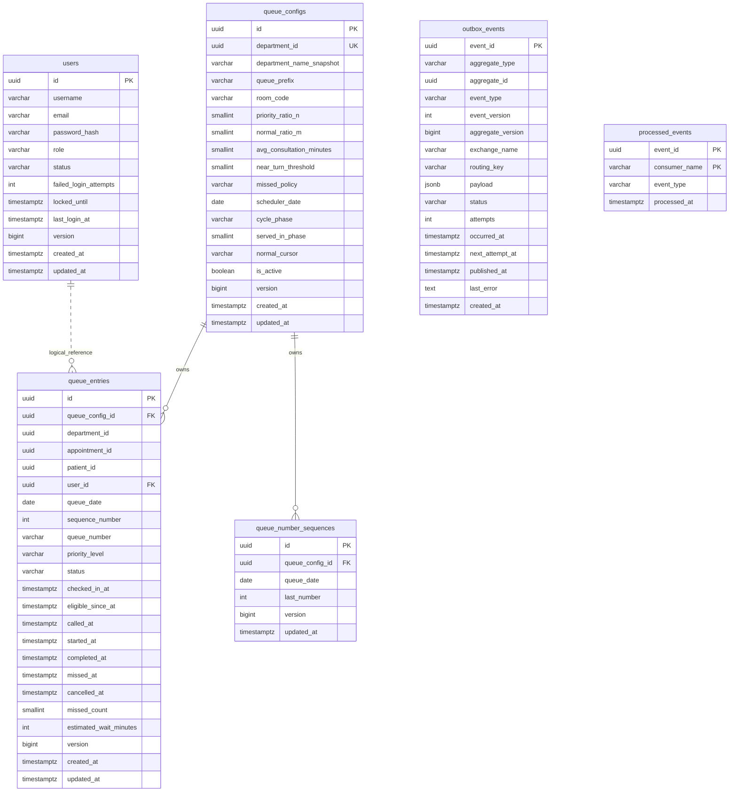

# CareFlow 🏥 — Phân Hệ Hệ Thống (Core/Infrastructure)

> Phần việc đảm nhận bởi **Người A (dangkhoii)** trong dự án CareFlow - Hệ thống hỗ trợ khám chữa bệnh tại bệnh viện công theo kiến trúc Microservices.

## 📌 Tổng quan phân hệ
Phân hệ Hệ thống đóng vai trò xương sống của dự án CareFlow, chịu trách nhiệm quản lý luồng điều phối chính (routing, authentication), thuật toán hàng đợi khám bệnh và cơ chế giao tiếp real-time giữa các dịch vụ.

Các thành phần chính do **dangkhoii** thiết kế & triển khai:
- **API Gateway**: Điểm vào duy nhất của hệ thống, xử lý định tuyến và xác thực JWT.
- **Identity & eKYC Service**: Đăng ký/đăng nhập, quản lý tài khoản, phân quyền người dùng (PATIENT, DOCTOR, ADMIN) và xác thực eKYC.
- **Queue Management Service (Trọng tâm)**: Quản lý số thứ tự, check-in QR, và thuật toán gọi khám xen kẽ N:M động.
- **Notification Service**: Đẩy thông báo real-time đến bệnh nhân và bác sỹ qua WebSocket.
- **Hạ tầng chung**: Service Discovery (Eureka Server), Message Broker (RabbitMQ), Docker Compose.

---

## 📋 Tính năng Nghiệp vụ Chi tiết (Business Features)

Dưới đây là các tính năng nghiệp vụ cụ thể của từng dịch vụ thuộc phân hệ do **dangkhoii** phụ trách:

### 1. API Gateway Service (Cổng kết nối)
- **Định tuyến (Routing)**: Chuyển tiếp các request từ client đến các backend microservice tương ứng thông qua Service Discovery (Eureka).
- **Xác thực tập trung (Authentication Filter)**: Kiểm tra chữ ký và tính hợp lệ của JWT token ở mọi protected request, tự động bóc tách và chuyển đổi thông tin định danh vào request headers (`X-User-Id`, `X-User-Role`).
- **Gắn vết Trace ID**: Tự động đính kèm `X-Correlation-Id` vào mọi request đầu vào để phục vụ ghi log tập trung xuyên suốt các service.

### 2. Identity & eKYC Service (Tài khoản & Định danh)
- **Đăng ký tài khoản (Register)**: Cho phép bệnh nhân đăng ký tài khoản mới tự động với vai trò `PATIENT`.
- **Đăng nhập (Login)**: Xác thực mật khẩu đã mã hóa (BCrypt/Argon2) và cấp mã thông báo JWT.
- **Phân quyền (RBAC)**: Định cấu hình và phân quyền chặt chẽ theo vai trò: `PATIENT` (Bệnh nhân), `DOCTOR` (Bác sỹ), `ADMIN` (Quản trị viên).
- **Định danh điện tử (Mock eKYC)**: Cung cấp API tải lên ảnh CMND/CCCD và trả về thông tin giả lập đã trích xuất tự động để định danh nhanh tài khoản.
- **Bảo mật tài khoản**: Theo dõi số lần đăng nhập sai liên tiếp và tự động khóa tài khoản tạm thời khi vượt ngưỡng.

### 3. Queue Management Service (Điều phối hàng đợi khám)
- **Cấp số thứ tự tự động**: Lắng nghe sự kiện tạo lịch hẹn từ RabbitMQ (`AppointmentCreated`) để tự động sinh số thứ tự (mỗi khoa một chuỗi số riêng biệt theo ngày).
- **Hủy số thứ tự**: Lắng nghe sự kiện hủy lịch hẹn (`AppointmentCancelled`) để chuyển trạng thái số khám sang `CANCELLED`.
- **Sinh mã & Check-in QR**: Bệnh nhân sinh mã QR an toàn (chứa token ký HMAC có hạn giờ) từ Mobile App và quét check-in tại bệnh viện để đưa số thứ tự vào hàng chờ khám kích hoạt (`CHECKED_IN`).
- **Lập lịch gọi khám N:M động**: Lập lịch gọi bệnh nhân tiếp theo xen kẽ giữa nhóm Ưu tiên (P1) và nhóm Thường (P2, P3) theo tỷ số cấu hình động, tự động ưu tiên tối đa ca cấp cứu (P0).
- **Xử lý lỡ lượt (Missed Turn)**: Bác sỹ đánh dấu bệnh nhân lỡ lượt; hệ thống hỗ trợ xếp lại (Requeue) theo chính sách cấu hình (Về cuối hàng, lên đầu hàng sau N lượt, hoặc tiếp nhận thủ công).
- **Ước tính thời gian chờ**: Tính toán động thời gian chờ còn lại của bệnh nhân dựa trên số lượng người chờ trước đó theo thuật toán N:M và thời gian khám trung bình động (`moving average`) của khoa.
- **Tiếp nhận thủ công**: Admin tiếp nhận và tạo số khám trực tiếp tại quầy đối với các ca cấp cứu (P0) hoặc khám vãng lai (P3).

### 4. Notification Service (Thông báo Real-time)
- **Kênh truyền tải thời gian thực**: Thiết lập kết nối WebSocket có xác thực (STOMP protocol) để đẩy thông báo trực tiếp đến Client.
- **Thông báo bệnh nhân**: Tự động thông báo qua WebSocket khi số thứ tự của bệnh nhân được cấp, check-in thành công, sắp đến lượt (cách N người), và khi bác sỹ gọi vào phòng khám.
- **Cập nhật màn hình bác sỹ**: Đẩy thông báo thay đổi hàng đợi theo thời gian thực tới màn hình dashboard làm việc của bác sỹ trong khoa.

---

## 🛠️ Kiến trúc Hệ thống & Luồng tích hợp

```
                       [CLIENT LAYER]
  ┌──────────────┐    ┌──────────────┐    ┌──────────────┐
  │ Mobile App   │    │ Web App      │    │ Admin Panel  │
  │ (Bệnh nhân)  │    │  (Bác sỹ)    │    │   (Admin)    │
  └──────┬───────┘    └──────┬───────┘    └──────┬───────┘
         │                   │                   │
         ▼                   ▼                   ▼
┌─────────────────────────────────────────────────────────┐
│            API GATEWAY (Spring Cloud Gateway)           │
│         JWT Filter · Rate Limiting · Route Routing      │
└────────────────────────────┬────────────────────────────┘
                             │
            ┌────────────────┼────────────────┐
            ▼                ▼                ▼
┌─────────────────┐  ┌──────────────┐  ┌──────────────────┐
│  Eureka Server  │  │  RabbitMQ    │  │  Shared Library  │
│  (Discovery)    │  │(Event Broker)│  │ (common utility) │
└─────────────────┘  └──────────────┘  └──────────────────┘
                             │
     ┌────────┬────────┬─────┴─┬────────┐
     ▼        ▼        ▼       ▼        ▼
┌────────┐┌────────┐┌────────┐┌────────┐┌────────┐
│Identity││Patient ││Appoint-││Queue   ││Notifi- │
│Service ││Service ││ment Svc││Mgmt Svc││cation  │ (Các service
│  (A)   ││ (B)    ││  (B)   ││  (A)   ││  (A)   │  khác...)
└───┬────┘└───┬────┘└───┬────┘└───┬────┘└───┬────┘
    ▼         ▼         ▼         ▼         ▼
[Auth DB] [Pat DB]  [Appt DB] [Queue DB] WebSocket
```

---

## 🚀 Thuật toán nổi bật (Queue Management)

### 1. Phân cấp độ ưu tiên (4 mức)
- **P0 - `EMERGENCY`**: Ca cấp cứu, luôn được gọi ngay lập tức mà không làm ảnh hưởng đến chu kỳ N:M.
- **P1 - `PRIORITY`**: Người già, trẻ em, phụ nữ mang thai (Được phục vụ theo chu kỳ N:M).
- **P2 - `APPOINTMENT`**: Đã đặt lịch trước (Xếp vào nhóm Normal).
- **P3 - `WALK_IN`**: Đến trực tiếp (Xếp vào nhóm Normal).

### 2. Thuật toán gọi khám xen kẽ động N:M
- Điều phối thông minh giữa nhóm **Ưu tiên (P1)** và nhóm **Thường (P2, P3)** theo tỉ lệ cấu hình động (Ví dụ: 2 bệnh nhân ưu tiên : 1 bệnh nhân thường).
- Tự động fallback/chuyển phase khi một trong các hàng chờ trống để tránh tắc nghẽn queue.

---

## 🗄️ Cấu trúc thư mục phân hệ (Người A)
```text
medici/ (careflow/)
├── docker-compose.infra.yml    # Docker Compose chạy infra (PostgreSQL, RabbitMQ, Eureka)
├── docker-compose.yml          # Docker Compose khởi chạy toàn bộ hệ thống
├── shared/
│   └── common-lib/             # Thư viện dùng chung (DTOs, JWT Utils, Exceptions)
├── services/
│   ├── eureka-server/          # Service Discovery (Eureka Server)
│   ├── api-gateway/            # API Gateway (Spring Cloud Gateway)
│   ├── identity-service/       # Xác thực, Quản lý tài khoản & eKYC (Port: 8081)
│   ├── queue-service/          # Quản lý hàng đợi & Số thứ tự (Port: 8084) ⭐
│   └── notification-service/   # Đẩy thông báo real-time qua WebSocket (Port: 8085)
```

---

## 📄 Tài liệu Phân tích & Thiết kế (OOAD)

- 📘 [Tài liệu OOAD chi tiết của Người A](ooad-person-a.md)
- 🗃️ [Database Model DBML của Người A](docs/database/careflow-person-a.dbml)
- 📋 [Kế hoạch triển khai tổng thể](docs/implementation_plan.md)

---

## 🗄️ Thiết kế Cơ sở dữ liệu (Database Schema)

Phân hệ Hệ thống sử dụng 2 Database độc lập trên PostgreSQL (tuân thủ nguyên tắc *Database-per-Service*):



### 1. Database: `careflow_identity` (Identity & eKYC Service)
Quản lý tài khoản, thông tin đăng nhập, phân quyền và dữ liệu eKYC.
- **`identity.users`**: Lưu trữ thông tin tài khoản, email, mật khẩu đã hash, vai trò (`PATIENT`, `DOCTOR`, `ADMIN`), trạng thái tài khoản và thông tin phục vụ cơ chế khóa tài khoản khi đăng nhập sai.

### 2. Database: `careflow_queue` (Queue Service)
Quản lý hàng đợi, số thứ tự khám và đảm bảo truyền nhận message tin cậy.
- **`queue.queue_configs`**: Lưu cấu hình hàng đợi của từng chuyên khoa (chỉ số N:M, thời gian khám trung bình, phòng khám, chính sách lỡ lượt) và trạng thái bộ lập lịch tại thời điểm chạy.
- **`queue.queue_number_sequences`**: Sinh số thứ tự tự động tăng dần theo ngày nghiệp vụ của từng khoa.
- **`queue.queue_entries`**: Lưu trạng thái chi tiết của từng lượt khám bệnh (ngày, số thứ tự, mức độ ưu tiên, trạng thái khám, các mốc thời gian check-in, gọi khám, hoàn thành, hủy).
- **`queue.outbox_events`**: Lưu trữ các sự kiện nghiệp vụ phục vụ mô hình *Transactional Outbox* để gửi tin nhắn tin cậy sang RabbitMQ.
- **`queue.processed_events`**: Lưu lịch sử các sự kiện đã xử lý từ các service khác nhằm đảm bảo tính *Idempotency* (tránh xử lý trùng lặp).

