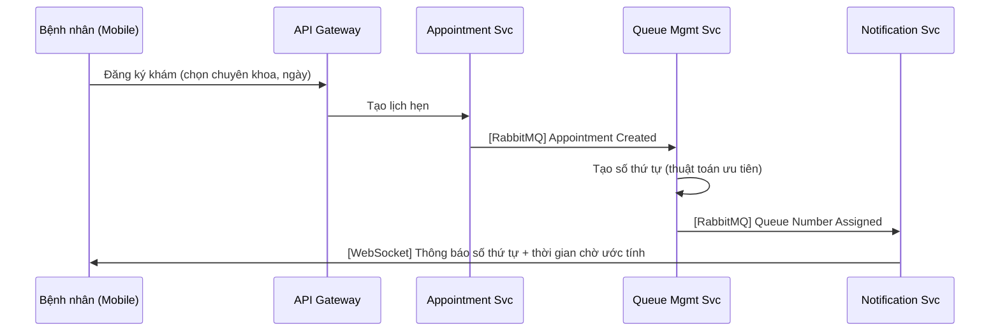
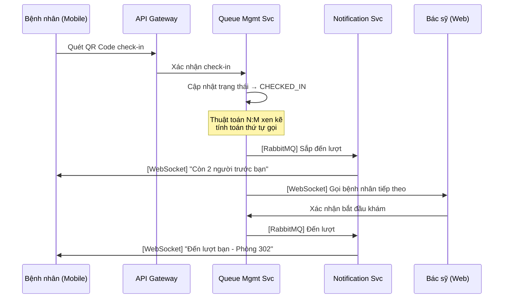
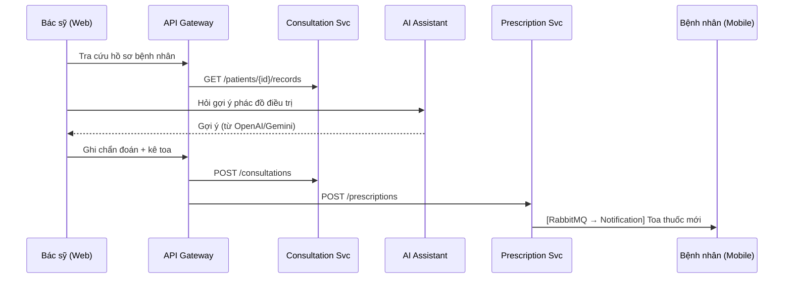

# Kế hoạch xây dựng hệ thống Medici - Phần mềm trợ giúp khám chữa bệnh

## 1. Phân tích tình huống

| Yếu tố | Thực tế |
|---|---|
| **Thời gian** | 5 tuần (~35 ngày, thực chất ~25 ngày làm việc) |
| **Nhân lực** | 3 người |
| **Tổng effort** | ~75 man-days |
| **Yêu cầu đề tài** | 12 microservices, Mobile App, Web App, AI ChatBot |
| **Mục tiêu thực tập** | Chứng minh hiểu kiến trúc Microservices + demo được luồng nghiệp vụ chính |

> [!IMPORTANT]
> **Chiến lược cốt lõi**: Tập trung làm **sâu 5-6 services thật**, còn lại **mock/stub** nhưng vẫn giữ đúng kiến trúc Microservices. Giám khảo đánh giá kiến trúc và luồng hoạt động, KHÔNG đánh giá bạn có hoàn thành 100% hay không.

---

## 2. Phân loại Services: BUILD vs MOCK

### 🟢 BUILD thật (có logic nghiệp vụ đầy đủ) — 6 services

| # | Service | Lý do phải build |
|---|---------|-------------------|
| 1 | **API Gateway Service** | Điểm vào duy nhất, chứng minh kiến trúc Microservices |
| 2 | **Identity & Auth Service** | Xác thực/phân quyền là nền tảng, dùng JWT |
| 3 | **Patient Service** | Core nghiệp vụ - quản lý hồ sơ bệnh nhân |
| 4 | **Appointment Service** | Core nghiệp vụ - đăng ký khám bệnh |
| 5 | **Queue Management Service** | **Điểm nhấn đề tài** - ba làn điều phối và Round Robin `1:1:1` |
| 6 | **Notification Service** | Gửi thông báo đến lượt khám (WebSocket/SSE) |

### 🟡 BUILD đơn giản (CRUD cơ bản + kết nối) — 3 services

| # | Service | Mức độ |
|---|---------|--------|
| 7 | **Doctor Consultation Service** | CRUD chẩn bệnh, tra cứu hồ sơ |
| 8 | **Prescription Service** | CRUD toa thuốc, liên kết với consultation |
| 9 | **Electronic Medical Record (EMR) Service** | CRUD hồ sơ bệnh án, upload file |

### 🔴 MOCK/STUB (chỉ có API endpoint trả dữ liệu giả) — 3 services

| # | Service | Cách mock |
|---|---------|-----------|
| 10 | **Laboratory Order Service** | Trả dữ liệu mẫu xét nghiệm cố định |
| 11 | **Analytics Service** | Trả dashboard data tĩnh (hardcode JSON) |
| 12 | **AI Clinical Assistant Service** | Gọi API OpenAI/Gemini với prompt template đơn giản, KHÔNG train model |

> [!TIP]
> **eKYC**: Không cần build thật. Mock bằng cách: upload ảnh CMND → trả về dữ liệu fake đã extract. Trong báo cáo ghi "tích hợp eKYC qua API bên thứ 3" là đủ.

---

## 3. Kiến trúc hệ thống

### 3.1. Tech Stack đề xuất

| Thành phần | Công nghệ | Lý do |
|---|---|---|
| **API Gateway** | Spring Cloud Gateway | Đúng hệ sinh thái Spring, dễ config routing |
| **Backend Services** | Spring Boot 3 + Java 17 | Phổ biến trong đề tài PTIT, tài liệu nhiều |
| **Database** | PostgreSQL (mỗi service 1 DB riêng) | Đúng pattern Database-per-Service |
| **Message Broker** | RabbitMQ | Đơn giản hơn Kafka, đủ cho demo |
| **Service Discovery** | Spring Cloud Eureka | Tự động tìm service |
| **Mobile App** | React Native hoặc **Flutter** | Cross-platform, 1 codebase cho cả Android/iOS |
| **Web App (Bác sỹ)** | React.js + Vite | Nhanh, hiện đại |
| **Containerization** | Docker + Docker Compose | Deploy toàn bộ hệ thống 1 lệnh |
| **Real-time** | WebSocket (STOMP) | Thông báo đến lượt khám |

> [!WARNING]
> **Đừng dùng Kubernetes**. Docker Compose là đủ cho demo. K8s sẽ tốn rất nhiều thời gian setup mà không thêm điểm.

### 3.2. Sơ đồ kiến trúc tổng quan

```
┌─────────────────────────────────────────────────────────────────┐
│                        CLIENT LAYER                             │
│  ┌──────────────┐    ┌──────────────┐    ┌──────────────┐       │
│  │ Mobile App   │    │ Web App      │    │ Admin Panel  │       │
│  │ (Flutter)    │    │ (React)      │    │ (React)      │       │
│  │ Bệnh nhân   │    │ Bác sỹ       │    │ (optional)   │       │
│  └──────┬───────┘    └──────┬───────┘    └──────┬───────┘       │
│         │                   │                   │               │
└─────────┼───────────────────┼───────────────────┼───────────────┘
          │                   │                   │
          ▼                   ▼                   ▼
┌─────────────────────────────────────────────────────────────────┐
│                    API GATEWAY (Spring Cloud Gateway)            │
│              JWT Validation · Rate Limiting · Routing            │
└──────────────────────────────┬──────────────────────────────────┘
                               │
              ┌────────────────┼────────────────┐
              ▼                ▼                ▼
┌─────────────────┐  ┌──────────────┐  ┌──────────────────┐
│  Eureka Server  │  │  Config Svc  │  │  RabbitMQ        │
│  (Discovery)    │  │  (optional)  │  │  (Message Broker)│
└─────────────────┘  └──────────────┘  └──────────────────┘
                               │
     ┌────────┬────────┬───────┼───────┬────────┬────────┐
     ▼        ▼        ▼       ▼       ▼        ▼        ▼
┌────────┐┌────────┐┌────────┐┌────────┐┌────────┐┌────────┐
│Identity││Patient ││Appoint-││Queue   ││Doctor  ││Notifi- │
│Service ││Service ││ment Svc││Mgmt Svc││Consult ││cation  │
│        ││        ││        ││        ││Service ││Service │
│ 🟢    ││ 🟢    ││ 🟢    ││ 🟢    ││ 🟡    ││ 🟢    │
└───┬────┘└───┬────┘└───┬────┘└───┬────┘└───┬────┘└───┬────┘
    │         │         │         │         │         │
    ▼         ▼         ▼         ▼         ▼         ▼
 [Auth DB] [Patient DB][Appt DB] [Queue DB][Doctor DB][──]
                                                    (dùng RabbitMQ)
```

---

## 4. Điểm nhấn đề tài: Queue Management Service

Đây là service **quan trọng nhất** vì nó là trọng tâm nghiên cứu của đề tài.

### 4.1. Ba làn hàng đợi tại phòng khám

```
Scheduling Lanes theo từng phòng/phiên:
┌─────────────────────────────────────────────┐
│ PRIORITY      - Khám ban đầu diện ưu tiên  │
│ NORMAL        - Khám ban đầu thông thường │
│ RESULT_REVIEW - Quay lại đọc kết quả      │
└─────────────────────────────────────────────┘
```

### 4.2. Round Robin `1:1:1`

```
Luồng đề xuất: PRIORITY → NORMAL → RESULT_REVIEW → PRIORITY → ...

Nếu một làn rỗng → bỏ qua và tiếp tục chu kỳ với làn có dữ liệu
Trong từng làn → FIFO theo queuedAt
Nếu bệnh nhân lỡ lượt → đưa cuối làn tương ứng theo chính sách
Hệ thống chỉ đề xuất; bác sĩ có thể gọi lượt gợi ý hoặc bất kỳ lượt CHECKED_IN
```

### 4.3. Queue FIFO tại điểm phục vụ

Ngoài ba làn của phòng khám, Queue Service quản lý hai loại queue FIFO độc lập:

```text
LAB_EXECUTION       - Thực hiện cận lâm sàng
PHARMACY_DISPENSING - Chờ phát thuốc
```

`RESULT_REVIEW` là phase/làn của `CONSULTATION`, không phải một `QueueType`.

### 4.4. Ước tính thời gian chờ

```
estimated_wait_time = position_in_queue × avg_consultation_time

Trong đó:
- position_in_queue: ước tính từ Round Robin `1:1:1` và số lượt trước trong mỗi làn
- avg_consultation_time: trung bình động (moving average)
  của thời gian khám thực tế các bệnh nhân trước đó
```

> [!TIP]
> Phần này nên có **unit test** kỹ lưỡng. Giám khảo sẽ hỏi sâu về thuật toán hàng đợi.

---

## 5. Phân công nhóm 3 người — Theo phân hệ

### Nguyên tắc phân công

> [!IMPORTANT]
> Mỗi người sở hữu **trọn vẹn 1 phân hệ** (cả backend services lẫn frontend). Người đó chịu trách nhiệm toàn bộ từ DB → API → UI cho phân hệ mình. Điều này giảm phụ thuộc chéo, mỗi người tự chủ và có thể demo phần của mình độc lập.

### Tổng quan phân hệ

```
┌──────────────────────────────────────────────────────────────────────┐
│                                                                      │
│  👤 Người A — PHÂN HỆ HỆ THỐNG (Core/Infrastructure)               │
│  ┌──────────────┬──────────────┬──────────────┬──────────────┐       │
│  │ API Gateway  │ Identity &   │ Queue Mgmt   │ Notification │       │
│  │ Service      │ Auth Service │ Service ⭐   │ Service      │       │
│  └──────────────┴──────────────┴──────────────┴──────────────┘       │
│  + Eureka Server, RabbitMQ, Docker Compose, Infra                    │
│  + Shared Library (common DTOs, exceptions, utils)                   │
│                                                                      │
├──────────────────────────────────────────────────────────────────────┤
│                                                                      │
│  👤 Người B — PHÂN HỆ BỆNH NHÂN (Patient Subsystem)                │
│  ┌──────────────┬──────────────┬──────────────┐                      │
│  │ Patient      │ Appointment  │ EMR Service  │                      │
│  │ Service      │ Service      │              │                      │
│  └──────────────┴──────────────┴──────────────┘                      │
│  + Mobile App (Flutter) — toàn bộ giao diện bệnh nhân               │
│  + Tích hợp: QR check-in, real-time queue tracking, notification     │
│                                                                      │
├──────────────────────────────────────────────────────────────────────┤
│                                                                      │
│  👤 Người C — PHÂN HỆ BÁC SỸ (Doctor Subsystem)                    │
│  ┌──────────────┬──────────────┬──────────────┬──────────────┐       │
│  │ Doctor       │ Prescription │ Lab Order    │ AI Clinical  │       │
│  │ Consultation │ Service      │ Svc [MOCK]   │ Asst [MOCK]  │       │
│  └──────────────┴──────────────┴──────────────┴──────────────┘       │
│  + Web App (React) — toàn bộ giao diện bác sỹ                       │
│  + ChatBot AI, dashboard bác sỹ, kê toa, chỉ định xét nghiệm       │
│                                                                      │
└──────────────────────────────────────────────────────────────────────┘
```

### Bảng phân công chi tiết

| Thành viên | Phân hệ | Backend Services | Frontend | Vai trò phụ |
|---|---|---|---|---|
| **Người A** (Leader) | 🔧 **Hệ thống** | API Gateway, Identity & Auth, Queue Management ⭐, Notification | *(không có UI riêng — cung cấp API cho B và C)* | DevOps, Docker, Infra, Shared Lib |
| **Người B** | 🏥 **Bệnh nhân** | Patient Service, Appointment Service, EMR Service | **Mobile App (Flutter)**: đăng ký khám, QR check-in, theo dõi hàng đợi, xem toa thuốc, nhận thông báo | Mock Analytics Service |
| **Người C** | 👨‍⚕️ **Bác sỹ** | Doctor Consultation, Prescription, Lab Order [mock], AI Assistant [mock] | **Web App (React)**: dashboard, tra cứu hồ sơ, chẩn bệnh, kê toa, ChatBot AI | Swagger/API docs |

### Giao tiếp giữa các phân hệ

```
Người B (Bệnh nhân)          Người A (Hệ thống)          Người C (Bác sỹ)
      │                            │                            │
      │── Appointment Created ──▶  │                            │
      │   (qua RabbitMQ)          │── Queue Number ──▶         │
      │                            │   (assign số thứ tự)       │
      │  ◀── Notification ────    │                            │
      │   (đến lượt khám)         │── Next Patient ──▶         │
      │                            │   (gọi bệnh nhân)          │
      │                            │                            │
      │── Patient Record ──────────┼───────────────────▶        │
      │   (hồ sơ bệnh nhân)       │                 (tra cứu)  │
      │                            │                            │
      │  ◀─────────────────────────┼── Prescription ──          │
      │   (toa thuốc)              │   (qua RabbitMQ)           │
```

> [!TIP]
> **Điểm phối hợp quan trọng**: 3 người cần thống nhất **API contract** (request/response format) ngay từ tuần 1. Người A định nghĩa trước các DTO trong Shared Library, B và C sử dụng.

---

## 6. Kế hoạch 5 tuần chi tiết

### 📅 Tuần 1 (Ngày 1-5): Foundation — Mỗi người dựng nền phân hệ mình

**Mục tiêu**: Dựng xong infra + skeleton tất cả services + Login/Register hoạt động

#### Người A — Hệ thống (Infra + Auth)

| # | Task | Output | Ưu tiên |
|---|------|--------|---------|
| 1 | Tạo monorepo, project structure, `.gitignore` | Repo GitHub | 🔴 P0 |
| 2 | Viết `docker-compose.infra.yml` (PostgreSQL, RabbitMQ) | Infra chạy 1 lệnh | 🔴 P0 |
| 3 | Setup **Eureka Server** (Service Discovery) | Services tìm nhau được | 🔴 P0 |
| 4 | Setup **API Gateway** + routing cơ bản tới các service | Gateway forward request | 🔴 P0 |
| 5 | Build **Identity & Auth Service**: đăng ký, đăng nhập, JWT, phân quyền (PATIENT / DOCTOR / ADMIN) | Auth API hoạt động | 🔴 P0 |
| 6 | Viết **Shared Library**: common DTOs, ApiResponse wrapper, exception handler, JWT utils | B & C reuse | 🔴 P0 |
| 7 | Tạo skeleton Spring Boot cho tất cả services (chạy được, chưa có logic) | Mỗi service boot được | 🟡 P1 |

#### Người B — Bệnh nhân (Patient backend + Mobile)

| # | Task | Output | Ưu tiên |
|---|------|--------|---------|
| 1 | Setup **Flutter project** cho Mobile App | Mobile skeleton | 🔴 P0 |
| 2 | Thiết kế Design System cho Mobile (màu sắc, font, component library) | Reusable UI | 🔴 P0 |
| 3 | Build màn hình **Login / Register** trên Mobile (gọi API Auth của A) | Auth flow end-to-end | 🔴 P0 |
| 4 | Setup **Patient Service** (Spring Boot) + DB schema | Patient API skeleton | 🔴 P0 |
| 5 | CRUD hồ sơ bệnh nhân: tạo, sửa, xem profile | Patient API | 🟡 P1 |
| 6 | Build màn hình **Profile bệnh nhân** trên Mobile | Profile UI | 🟡 P1 |

#### Người C — Bác sỹ (Doctor backend + Web)

| # | Task | Output | Ưu tiên |
|---|------|--------|---------|
| 1 | Setup **React + Vite project** cho Web App | Web skeleton | 🔴 P0 |
| 2 | Thiết kế Design System cho Web (sidebar layout, component library, dark mode) | Reusable UI | 🔴 P0 |
| 3 | Build màn hình **Login** trên Web (gọi API Auth của A) | Auth flow end-to-end | 🔴 P0 |
| 4 | Setup **Doctor Consultation Service** (Spring Boot) + DB schema | Consultation API skeleton | 🔴 P0 |
| 5 | API danh sách bác sỹ, thông tin bác sỹ | Doctor API | 🟡 P1 |
| 6 | Build màn hình **Dashboard bác sỹ** (layout, sidebar, topbar) | Dashboard shell | 🟡 P1 |

**🎯 Deliverable cuối tuần 1**:
- ✅ Tất cả services boot được, đăng ký vào Eureka
- ✅ API Gateway routing đúng tới các service
- ✅ Login/Register hoạt động end-to-end (Mobile + Web → Gateway → Auth)
- ✅ B và C đã có UI skeleton đẹp

**🤝 Điểm phối hợp tuần 1**:
- Ngày 1: A tạo repo + infra → push → B, C clone
- Ngày 2: A push Auth API → B, C bắt đầu tích hợp Login
- Ngày 3-5: Mỗi người tự làm phần mình, sync cuối ngày

---

### 📅 Tuần 2 (Ngày 6-10): Core Flow — Đăng ký khám + Hàng đợi

**Mục tiêu**: Bệnh nhân đăng ký khám → nhận số thứ tự → hàng đợi hoạt động

#### Người A — Hệ thống (Queue Management ⭐)

| # | Task | Output | Ưu tiên |
|---|------|--------|---------|
| 1 | **Queue Management Service** - DB schema + data model | Queue DB | 🔴 P0 |
| 2 | Implement ba làn `PRIORITY`, `NORMAL`, `RESULT_REVIEW` và FIFO trong từng làn | Core algorithm | 🔴 P0 |
| 3 | Implement Round Robin `1:1:1`, bỏ qua làn rỗng và `lastServedLane` | Interleaving logic | 🔴 P0 |
| 4 | API: tạo số thứ tự, xem đề xuất, gọi theo entry/gọi nhanh, skip và xử lý lỡ lượt | Queue REST endpoints | 🔴 P0 |
| 5 | Lắng nghe event `AppointmentCreated` từ RabbitMQ → tự tạo queue entry | Event-driven flow | 🔴 P0 |
| 6 | **Unit test** queue (làn rỗng, gọi khác gợi ý, nhiều lượt CALLED, lỡ lượt) | Test coverage | 🟡 P1 |
| 7 | Consume `AllRequiredResultsAvailable` và tự động kích hoạt entry `CONSULTATION + RESULT_REVIEW` idempotent | Result-review flow | 🟡 P1 |
| 8 | Consume `PrescriptionIssued`, tạo `PHARMACY_DISPENSING` và gọi FIFO theo điểm cấp phát | Pharmacy queue | 🟡 P1 |

#### Người B — Bệnh nhân (Appointment + Mobile booking)

| # | Task | Output | Ưu tiên |
|---|------|--------|---------|
| 1 | **Appointment Service** - DB schema + CRUD | Appointment API | 🔴 P0 |
| 2 | API đặt lịch khám: chọn chuyên khoa, ngày, ca khám | Booking API | 🔴 P0 |
| 3 | Publish event `AppointmentCreated` lên RabbitMQ (A lắng nghe) | Event publishing | 🔴 P0 |
| 4 | Mobile: Màn hình **Đăng ký khám bệnh** (chọn khoa, ngày, xác nhận) | Booking flow UI | 🔴 P0 |
| 5 | Mobile: Màn hình **Theo dõi lượt khám** (hiển thị số thứ tự, vị trí trong hàng đợi) | Queue tracking UI | 🔴 P0 |
| 6 | **EMR Service** - CRUD hồ sơ bệnh án, upload file ảnh/PDF | EMR API | 🟡 P1 |
| 7 | Mobile: Màn hình **Upload hồ sơ bệnh án** | EMR upload UI | 🟡 P1 |

#### Người C — Bác sỹ (Tra cứu bệnh nhân + Dashboard queue)

| # | Task | Output | Ưu tiên |
|---|------|--------|---------|
| 1 | API tra cứu hồ sơ bệnh nhân (gọi sang Patient Service + EMR Service qua Gateway) | Cross-service query | 🔴 P0 |
| 2 | Web: Màn hình **Danh sách bệnh nhân chờ khám** (gọi Queue API của A) | Queue dashboard | 🔴 P0 |
| 3 | Web: Nút **Gọi** trên từng hàng và nút gọi nhanh `recommendedNext` | Queue call commands | 🔴 P0 |
| 4 | Web: Màn hình **Xem hồ sơ bệnh nhân** (lịch sử khám, kết quả XN) | Patient detail view | 🟡 P1 |
| 5 | Setup **Prescription Service** skeleton + DB | Prescription API skeleton | 🟡 P1 |

**🎯 Deliverable cuối tuần 2**:
- ✅ Bệnh nhân đăng ký khám trên Mobile → event → tự tạo số thứ tự
- ✅ Ba làn hoạt động đúng FIFO và Round Robin `1:1:1`
- ✅ Bác sỹ xem ba danh sách + gọi bệnh nhân được đề xuất trên Web

**🤝 Điểm phối hợp tuần 2**:
- Ngày 6: A, B, C thống nhất API contract cho Queue + Appointment
- Ngày 7: B push event `AppointmentCreated` → A test nhận được
- Ngày 9: C tích hợp gọi Queue API của A trên Web
- Cuối tuần 2: **Demo nội bộ** luồng đăng ký → hàng đợi → gọi khám

---

### 📅 Tuần 3 (Ngày 11-15): Khám bệnh + Thông báo real-time

**Mục tiêu**: Luồng khám hoàn chỉnh + bệnh nhân nhận thông báo real-time

#### Người A — Hệ thống (Notification + QR + Ước tính thời gian)

| # | Task | Output | Ưu tiên |
|---|------|--------|---------|
| 1 | **Notification Service** - WebSocket/STOMP server | Real-time channel | 🔴 P0 |
| 2 | Lắng nghe event từ Queue → push thông báo: "sắp đến lượt", "đến lượt", "lỡ lượt" | Push notifications | 🔴 P0 |
| 3 | API **QR Code** generation cho mỗi appointment (để check-in) | QR API | 🔴 P0 |
| 4 | API **Check-in** bằng QR: verify + cập nhật queue status → CHECKED_IN | Check-in flow | 🔴 P0 |
| 5 | Implement **ước tính thời gian chờ** (moving average) | Wait time API | 🟡 P1 |
| 6 | Cung cấp WebSocket endpoint cho B (mobile) và C (web) subscribe | WS integration guide | 🟡 P1 |

#### Người B — Bệnh nhân (Check-in + Nhận thông báo + Xem toa)

| # | Task | Output | Ưu tiên |
|---|------|--------|---------|
| 1 | Mobile: **Quét QR Code** check-in tại bệnh viện (gọi API check-in của A) | QR scanner UI | 🔴 P0 |
| 2 | Mobile: **Nhận thông báo real-time** qua WebSocket (đến lượt, sắp đến lượt) | Notification UI | 🔴 P0 |
| 3 | Mobile: Cập nhật **thời gian chờ ước tính** real-time | Live wait time | 🔴 P0 |
| 4 | Mobile: Xem **toa thuốc** + **lịch tái khám** (nhận event từ Prescription Service của C) | Prescription view | 🟡 P1 |
| 5 | Mobile: Xem **kết quả chỉ định xét nghiệm** | Lab result view | 🟢 P2 |
| 6 | Mock **Analytics Service** (dashboard dữ liệu tĩnh) | Analytics stub | 🟢 P2 |

#### Người C — Bác sỹ (Chẩn bệnh + Kê toa + AI ChatBot)

| # | Task | Output | Ưu tiên |
|---|------|--------|---------|
| 1 | **Doctor Consultation Service** - API chẩn bệnh: ghi chẩn đoán, ghi chú | Consultation API | 🔴 P0 |
| 2 | **Prescription Service** - API kê toa thuốc: tên thuốc, liều, tần suất | Prescription API | 🔴 P0 |
| 3 | Publish event `PrescriptionCreated` lên RabbitMQ (B lắng nghe → hiển thị trên Mobile) | Event publishing | 🔴 P0 |
| 4 | Web: Màn hình **Chẩn bệnh + Kê toa** (form chẩn đoán, thêm thuốc, hẹn tái khám) | Consultation form | 🔴 P0 |
| 5 | Mock **AI Clinical Assistant**: gọi API Gemini/OpenAI với prompt template | AI API | 🟡 P1 |
| 6 | Web: **ChatBot AI** gợi ý phác đồ điều trị (panel bên phải màn hình chẩn bệnh) | ChatBot UI | 🟡 P1 |
| 7 | Mock **Laboratory Order Service**: API chỉ định XN, trả kết quả giả | Lab stub | 🟢 P2 |
| 8 | Web: Nhận WebSocket thông báo "bệnh nhân tiếp theo đã check-in" | Real-time doctor | 🟡 P1 |

**🎯 Deliverable cuối tuần 3**:
- ✅ Luồng hoàn chỉnh: check-in QR → chờ → thông báo đến lượt → khám → kê toa → bệnh nhân nhận toa
- ✅ Thông báo real-time hoạt động cả trên Mobile và Web
- ✅ ChatBot AI gợi ý phác đồ (gọi API bên ngoài)

**🤝 Điểm phối hợp tuần 3**:
- Ngày 11: A cung cấp WebSocket endpoint + hướng dẫn subscribe → B, C tích hợp
- Ngày 12: A cung cấp QR + Check-in API → B tích hợp trên Mobile
- Ngày 13: C push event `PrescriptionCreated` → B test nhận được trên Mobile
- Cuối tuần 3: **Demo nội bộ** toàn bộ luồng end-to-end

---

### 📅 Tuần 4 (Ngày 16-20): Integration + Polish + Edge Cases

**Mục tiêu**: Kết nối toàn bộ, xử lý edge cases, UI đẹp, hệ thống ổn định

#### Người A — Hệ thống (Docker + Resilience + Fix bugs)

| # | Task | Output | Ưu tiên |
|---|------|--------|---------|
| 1 | Hoàn thiện **`docker-compose.yml`** cho TOÀN BỘ hệ thống (12 services + infra) | 1-command deploy | 🔴 P0 |
| 2 | Health check endpoints cho tất cả services | Monitoring | 🔴 P0 |
| 3 | Xử lý edge cases Queue: bệnh nhân lỡ lượt → cập nhật thứ tự, bệnh nhân hủy khám | Robust queue | 🔴 P0 |
| 4 | Circuit breaker (Resilience4j) cho cross-service calls | Fault tolerance | 🟡 P1 |
| 5 | Centralized logging (Spring Boot Actuator + simple log aggregation) | Observability | 🟢 P2 |
| 6 | Fix bugs integration tổng thể | Stable system | 🔴 P0 |

#### Người B — Bệnh nhân (Polish Mobile + Fix bugs)

| # | Task | Output | Ưu tiên |
|---|------|--------|---------|
| 1 | Polish UI/UX Mobile: animations, loading states, error handling | Beautiful mobile | 🔴 P0 |
| 2 | Xử lý edge cases: mất kết nối WebSocket → auto reconnect | Robust mobile | 🔴 P0 |
| 3 | Hoàn thiện các màn hình còn thiếu (lịch sử khám, hồ sơ bệnh án) | Complete mobile | 🟡 P1 |
| 4 | Tạo **test data** thực tế cho demo (bệnh nhân mẫu, lịch hẹn) | Demo data | 🟡 P1 |
| 5 | Fix bugs phân hệ bệnh nhân | Stable patient flow | 🔴 P0 |

#### Người C — Bác sỹ (Polish Web + Fix bugs)

| # | Task | Output | Ưu tiên |
|---|------|--------|---------|
| 1 | Polish UI/UX Web: responsive, dark mode, micro-animations | Beautiful web | 🔴 P0 |
| 2 | Viết **Swagger/OpenAPI documentation** cho tất cả API | API docs | 🟡 P1 |
| 3 | Hoàn thiện các màn hình còn thiếu (lịch sử toa thuốc, danh sách XN) | Complete web | 🟡 P1 |
| 4 | Tạo **test data** cho bác sỹ demo (bệnh nhân mẫu, chẩn đoán, toa thuốc) | Demo data | 🟡 P1 |
| 5 | Fix bugs phân hệ bác sỹ | Stable doctor flow | 🔴 P0 |

**🎯 Deliverable cuối tuần 4**:
- ✅ `docker-compose up` → toàn bộ hệ thống chạy
- ✅ UI đẹp, UX mượt trên cả Mobile và Web
- ✅ Edge cases được xử lý (lỡ lượt, mất kết nối, lỗi server)

---

### 📅 Tuần 5 (Ngày 21-25): Demo + Báo cáo

**Mục tiêu**: Demo chạy mượt + báo cáo hoàn chỉnh

#### Cả nhóm cùng làm

| # | Task | Ai làm | Output |
|---|------|--------|--------|
| 1 | Chuẩn bị môi trường demo (máy sạch, Docker ready) | **A** | Demo environment |
| 2 | Tạo **kịch bản demo** (3 luồng chính, có lỗi giả để show fault tolerance) | **Cả nhóm** | Demo script |
| 3 | Rehearse demo nhiều lần | **Cả nhóm** | Smooth demo |
| 4 | Quay **video demo** backup | **B** (quay mobile) + **C** (quay web) | Demo video |

#### Báo cáo — mỗi người viết phần phân hệ mình

| Phần báo cáo | Ai viết |
|---|---|
| Kiến trúc tổng quan, deployment diagram, so sánh pattern | **A** |
| Thuật toán hàng đợi, sequence diagrams, API Gateway | **A** |
| Phân hệ Bệnh nhân: usecase, DB schema, API, screenshots Mobile | **B** |
| Phân hệ Bác sỹ: usecase, DB schema, API, screenshots Web, AI ChatBot | **C** |
| Phần mở đầu, kết luận, tài liệu tham khảo | **Cả nhóm** |

**🎯 Deliverable cuối tuần 5**:
- ✅ Demo chạy mượt, có kịch bản rõ ràng
- ✅ Báo cáo hoàn chỉnh
- ✅ Video demo backup phòng trường hợp Docker lỗi ngày demo

---

## 7. Luồng nghiệp vụ chính cần demo

### Luồng 1: Bệnh nhân đăng ký khám (Happy Path)



### Luồng 2: Ngày khám - Check-in & Chờ khám



### Luồng 3: Khám bệnh & Kê toa



---

## 8. Các mẹo tiết kiệm thời gian

### 8.1. Dùng Spring Initializr tạo nhanh project
```
Mỗi service chỉ cần: Spring Web, Spring Data JPA, PostgreSQL Driver, 
Lombok, Spring Cloud Eureka Client, Spring AMQP (RabbitMQ)
```

### 8.2. eKYC - MOCK hoàn toàn
```java
@PostMapping("/verify")
public EkycResult verify(@RequestParam MultipartFile idCard) {
    // Mock: Trả về dữ liệu giả
    return EkycResult.builder()
        .fullName("Nguyễn Văn A")
        .idNumber("0123456789")
        .dateOfBirth("1990-01-01")
        .verified(true)
        .build();
}
```

### 8.3. AI Clinical Assistant - Gọi API OpenAI/Gemini
```java
@PostMapping("/suggest")
public String suggestTreatment(@RequestBody String symptoms) {
    // Gọi Gemini API với prompt template
    String prompt = """
        Bạn là bác sỹ. Dựa trên triệu chứng sau, gợi ý phác đồ điều trị.
        Triệu chứng: %s
        Trả lời bằng tiếng Việt, ngắn gọn.
        """.formatted(symptoms);
    return geminiClient.generate(prompt);
}
```

### 8.4. Analytics Service - Dữ liệu tĩnh
```java
@GetMapping("/dashboard")
public DashboardData getDashboard() {
    // Trả dữ liệu hardcode
    return DashboardData.builder()
        .totalPatientsToday(45)
        .avgWaitTime(Duration.ofMinutes(23))
        .queueDistribution(Map.of("Nội", 15, "Ngoại", 12, "Nhi", 8))
        .build();
}
```

### 8.5. Laboratory Order - Stub
```java
@PostMapping("/orders")
public LabOrder createOrder(@RequestBody LabOrderRequest request) {
    // Tạo order giả, trạng thái luôn là PENDING
    return LabOrder.builder()
        .id(UUID.randomUUID())
        .testName(request.getTestName())
        .status("PENDING")
        .estimatedResult(LocalDateTime.now().plusHours(2))
        .build();
}
```

---

## 9. Database Schema tóm tắt (các bảng chính)

### Identity Service DB
```sql
-- users, roles, permissions
users (id, username, email, password_hash, role, created_at)
```

### Patient Service DB
```sql
patients (id, user_id, full_name, date_of_birth, gender, phone, 
          id_card_number, insurance_number, address, created_at)
```

### Appointment Service DB
```sql
departments (id, code, display_name, active)

clinic_rooms (id, room_code, display_name, department_id, active)
-- Department 1:N ClinicRoom; dữ liệu MVP seed đúng một phòng active mỗi khoa

appointments (id, patient_id, department, room_id, doctor_id,
              appointment_date, time_slot, status, created_at)
-- status: PENDING, CONFIRMED, CHECKED_IN, IN_PROGRESS, COMPLETED, CANCELLED
```

Create Appointment không nhận `room_id` từ Mobile. Backend truy vấn phòng active
theo khoa; MVP yêu cầu đúng một kết quả và không dùng random/find-first.

### Queue Management Service DB
```sql
queue_schedulers (id, room_id, session_date, session_code,
                  last_served_lane, version)

queue_entries (id, appointment_id, consultation_id, prescription_id, patient_id,
              room_id, service_point_id, queue_number, queue_type,
              consultation_phase, queue_class, status,
              queued_at, called_at, called_by_doctor_id, completed_at,
              estimated_wait_minutes)
-- queue_type: CONSULTATION, LAB_EXECUTION, PHARMACY_DISPENSING
-- consultation_phase: INITIAL, RESULT_REVIEW (chỉ áp dụng cho CONSULTATION)
-- queue_class: PRIORITY, NORMAL (chỉ áp dụng cho CONSULTATION + INITIAL)
-- scheduling lane được suy ra, không lưu thành ba bảng riêng
-- status: TICKET_ISSUED/QUEUED, CHECKED_IN, CALLED, IN_PROGRESS,
--         COMPLETED, MISSED, CANCELLED, NO_SHOW
```

### Consultation Service DB
```sql
consultations (id, appointment_id, patient_id, doctor_id,
               diagnosis, notes, created_at)
```

### Prescription Service DB
```sql
prescriptions (id, consultation_id, patient_id, doctor_id, 
               notes, follow_up_date, created_at)

prescription_items (id, prescription_id, medicine_name, 
                    dosage, frequency, duration, notes)
```

---

## 10. Rủi ro & Giải pháp

| Rủi ro | Xác suất | Giải pháp |
|---|---|---|
| Không kịp deadline | Cao | Ưu tiên demo luồng chính, bỏ feature phụ |
| Service không kết nối được | Trung bình | Test integration sớm từ tuần 1 |
| Mobile app phức tạp quá | Trung bình | Dùng Flutter + widget có sẵn, không custom UI phức tạp |
| AI ChatBot không hoạt động | Thấp | Fallback: hiển thị "Tính năng đang phát triển" |
| Docker compose quá nặng | Trung bình | Giảm số container, share DB nếu cần |

---

## 11. Cấu trúc thư mục đề xuất

```
medici/
├── docker-compose.yml          # Toàn bộ hệ thống
├── docker-compose.infra.yml    # Chỉ infra (DB, RabbitMQ, Eureka)
│
├── services/
│   ├── eureka-server/          # Service Discovery
│   ├── api-gateway/            # API Gateway
│   ├── identity-service/       # Auth + JWT
│   ├── patient-service/        # Quản lý bệnh nhân
│   ├── appointment-service/    # Đặt lịch khám
│   ├── queue-service/          # ⭐ Quản lý hàng đợi
│   ├── notification-service/   # Thông báo
│   ├── consultation-service/   # Khám bệnh
│   ├── prescription-service/   # Toa thuốc
│   ├── emr-service/            # Hồ sơ bệnh án
│   ├── lab-service/            # [MOCK] Xét nghiệm
│   ├── analytics-service/      # [MOCK] Thống kê
│   └── ai-assistant-service/   # [MOCK] ChatBot AI
│
├── shared/
│   └── common-lib/             # Shared DTOs, utils
│
├── frontend/
│   ├── doctor-web/             # React - Web bác sỹ
│   └── patient-mobile/         # Flutter - App bệnh nhân
│
└── docs/
    ├── architecture/           # Sơ đồ kiến trúc
    ├── api/                    # API documentation
    └── database/               # DB schema
```

---

## Open Questions

> [!IMPORTANT]
> **Q1**: Bạn và nhóm thành thạo ngôn ngữ/framework nào nhất? (Java/Spring Boot, Node.js, Go?) — Điều này ảnh hưởng lớn đến tốc độ phát triển.

> [!IMPORTANT]
> **Q2**: Mobile App bạn muốn dùng Flutter hay React Native? Hay chỉ cần Web responsive thay cho Mobile App? (Web responsive sẽ tiết kiệm rất nhiều thời gian)

> [!IMPORTANT]
> **Q3**: 5 tuần bắt đầu từ ngày nào? Bạn đã bắt đầu chưa hay đang ở ngày đầu tiên?

> [!WARNING]
> **Q4**: Giám khảo có yêu cầu deploy lên cloud (AWS/GCP) hay chỉ cần demo local? Nếu chỉ local thì tiết kiệm được rất nhiều thời gian.

> [!NOTE]
> **Q5**: Bạn có muốn tôi bắt đầu tạo project structure và code skeleton ngay không? Tôi có thể tạo sẵn toàn bộ Spring Boot services + Docker Compose + React + Flutter project.

---

## Verification Plan

### Automated Tests
- Unit tests cho FIFO từng làn, Round Robin `1:1:1`, bỏ qua làn rỗng và gọi đồng thời
- Integration tests cho luồng Appointment → Queue → Notification
- API tests cho tất cả endpoints chính (Postman collection)

### Manual Verification
- Demo 3 luồng chính end-to-end (đăng ký → check-in → khám → kê toa)
- Verify real-time notification hoạt động
- Verify Docker Compose deploy toàn bộ hệ thống
- Chạy thử trên máy khác để đảm bảo portable
