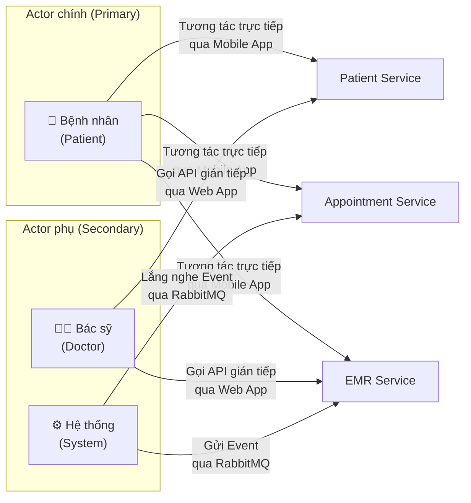
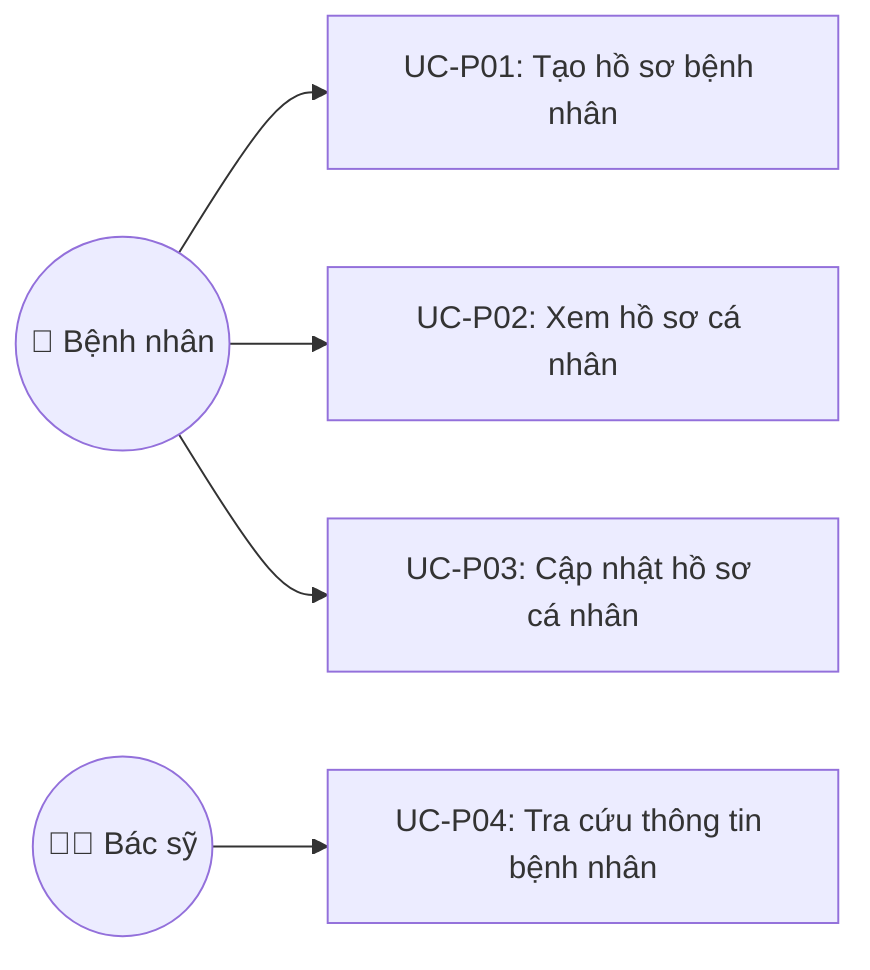
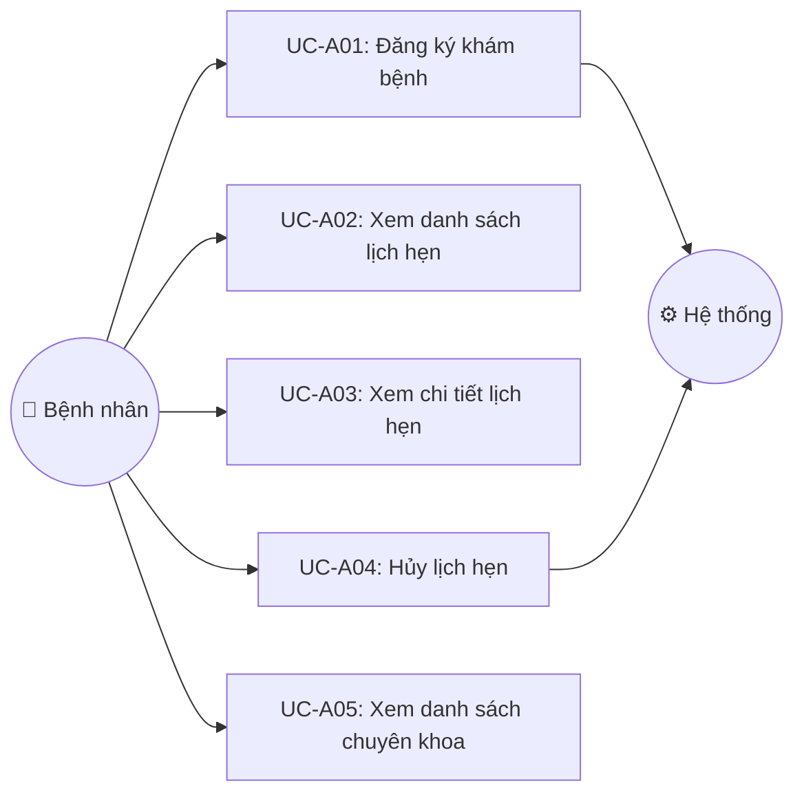
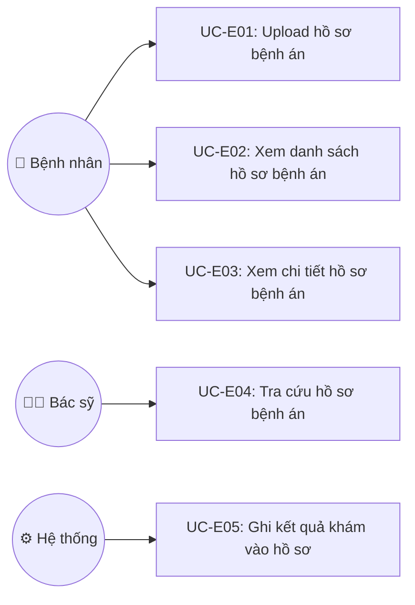
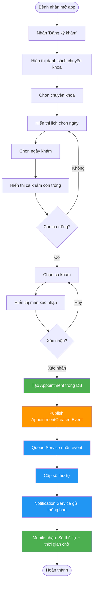
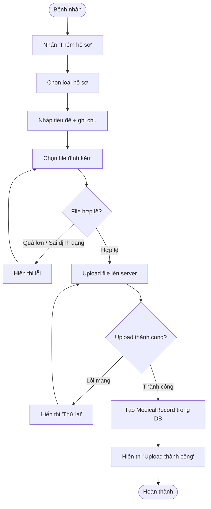

# Phân tích OOAD — Phân hệ Bệnh nhân (Người B)

> **Tài liệu lịch sử:** với Appointment/phân phòng, nguồn hiện hành là
> `docs/service-contracts/05-appointment.md` và baseline Chương 3. Event/trạng
> thái cũ còn lại trong file chỉ phản ánh kế hoạch ban đầu.

## Phạm vi phân tích

| Mục | Chi tiết |
|-----|----------|
| **Phân hệ** | Bệnh nhân |
| **Services** | Patient Service, Appointment Service, EMR Service |
| **Frontend** | Mobile App (Flutter) |
| **Phương pháp** | OOAD (Object-Oriented Analysis & Design) |

---

## Phase 1: Phân tích (Analysis)

### 1.1 Xác định Actor



| Actor | Loại | Mô tả | Tương tác với Service nào |
|-------|------|-------|--------------------------|
| **Bệnh nhân** | Primary | Người dùng chính, tương tác qua Mobile App (Flutter). Là chủ thể của toàn bộ phân hệ. | Patient, Appointment, EMR |
| **Bác sỹ** | Secondary | Tương tác gián tiếp qua Web App (React) của Người C. Gọi API của B để tra cứu thông tin bệnh nhân và hồ sơ bệnh án. | Patient, EMR |
| **Hệ thống** | Secondary | Đại diện cho các service khác (Queue Service của A, Doctor Consultation Service của C). Giao tiếp qua RabbitMQ (event-driven). | Appointment, EMR |

> [!NOTE]
> **Actor "Hệ thống"** ở đây không phải là 1 người cụ thể, mà là các Microservice khác trong hệ thống CareFlow. Chúng tương tác với service của B thông qua **Event (RabbitMQ)** hoặc **API call trực tiếp (REST)**. Trong Use Case Diagram, ta gộp chúng lại thành 1 actor "Hệ thống" cho đơn giản.

---

### 1.2 Danh sách Use Case

#### 🔵 Patient Service

| Mã UC | Tên Use Case | Actor chính | Actor phụ | Mức ưu tiên |
|-------|-------------|-------------|-----------|-------------|
| UC-P01 | Tạo hồ sơ bệnh nhân | Bệnh nhân | Hệ thống (Identity Service trigger) | 🔴 P0 |
| UC-P02 | Xem hồ sơ cá nhân | Bệnh nhân | — | 🔴 P0 |
| UC-P03 | Cập nhật hồ sơ cá nhân | Bệnh nhân | — | 🔴 P0 |
| UC-P04 | Tra cứu thông tin bệnh nhân | Bác sỹ | — | 🟡 P1 |

#### 🟢 Appointment Service

| Mã UC | Tên Use Case | Actor chính | Actor phụ | Mức ưu tiên |
|-------|-------------|-------------|-----------|-------------|
| UC-A01 | Đăng ký khám bệnh | Bệnh nhân | Hệ thống (Queue Service nhận event) | 🔴 P0 |
| UC-A02 | Xem danh sách lịch hẹn | Bệnh nhân | — | 🔴 P0 |
| UC-A03 | Xem chi tiết lịch hẹn | Bệnh nhân | — | 🔴 P0 |
| UC-A04 | Hủy lịch hẹn | Bệnh nhân | Hệ thống (Queue Service nhận event hủy) | 🟡 P1 |
| UC-A05 | Xem danh sách chuyên khoa | Bệnh nhân | — | 🔴 P0 |

#### 🟠 EMR Service (Electronic Medical Record)

| Mã UC | Tên Use Case | Actor chính | Actor phụ | Mức ưu tiên |
|-------|-------------|-------------|-----------|-------------|
| UC-E01 | Upload hồ sơ bệnh án | Bệnh nhân | — | 🔴 P0 |
| UC-E02 | Xem danh sách hồ sơ bệnh án | Bệnh nhân | — | 🔴 P0 |
| UC-E03 | Xem chi tiết hồ sơ bệnh án | Bệnh nhân | — | 🔴 P0 |
| UC-E04 | Tra cứu hồ sơ bệnh án của bệnh nhân | Bác sỹ | — | 🟡 P1 |
| UC-E05 | Ghi kết quả khám vào hồ sơ | Hệ thống (Doctor Consultation Service) | — | 🟡 P1 |

---

### 1.3 Use Case Diagram

#### Patient Service



#### Appointment Service



#### EMR Service



---

### 1.4 Đặc tả Use Case chi tiết

---

#### UC-P01: Tạo hồ sơ bệnh nhân

| Mục | Chi tiết |
|-----|----------|
| **Mã UC** | UC-P01 |
| **Tên** | Tạo hồ sơ bệnh nhân |
| **Actor** | Bệnh nhân |
| **Mô tả** | Sau khi đăng ký tài khoản thành công (qua Identity Service của A), bệnh nhân tạo hồ sơ cá nhân bao gồm thông tin y tế cơ bản. |
| **Tiền điều kiện** | Bệnh nhân đã đăng ký tài khoản và đăng nhập thành công (có JWT token). Chưa có hồ sơ bệnh nhân trong hệ thống. |
| **Hậu điều kiện** | Hồ sơ bệnh nhân được tạo trong DB, gắn với `user_id` từ Identity Service. |

**Luồng chính (Main Flow):**
1. Bệnh nhân mở ứng dụng lần đầu sau khi đăng ký.
2. Hệ thống hiển thị form nhập thông tin cá nhân (họ tên, ngày sinh, giới tính, SĐT, CMND/CCCD, số BHYT, địa chỉ).
3. Bệnh nhân điền thông tin và nhấn "Lưu".
4. Hệ thống validate dữ liệu.
5. Hệ thống tạo bản ghi `Patient` trong DB với `user_id` lấy từ JWT token.
6. Hệ thống hiển thị thông báo "Tạo hồ sơ thành công" và chuyển về Trang chủ.

**Luồng thay thế (Alternative Flow):**
- **4a.** Dữ liệu không hợp lệ (thiếu họ tên, SĐT sai định dạng...):
  - Hệ thống highlight trường bị lỗi và hiển thị thông báo lỗi cụ thể.
  - Quay lại bước 3.
- **5a.** `user_id` đã tồn tại trong bảng `patients`:
  - Hệ thống trả về lỗi "Hồ sơ đã tồn tại".
  - Chuyển hướng tới màn hình xem hồ sơ (UC-P02).

---

#### UC-P02: Xem hồ sơ cá nhân

| Mục | Chi tiết |
|-----|----------|
| **Mã UC** | UC-P02 |
| **Tên** | Xem hồ sơ cá nhân |
| **Actor** | Bệnh nhân |
| **Mô tả** | Bệnh nhân xem thông tin cá nhân của mình. |
| **Tiền điều kiện** | Bệnh nhân đã đăng nhập. Đã có hồ sơ bệnh nhân (UC-P01 đã thực hiện). |
| **Hậu điều kiện** | Không thay đổi dữ liệu. |

**Luồng chính:**
1. Bệnh nhân nhấn vào tab "Hồ sơ" trên thanh điều hướng.
2. Hệ thống gọi API `GET /api/patients/me` với JWT token.
3. Hệ thống hiển thị thông tin: họ tên, ngày sinh, giới tính, SĐT, CMND/CCCD, số BHYT, địa chỉ, ảnh đại diện.

**Luồng ngoại lệ:**
- **2a.** Không tìm thấy hồ sơ: Chuyển hướng tới form tạo hồ sơ (UC-P01).
- **2b.** Lỗi mạng/server: Hiển thị thông báo lỗi + nút "Thử lại".

---

#### UC-P03: Cập nhật hồ sơ cá nhân

| Mục | Chi tiết |
|-----|----------|
| **Mã UC** | UC-P03 |
| **Tên** | Cập nhật hồ sơ cá nhân |
| **Actor** | Bệnh nhân |
| **Mô tả** | Bệnh nhân chỉnh sửa thông tin cá nhân (SĐT, địa chỉ, số BHYT, ảnh đại diện...). |
| **Tiền điều kiện** | Đã đăng nhập, đã có hồ sơ. |
| **Hậu điều kiện** | Thông tin bệnh nhân được cập nhật trong DB. |

**Luồng chính:**
1. Bệnh nhân đang ở màn hình Hồ sơ (UC-P02), nhấn nút "Chỉnh sửa".
2. Hệ thống hiển thị form chỉnh sửa với dữ liệu hiện tại đã được điền sẵn.
3. Bệnh nhân sửa các trường mong muốn và nhấn "Lưu".
4. Hệ thống validate dữ liệu mới.
5. Hệ thống gọi API `PUT /api/patients/{id}` để cập nhật.
6. Hệ thống hiển thị thông báo "Cập nhật thành công".

**Luồng thay thế:**
- **4a.** Dữ liệu không hợp lệ: Hiển thị lỗi, quay lại bước 3.
- **3a.** Bệnh nhân nhấn "Hủy": Quay lại màn hình xem hồ sơ, không thay đổi gì.

---

#### UC-P04: Tra cứu thông tin bệnh nhân

| Mục | Chi tiết |
|-----|----------|
| **Mã UC** | UC-P04 |
| **Tên** | Tra cứu thông tin bệnh nhân |
| **Actor** | Bác sỹ |
| **Mô tả** | Bác sỹ tra cứu thông tin cá nhân của bệnh nhân trước hoặc trong khi khám. Bác sỹ truy cập qua Web App (của Người C), Web App gọi API của Patient Service. |
| **Tiền điều kiện** | Bác sỹ đã đăng nhập trên Web App với role `DOCTOR`. |
| **Hậu điều kiện** | Không thay đổi dữ liệu. |

**Luồng chính:**
1. Bác sỹ chọn bệnh nhân từ danh sách hàng đợi (dữ liệu từ Queue Service của A).
2. Web App gọi API `GET /api/patients/{id}` của Patient Service.
3. Hiển thị thông tin bệnh nhân: họ tên, tuổi, giới tính, số BHYT, tiền sử dị ứng.

**Luồng ngoại lệ:**
- **2a.** Không tìm thấy bệnh nhân: Hiển thị "Không tìm thấy hồ sơ bệnh nhân".

> [!NOTE]
> **Phân quyền quan trọng:** API `GET /api/patients/{id}` chỉ cho phép role `DOCTOR` hoặc chính bệnh nhân đó (kiểm tra `patient_id` trong JWT token khớp với `{id}`). Bệnh nhân không được xem hồ sơ của bệnh nhân khác.

---

#### UC-A01: Đăng ký khám bệnh

| Mục | Chi tiết |
|-----|----------|
| **Mã UC** | UC-A01 |
| **Tên** | Đăng ký khám bệnh |
| **Actor** | Bệnh nhân |
| **Mô tả** | Bệnh nhân đăng ký lịch khám bệnh bằng cách chọn chuyên khoa, ngày, và ca khám. Đây là use case cốt lõi nhất của phân hệ Bệnh nhân theo đề bài. |
| **Tiền điều kiện** | Bệnh nhân đã đăng nhập, đã có hồ sơ (UC-P01). |
| **Hậu điều kiện** | Lịch hẹn được tạo trong DB với trạng thái `PENDING`. Event `AppointmentCreated` được publish lên RabbitMQ để Queue Service (A) xử lý. |

**Luồng chính:**
1. Bệnh nhân nhấn "Đăng ký khám" trên Trang chủ.
2. Hệ thống hiển thị danh sách chuyên khoa (lấy từ API `GET /api/appointments/departments`).
3. Bệnh nhân chọn chuyên khoa.
4. Hệ thống hiển thị lịch (calendar) để chọn ngày khám.
5. Bệnh nhân chọn ngày.
6. Hệ thống hiển thị các ca khám còn trống trong ngày đã chọn (ví dụ: "08:00-08:30", "08:30-09:00"...).
7. Bệnh nhân chọn ca khám.
8. Hệ thống hiển thị màn hình **Xác nhận**: tóm tắt chuyên khoa, ngày, giờ, thông tin bệnh nhân.
9. Bệnh nhân nhấn "Xác nhận đặt lịch".
10. Hệ thống tạo bản ghi `Appointment` trong DB (trạng thái = `PENDING`).
11. Hệ thống publish event `AppointmentCreated` lên RabbitMQ.
12. Hệ thống hiển thị thông báo "Đặt lịch thành công" + thông tin lịch hẹn.

**Luồng thay thế:**
- **6a.** Không còn ca trống trong ngày đã chọn:
  - Hiển thị "Ngày này đã hết lịch, vui lòng chọn ngày khác."
  - Quay lại bước 4.
- **9a.** Bệnh nhân nhấn "Quay lại":
  - Quay lại bước trước đó, không tạo lịch hẹn.
- **10a.** Bệnh nhân đã có lịch hẹn cùng chuyên khoa, cùng ngày:
  - Hệ thống trả lỗi "Bạn đã có lịch hẹn khoa Nội ngày 20/07. Vui lòng hủy lịch cũ trước."

**Sự kiện phát sinh (Event):**

```json
// AppointmentCreatedEvent → publish lên RabbitMQ
{
    "eventType": "APPOINTMENT_CREATED",
    "appointmentId": "uuid",
    "patientId": "uuid",
    "patientName": "Nguyễn Văn A",
    "department": "Nội khoa",
    "appointmentDate": "2026-07-20",
    "timeSlot": "08:00-08:30",
    "createdAt": "2026-07-15T10:30:00"
}
```

> [!IMPORTANT]
> Appointment Service không tự quyết định diện ưu tiên. Queue Service mặc định
> lượt khám ban đầu là `NORMAL`; nhân viên có quyền chỉ xác nhận `PRIORITY` khi
> check-in sau khi kiểm tra diện ưu tiên và ghi nhận lý do/audit.

---

#### UC-A02: Xem danh sách lịch hẹn

| Mục | Chi tiết |
|-----|----------|
| **Mã UC** | UC-A02 |
| **Tên** | Xem danh sách lịch hẹn |
| **Actor** | Bệnh nhân |
| **Mô tả** | Bệnh nhân xem tất cả lịch hẹn khám của mình, phân loại theo: sắp tới, đã hoàn thành, đã hủy. |
| **Tiền điều kiện** | Bệnh nhân đã đăng nhập. |
| **Hậu điều kiện** | Không thay đổi dữ liệu. |

**Luồng chính:**
1. Bệnh nhân nhấn tab "Lịch hẹn" trên thanh điều hướng.
2. Hệ thống gọi API `GET /api/appointments/patient/{patientId}`.
3. Hệ thống hiển thị danh sách lịch hẹn, mặc định hiển thị tab "Sắp tới".
4. Mỗi lịch hẹn hiển thị: chuyên khoa, ngày giờ, trạng thái (badge màu).

**Luồng thay thế:**
- **3a.** Chưa có lịch hẹn nào: Hiển thị empty state "Bạn chưa có lịch hẹn nào" + nút "Đăng ký khám ngay".

---

#### UC-A03: Xem chi tiết lịch hẹn

| Mục | Chi tiết |
|-----|----------|
| **Mã UC** | UC-A03 |
| **Tên** | Xem chi tiết lịch hẹn |
| **Actor** | Bệnh nhân |
| **Mô tả** | Bệnh nhân xem thông tin chi tiết của một lịch hẹn cụ thể: chuyên khoa, ngày giờ, trạng thái, số thứ tự (nếu đã được cấp), ghi chú. |
| **Tiền điều kiện** | Bệnh nhân đã đăng nhập, đã có ít nhất 1 lịch hẹn. |
| **Hậu điều kiện** | Không thay đổi dữ liệu. |

**Luồng chính:**
1. Từ danh sách lịch hẹn (UC-A02), bệnh nhân nhấn vào một lịch hẹn.
2. Hệ thống gọi API `GET /api/appointments/{id}`.
3. Hệ thống hiển thị chi tiết: chuyên khoa, ngày, ca khám, trạng thái, ghi chú.
4. Nếu trạng thái là `CONFIRMED` hoặc `PENDING`: hiển thị nút "Hủy lịch hẹn".
5. Nếu đã được cấp số thứ tự (từ Queue Service của A): hiển thị số thứ tự và vị trí hàng đợi.

---

#### UC-A04: Hủy lịch hẹn

| Mục | Chi tiết |
|-----|----------|
| **Mã UC** | UC-A04 |
| **Tên** | Hủy lịch hẹn |
| **Actor** | Bệnh nhân |
| **Mô tả** | Bệnh nhân hủy một lịch hẹn đã đặt trước khi ngày khám diễn ra. |
| **Tiền điều kiện** | Lịch hẹn đang ở trạng thái `PENDING` hoặc `CONFIRMED`. Ngày khám chưa đến. |
| **Hậu điều kiện** | Trạng thái lịch hẹn chuyển thành `CANCELLED`. Event `AppointmentCancelled` được publish lên RabbitMQ. |

**Luồng chính:**
1. Từ chi tiết lịch hẹn (UC-A03), bệnh nhân nhấn nút "Hủy lịch hẹn".
2. Hệ thống hiển thị dialog xác nhận: "Bạn có chắc muốn hủy lịch khám khoa Nội ngày 20/07?"
3. Bệnh nhân nhấn "Xác nhận hủy".
4. Hệ thống cập nhật trạng thái lịch hẹn thành `CANCELLED`.
5. Hệ thống publish event `AppointmentCancelled` lên RabbitMQ (để Queue Service của A xóa khỏi hàng đợi).
6. Hệ thống hiển thị "Hủy lịch thành công" và quay về danh sách lịch hẹn.

**Luồng thay thế:**
- **3a.** Bệnh nhân nhấn "Không": Đóng dialog, quay lại chi tiết lịch hẹn.
- **1a.** Lịch hẹn đã ở trạng thái `CHECKED_IN` hoặc `IN_PROGRESS`: Nút "Hủy" bị ẩn, không cho hủy.

---

#### UC-A05: Xem danh sách chuyên khoa

| Mục | Chi tiết |
|-----|----------|
| **Mã UC** | UC-A05 |
| **Tên** | Xem danh sách chuyên khoa |
| **Actor** | Bệnh nhân |
| **Mô tả** | Bệnh nhân xem danh sách các chuyên khoa đang hoạt động tại bệnh viện để chọn khi đăng ký khám. |
| **Tiền điều kiện** | Bệnh nhân đã đăng nhập. |
| **Hậu điều kiện** | Không thay đổi dữ liệu. |

**Luồng chính:**
1. Hệ thống gọi API `GET /api/appointments/departments`.
2. Hiển thị danh sách chuyên khoa: tên, mô tả, vị trí (tầng/khu), trạng thái hoạt động.

> [!NOTE]
> Use case này thường được **include** (bao gồm) trong UC-A01 (Đăng ký khám bệnh) ở bước 2. Tuy nhiên, bệnh nhân cũng có thể xem danh sách chuyên khoa độc lập từ Trang chủ để tìm hiểu trước khi đặt lịch.

---

#### UC-E01: Upload hồ sơ bệnh án

| Mục | Chi tiết |
|-----|----------|
| **Mã UC** | UC-E01 |
| **Tên** | Upload hồ sơ bệnh án |
| **Actor** | Bệnh nhân |
| **Mô tả** | Bệnh nhân tải lên hồ sơ bệnh án cũ (kết quả xét nghiệm, phim chụp X-quang, giấy ra viện...) từ điện thoại. Đây là yêu cầu trực tiếp từ đề bài: "upload hồ sơ bệnh án (lịch sử khám điều trị và các xét nghiệm)". |
| **Tiền điều kiện** | Bệnh nhân đã đăng nhập, đã có hồ sơ bệnh nhân. |
| **Hậu điều kiện** | Bản ghi `MedicalRecord` được tạo trong DB. File được lưu trữ (local storage hoặc cloud). |

**Luồng chính:**
1. Bệnh nhân vào mục "Hồ sơ bệnh án" và nhấn nút "Thêm hồ sơ".
2. Hệ thống hiển thị form:
   - Loại hồ sơ (dropdown): Kết quả xét nghiệm, Phim chụp, Giấy ra viện, Đơn thuốc cũ, Khác
   - Tiêu đề (text): Ví dụ "Kết quả xét nghiệm máu 15/06/2026"
   - Ngày khám (date picker)
   - Mô tả / Ghi chú (text, không bắt buộc)
   - Đính kèm file (chọn ảnh từ thư viện hoặc chụp mới)
3. Bệnh nhân điền thông tin và đính kèm file (ảnh/PDF).
4. Bệnh nhân nhấn "Lưu".
5. Hệ thống upload file lên server (API `POST /api/emr/records/{id}/upload`).
6. Hệ thống tạo bản ghi `MedicalRecord` trong DB với `file_url` trỏ đến file đã upload.
7. Hiển thị "Upload thành công".

**Luồng thay thế:**
- **5a.** File quá lớn (>10MB): Hiển thị lỗi "File quá lớn, vui lòng chọn file dưới 10MB".
- **5b.** Định dạng không hỗ trợ: Hiển thị lỗi "Chỉ hỗ trợ ảnh (JPG, PNG) hoặc PDF".
- **5c.** Lỗi mạng khi upload: Hiển thị "Upload thất bại" + nút "Thử lại".

---

#### UC-E02: Xem danh sách hồ sơ bệnh án

| Mục | Chi tiết |
|-----|----------|
| **Mã UC** | UC-E02 |
| **Tên** | Xem danh sách hồ sơ bệnh án |
| **Actor** | Bệnh nhân |
| **Mô tả** | Bệnh nhân xem tất cả hồ sơ bệnh án của mình, bao gồm cả hồ sơ tự upload và hồ sơ do bác sỹ tạo sau khi khám. |
| **Tiền điều kiện** | Bệnh nhân đã đăng nhập. |
| **Hậu điều kiện** | Không thay đổi dữ liệu. |

**Luồng chính:**
1. Bệnh nhân vào mục "Hồ sơ bệnh án".
2. Hệ thống gọi API `GET /api/emr/records/patient/{patientId}`.
3. Hiển thị danh sách hồ sơ, sắp xếp theo ngày (mới nhất trước). Mỗi hồ sơ hiển thị: loại (icon + màu), tiêu đề, ngày, nguồn (tự upload / bác sỹ tạo).
4. Bệnh nhân có thể lọc theo loại hồ sơ (tất cả, xét nghiệm, phim chụp, kết quả khám...).

**Luồng thay thế:**
- **3a.** Chưa có hồ sơ nào: Hiển thị empty state + nút "Upload hồ sơ đầu tiên".

---

#### UC-E03: Xem chi tiết hồ sơ bệnh án

| Mục | Chi tiết |
|-----|----------|
| **Mã UC** | UC-E03 |
| **Tên** | Xem chi tiết hồ sơ bệnh án |
| **Actor** | Bệnh nhân |
| **Mô tả** | Bệnh nhân xem chi tiết một hồ sơ bệnh án cụ thể, bao gồm ảnh/file đính kèm. |
| **Tiền điều kiện** | Bệnh nhân đã đăng nhập, có ít nhất 1 hồ sơ. |
| **Hậu điều kiện** | Không thay đổi dữ liệu. |

**Luồng chính:**
1. Từ danh sách (UC-E02), bệnh nhân nhấn vào một hồ sơ.
2. Hệ thống gọi API `GET /api/emr/records/{id}`.
3. Hiển thị: tiêu đề, loại hồ sơ, ngày, mô tả, file đính kèm (ảnh hiển thị trực tiếp, PDF có nút "Mở").

---

#### UC-E04: Tra cứu hồ sơ bệnh án của bệnh nhân

| Mục | Chi tiết |
|-----|----------|
| **Mã UC** | UC-E04 |
| **Tên** | Tra cứu hồ sơ bệnh án của bệnh nhân |
| **Actor** | Bác sỹ |
| **Mô tả** | Bác sỹ tra cứu toàn bộ hồ sơ bệnh án của một bệnh nhân trước/trong khi khám để nắm tiền sử bệnh. Bác sỹ thao tác trên Web App (của Người C), Web App gọi API của EMR Service. |
| **Tiền điều kiện** | Bác sỹ đã đăng nhập, có role `DOCTOR`. |
| **Hậu điều kiện** | Không thay đổi dữ liệu. |

**Luồng chính:**
1. Bác sỹ chọn bệnh nhân (từ hàng đợi hoặc tìm kiếm).
2. Web App gọi API `GET /api/emr/records/patient/{patientId}`.
3. Hiển thị danh sách hồ sơ bệnh án: chẩn đoán cũ, kết quả xét nghiệm, phim chụp...
4. Bác sỹ nhấn vào từng hồ sơ để xem chi tiết + file đính kèm.

> [!NOTE]
> **Phân quyền:** API này chỉ cho phép role `DOCTOR`. Bệnh nhân chỉ được xem hồ sơ của chính mình qua UC-E02.

---

#### UC-E05: Ghi kết quả khám vào hồ sơ

| Mục | Chi tiết |
|-----|----------|
| **Mã UC** | UC-E05 |
| **Tên** | Ghi kết quả khám vào hồ sơ |
| **Actor** | Hệ thống (Doctor Consultation Service của Người C) |
| **Mô tả** | Sau khi bác sỹ khám xong và ghi chẩn đoán trên Web App, Doctor Consultation Service (C) gửi event hoặc gọi API để lưu kết quả khám vào EMR Service (B). |
| **Tiền điều kiện** | Buổi khám đã diễn ra, bác sỹ đã ghi chẩn đoán trên hệ thống. |
| **Hậu điều kiện** | Bản ghi `MedicalRecord` mới được tạo với `record_type = EXAMINATION`. Bệnh nhân có thể xem kết quả khám này trên Mobile App. |

**Luồng chính:**
1. Doctor Consultation Service (C) publish event `ConsultationCompleted` lên RabbitMQ.
2. EMR Service (B) nhận event.
3. EMR Service tạo bản ghi `MedicalRecord` mới:
   - `patient_id`: từ event
   - `record_type`: `EXAMINATION`
   - `title`: "Khám Nội khoa — BS. Nguyễn Văn X"
   - `description`: chẩn đoán + ghi chú của bác sỹ
   - `record_date`: ngày khám
4. Bệnh nhân mở app → thấy hồ sơ mới trong danh sách bệnh án (UC-E02).

**Event nhận:**

```json
// ConsultationCompletedEvent — nhận từ RabbitMQ (Người C gửi)
{
    "eventType": "CONSULTATION_COMPLETED",
    "consultationId": "uuid",
    "patientId": "uuid",
    "doctorId": "uuid",
    "doctorName": "BS. Nguyễn Văn X",
    "department": "Nội khoa",
    "diagnosis": "Viêm họng cấp",
    "notes": "Bệnh nhân cần nghỉ ngơi, uống nhiều nước",
    "consultationDate": "2026-07-20",
    "appointmentId": "uuid"
}
```

---

### 1.5 Activity Diagram — Luồng chính

#### Luồng Đăng ký khám bệnh (UC-A01) — End-to-end



> **Chú thích màu:**
> - 🟢 Xanh lá = Service của B xử lý
> - 🟠 Cam = RabbitMQ Event
> - 🔵 Xanh dương = Service của A xử lý

#### Luồng Upload hồ sơ bệnh án (UC-E01)



---

### 1.6 Ma trận Actor × Use Case (CRUD Matrix)

Bảng tổng hợp quyền truy cập của từng Actor vào từng Use Case:

| Use Case | Bệnh nhân | Bác sỹ | Hệ thống |
|----------|-----------|--------|----------|
| **Patient Service** | | | |
| UC-P01: Tạo hồ sơ bệnh nhân | ✅ Create | — | — |
| UC-P02: Xem hồ sơ cá nhân | ✅ Read (chỉ của mình) | — | — |
| UC-P03: Cập nhật hồ sơ | ✅ Update (chỉ của mình) | — | — |
| UC-P04: Tra cứu bệnh nhân | — | ✅ Read (bất kỳ) | — |
| **Appointment Service** | | | |
| UC-A01: Đăng ký khám | ✅ Create | — | 📩 Nhận event |
| UC-A02: Xem danh sách lịch hẹn | ✅ Read (chỉ của mình) | — | — |
| UC-A03: Xem chi tiết lịch hẹn | ✅ Read (chỉ của mình) | — | — |
| UC-A04: Hủy lịch hẹn | ✅ Update (chỉ của mình) | — | 📩 Nhận event |
| UC-A05: Xem chuyên khoa | ✅ Read | — | — |
| **EMR Service** | | | |
| UC-E01: Upload hồ sơ bệnh án | ✅ Create | — | — |
| UC-E02: Xem danh sách hồ sơ | ✅ Read (chỉ của mình) | — | — |
| UC-E03: Xem chi tiết hồ sơ | ✅ Read (chỉ của mình) | — | — |
| UC-E04: Tra cứu hồ sơ bệnh nhân | — | ✅ Read (bất kỳ) | — |
| UC-E05: Ghi kết quả khám | — | — | ✅ Create (qua Event) |

---

## Các điểm cần thống nhất với Người A và Người C

> [!WARNING]
> Những điểm dưới đây **BẮT BUỘC** phải thống nhất với nhóm trước khi bắt tay vào thiết kế (Phase 2). Nếu không thống nhất sẽ dẫn đến lỗi tích hợp.

### Thống nhất với Người A (Phân hệ Hệ thống)

| # | Nội dung cần thống nhất | Lý do |
|---|------------------------|-------|
| 1 | Cấu trúc JWT Token chứa những trường gì? (`user_id`, `role`, `patient_id`?) | Patient Service cần lấy `user_id` từ token để biết bệnh nhân nào đang gọi API |
| 2 | Payload của event `AppointmentCreated` gồm những gì? | Queue Service cần nhận đúng format để tạo số thứ tự |
| 3 | Payload của event `AppointmentCancelled` gồm những gì? | Queue Service cần biết để xóa/cập nhật hàng đợi |
| 4 | Tên Exchange, Routing Key trên RabbitMQ? | Hai bên phải dùng chung tên để message đi đúng đích |
| 5 | API lấy số thứ tự: `GET /api/queues/patient/{patientId}/status` — response trả gì? | Mobile App của B cần hiển thị số thứ tự, vị trí, thời gian chờ |

### Thống nhất với Người C (Phân hệ Bác sỹ)

| # | Nội dung cần thống nhất | Lý do |
|---|------------------------|-------|
| 1 | API tra cứu bệnh nhân: `GET /api/patients/{id}` — response trả những gì? | Web App của C cần hiển thị thông tin bệnh nhân khi bác sỹ khám |
| 2 | API tra cứu hồ sơ bệnh án: `GET /api/emr/records/patient/{patientId}` — response trả gì? | Bác sỹ cần xem lịch sử bệnh trước khi khám |
| 3 | Payload event `ConsultationCompleted` gồm những gì? | EMR Service (B) cần nhận đúng format để lưu kết quả khám |
| 4 | Phân quyền: role `DOCTOR` được gọi API nào của B? | Tránh việc Web App gọi nhầm API chỉ dành cho bệnh nhân |
