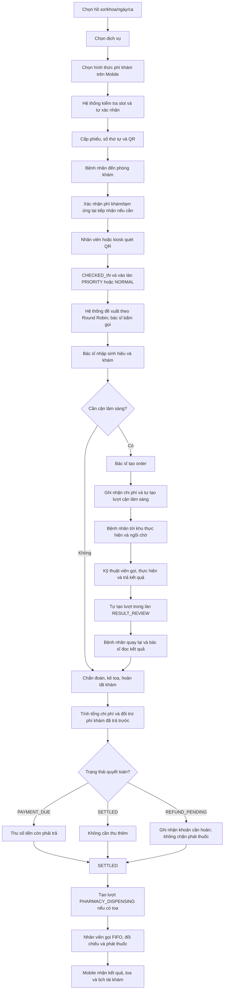

# Hành trình khám ngoại trú và vai trò của hệ thống CareFlow

> Phiên bản nghiệp vụ đã thống nhất ngày 30/07/2026, cập nhật mô hình Queue ngày
> 03/08/2026, luồng thanh toán Mobile ngày 04/08/2026 và mô hình tự chi trả hai
> giai đoạn ngày 05/08/2026.
>
> Tài liệu mô tả hành trình của bệnh nhân, bác sĩ và nhân viên y tế trong một lượt
> khám ngoại trú; đồng thời xác định Mobile App, Hospital Web App và các
> microservice tham gia ở từng giai đoạn.

## 1. Mục tiêu

CareFlow là hệ thống hỗ trợ và điều phối hành trình khám ngoại trú tại bệnh viện
công, từ lúc bệnh nhân đặt khám đến khi nhận kết quả, toa thuốc và lịch tái khám.

Hệ thống giải quyết các vấn đề chính:

- Bệnh nhân chủ động đặt lịch và nhận phiếu khám điện tử.
- Bệnh viện biết bệnh nhân nào thực sự đã đến và đang chờ.
- Bác sĩ theo dõi queue, hồ sơ và toàn bộ diễn biến của lượt khám.
- Chỉ định cận lâm sàng được chuyển tự động tới đúng bộ phận.
- Bệnh nhân được hướng dẫn rõ bước tiếp theo trên Mobile App.
- Kết quả, toa thuốc và lịch tái khám được lưu thành lịch sử liên tục.

CareFlow không thay thế toàn bộ HIS của bệnh viện. Những nghiệp vụ như quản lý
viện phí đầy đủ, kho dược, nội trú hoặc PACS có thể được mô hình hóa như hệ
thống ngoài và tích hợp sau. Phiên bản báo cáo chỉ xét người bệnh tự chi trả.

## 2. Các quyết định nghiệp vụ đã chốt

1. Appointment được hệ thống tự động xác nhận nếu slot còn khả dụng; không cần
   nhân viên duyệt thủ công.
2. Khi đặt khám thành công, bệnh nhân nhận phiếu khám, số thứ tự, khung giờ,
   phòng khám và QR.
3. Một khoa có thể có nhiều phòng khám (`Department 1:N ClinicRoom`). Trong MVP,
   dữ liệu chỉ cấu hình đúng một phòng active cho mỗi khoa;
   Appointment Service suy ra phòng từ khoa, không chọn ngẫu nhiên và bệnh nhân
   không truyền `roomId` khi đặt lịch.
4. QR thuộc phiếu khám của bệnh nhân. Nhân viên hoặc kiosk tại phòng khám quét
   QR để xác nhận tiếp nhận.
5. Active queue của phòng khám chỉ chứa bệnh nhân khám ban đầu đã `CHECKED_IN`
   hoặc lượt đọc kết quả được tự động tạo khi đủ kết quả bắt buộc.
6. Mỗi phòng và phiên khám có ba làn điều phối logic: `PRIORITY`, `NORMAL` và
   `RESULT_REVIEW`. Queue Service đề xuất lượt theo Round Robin `1:1:1`, đồng
   thời giữ FIFO riêng trong từng làn.
7. Bác sĩ nhập sinh hiệu trực tiếp trong màn hình khám. Role điều dưỡng có thể
   được bổ sung sau nhưng không bắt buộc trong MVP.
8. Trong Patient Mobile, luồng đặt khám có thêm bước chọn dịch vụ và thanh toán
   phí khám. Khi chưa có catalog dịch vụ, Mobile dùng fixture duy nhất
   `GENERAL_CONSULTATION` — “Khám thường”, giá demo `150.000 ₫`, thời lượng tham
   khảo 15 phút.
9. Patient Mobile chỉ ghi nhận `ONLINE_MOCK` cho phí khám khi đặt lịch. Khoản
   này được lưu thành `PAID` trong receipt local; `CASH_AT_HOSPITAL` không còn
   được hiển thị trong booking vì người chưa trả trước sẽ làm thủ tục trực tiếp
   tại bệnh viện. Appointment vẫn tự `CONFIRMED` khi slot hợp lệ; Appointment
   Service chưa nhận payment/service contract. Receipt của bước này được lưu
   qua local adapter và lỗi local không làm hỏng lịch hẹn đã tạo thành công.
9a. Hành trình chỉ có hai giai đoạn thanh toán: trả trước phí khám khi đặt lịch
    và quyết toán một lần ở cuối lượt khám. Chi phí cận lâm sàng và thuốc được
    cộng vào tổng chi phí lượt khám, không tạo lần thanh toán riêng.
10. Sau khi bác sĩ tạo chỉ định cận lâm sàng, hệ thống tự tạo lượt tại khu tương
   ứng. Bệnh nhân tới ngồi chờ, không check-in thêm tại mỗi khu.
11. Khi đủ kết quả bắt buộc, hệ thống tự đưa lượt vào làn `RESULT_REVIEW` và
    thông báo/hướng dẫn bệnh nhân quay lại phòng bác sĩ.
12. Lượt đọc kết quả vẫn thuộc cùng consultation, không tạo Appointment mới.
13. Toa đã xác nhận tự tạo lượt phát thuốc FIFO tại điểm cấp phát; nghiệp vụ này
   không bao gồm quản lý kho hoặc tồn kho.
14. Sau khi bác sĩ hoàn tất kết luận, hệ thống tính `totalVisitCost`, đối trừ
   `prepaidAmount` và xác định `amountDue` hoặc `refundDue`. Các trạng thái quyết
   toán gồm `PAYMENT_DUE`, `SETTLED`, `REFUND_PENDING` và `REFUNDED`; số tiền cần
   thu không bao giờ được lưu âm.
15. `REFUND_PENDING` không chặn phát thuốc vì người bệnh không còn nghĩa vụ phải
   nộp thêm. Chỉ trạng thái `PAYMENT_DUE` mới chặn thao tác xác nhận phát thuốc.
16. Hệ thống chỉ đề xuất lượt tiếp theo; bác sĩ phải chủ động bấm gọi. Việc xem
   đề xuất không làm thay đổi trạng thái Queue Entry.

## 3. Các vai trò và giao diện

| Vai trò | Giao diện | Trách nhiệm chính |
|---|---|---|
| Bệnh nhân | Patient Mobile App | Đặt khám, xem phiếu, theo dõi lượt, nhận chỉ định, kết quả, toa và lịch tái khám |
| Bác sĩ | Hospital Web App | Theo dõi queue, khám, nhập sinh hiệu, chẩn đoán, tạo chỉ định, kê toa |
| Nhân viên tiếp nhận | Hospital Web App | Quét phiếu, xác nhận bệnh nhân đã đến, hỗ trợ lỡ lượt |
| Kỹ thuật viên cận lâm sàng | Hospital Web App | Theo dõi order, gọi số, thực hiện kỹ thuật và nhập kết quả |
| Nhân viên cấp phát thuốc | Hospital Web App | Theo dõi queue FIFO, gọi số, đối chiếu toa và xác nhận đã phát thuốc |
| Thu ngân | Hospital Web App hoặc hệ thống ngoài | Ghi nhận phí khám trả trước, quyết toán cuối lượt và xử lý hoàn tiền; adapter demo không được xem là chứng từ production |
| Quản trị viên | Hospital Web App | Cấu hình khoa, phòng, bác sĩ, lịch, capacity và điểm phục vụ |

Hospital Web App là một ứng dụng phân quyền theo role. Không cần xây một web
riêng cho từng loại nhân viên.

## 4. Các khái niệm nghiệp vụ cốt lõi

### 4.1. Appointment

Lịch đặt khám trong tương lai, gồm bệnh nhân, khoa, phòng đã được hệ thống phân,
bác sĩ nếu có, ngày, khung giờ và thông tin dịch vụ hiển thị trên Mobile.
Appointment giữ capacity nhưng không chứng minh bệnh nhân đã đến. Request từ
bệnh nhân không chứa `roomId`; Appointment Service xác định và lưu `roomId`
trước khi xác nhận lịch. Ở Mobile MVP, thông tin dịch vụ và receipt thanh toán
được giữ qua local adapter vì Appointment Service chưa có payment/service contract.

### 4.2. Department và ClinicRoom

`Department` là khoa chuyên môn; `ClinicRoom` là phòng khám vật lý thuộc một
khoa. Mô hình mục tiêu cho phép một khoa có nhiều phòng. Chính sách MVP yêu cầu
truy vấn phòng active của khoa phải trả đúng một kết
quả. Không có phòng hoặc có nhiều hơn một phòng đều là lỗi cấu hình, không được
âm thầm chọn `findFirst()` hoặc random.

### 4.3. Visit Ticket

Phiếu khám điện tử do Queue Management Service cấp sau khi nhận sự kiện
`AppointmentConfirmed`. Phiếu gồm:

- Mã phiếu.
- Số thứ tự.
- Khung giờ dự kiến.
- Khoa và phòng.
- QR tham chiếu phiếu.
- Trạng thái phí khám trả trước nếu có.

### 4.4. Queue Entry

Một lượt chờ tại một điểm phục vụ cụ thể, ví dụ:

- Phòng khám Thần kinh 21.
- Khu lấy mẫu xét nghiệm.
- Phòng siêu âm 05.
- Danh sách chờ bác sĩ đọc kết quả.
- Quầy phát thuốc.

Không có một queue chung cho toàn bệnh viện.

`QueueType` mô tả công đoạn phục vụ (`CONSULTATION`, `LAB_EXECUTION`,
`PHARMACY_DISPENSING`). Với `CONSULTATION`, `ConsultationPhase` phân biệt
`INITIAL` và `RESULT_REVIEW`, còn `QueueClass` mô tả diện bệnh nhân ở phase
`INITIAL` (`PRIORITY`, `NORMAL`). Tại phòng khám, Queue Service ánh xạ chúng
thành ba làn điều phối `PRIORITY`, `NORMAL` và `RESULT_REVIEW`; đây là ba tập
logic trên cùng nguồn Queue Entry, không phải ba bảng dữ liệu độc lập.

### 4.5. Consultation

Phiên khám lâm sàng của bác sĩ. Consultation có thể tạm dừng để chờ cận lâm
sàng, sau đó tiếp tục khi kết quả sẵn sàng.

### 4.6. Clinical/Laboratory Order

Chỉ định do bác sĩ tạo, gồm một hoặc nhiều hạng mục cần thực hiện. Các xét
nghiệm sử dụng cùng một lần lấy mẫu nên được gom vào một lượt phục vụ.

### 4.7. Result

Kết quả cận lâm sàng gắn với order và consultation. Khi đủ kết quả, hệ thống đưa
bệnh nhân trở lại danh sách chờ bác sĩ đọc kết quả.

### 4.8. Prescription và Follow-up

Toa thuốc và lịch tái khám được tạo sau khi bác sĩ hoàn thiện kết luận.

## 5. Luồng tổng thể



## 6. Tiền điều kiện: Bệnh viện cấu hình hệ thống

Trước khi mở lịch, quản trị viên cấu hình:

- Cơ sở bệnh viện.
- Khoa chuyên môn.
- Các phòng khám thuộc từng khoa theo quan hệ `Department 1:N ClinicRoom`.
- Danh sách bác sĩ.
- Lịch làm việc của bác sĩ.
- Khung giờ và capacity.
- Chính sách check-in sớm/muộn.
- Chính sách `MISSED`, `NO_SHOW` và gọi lại.
- Danh mục dịch vụ cận lâm sàng.

Trong Patient Mobile MVP, catalog dịch vụ khám chưa lấy từ backend. Mobile dùng
fixture cố định `GENERAL_CONSULTATION` / “Khám thường” / `150.000 ₫` / 15 phút.
Fixture này sẽ được thay bằng catalog theo cơ sở khi Hospital Directory hoặc
Appointment Service hỗ trợ contract tương ứng.

Ví dụ:

```text
Khoa: Thần kinh
Phòng: 21
Bác sĩ: Nguyễn Văn A
Ngày: 18/08/2026
Khung giờ: 10:30-11:30
Capacity: 10 bệnh nhân
```

Trong dữ liệu MVP, khoa Thần kinh chỉ có một `ClinicRoom` active tại khung giờ
trên. Ràng buộc này thuộc chính sách ứng dụng, không phải cardinality 1:1 của mô
hình dữ liệu.

Các service tham gia:

- Identity & eKYC Service.
- Appointment Service.
- Queue Management Service.
- Patient Service.

## 7. Giai đoạn 1: Đặt khám và tự động xác nhận

### 7.1. Bệnh nhân thao tác

Trên Patient Mobile App:

1. Đăng nhập.
2. Chọn hồ sơ bệnh nhân.
3. Chọn khoa hoặc bác sĩ.
4. Chọn ngày và khung giờ.
5. Chọn dịch vụ “Khám thường” (fixture hiện tại).
6. Nhập lý do khám.
7. Thanh toán trực tuyến mô phỏng `ONLINE_MOCK` cho phí khám.
8. Xác nhận đặt khám.

### 7.2. Hệ thống xử lý

Appointment Service kiểm tra:

- Slot còn capacity.
- Ngày khám hợp lệ.
- Bệnh nhân không đặt trùng cùng thời điểm.
- Danh sách phòng active của khoa trả đúng một phòng trong MVP.

Nếu hợp lệ:

```text
POST /api/appointments
→ suy ra và lưu roomId từ khoa
→ tạo Appointment CONFIRMED
→ giữ capacity
→ phát AppointmentConfirmed
```

Payment/service catalog không nằm trong request contract hiện tại của Appointment.
Sau khi API tạo lịch thành công, Mobile lưu `AppointmentPaymentReceipt` qua
local adapter để thể hiện UX. `ONLINE_MOCK` có receipt mô phỏng; tiền mặt có
trạng thái `DUE_AT_HOSPITAL`. Nếu local storage lỗi, Mobile vẫn giữ lịch hẹn đã
được backend tạo thành công và hiển thị cảnh báo có thể thử lưu lại receipt.

Không có bước nhân viên duyệt thủ công.

### 7.3. App hiển thị

```text
ĐẶT KHÁM THÀNH CÔNG

Khoa: Thần kinh
Phòng: 21
Ngày khám: 18/08/2026
Khung giờ: 10:30-11:30
Dịch vụ: Khám thường
Phí khám: 150.000 ₫
Thanh toán: Đã mô phỏng / Thanh toán tại bệnh viện
Trạng thái: Đã xác nhận
```

### 7.4. Service tham gia

- API Gateway: xác thực và routing.
- Identity Service: xác định tài khoản.
- Patient Service: lấy hồ sơ bệnh nhân.
- Appointment Service: sở hữu `Department`, `ClinicRoom`, kiểm tra/phân phòng và
  giữ slot theo chính sách MVP.
- Notification Service: thông báo thành công.

Patient Mobile giữ `AppointmentServiceOption.catalog` và
`AppointmentPaymentReceipt` qua local adapter trong MVP; đây không phải Payment
Service và không làm thay đổi Appointment API hiện tại.

## 8. Giai đoạn 2: Cấp phiếu khám điện tử

Sau khi Appointment được xác nhận, Queue Management Service nhận
`AppointmentConfirmed`, tạo Visit Ticket và cấp:

```text
PHIẾU KHÁM BỆNH

Mã phiếu: PK-2026-00125
Số thứ tự: 47
Khoa: Thần kinh
Phòng: 21
Khung giờ: 10:30-11:30
QR: careflow:ticket:<opaque-token>
```

QR chỉ chứa token tham chiếu hoặc token đã ký. Không nhúng trực tiếp họ tên,
CCCD, ngày sinh, chẩn đoán hoặc thông tin y tế.

Patient Mobile hiển thị:

- Phiếu khám.
- Số thứ tự.
- QR.
- Bản đồ hoặc hướng dẫn đến phòng.
- Hướng dẫn đến trước giờ dự kiến.
- Nút hủy lịch.
- Trạng thái thanh toán.

Queue Entry có thể được tạo trước ở trạng thái `TICKET_ISSUED`, nhưng chưa xuất
hiện trong active queue.

## 9. Giai đoạn 3: Đến bệnh viện và check-in

Bệnh nhân tới đúng phòng khám và xuất trình phiếu.

Nhân viên hoặc kiosk:

1. Quét QR.
2. Mở đúng phiếu.
3. Đối chiếu thông tin tối thiểu.
4. Xác nhận tiếp nhận.

Hệ thống chuyển:

```text
TICKET_ISSUED
→ CHECKED_IN
```

`CHECKED_IN` có nghĩa:

- Bệnh nhân đã đến.
- Đã được tiếp nhận.
- Đang có mặt ở khu chờ.
- Đủ điều kiện để được gọi.

Không tách `ARRIVED` và `READY` trong MVP.

Patient Mobile hiển thị:

```text
ĐÃ TIẾP NHẬN

Số thứ tự: 47
Phòng: 21
Trạng thái: Đang chờ
Dự kiến gọi: 10:40
```

## 10. Giai đoạn 4: Active queue và gọi bệnh nhân

### 10.1. Hai danh sách khác nhau

Appointment Service cung cấp danh sách lịch dự kiến:

| Số | Khung giờ | Trạng thái |
|---:|---|---|
| 47 | 10:30 | Đã check-in |
| 48 | 10:40 | Chưa đến |
| 49 | 10:50 | Đã check-in |

Queue Service chỉ đưa các lượt đủ điều kiện vào active queue. Lượt khám ban đầu
được phân vào làn `PRIORITY` hoặc `NORMAL`:

| Vị trí | Số | Trạng thái |
|---:|---:|---|
| 1 | 47 | Đang chờ |
| 2 | 49 | Đang chờ |

Số 48 không xuất hiện trong active queue cho tới khi check-in. Nếu quá thời gian
cho phép mà chưa check-in, Appointment có thể chuyển sang `NO_SHOW`.

### 10.2. Ba làn điều phối và quy tắc Round Robin

- Mỗi phòng và phiên khám có ba làn logic: `PRIORITY`, `NORMAL` và
  `RESULT_REVIEW`.
- Chỉ `CHECKED_IN` mới đủ điều kiện gọi.
- Trong mỗi làn, FIFO theo `queuedAt`; nếu bằng nhau thì dùng số thứ tự làm tiêu
  chí phụ. Với lượt khám ban đầu, `queuedAt` được ghi khi check-in.
- Mặc định lượt khám ban đầu thuộc `NORMAL`; nhân viên có quyền chỉ xác nhận
  `PRIORITY` sau khi kiểm tra diện ưu tiên và phải lưu lý do để audit.
- Queue Service đề xuất theo chu kỳ `PRIORITY → NORMAL → RESULT_REVIEW` và bỏ
  qua làn rỗng, không để một làn rỗng làm gián đoạn việc gọi.
- Nếu chưa có lịch sử gọi, chu kỳ bắt đầu từ `PRIORITY`; sau đó hệ thống quét từ
  làn đứng sau `lastServedLane` để tìm làn không rỗng đầu tiên.
- Bệnh nhân đến trễ chỉ vào cuối làn tương ứng tại thời điểm check-in.
- Cấp cứu là luồng riêng, không trộn vào queue khám ngoại trú.

### 10.3. Gọi bệnh nhân

Doctor Web hiển thị đồng thời ba làn, một ô `recommendedNext` và nút **Gọi** tại
mỗi lượt `CHECKED_IN`. Khi sẵn sàng, bác sĩ có thể gọi lượt được đề xuất hoặc
chủ động gọi một lượt khác:

```text
CHECKED_IN
→ CALLED
```

Nếu bác sĩ dùng nút gọi nhanh, Queue Service tính lại đề xuất tại thời điểm xử lý.
Nếu bác sĩ bấm nút trên một hàng, Queue Service gọi đúng Queue Entry được chọn.
Sau khi gọi thành công, hệ thống ghi `calledByUserId`, `calledAt` và phát
`PatientCalled`. Phòng MVP có một bác sĩ và một máy; hệ thống không chặn bác sĩ
gọi thêm chỉ vì đã có bệnh nhân `CALLED` hoặc `IN_PROGRESS`.

Mobile nhận:

```text
ĐÃ ĐẾN LƯỢT

Mời số 47 vào Phòng 21.
```

Màn hình công cộng chỉ hiển thị mã/số, không hiển thị đầy đủ tên bệnh nhân.

Nếu bệnh nhân không có mặt:

```text
CALLED
→ RECALL
→ MISSED
```

Nhân viên có thể đưa lượt `MISSED` xuống cuối queue hoặc gọi lại theo chính sách.

## 11. Giai đoạn 5: Khám lâm sàng ban đầu

Bác sĩ bấm `Bắt đầu khám`:

```text
QueueEntry: CALLED → IN_PROGRESS
Consultation: NOT_STARTED → IN_PROGRESS
```

Doctor Web hiển thị:

- Thông tin định danh.
- Lý do khám.
- Tiền sử bệnh.
- Dị ứng.
- Thuốc đang dùng.
- Hồ sơ bệnh nhân đã upload.
- Lịch sử consultation, prescription và kết quả cũ.

Bác sĩ nhập trực tiếp:

- Nhiệt độ.
- Huyết áp.
- Mạch.
- SpO2.
- Cân nặng và chiều cao.
- Triệu chứng.
- Khám thực thể.
- Chẩn đoán sơ bộ.
- ICD-10.
- Ghi chú lâm sàng.

Trong MVP không bắt buộc workflow điều dưỡng riêng. Sau này role `NURSE` có thể
được cấp quyền nhập sinh hiệu trên cùng dữ liệu.

Các service tham gia:

- Patient Service.
- EMR Service.
- Doctor Consultation Service.
- Queue Management Service.
- AI Clinical Assistant Service ở vai trò hỗ trợ tùy chọn.

## 12. Giai đoạn 6A: Không cần cận lâm sàng

Nếu bác sĩ đủ thông tin để kết luận:

1. Hoàn thiện chẩn đoán.
2. Tạo toa thuốc.
3. Dặn dò.
4. Tạo lịch tái khám nếu cần.
5. Hoàn tất consultation.

```text
Consultation: IN_PROGRESS → COMPLETED
QueueEntry: IN_PROGRESS → COMPLETED
Appointment: CONFIRMED → FULFILLED
```

Luồng tiếp tục tại Giai đoạn 9 và 10.

## 13. Giai đoạn 6B: Tạo chỉ định cận lâm sàng

Nếu cần cận lâm sàng, bác sĩ tạo order, ví dụ:

- Công thức máu.
- Đường huyết.
- Chức năng gan.
- Siêu âm ổ bụng.

Consultation chuyển:

```text
IN_PROGRESS
→ WAITING_FOR_RESULTS
```

Không đánh dấu consultation hoàn tất.

### 13.1. Mobile hiển thị

```text
ĐÃ KHÁM BAN ĐẦU

Bác sĩ đã tạo chỉ định cận lâm sàng.
Lượt khám của bạn chưa hoàn tất.

1. Xét nghiệm máu
   Địa điểm: Khu xét nghiệm - Tầng 2
   Trạng thái: Chờ thực hiện

2. Siêu âm ổ bụng
   Địa điểm: Phòng siêu âm 05
   Trạng thái: Chờ thực hiện
```

### 13.2. Ghi nhận chi phí

Laboratory Order lưu đơn giá và thành tiền của từng hạng mục để tổng hợp khi kết
thúc lượt khám. Order hợp lệ được đưa ngay vào queue thực hiện:

```text
ORDERED → QUEUED
```

Không có phương thức, trạng thái hoặc API thanh toán riêng cho cận lâm sàng.
Việc thu tiền chỉ diễn ra tại bước quyết toán cuối lượt.

## 14. Giai đoạn 7: Thực hiện cận lâm sàng

### 14.1. Không check-in lại tại khu cận lâm sàng

Ngay khi order đủ điều kiện thực hiện:

```text
ClinicalOrderCreated
→ Laboratory Order Service nhận order
→ Queue Service tự tạo lượt
→ Mobile hiển thị số và địa điểm
```

Bệnh nhân chỉ cần tới khu tương ứng và ngồi chờ. Không cần:

- Quét QR thêm.
- Gặp quầy tiếp nhận riêng.
- Bấm check-in.
- Lấy phiếu thủ công lần nữa.

### 14.2. App hiển thị

```text
XÉT NGHIỆM MÁU

Số thứ tự: XN-105
Địa điểm: Khu xét nghiệm - Tầng 2
Trạng thái: Đang chờ
Còn 4 lượt phía trước
```

### 14.3. Kỹ thuật viên thao tác

Lab Web đã có sẵn order và queue. Kỹ thuật viên:

1. Gọi số tiếp theo.
2. Khi bệnh nhân tới bàn thực hiện, đối chiếu danh tính.
3. Bấm `Bắt đầu thực hiện`.
4. Lấy mẫu/thực hiện kỹ thuật.
5. Nhập hoặc xác nhận kết quả.

Không có bước check-in riêng. Việc đối chiếu danh tính là một phần của thao tác
bắt đầu thực hiện.

### 14.4. Trạng thái

```text
ORDERED
→ QUEUED
→ CALLED
→ IN_PROGRESS
→ RESULT_AVAILABLE
→ REVIEWED
```

Nếu bệnh nhân không có mặt:

```text
CALLED
→ MISSED
→ QUEUED
```

### 14.5. Gom order theo điểm phục vụ

Các xét nghiệm dùng chung một lần lấy máu:

```text
1 Laboratory Order
├── Công thức máu
├── Đường huyết
└── Chức năng gan

1 Queue Entry: XN-105
```

Siêu âm ở điểm phục vụ khác tạo lượt riêng:

```text
XN-105 — Khu lấy mẫu
SA-042 — Phòng siêu âm
```

## 15. Giai đoạn 8: Quay lại bác sĩ đọc kết quả

### 15.1. Kích hoạt lượt đọc kết quả

Khi tất cả kết quả bắt buộc đã sẵn sàng:

```text
LabResultAvailable
→ Consultation WAITING_FOR_REVIEW
→ Queue Service tự tạo entry CONSULTATION + RESULT_REVIEW ở trạng thái QUEUED
→ queuedAt = thời điểm đủ kết quả
→ Notification hướng dẫn bệnh nhân quay lại Phòng 21
```

Bệnh nhân không:

- Check-in lại.
- Lấy Appointment mới.
- Lấy lại queue khám ban đầu.

### 15.2. Làn `RESULT_REVIEW` và Round Robin `1:1:1`

Giả sử ba làn đều có bệnh nhân, thứ tự đề xuất là:

```text
PRIORITY → NORMAL → RESULT_REVIEW → PRIORITY → ...
```

Nếu một làn rỗng, Queue Service bỏ qua làn đó. Ví dụ `NORMAL` đang rỗng:

```text
PRIORITY → RESULT_REVIEW → PRIORITY → RESULT_REVIEW → ...
```

FIFO vẫn được giữ trong từng làn. Lượt `RESULT_REVIEW` không bị chèn vào giữa
làn khám ban đầu và cũng không tự động đứng đầu toàn bộ active queue.

### 15.3. Mobile hiển thị

```text
KẾT QUẢ ĐÃ SẴN SÀNG

Bạn đã được đưa vào danh sách chờ đọc kết quả.
Vui lòng quay lại Phòng 21 và chờ được gọi.
```

### 15.4. Doctor Web hiển thị

```text
Đang khám
• A

Ưu tiên: P1, P2
Thông thường: N1, N2
Đọc kết quả: R1, R2
Đề xuất tiếp theo: N1
```

Các Queue Entry được ánh xạ thành làn điều phối:

```text
- CONSULTATION + INITIAL + PRIORITY → PRIORITY
- CONSULTATION + INITIAL + NORMAL → NORMAL
- CONSULTATION + RESULT_REVIEW → RESULT_REVIEW
```

### 15.5. Nếu bệnh nhân chưa quay lại

Khi đến lượt R mà R chưa có mặt:

```text
RESULT_REVIEW CALLED
→ MISSED
→ xếp lại cuối làn RESULT_REVIEW nếu đủ điều kiện
```

Không để phòng khám chờ. Queue Service bỏ qua lượt vắng và đề xuất đầu làn hợp
lệ kế tiếp. Có thể giới hạn số lần gọi lại trước khi yêu cầu nhân viên xử lý.

### 15.6. Bác sĩ tiếp tục consultation

```text
Consultation:
WAITING_FOR_REVIEW
→ IN_PROGRESS
→ COMPLETED
```

Bác sĩ đọc kết quả, hoàn thiện chẩn đoán, kê toa và dặn dò.

## 16. Giai đoạn 9: Kê toa, tái khám và hoàn tất

### 16.1. Xác nhận toa và hoàn tất khám

Bác sĩ tạo toa ở trạng thái `DRAFT`, kiểm tra rồi xác nhận:

```text
DRAFT
→ CONFIRMED
→ phát PrescriptionIssued
```

Prescription Service phải kiểm tra:

- Prescription thuộc đúng consultation.
- Bác sĩ đang xử lý consultation đó.
- Patient ID khớp.
- Dị ứng và cảnh báo an toàn cơ bản.
- Liều lượng và số lượng hợp lệ.

Nếu cần tái khám:

```text
Bác sĩ chọn ngày/khung giờ
→ Appointment Service tạo follow-up appointment
→ Notification gửi cho bệnh nhân
```

Kết thúc:

```text
Consultation → COMPLETED
QueueEntry → COMPLETED
Appointment → FULFILLED
```

EMR tổng hợp:

- Sinh hiệu.
- Triệu chứng.
- Chẩn đoán.
- Chỉ định.
- Kết quả.
- Toa thuốc.
- Lịch tái khám.

### 16.2. Xếp hàng và phát thuốc

Sau khi toa được xác nhận:

```text
Prescription CONFIRMED
→ phát PrescriptionIssued
→ Queue Service tạo PHARMACY_DISPENSING tại servicePointId mặc định
→ QUEUED → CALLED → IN_PROGRESS
→ nhân viên đối chiếu và xác nhận phát thuốc
→ Prescription DISPENSED
→ Queue Entry COMPLETED
```

Queue phát thuốc giữ FIFO theo `queuedAt`, không tham gia Round Robin của phòng
khám và không yêu cầu bệnh nhân check-in lại. MVP có thể cấu hình một điểm cấp
phát; mô hình vẫn giữ `servicePointId` để hỗ trợ nhiều quầy sau này. Queue Service
không quản lý tồn kho và không tự sửa trạng thái toa.

Trước khi xác nhận cấp phát, nhân viên kiểm tra trạng thái quyết toán cuối lượt.
Queue vẫn được tạo ngay từ toa `CONFIRMED` để mọi bệnh nhân, kể cả người không
dùng Mobile, có lượt chờ. Chỉ `PAYMENT_DUE` chặn thao tác dispense;
`SETTLED`, `REFUND_PENDING` và `REFUNDED` đều cho phép tiếp tục.

### 16.3. Quyết toán cuối lượt trên Patient Mobile MVP

Mobile trình bày bảng tổng hợp gồm phí khám, cận lâm sàng, thuốc,
`prepaidAmount`, `amountDue` và `refundDue`. Công thức thống nhất là:

```text
patientPayable = totalVisitCost
amountDue = max(0, patientPayable - prepaidAmount)
refundDue = max(0, prepaidAmount - patientPayable)
```

Adapter local/demo có thể mô phỏng việc xác nhận `SETTLED` hoặc hoàn tiền từ
`REFUND_PENDING` sang `REFUNDED`. Đây là lớp trình diễn để hoàn thiện hành trình,
không phải cổng thanh toán hay sổ kế toán production.

## 17. Giai đoạn 10: Patient Mobile sau khám

Patient Mobile hiển thị:

```text
LƯỢT KHÁM ĐÃ HOÀN TẤT

Ngày khám: 18/08/2026
Khoa: Thần kinh
Bác sĩ: Nguyễn Văn A

Chẩn đoán
• ...

Kết quả
• Công thức máu — Đã có
• Siêu âm ổ bụng — Đã có

Toa thuốc
• 3 loại thuốc
[Xem toa]

Quyết toán lượt khám
• Tổng chi phí: ...
• Đã trả trước: 150.000 ₫
• Còn phải trả / Cần hoàn: ...
• Trạng thái: PAYMENT_DUE / SETTLED / REFUND_PENDING / REFUNDED

Lịch tái khám
• 15/09/2026 — 09:00
[Xem lịch]

Dặn dò
• ...
```

Sau khám, Mobile App hỗ trợ:

- Xem lại lịch sử khám.
- Xem toa thuốc.
- Xem kết quả.
- Nhận nhắc tái khám.
- Upload thêm hồ sơ.
- Đặt lịch mới hoặc quản lý lịch tái khám.

## 18. Các trạng thái cốt lõi

### 18.1. Appointment

```text
CONFIRMED
→ FULFILLED

CONFIRMED → CANCELLED
CONFIRMED → NO_SHOW
```

### 18.2. Queue Entry phòng khám

```text
TICKET_ISSUED
→ CHECKED_IN
→ CALLED
→ IN_PROGRESS
→ COMPLETED
```

Ngoại lệ:

```text
CALLED → MISSED
MISSED → CHECKED_IN
TICKET_ISSUED → NO_SHOW
```

### 18.3. Consultation

Không có cận lâm sàng:

```text
NOT_STARTED
→ IN_PROGRESS
→ COMPLETED
```

Có cận lâm sàng:

```text
NOT_STARTED
→ IN_PROGRESS
→ WAITING_FOR_RESULTS
→ WAITING_FOR_REVIEW
→ IN_PROGRESS
→ COMPLETED
```

### 18.4. Laboratory/Clinical Order

```text
ORDERED
→ QUEUED
→ CALLED
→ IN_PROGRESS
→ RESULT_AVAILABLE
→ REVIEWED
```

Ngoại lệ:

```text
CALLED → MISSED
MISSED → QUEUED
```

### 18.5. Queue Entry đọc kết quả

```text
QueueType = CONSULTATION
ConsultationPhase = RESULT_REVIEW
```

```text
QUEUED
→ CALLED
→ IN_PROGRESS
→ COMPLETED
```

Ngoại lệ:

```text
CALLED
→ MISSED
→ QUEUED lại cuối làn RESULT_REVIEW theo chính sách
```

### 18.6. Prescription

```text
DRAFT
→ CONFIRMED
→ DISPENSED
```

Trạng thái quyết toán thuộc toàn bộ lượt khám, không thuộc vòng đời Prescription.
Prescription chỉ quản lý việc tạo, xác nhận và phát toa.

### 18.7. Queue Entry phát thuốc

```text
QueueType = PHARMACY_DISPENSING
QUEUED → CALLED → IN_PROGRESS → COMPLETED
CALLED → MISSED → QUEUED
```

## 19. Service nào chịu trách nhiệm gì?

| Service | Trách nhiệm |
|---|---|
| API Gateway Service | Điểm vào chung, xác thực JWT, routing, trusted identity headers và correlation ID |
| Identity & eKYC Service | Tài khoản, đăng nhập, role và định danh |
| Patient Service | Hồ sơ bệnh nhân, dị ứng, tiền sử và hồ sơ bệnh nhân upload |
| Appointment Service | Slot, capacity, đặt/hủy lịch và lịch tái khám |
| Queue Management Service | Phiếu khám, QR, số thứ tự; ba làn phòng khám; queue FIFO cận lâm sàng/phát thuốc; gọi số và missed/requeue |
| Notification Service | Thông báo realtime cho Mobile và Web |
| Doctor Consultation Service | Phiên khám, sinh hiệu, triệu chứng, chẩn đoán và trạng thái chờ kết quả |
| Laboratory Order Service | Chỉ định, hạng mục, trạng thái thực hiện và kết quả |
| Prescription Service | Toa thuốc, thuốc trong toa, xác nhận và trạng thái phát thuốc |
| Electronic Medical Record Service | Góc nhìn tổng hợp lịch sử bệnh nhân từ các service |
| AI Clinical Assistant Service | Tóm tắt, cảnh báo và gợi ý tham khảo; bác sĩ quyết định cuối cùng |
| Analytics Service | Thống kê thời gian chờ, lượt khám và hiệu quả vận hành |

Patient Mobile giữ adapter local cho phí khám trả trước và `VisitSettlement` của
MVP. Các adapter này không phải service backend, không sở hữu payment ledger và
không được xem là contract production.

## 20. App và Web tham gia ở đâu?

| Giai đoạn | Patient Mobile | Doctor Web | Staff Web |
|---|---|---|---|
| Cấu hình | Không | Xem lịch cá nhân | Admin cấu hình khoa, phòng, lịch và capacity |
| Đặt khám | Chọn lịch, hồ sơ, dịch vụ, hình thức thanh toán; lưu receipt local | Không | Chỉ hỗ trợ ngoại lệ |
| Phiếu khám | Xem số, QR, phòng và khung giờ | Xem lịch sắp tới | Xem lịch hôm nay |
| Đến bệnh viện | Xuất trình QR | Thấy trạng thái đã đến | Quét QR và tiếp nhận |
| Chờ khám | Xem trạng thái và thông báo | Xem active queue | Recall, missed và hỗ trợ bệnh nhân |
| Khám ban đầu | Không cần thao tác | Nhập sinh hiệu, triệu chứng và chẩn đoán | Không bắt buộc |
| Chỉ định | Xem danh sách việc cần làm và chi phí phát sinh | Tạo order | Không thu tiền riêng tại bước này |
| Cận lâm sàng | Xem số, địa điểm và tiến độ | Theo dõi kết quả | Kỹ thuật viên gọi, thực hiện và nhập kết quả |
| Quay lại | Nhận thông báo và quay lại phòng, không cần xác nhận trên app | Xem RESULT_REVIEW trong queue | Hỗ trợ `MISSED/requeue` nếu bệnh nhân chưa về |
| Quyết toán cuối lượt | Xem tổng chi phí, khoản trả trước, còn phải trả hoặc cần hoàn | Hoàn tất kết luận | Thu thêm hoặc ghi nhận hoàn tiền theo trạng thái quyết toán |
| Phát thuốc | Xem số và trạng thái chờ tại quầy | Không | Nhân viên gọi FIFO, đối chiếu toa; chỉ `PAYMENT_DUE` chặn xác nhận cấp phát |
| Hoàn tất | Xem toa, kết quả, quyết toán và tái khám | Kê toa, kết luận và hoàn tất | Hỗ trợ các ngoại lệ nghiệp vụ |
| Sau khám | Xem lịch sử và nhắc tái khám | Tra cứu hồ sơ | Xem báo cáo vận hành |

## 21. Tương tác đồng bộ và bất đồng bộ

### 21.1. Command dùng API đồng bộ

Các thao tác người dùng cần biết kết quả ngay:

```text
Đặt lịch
Check-in
Gọi bệnh nhân
Bắt đầu khám
Tạo chỉ định
Nhập kết quả
Kê toa
Gọi lượt phát thuốc
Xác nhận đã phát thuốc
Hoàn tất consultation
```

Chọn phương thức trả trước phí khám và xác nhận quyết toán trong Mobile MVP là
thao tác qua adapter; không được mô tả như command của Payment Service production.

Ví dụ:

```text
Nhân viên bấm tiếp nhận
→ Queue API
→ trả CHECKED_IN hoặc lỗi
```

### 21.2. Sự kiện dùng RabbitMQ

Các sự thật đã xảy ra được phát dưới dạng event:

```text
AppointmentConfirmed
VisitTicketIssued
PatientCheckedIn
PatientCalled
ConsultationStarted
ClinicalOrderCreated
LabResultAvailable
AllRequiredResultsAvailable
ConsultationCompleted
PrescriptionIssued
FollowUpScheduled
```

Nguyên tắc:

> Command dùng API; sự thật đã xảy ra dùng event.

Event phải có envelope thống nhất:

```text
eventId
eventType
eventVersion
aggregateId
correlationId
occurredAt
payload
```

## 22. Quy tắc Queue chính thức

### 22.1. Queue phòng khám

- Ba làn logic `PRIORITY`, `NORMAL`, `RESULT_REVIEW` theo từng phòng và phiên.
- Lượt khám ban đầu trong active queue chỉ chứa `CHECKED_IN`; lượt đọc kết quả
  tự động hoạt động ngay khi đủ kết quả bắt buộc.
- Đề xuất theo Round Robin `1:1:1`, bỏ qua làn rỗng.
- FIFO theo `queuedAt` trong từng làn.
- Số chưa check-in không xuất hiện.
- Lượt đến trễ được đưa xuống cuối hoặc xử lý thủ công.
- `MISSED` không được giữ đầu queue.
- Hệ thống không tự gọi; bác sĩ có thể gọi lượt được đề xuất hoặc bất kỳ lượt
  `CHECKED_IN` nào trên Doctor Web.
- Mỗi hàng có nút **Gọi**; `call-next` chỉ là thao tác gọi nhanh theo gợi ý.

### 22.2. Queue cận lâm sàng

- Tự tạo từ order đủ điều kiện.
- Không check-in thêm.
- Bệnh nhân tới khu phục vụ và ngồi chờ.
- Kỹ thuật viên gọi, xác minh danh tính rồi bắt đầu.
- Nếu gọi không có mặt thì `MISSED` và đưa lại queue.

### 22.3. Queue đọc kết quả

- Consultation chuyển `WAITING_FOR_REVIEW` khi đủ kết quả bắt buộc.
- Bệnh nhân không tạo Appointment mới và không check-in lại bằng Visit Ticket.
- Queue Entry `CONSULTATION + RESULT_REVIEW` tự động vào active queue khi nhận
  `AllRequiredResultsAvailable`; `queuedAt` lấy theo thời điểm đủ kết quả.
- Bệnh nhân không cần Mobile hoặc thao tác xác nhận quay lại. Nếu chưa có mặt khi
  được gọi, lượt chuyển `MISSED` và có thể xếp lại cuối làn.
- FIFO riêng trong làn `RESULT_REVIEW` và tham gia Round Robin `1:1:1`.
- Nếu bị `MISSED`, lượt chỉ được xếp lại cuối làn theo chính sách.

### 22.4. Queue phát thuốc

- Tự tạo một entry `PHARMACY_DISPENSING` khi toa chuyển `CONFIRMED`.
- Không check-in lại; nhân viên gọi FIFO tại đúng `servicePointId`.
- Toa `DISPENSED` làm Queue Entry tương ứng hoàn tất.
- Không quản lý tồn kho, nhập/xuất kho hoặc tự động thay đổi nội dung toa.

### 22.5. Không áp dụng

- Không áp dụng một thuật toán ưu tiên chung cho toàn bệnh viện; quy tắc
  `1:1:1` chỉ thuộc phạm vi từng phòng và phiên khám.
- Không trộn cấp cứu vào queue khám ngoại trú.
- Không tách `PRIORITY`, `NORMAL`, `RESULT_REVIEW` thành ba bảng dữ liệu độc lập.

## 23. Bảo mật và an toàn dữ liệu

- QR không chứa dữ liệu cá nhân trực tiếp.
- Gateway phải xóa header định danh giả và gắn trusted headers từ JWT.
- Downstream service phải kiểm role và ownership, không tin `patientId` từ
  client.
- Bệnh nhân chỉ xem hồ sơ, kết quả và toa của chính mình.
- Bác sĩ chỉ truy cập bệnh nhân thuộc lượt khám được phân công.
- Kỹ thuật viên chỉ xem thông tin cần thiết cho order.
- Màn hình công cộng chỉ hiển thị số thứ tự.
- Truy cập EMR, sửa chẩn đoán, nhập kết quả và xác nhận toa phải có audit log.
- AI chỉ đưa gợi ý; không tự chẩn đoán hoặc tự phát hành toa.

## 24. Luồng demo tối thiểu

### 24.1. Không có cận lâm sàng

```text
Đăng nhập
→ chọn dịch vụ Khám thường
→ chọn hình thức thanh toán phí khám
→ đặt lịch tự động xác nhận
→ nhận phiếu và số
→ quét QR tại phòng
→ vào làn PRIORITY hoặc NORMAL
→ bác sĩ gọi lượt được đề xuất
→ khám và nhập sinh hiệu
→ chẩn đoán
→ kê toa
→ tính tổng chi phí và đối trừ khoản trả trước
→ xác nhận SETTLED hoặc ghi nhận REFUND_PENDING
→ vào queue phát thuốc FIFO
→ nhân viên gọi và phát thuốc
→ Mobile nhận toa và lịch tái khám
```

### 24.2. Có cận lâm sàng

```text
Đăng nhập
→ đặt lịch
→ check-in tại phòng
→ bác sĩ khám
→ tạo Lab Order
→ hệ thống tự tạo số xét nghiệm
→ bệnh nhân tới ngồi chờ
→ kỹ thuật viên gọi và thực hiện
→ kết quả sẵn sàng
→ hệ thống tự đưa vào làn chờ đọc kết quả
→ bệnh nhân được hướng dẫn quay lại phòng khám
→ RESULT_REVIEW tham gia Round Robin 1:1:1
→ bác sĩ đọc kết quả
→ chẩn đoán và kê toa
→ tính tổng chi phí và đối trừ khoản trả trước
→ PAYMENT_DUE thì thu phần còn thiếu; REFUND_PENDING thì ghi nhận khoản cần hoàn
→ vào queue phát thuốc FIFO; chỉ PAYMENT_DUE chặn dispense
→ nhân viên gọi và phát thuốc
→ Mobile nhận kết quả, toa và tái khám
```

## 25. Tiêu chí hoàn thành nghiệp vụ

Hệ thống được coi là hoàn thành luồng chính khi:

1. Bệnh nhân đặt được lịch và nhận phiếu mà không cần duyệt thủ công.
2. Mobile hiển thị dịch vụ `GENERAL_CONSULTATION`, phí demo `150.000 ₫` và
   bắt buộc ghi nhận `ONLINE_MOCK`; lỗi lưu receipt local không làm mất lịch.
3. Quét QR đưa đúng bệnh nhân vào đúng làn `PRIORITY` hoặc `NORMAL`.
4. Bệnh nhân chưa check-in không xuất hiện trong active queue.
5. Doctor Web hiển thị ba làn, đề xuất đúng chu kỳ và chỉ gọi khi bác sĩ bấm nút.
6. Bác sĩ nhập được sinh hiệu, chẩn đoán và chỉ định.
7. Lab Order tự xuất hiện trên Lab Web.
8. Bệnh nhân nhận được số cận lâm sàng mà không check-in lại.
9. Kết quả tự động đưa consultation sang chờ review.
10. Result review tự động vào làn riêng và tham gia Round Robin `1:1:1`; bệnh
   nhân không cần xác nhận trên Mobile.
11. Bác sĩ hoàn thiện consultation, toa và lịch tái khám.
12. Toa đã xác nhận tự tạo một lượt phát thuốc; nhân viên gọi FIFO và xác nhận
    cấp phát mà không cần module tồn kho.
13. Hệ thống tính đúng `amountDue`/`refundDue`, không lưu số tiền âm và chỉ
    `PAYMENT_DUE` chặn phát thuốc; `REFUND_PENDING` vẫn cho phép tiếp tục.
14. Mobile hiển thị đầy đủ timeline, kết quả và tài liệu sau khám.
15. Các API bảo vệ đúng role và ownership.

## 26. Ngoài phạm vi MVP

- Thanh toán production với ngân hàng/ví điện tử.
- Catalog dịch vụ và bảng giá khám/thuốc production.
- Payment/Refund production API và ledger viện phí.
- Kho dược, tồn kho, nhập/xuất kho và kiểm kê thuốc.
- PACS và lưu trữ ảnh DICOM.
- Nội trú và quản lý giường bệnh.
- Cấp cứu.
- Ký số y tế production-grade.
- AI tự chẩn đoán hoặc tự kê toa.
- Thuật toán điều phối ưu tiên ở quy mô toàn bệnh viện hoặc liên phòng.
