# CHƯƠNG 3. PHÂN TÍCH HỆ THỐNG

Chương này bắt đầu từ tổ chức và quy trình khám ngoại trú khi chưa có CareFlow,
sau đó đề xuất mô hình vận hành mới và xác định các tình huống phần mềm tham gia
giải quyết. API, repository, database, RabbitMQ và framework không xuất hiện
trong mô hình hiện trạng; các thành phần kỹ thuật được dành cho Chương 4.

Thuật ngữ và quy tắc trong chương tuân theo [nguồn sự thật phân tích](chapter-03/00-foundation.md),
[hành trình nghiệp vụ](../patient-journey-and-system-workflow.md), [danh mục Use
Case](chapter-03/01-use-case-catalog.md) và [ma trận truy vết](chapter-03/03-traceability-matrix.md).

## 3.1. Hiện trạng phát sinh nhu cầu sử dụng phần mềm

### 3.1.1. Các đối tượng trong quy trình hiện tại

| Đối tượng | Trách nhiệm trong quy trình hiện tại |
|---|---|
| Bệnh nhân | đăng ký, cung cấp thông tin, chờ gọi và thực hiện các bước được hướng dẫn |
| Nhân viên tiếp nhận | kiểm tra thông tin, xác nhận người bệnh đến và hướng dẫn khoa/phòng |
| Thu ngân/bộ phận thanh toán | ghi nhận phí khám trả trước, quyết toán cuối lượt và hoàn phần dư nếu có |
| Bác sĩ | gọi lượt, khám, chỉ định, đọc kết quả, chẩn đoán và kê toa |
| Kỹ thuật viên cận lâm sàng | tiếp nhận yêu cầu, thực hiện kỹ thuật và trả kết quả |
| Nhân viên cấp phát thuốc | đối chiếu toa, gọi người bệnh và xác nhận phát thuốc |
| Bộ phận quản lý bệnh viện | tổ chức khoa, phòng, lịch, ca và nguồn lực phục vụ |

Đây là các vai trò thực tế của tổ chức. Patient Mobile, Hospital Web,
Microservice, API Gateway, RabbitMQ và database chưa được đưa vào mô tả hiện
trạng vì chúng thuộc giải pháp được đề xuất.

### 3.1.2. Quy trình khám ngoại trú hiện tại

Quy trình khám ngoại trú hiện tại được khái quát như sau:

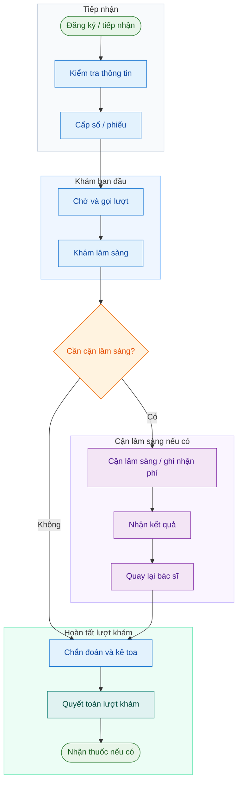
```mermaid
flowchart TB
    subgraph intake ["Tiếp nhận"]
        direction LR
        A(["Đăng ký / tiếp nhận"]) --> B["Kiểm tra thông tin"] --> C["Cấp số / phiếu"]
    end

    subgraph clinic ["Khám ban đầu"]
        direction LR
        D["Chờ và gọi lượt"] --> E["Khám lâm sàng"]
    end

    subgraph lab ["Cận lâm sàng nếu có"]
        direction LR
        G["Cận lâm sàng / ghi nhận phí"] --> H["Nhận kết quả"] --> I["Quay lại bác sĩ"]
    end

    subgraph completion ["Hoàn tất lượt khám"]
        direction LR
        J["Chẩn đoán và kê toa"] --> K["Quyết toán lượt khám"] --> L(["Nhận thuốc nếu có"])
    end

    C --> D
    E --> F{"Cần cận lâm sàng?"}
    F -->|"Có"| G
    F -->|"Không"| J
    I --> J

    classDef startEnd fill:#E8F5E9,stroke:#2E7D32,color:#1B5E20
    classDef process fill:#E3F2FD,stroke:#1976D2,color:#0D47A1
    classDef lab fill:#F3E5F5,stroke:#7B1FA2,color:#4A148C
    classDef decision fill:#FFF3E0,stroke:#EF6C00,color:#E65100
    classDef finish fill:#E0F2F1,stroke:#00796B,color:#004D40

    class A,L startEnd
    class B,C,D,E,J process
    class G,H,I lab
    class F decision
    class K finish

    style intake fill:#F8FAFC,stroke:#CBD5E1
    style clinic fill:#EFF6FF,stroke:#93C5FD
    style lab fill:#FAF5FF,stroke:#C4B5FD
    style completion fill:#ECFDF5,stroke:#6EE7B7
```

Quy trình trên dùng giả định người bệnh tự chi trả và thanh toán tập trung ở
cuối lượt khám. Đây là luồng chính của báo cáo nhằm tuân theo nguyên tắc đơn giản
hóa chi trả và tránh nộp viện phí nhiều lần trong [Quyết định
1313/QĐ-BYT](https://soyte.laichau.gov.vn/upload/2000987/20221006/1313_qd-byt_184515-2_c5eb210b64.pdf).
Các quy trình BHYT không thuộc phạm vi phân tích.

### 3.1.3. Các tình huống nghiệp vụ phát sinh

| Tình huống | Đối tượng liên quan | Nhu cầu phát sinh |
|---|---|---|
| Bệnh nhân đặt khám nhưng chưa đến | Bệnh nhân, tiếp nhận | phân biệt phiếu đã cấp với người đã có mặt |
| Bệnh nhân thuộc diện ưu tiên | Tiếp nhận, bác sĩ | xác nhận lý do ưu tiên và điều phối công bằng |
| Bệnh nhân lỡ lượt | Bệnh nhân, nhân viên điểm phục vụ | ghi nhận lỡ lượt và xếp lại có kiểm soát |
| Bác sĩ yêu cầu cận lâm sàng | Bác sĩ, kỹ thuật viên | chuyển người bệnh đến đúng điểm phục vụ và giữ liên kết chỉ định |
| Phát sinh phí khám | Bệnh nhân, tiếp nhận, thu ngân | ghi nhận khoản đã trả trước để không thu lại khi quyết toán |
| Phát sinh chi phí cận lâm sàng | Bệnh nhân, kỹ thuật viên | cộng đúng chi phí vào lượt khám mà không yêu cầu thanh toán riêng |
| Kết quả đã đầy đủ | Bác sĩ, bệnh nhân | đưa người bệnh quay lại đọc kết quả trong phiên khám cũ |
| Toa đã được xác nhận | Bệnh nhân, nhân viên cấp phát | tạo lượt chờ và đối chiếu đúng toa trước khi phát |
| Quyết toán cuối lượt | Bệnh nhân, thu ngân, nhân viên cấp phát | tính số phải trả thêm hoặc phải hoàn, rồi xác nhận điều kiện nhận thuốc |
| Người bệnh không dùng điện thoại | Bệnh nhân, tiếp nhận | vẫn được cấp phiếu và tham gia quy trình bình thường |

### 3.1.4. Những khó khăn và hạn chế

- Bệnh nhân khó biết mình đang ở bước nào, chờ ở đâu và hành động tiếp theo là
  gì.
- Danh sách chờ có thể chứa cả người chưa đến nên không phản ánh đúng active
  queue.
- Gọi ưu tiên tuyệt đối có thể làm người bệnh thường hoặc người quay lại đọc
  kết quả phải chờ quá lâu.
- Việc chuyển giữa phòng khám, cận lâm sàng và quầy thuốc dễ mất liên kết hoặc
  phụ thuộc hướng dẫn thủ công.
- Khoản phí khám đã trả trước và các chi phí phát sinh có thể nằm ở các hệ thống
  rời rạc, dẫn đến nguy cơ thu trùng, tính sai số còn phải trả hoặc bỏ sót khoản
  cần hoàn.
- Lỡ lượt, gọi lại và xếp lại không phải lúc nào cũng được ghi nhận nhất quán.
- Kết quả và toa được tạo ở các bộ phận khác nhau nhưng bệnh nhân thiếu một nơi
  theo dõi xuyên suốt.
- Dữ liệu nhạy cảm cần được giới hạn theo vai trò và phạm vi phân công.

Những hạn chế trên cho thấy nhu cầu không chỉ là số hóa một hàng đợi riêng lẻ,
mà là phối hợp toàn bộ hành trình khám ngoại trú.

## 3.2. Đề xuất giải pháp của đề tài

### 3.2.1. Mô hình vận hành mới

CareFlow được đưa vào quy trình như một công cụ chung để ghi nhận trạng thái,
điều phối lượt và truyền thông tin giữa các vai trò. Con người vẫn chịu trách
nhiệm cho các quyết định chuyên môn và thao tác phục vụ.

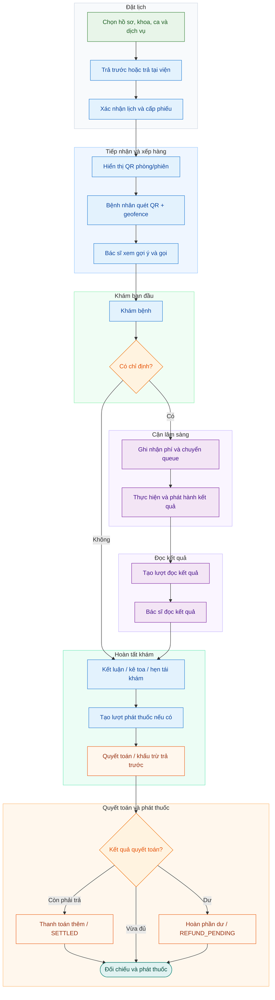
```mermaid
flowchart TB
    subgraph booking ["Đặt lịch"]
        direction LR
        A["Chọn hồ sơ, khoa, ca và dịch vụ"] --> A1["Trả trước hoặc trả tại viện"] --> B["Xác nhận lịch và cấp phiếu"]
    end

    subgraph checkin ["Tiếp nhận và xếp hàng"]
        direction LR
        C["Hiển thị QR phòng/phiên"] --> D["Bệnh nhân quét QR + geofence"] --> E["Bác sĩ xem gợi ý và gọi"]
    end

    subgraph consultation ["Khám ban đầu"]
        direction LR
        F["Khám bệnh"] --> G{"Có chỉ định?"}
    end

    subgraph lab ["Cận lâm sàng"]
        direction LR
        I["Ghi nhận phí và chuyển queue"] --> J["Thực hiện và phát hành kết quả"]
    end

    subgraph review ["Đọc kết quả"]
        direction LR
        K["Tạo lượt đọc kết quả"] --> L["Bác sĩ đọc kết quả"]
    end

    subgraph completion ["Hoàn tất khám"]
        direction LR
        H["Kết luận / kê toa / hẹn tái khám"] --> M["Tạo lượt phát thuốc nếu có"] --> M1["Quyết toán / khấu trừ trả trước"]
    end

    subgraph settlement ["Quyết toán và phát thuốc"]
        direction LR
        M2{"Kết quả quyết toán?"}
        M3["Thanh toán thêm / SETTLED"]
        M4["Hoàn phần dư / REFUND_PENDING"]
        N(["Đối chiếu và phát thuốc"])
        M2 -->|"Còn phải trả"| M3 --> N
        M2 -->|"Vừa đủ"| N
        M2 -->|"Dư"| M4 --> N
    end

    B --> C
    E --> F
    G -->|"Không"| H
    G -->|"Có"| I
    J --> K
    L --> H
    M1 --> M2

    classDef startEnd fill:#E8F5E9,stroke:#2E7D32,color:#1B5E20
    classDef process fill:#E3F2FD,stroke:#1976D2,color:#0D47A1
    classDef labStep fill:#F3E5F5,stroke:#7B1FA2,color:#4A148C
    classDef decision fill:#FFF3E0,stroke:#EF6C00,color:#E65100
    classDef payment fill:#FFF7ED,stroke:#EA580C,color:#9A3412
    classDef finish fill:#E0F2F1,stroke:#00796B,color:#004D40

    class A startEnd
    class A1,B,C,D,E,F,H,M process
    class I,J,K,L labStep
    class G,M2 decision
    class M1,M3,M4 payment
    class N finish

    style booking fill:#F8FAFC,stroke:#CBD5E1
    style checkin fill:#EFF6FF,stroke:#93C5FD
    style consultation fill:#F0FDF4,stroke:#86EFAC
    style lab fill:#FAF5FF,stroke:#C4B5FD
    style review fill:#FAF5FF,stroke:#C4B5FD
    style completion fill:#ECFDF5,stroke:#6EE7B7
    style settlement fill:#FFF7ED,stroke:#FDBA74
```

### 3.2.2. Vai trò của CareFlow

CareFlow có năm vai trò chính trong mô hình mới:

1. ghi nhận lịch, phiếu, QR phòng/phiên và trạng thái có mặt;
2. duy trì queue theo phòng/điểm phục vụ và đề xuất lượt tiếp theo;
3. liên kết Appointment, Consultation, Laboratory Order, Result và
   Prescription thành một hành trình;
4. cung cấp Patient Mobile và Hospital Web phù hợp với hành động của từng vai
   trò;
5. ghi nhận phí khám trả trước, tổng hợp chi phí và quyết toán cuối lượt với
   trạng thái trả thêm/đã đủ/hoàn tiền;
6. lưu thông báo, audit và dữ liệu truy vết để trạng thái có thể được tải lại.

CareFlow không tự gọi bệnh nhân, chẩn đoán, kê toa hoặc quyết định người bệnh
được ưu tiên. Bác sĩ và nhân viên vẫn là người xác nhận, bấm gọi và thực hiện
nghiệp vụ.

CareFlow không thực hiện kế toán viện phí hoặc đối soát cổng thanh toán
production. Trong phạm vi MVP, phí khám trả trước, Visit Settlement và Refund
được mô phỏng bằng adapter local/demo. Phiên bản báo cáo không xét BHYT.

### 3.2.3. Những thay đổi so với hiện trạng

| Vấn đề hiện tại | Sự hỗ trợ của CareFlow | Thay đổi vận hành |
|---|---|---|
| Phiếu không phản ánh người đã đến | QR phòng/phiên, geofence và check-in tách ticket với active queue | bệnh nhân quét tại bệnh viện; nhân viên hỗ trợ khi cần |
| Gọi ưu tiên tuyệt đối | ba lane FIFO và gợi ý Round Robin 1:1:1 | bác sĩ xem gợi ý rồi chủ động gọi |
| Chuyển bước bằng hướng dẫn rời rạc | trạng thái hành trình và queue theo điểm phục vụ | mỗi bộ phận nhận đúng lượt liên quan |
| Quay lại đọc kết quả khó theo dõi | tự tạo `RESULT_REVIEW` trong consultation cũ | không tạo Appointment giả hoặc check-in lần hai |
| Phát thuốc không nối với lượt khám | toa xác nhận tạo `PHARMACY_DISPENSING` | quầy thuốc gọi và đối chiếu theo toa nguồn |
| Khoản trả trước và chi phí phát sinh bị tách rời | quyết toán cuối lượt, khấu trừ Prepayment và tách `amountDue/refundDue` | không thu trùng; biết rõ phải trả thêm hay hoàn phần dư |
| Mất cập nhật khi người dùng offline | trạng thái lưu bền vững và tải lại qua REST | WebSocket chỉ dùng để cập nhật nhanh |

### 3.2.4. Lợi ích của giải pháp

Đối với bệnh nhân, giải pháp làm rõ số thứ tự, phòng, trạng thái và bước tiếp
theo. Đối với bác sĩ và nhân viên, hệ thống giảm thao tác phối hợp thủ công,
giúp biết lượt nào đang chờ và vì sao. Đối với bộ phận quản lý, dữ liệu trạng
thái và audit tạo cơ sở để truy vết, đánh giá quy trình và mở rộng nhiều phòng
trong tương lai. Mô hình hai giai đoạn cũng giúp người bệnh biết khoản nào đã trả
trước, khoản nào phát sinh và kết quả quyết toán, dù CareFlow MVP chưa thay thế
hệ thống viện phí production.

## 3.3. Định nghĩa các tình huống CareFlow tham gia giải quyết

### 3.3.1. Xác định các actor nghiệp vụ

| Mã | Actor nghiệp vụ | Mục tiêu khi tương tác với CareFlow |
|---|---|---|
| `ACT-PATIENT` | Bệnh nhân | đặt khám, xem phiếu, theo dõi hành trình, kết quả và toa |
| `ACT-RECEPTION` | Nhân viên tiếp nhận | xác nhận có mặt và hỗ trợ lỡ lượt |
| `ACT-DOCTOR` | Bác sĩ | gọi lượt, khám, chỉ định, đọc kết quả và kê toa |
| `ACT-LAB` | Kỹ thuật viên cận lâm sàng | nhận lượt, thực hiện và phát hành kết quả |
| `ACT-PHARMACY` | Nhân viên cấp phát thuốc | gọi FIFO, đối chiếu toa và xác nhận phát thuốc |
| `ACT-MANAGEMENT` | Bộ phận quản lý bệnh viện | duy trì khoa, phòng, lịch, ca và capacity nghiệp vụ |
| `ACT-PAYMENT` | Thu ngân/hệ thống thanh toán ngoài | ghi nhận phí khám trả trước, quyết toán cuối lượt và xử lý hoàn phần dư |

Đăng nhập và phân quyền là điều kiện nền tảng, không phải Use Case nghiệp vụ
cốt lõi. `User`, actor kỹ thuật `Admin`, Gateway, RabbitMQ và database không
được sử dụng làm actor trong biểu đồ phân tích.

### 3.3.2. Biểu đồ Use Case tổng quát

Nguồn Mermaid của các hình được giữ trong các file Markdown để có thể render
trực tiếp trong trình soạn thảo hỗ trợ Mermaid:

- [DGM-UC-01 — Use Case tổng quát](chapter-03/diagrams/use-case/dgm-uc-01-overall.md)
- [DGM-UC-02 — Phân hệ bệnh nhân](chapter-03/diagrams/use-case/dgm-uc-02-patient.md)
- [DGM-UC-03 — Phân hệ bệnh viện](chapter-03/diagrams/use-case/dgm-uc-03-hospital.md)

Biểu đồ chỉ thể hiện mục tiêu nghiệp vụ. Những chức năng nền như xác thực được
xem là tiền điều kiện; các component kỹ thuật được phân rã tại mục 3.5 và thiết
kế ở Chương 4.

### 3.3.3. Quan hệ giữa các Use Case

| Use Case nguồn | Quan hệ | Use Case đích | Ý nghĩa |
|---|---|---|---|
| Đặt lịch khám | `include` | Chọn hồ sơ và kiểm tra lịch khả dụng | luôn cần xác định hồ sơ và slot |
| `UC-PAY-01` Thanh toán và quyết toán | `extend` | Đặt lịch khám | ghi nhận phí khám trả trước hoặc còn phải nộp tại bệnh viện |
| Check-in bằng QR | `include` | Kiểm tra phiếu khám và geofence | luôn phải xác minh ticket, phòng/phiên và vị trí trước khi xác nhận có mặt |
| Gọi lượt khám | `include` | Xem active queue và lượt đề xuất | cần biết queue trước khi bác sĩ chọn lượt |
| Tạo chỉ định cận lâm sàng | `extend` | Thực hiện phiên khám | chỉ xảy ra khi bác sĩ thấy cần |
| Đọc kết quả | `extend` | Thực hiện phiên khám | chỉ xảy ra khi có chỉ định và kết quả đầy đủ |
| Xử lý lỡ lượt | `extend` | Gọi lượt tại điểm phục vụ | chỉ xảy ra khi người bệnh không có mặt |
| Gọi và phát thuốc | `include` | Đối chiếu toa | bắt buộc xác minh toa trước khi dispense |
| `UC-PAY-01` Thanh toán và quyết toán | `extend` | Gọi và phát thuốc | quyết toán cuối lượt trước khi xác nhận dispense |

Generalization chỉ dùng khi nhiều actor hoặc Use Case có thực sự chung một vai
trò/luồng trừu tượng. Bộ Use Case cốt lõi hiện tại chưa cần thêm generalization.

### 3.3.4. Danh mục Use Case

| Mã | Use Case | Actor chính | Kết quả nghiệp vụ |
|---|---|---|---|
| `UC-APT-02` | Đặt lịch khám | Bệnh nhân | Appointment `CONFIRMED`, có phòng và Visit Ticket |
| `UC-QUE-02` | Check-in bằng QR tại bệnh viện | Bệnh nhân; Nhân viên tiếp nhận hỗ trợ | lượt khám ban đầu vào active queue khi QR và vị trí hợp lệ |
| `UC-QUE-04` | Theo dõi, đề xuất và gọi lượt | Bác sĩ | entry được gọi có actor và audit |
| `UC-CON-01` | Bắt đầu và thực hiện phiên khám | Bác sĩ | Consultation được ghi nhận hoặc chờ kết quả |
| `UC-LAB-01` | Tạo chỉ định cận lâm sàng | Bác sĩ | Laboratory Order và item được tạo |
| `UC-LAB-03` | Thực hiện, phát hành và đọc kết quả | Kỹ thuật viên/Bác sĩ | kết quả FINAL và review hoàn tất |
| `UC-PRE-01` | Kê toa, hẹn tái khám và hoàn tất | Bác sĩ | Prescription/follow-up được xác nhận |
| `UC-PHA-01` | Gọi lượt và phát thuốc | Nhân viên cấp phát | toa `DISPENSED`, entry hoàn tất |

Các Use Case hỗ trợ như quản lý hồ sơ, xem/hủy lịch, thông báo, cấu hình và xác
nhận điều kiện thanh toán được duy trì trong [danh mục đầy đủ](chapter-03/01-use-case-catalog.md).
Thanh toán không được nâng thành Use Case cốt lõi vì CareFlow MVP không thay thế
hệ thống viện phí production; nó xuất hiện như luồng hỗ trợ ở bước trả trước và
quyết toán cuối lượt.

### 3.3.5. Đặc tả sơ bộ từng Use Case

#### `UC-APT-02` — Đặt lịch khám

- **Mục đích:** tạo lịch hợp lệ và cấp phiếu cho bệnh nhân.
- Quy tắc cập nhật 08/08/2026: booking chỉ ghi nhận thanh toán trực tuyến
  `ONLINE_MOCK`; thanh toán tiền mặt chỉ thuộc quyết toán cuối lượt nếu có
  `amountDue`.
- **Actor chính/liên quan:** Bệnh nhân; bộ phận quản lý cung cấp cấu hình khoa,
  phòng và capacity; thu ngân chỉ tham gia ở bước quyết toán cuối lượt nếu phát
  sinh khoản phải thu.
- **Tiền điều kiện:** hồ sơ thuộc bệnh nhân; khoa, ngày và ca còn khả dụng.
- **Luồng chính:** chọn hồ sơ, khoa, ngày, ca và dịch vụ; trả trước phí khám bằng
  `ONLINE_MOCK`; CareFlow giữ capacity, suy ra phòng và cấp phiếu/số. QR
  check-in được Hospital Web hiển thị theo phòng/phiên khi bệnh nhân đến.
  Khoản phí khám được lưu để khấu trừ khi quyết toán cuối lượt.
- **Hậu điều kiện thành công:** Appointment `CONFIRMED`, có `roomId` và Visit
  Ticket; receipt Mobile được lưu riêng nếu có.
- **Hậu điều kiện thất bại:** không tạo lịch hoặc giữ capacity; dữ liệu cũ không
  thay đổi.
- **Ngoại lệ:** hết slot, đặt trùng, hồ sơ không thuộc quyền sở hữu hoặc phòng
  active không hợp lệ.

#### `UC-QUE-02` — Check-in bằng QR

- **Mục đích:** xác nhận người bệnh đã đến bệnh viện và đủ điều kiện vào queue.
- **Actor chính/liên quan:** Bệnh nhân; Nhân viên tiếp nhận hỗ trợ tại quầy.
- **Tiền điều kiện:** Appointment/ticket còn hiệu lực; bệnh viện đang hiển thị
  QR đúng phòng/phiên; Mobile có quyền lấy vị trí.
- **Luồng chính:** bệnh nhân quét QR bệnh viện, gửi mã lịch và vị trí; CareFlow
  kiểm tra token, lịch/phòng/phiên và khoảng cách tới Hospital Geofence, sau đó
  đưa lượt vào active queue.
- **Hậu điều kiện thành công:** entry `CHECKED_IN`, có `checkedInAt`, phương thức
  check-in và lane.
- **Hậu điều kiện thất bại:** ticket giữ nguyên, không có active entry mới.
- **Ngoại lệ:** QR sai/hết hạn, sai ngày/phòng/phiên, ticket đã dùng, vị trí ngoài
  bán kính, không lấy được vị trí hoặc độ chính xác không đạt. `PRIORITY` chỉ do
  nhân viên có quyền xác nhận cùng lý do.

#### `UC-QUE-04` — Theo dõi, đề xuất và gọi lượt

- **Mục đích:** giúp bác sĩ chọn và gọi người bệnh tại phòng khám.
- **Actor chính:** Bác sĩ.
- **Tiền điều kiện:** bác sĩ được phân công; entry thuộc active queue.
- **Luồng chính:** xem ba lane; CareFlow trả `recommendedNext` theo Round Robin
  1:1:1; bác sĩ bấm gọi một entry; hệ thống ghi trạng thái và thông báo.
- **Hậu điều kiện thành công:** entry `CALLED`, có actor và thời điểm.
- **Hậu điều kiện thất bại:** queue không đổi và không gửi thông báo gọi.
- **Ngoại lệ:** entry đã được người khác gọi, sai phòng hoặc người bệnh lỡ lượt.

#### `UC-CON-01` — Bắt đầu và thực hiện phiên khám

- **Mục đích:** ghi nhận hoạt động khám và quyết định chuyên môn.
- **Actor chính/liên quan:** Bác sĩ; Bệnh nhân.
- **Tiền điều kiện:** lượt hợp lệ đã được gọi; bác sĩ đúng phạm vi.
- **Luồng chính:** bắt đầu phiên, ghi triệu chứng/sinh hiệu/chẩn đoán sơ bộ, tạo
  chỉ định hoặc kết luận.
- **Hậu điều kiện thành công:** Consultation `WAITING_FOR_RESULTS` hoặc
  `COMPLETED`.
- **Hậu điều kiện thất bại:** không tạo/chuyển phiên sai trạng thái.
- **Ngoại lệ:** lượt chưa gọi, bác sĩ không được phân công, dữ liệu bắt buộc
  thiếu.

#### `UC-LAB-01` — Tạo chỉ định cận lâm sàng

- **Mục đích:** tạo các hạng mục cần thực hiện từ phiên khám.
- **Actor chính:** Bác sĩ.
- **Tiền điều kiện:** Consultation đang hoạt động.
- **Luồng chính:** chọn hạng mục, nhập lý do/ghi chú, xác nhận; CareFlow tạo
  order, ghi nhận chi phí và tạo lượt `LAB_EXECUTION` ngay khi order hợp lệ.
- **Hậu điều kiện thành công:** Laboratory Order và item hợp lệ được lưu.
- **Hậu điều kiện thất bại:** không có order một phần hoặc queue entry mồ côi.
- **Ngoại lệ:** hạng mục không hợp lệ, trùng chỉ định hoặc chưa đủ điều kiện.

#### `UC-LAB-03` — Thực hiện, phát hành và đọc kết quả

- **Mục đích:** hoàn tất chỉ định và đưa người bệnh quay lại bác sĩ.
- **Actor chính/liên quan:** Kỹ thuật viên cận lâm sàng; Bác sĩ.
- **Tiền điều kiện:** order đủ điều kiện, đúng điểm phục vụ và được gọi.
- **Luồng chính:** thực hiện, nhập kết quả, phát hành `FINAL`; khi đủ kết quả,
  CareFlow tạo `RESULT_REVIEW`; bác sĩ gọi và đọc kết quả.
- **Hậu điều kiện thành công:** kết quả FINAL, review hoàn tất trong consultation
  cũ.
- **Hậu điều kiện thất bại:** dữ liệu draft được giữ có kiểm soát; không tạo
  review khi thiếu kết quả bắt buộc.
- **Ngoại lệ:** sai order, thiếu dữ liệu, correction sau FINAL hoặc kết quả bị
  thu hồi.

#### `UC-PRE-01` — Kê toa, hẹn tái khám và hoàn tất

- **Mục đích:** ghi kết luận và hướng xử trí sau khám.
- **Actor chính:** Bác sĩ.
- **Tiền điều kiện:** Consultation đủ dữ liệu để kết luận.
- **Luồng chính:** nhập chẩn đoán, thuốc/liều dùng và ngày tái khám; xác nhận
  toa; hoàn tất consultation.
- **Hậu điều kiện thành công:** Prescription `CONFIRMED`, follow-up nếu có và
  event tạo lượt quầy thuốc.
- **Hậu điều kiện thất bại:** toa draft không được phát và consultation không
  bị hoàn tất sai.
- **Ngoại lệ:** thuốc/liều không hợp lệ, thiếu chẩn đoán hoặc toa đã xác nhận.

#### `UC-PHA-01` — Gọi lượt và phát thuốc

- **Mục đích:** giao đúng thuốc theo toa đã xác nhận.
- **Actor chính/liên quan:** Nhân viên cấp phát; Bệnh nhân; thu ngân/hệ thống
  thanh toán ngoài thực hiện quyết toán cuối lượt.
- **Tiền điều kiện:** entry `PHARMACY_DISPENSING` và Prescription `CONFIRMED`.
- **Luồng chính:** xem FIFO, gọi lượt; CareFlow tổng hợp chi phí, khấu trừ khoản
  trả trước và xử lý `PAYMENT_DUE/SETTLED/REFUND_PENDING`; nhân viên đối chiếu
  danh tính/toa, bắt đầu phục vụ và xác nhận đã phát. Queue vẫn được tạo từ toa
  xác nhận, không bắt bệnh nhân có Mobile mới được xếp lượt.
- **Hậu điều kiện thành công:** Prescription `DISPENSED`, entry hoàn tất và có
  audit.
- **Hậu điều kiện thất bại:** không tạo dispense record hoặc đóng queue sai.
- **Ngoại lệ:** toa hủy/đã phát, sai điểm phục vụ hoặc lượt chưa được gọi.

#### `UC-PAY-01` — Thanh toán và quyết toán lượt khám (Use Case hỗ trợ)

- **Mục đích:** ghi nhận phí khám trả trước và quyết toán toàn bộ lượt khám.
- **Actor chính/liên quan:** Thu ngân/hệ thống thanh toán ngoài; Bệnh nhân và
  nhân viên tại điểm phục vụ.
- **Tiền điều kiện:** có Appointment và, khi quyết toán, bác sĩ đã hoàn tất kết
  luận/toa để tổng hợp chi phí.
- **Luồng chính:** lưu Prepayment; cuối lượt tính `amountDue` và `refundDue`; thu
  thêm nếu còn thiếu hoặc tạo yêu cầu hoàn nếu dư.
- **Hậu điều kiện:** settlement là `SETTLED`, `REFUND_PENDING` hoặc `REFUNDED`;
  không còn số phải trả âm. `REFUND_PENDING` không chặn nhận thuốc.
- **Ngoại lệ:** giao dịch chưa xác nhận, số tiền/tham chiếu không khớp, thanh
  toán thêm thất bại hoặc yêu cầu hoàn tiền bị từ chối/lỗi.

Use Case hỗ trợ này đã được thể hiện trong hai Sequence/Activity Diagram liên
quan; không tính thêm vào tám Use Case cốt lõi cần một bộ biểu đồ riêng.

## 3.4. Định nghĩa các tương tác của CareFlow

### 3.4.1. Sequence Diagram mức phân tích

Ở mức phân tích, CareFlow được xem như một hộp đen. Sơ đồ chỉ thể hiện actor,
dữ liệu gửi vào, kết quả quan sát được và lỗi nghiệp vụ; không đưa Form,
Controller, Service, Repository, database hoặc RabbitMQ vào đây.

#### `UC-APT-02` — Đặt lịch khám

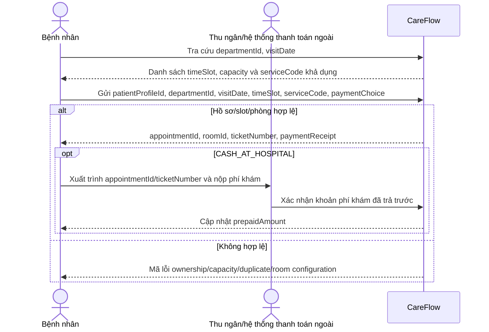
```mermaid
sequenceDiagram
    actor BN as Bệnh nhân
    actor TT as Thu ngân/hệ thống thanh toán ngoài
    participant CF as CareFlow
    BN->>CF: Tra cứu departmentId, visitDate
    CF-->>BN: Danh sách timeSlot, capacity và serviceCode khả dụng
    BN->>CF: Gửi patientProfileId, departmentId, visitDate, timeSlot, serviceCode, paymentChoice
    alt Hồ sơ/slot/phòng hợp lệ
        CF-->>BN: appointmentId, roomId, ticketNumber, paymentReceipt
        opt CASH_AT_HOSPITAL
            BN->>TT: Xuất trình appointmentId/ticketNumber và nộp phí khám
            TT->>CF: Xác nhận khoản phí khám đã trả trước
            CF-->>BN: Cập nhật prepaidAmount
        end
    else Không hợp lệ
        CF-->>BN: Mã lỗi ownership/capacity/duplicate/room configuration
    end
```

#### `UC-QUE-02` — Check-in bằng QR

```mermaid
sequenceDiagram
    actor BN as Bệnh nhân
    actor TN as Nhân viên tiếp nhận
    participant CF as CareFlow
    participant HW as Hospital Web
    CF-->>HW: QR check-in phòng/phiên có thời hạn
    HW-->>BN: Hiển thị QR tại bệnh viện
    BN->>CF: Gửi appointmentId, checkInQrToken, latitude, longitude, accuracyMeters
    CF->>CF: Kiểm token, lịch/phòng/phiên và tính khoảng cách geofence
    alt QR hợp lệ và vị trí trong bán kính
        CF-->>BN: ticketNumber, queueEntryId, lane, status CHECKED_IN
        CF-->>TN: Cập nhật lượt đã có mặt
    else QR hoặc vị trí không hợp lệ
        CF-->>BN: Từ chối và nêu lý do; ticket chưa CHECKED_IN
    end
    opt Bệnh nhân không dùng Mobile
        TN->>CF: Xác nhận tại quầy sau khi đối chiếu phiếu
        CF-->>TN: CHECKED_IN và lane mặc định NORMAL
    end
```

#### `UC-QUE-04` — Theo dõi, đề xuất và gọi lượt

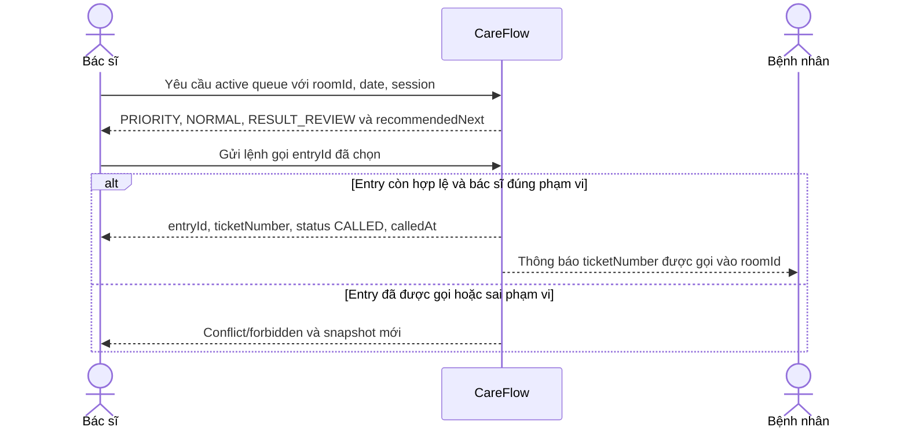
```mermaid
sequenceDiagram
    actor BS as Bác sĩ
    participant CF as CareFlow
    actor BN as Bệnh nhân
    BS->>CF: Yêu cầu active queue với roomId, date, session
    CF-->>BS: PRIORITY, NORMAL, RESULT_REVIEW và recommendedNext
    BS->>CF: Gửi lệnh gọi entryId đã chọn
    alt Entry còn hợp lệ và bác sĩ đúng phạm vi
        CF-->>BS: entryId, ticketNumber, status CALLED, calledAt
        CF-->>BN: Thông báo ticketNumber được gọi vào roomId
    else Entry đã được gọi hoặc sai phạm vi
        CF-->>BS: Conflict/forbidden và snapshot mới
    end
```

#### `UC-CON-01` — Bắt đầu và thực hiện phiên khám

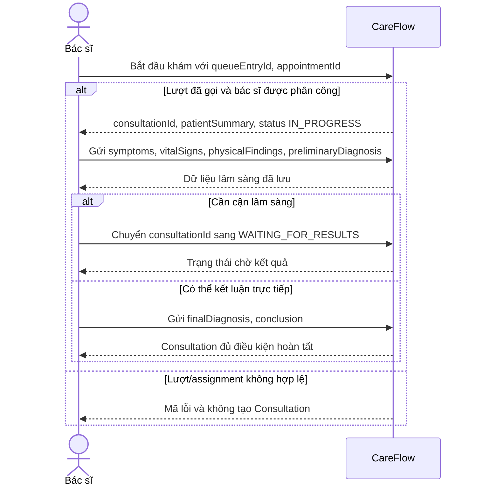
```mermaid
sequenceDiagram
    actor BS as Bác sĩ
    participant CF as CareFlow
    BS->>CF: Bắt đầu khám với queueEntryId, appointmentId
    alt Lượt đã gọi và bác sĩ được phân công
        CF-->>BS: consultationId, patientSummary, status IN_PROGRESS
        BS->>CF: Gửi symptoms, vitalSigns, physicalFindings, preliminaryDiagnosis
        CF-->>BS: Dữ liệu lâm sàng đã lưu
        alt Cần cận lâm sàng
            BS->>CF: Chuyển consultationId sang WAITING_FOR_RESULTS
            CF-->>BS: Trạng thái chờ kết quả
        else Có thể kết luận trực tiếp
            BS->>CF: Gửi finalDiagnosis, conclusion
            CF-->>BS: Consultation đủ điều kiện hoàn tất
        end
    else Lượt/assignment không hợp lệ
        CF-->>BS: Mã lỗi và không tạo Consultation
    end
```

#### `UC-LAB-01` — Tạo chỉ định cận lâm sàng

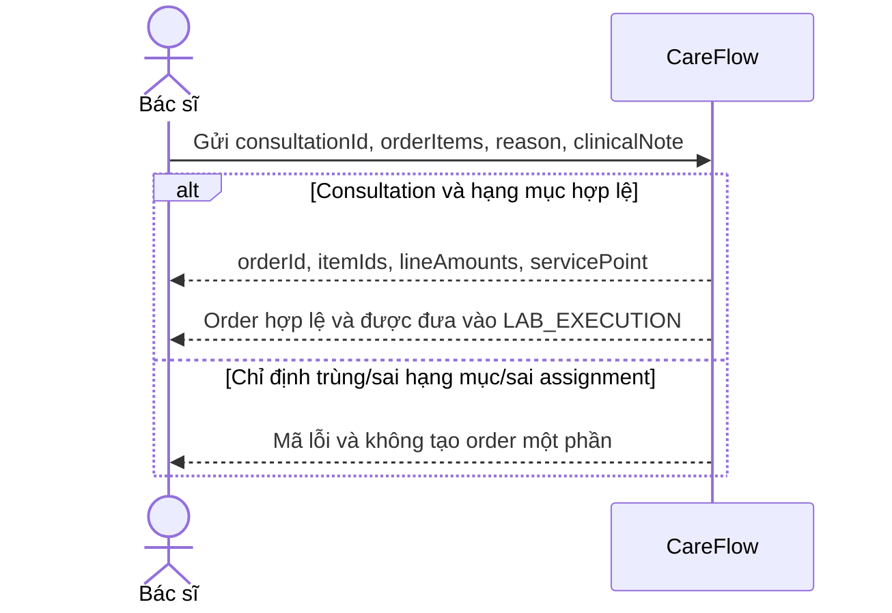
```mermaid
sequenceDiagram
    actor BS as Bác sĩ
    participant CF as CareFlow
    BS->>CF: Gửi consultationId, orderItems, reason, clinicalNote
    alt Consultation và hạng mục hợp lệ
        CF-->>BS: orderId, itemIds, lineAmounts, servicePoint
        CF-->>BS: Order hợp lệ và được đưa vào LAB_EXECUTION
    else Chỉ định trùng/sai hạng mục/sai assignment
        CF-->>BS: Mã lỗi và không tạo order một phần
    end
```

#### `UC-LAB-03` — Thực hiện, phát hành và đọc kết quả

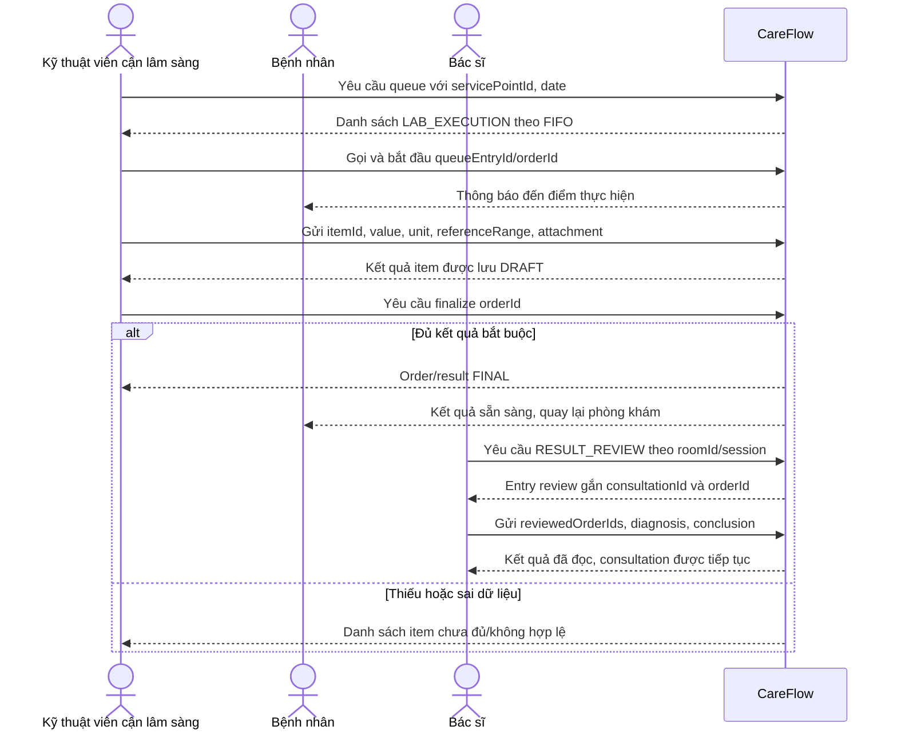
```mermaid
sequenceDiagram
    actor KT as Kỹ thuật viên cận lâm sàng
    actor BN as Bệnh nhân
    actor BS as Bác sĩ
    participant CF as CareFlow
    KT->>CF: Yêu cầu queue với servicePointId, date
    CF-->>KT: Danh sách LAB_EXECUTION theo FIFO
    KT->>CF: Gọi và bắt đầu queueEntryId/orderId
    CF-->>BN: Thông báo đến điểm thực hiện
    KT->>CF: Gửi itemId, value, unit, referenceRange, attachment
    CF-->>KT: Kết quả item được lưu DRAFT
    KT->>CF: Yêu cầu finalize orderId
    alt Đủ kết quả bắt buộc
        CF-->>KT: Order/result FINAL
        CF-->>BN: Kết quả sẵn sàng, quay lại phòng khám
        BS->>CF: Yêu cầu RESULT_REVIEW theo roomId/session
        CF-->>BS: Entry review gắn consultationId và orderId
        BS->>CF: Gửi reviewedOrderIds, diagnosis, conclusion
        CF-->>BS: Kết quả đã đọc, consultation được tiếp tục
    else Thiếu hoặc sai dữ liệu
        CF-->>KT: Danh sách item chưa đủ/không hợp lệ
    end
```

#### `UC-PRE-01` — Kê toa, hẹn tái khám và hoàn tất

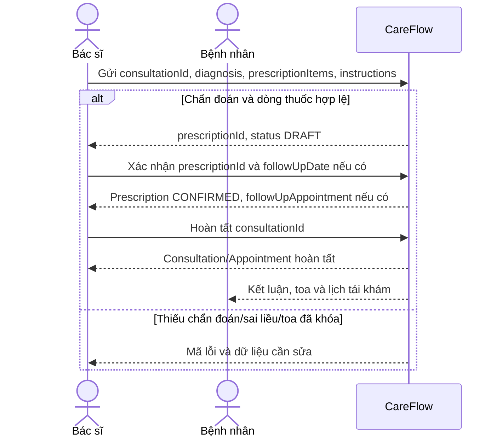
```mermaid
sequenceDiagram
    actor BS as Bác sĩ
    actor BN as Bệnh nhân
    participant CF as CareFlow
    BS->>CF: Gửi consultationId, diagnosis, prescriptionItems, instructions
    alt Chẩn đoán và dòng thuốc hợp lệ
        CF-->>BS: prescriptionId, status DRAFT
        BS->>CF: Xác nhận prescriptionId và followUpDate nếu có
        CF-->>BS: Prescription CONFIRMED, followUpAppointment nếu có
        BS->>CF: Hoàn tất consultationId
        CF-->>BS: Consultation/Appointment hoàn tất
        CF-->>BN: Kết luận, toa và lịch tái khám
    else Thiếu chẩn đoán/sai liều/toa đã khóa
        CF-->>BS: Mã lỗi và dữ liệu cần sửa
    end
```

#### `UC-PHA-01` — Gọi lượt và phát thuốc

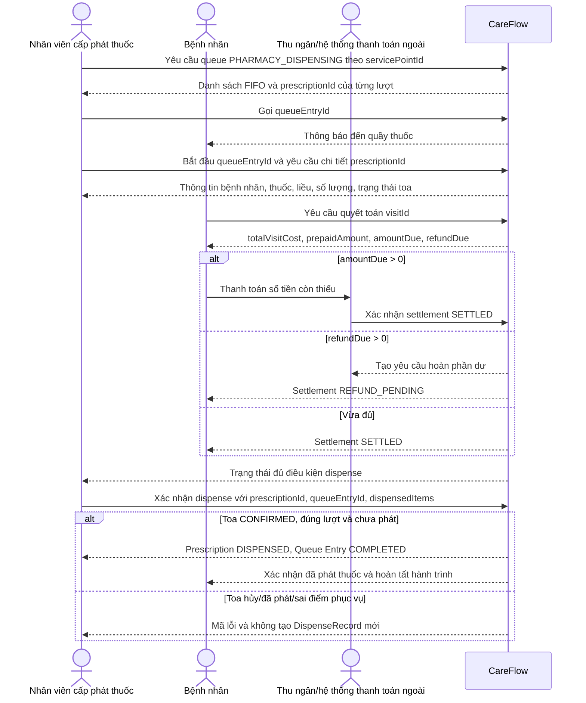
```mermaid
sequenceDiagram
    actor NV as Nhân viên cấp phát thuốc
    actor BN as Bệnh nhân
    actor TT as Thu ngân/hệ thống thanh toán ngoài
    participant CF as CareFlow
    NV->>CF: Yêu cầu queue PHARMACY_DISPENSING theo servicePointId
    CF-->>NV: Danh sách FIFO và prescriptionId của từng lượt
    NV->>CF: Gọi queueEntryId
    CF-->>BN: Thông báo đến quầy thuốc
    NV->>CF: Bắt đầu queueEntryId và yêu cầu chi tiết prescriptionId
    CF-->>NV: Thông tin bệnh nhân, thuốc, liều, số lượng, trạng thái toa
    BN->>CF: Yêu cầu quyết toán visitId
    CF-->>BN: totalVisitCost, prepaidAmount, amountDue, refundDue
    alt amountDue > 0
        BN->>TT: Thanh toán số tiền còn thiếu
        TT->>CF: Xác nhận settlement SETTLED
    else refundDue > 0
        CF-->>TT: Tạo yêu cầu hoàn phần dư
        CF-->>BN: Settlement REFUND_PENDING
    else Vừa đủ
        CF-->>BN: Settlement SETTLED
    end
    CF-->>NV: Trạng thái đủ điều kiện dispense
    NV->>CF: Xác nhận dispense với prescriptionId, queueEntryId, dispensedItems
    alt Toa CONFIRMED, đúng lượt và chưa phát
        CF-->>NV: Prescription DISPENSED, Queue Entry COMPLETED
        CF-->>BN: Xác nhận đã phát thuốc và hoàn tất hành trình
    else Toa hủy/đã phát/sai điểm phục vụ
        CF-->>NV: Mã lỗi và không tạo DispenseRecord mới
    end
```

### 3.4.2. Activity Diagram

Mỗi Activity Diagram được suy ra từ luồng chính và ngoại lệ của đúng một Use
Case. Các sơ đồ không gộp toàn bộ hành trình thành một hoạt động duy nhất.

#### `UC-APT-02` — Đặt lịch khám

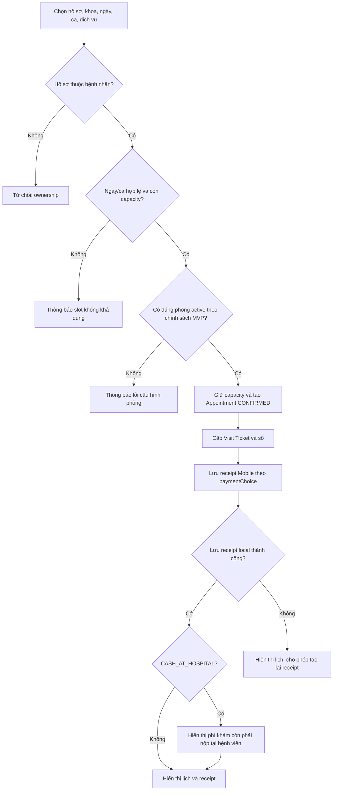
```mermaid
flowchart TD
    A["Chọn hồ sơ, khoa, ngày, ca, dịch vụ"] --> B{"Hồ sơ thuộc bệnh nhân?"}
    B -- "Không" --> X["Từ chối: ownership"]
    B -- "Có" --> C{"Ngày/ca hợp lệ và còn capacity?"}
    C -- "Không" --> Y["Thông báo slot không khả dụng"]
    C -- "Có" --> D{"Có đúng phòng active theo chính sách MVP?"}
    D -- "Không" --> Z["Thông báo lỗi cấu hình phòng"]
    D -- "Có" --> E["Giữ capacity và tạo Appointment CONFIRMED"]
    E --> F["Cấp Visit Ticket và số"]
    F --> G["Lưu receipt Mobile theo paymentChoice"]
    G --> H{"Lưu receipt local thành công?"}
    H -- "Có" --> H1{"CASH_AT_HOSPITAL?"}
    H1 -- "Có" --> H2["Hiển thị phí khám còn phải nộp tại bệnh viện"]
    H1 -- "Không" --> I["Hiển thị lịch và receipt"]
    H2 --> I
    H -- "Không" --> J["Hiển thị lịch; cho phép tạo lại receipt"]
```

#### `UC-QUE-02` — Check-in bằng QR

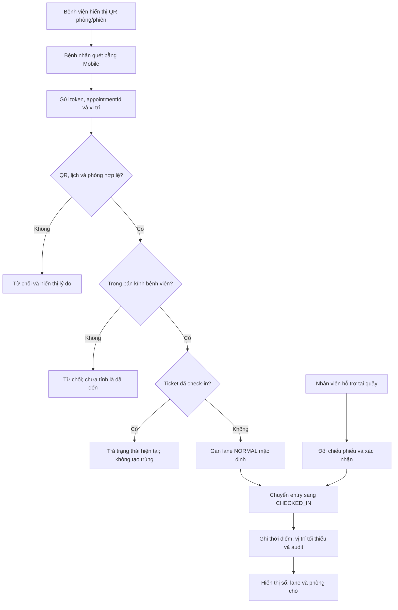
```mermaid
flowchart TD
    A["Bệnh viện hiển thị QR phòng/phiên"] --> B["Bệnh nhân quét bằng Mobile"]
    B --> C["Gửi token, appointmentId và vị trí"]
    C --> D{"QR, lịch và phòng hợp lệ?"}
    D -- "Không" --> X["Từ chối và hiển thị lý do"]
    D -- "Có" --> E{"Trong bán kính bệnh viện?"}
    E -- "Không" --> Y["Từ chối; chưa tính là đã đến"]
    E -- "Có" --> F{"Ticket đã check-in?"}
    F -- "Có" --> Z["Trả trạng thái hiện tại; không tạo trùng"]
    F -- "Không" --> G["Gán lane NORMAL mặc định"]
    G --> H["Chuyển entry sang CHECKED_IN"]
    H --> I["Ghi thời điểm, vị trí tối thiểu và audit"]
    I --> J["Hiển thị số, lane và phòng chờ"]
    K["Nhân viên hỗ trợ tại quầy"] --> L["Đối chiếu phiếu và xác nhận"]
    L --> H
```

#### `UC-QUE-04` — Theo dõi, đề xuất và gọi lượt

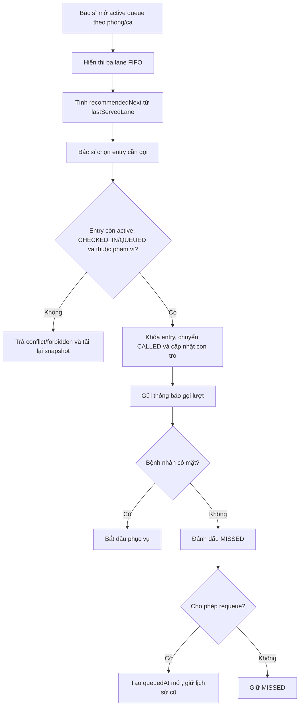
```mermaid
flowchart TD
    A["Bác sĩ mở active queue theo phòng/ca"] --> B["Hiển thị ba lane FIFO"]
    B --> C["Tính recommendedNext từ lastServedLane"]
    C --> D["Bác sĩ chọn entry cần gọi"]
    D --> E{"Entry còn active: CHECKED_IN/QUEUED và thuộc phạm vi?"}
    E -- "Không" --> F["Trả conflict/forbidden và tải lại snapshot"]
    E -- "Có" --> G["Khóa entry, chuyển CALLED và cập nhật con trỏ"]
    G --> H["Gửi thông báo gọi lượt"]
    H --> I{"Bệnh nhân có mặt?"}
    I -- "Có" --> J["Bắt đầu phục vụ"]
    I -- "Không" --> K["Đánh dấu MISSED"]
    K --> L{"Cho phép requeue?"}
    L -- "Có" --> M["Tạo queuedAt mới, giữ lịch sử cũ"]
    L -- "Không" --> N["Giữ MISSED"]
```

#### `UC-CON-01` — Bắt đầu và thực hiện phiên khám

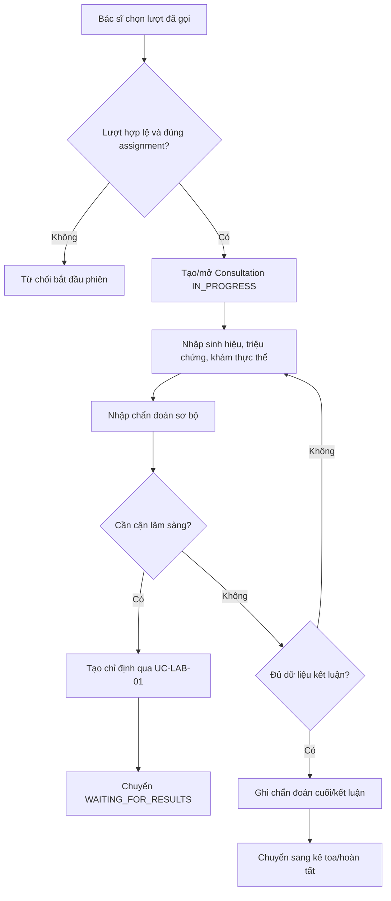
```mermaid
flowchart TD
    A["Bác sĩ chọn lượt đã gọi"] --> B{"Lượt hợp lệ và đúng assignment?"}
    B -- "Không" --> X["Từ chối bắt đầu phiên"]
    B -- "Có" --> C["Tạo/mở Consultation IN_PROGRESS"]
    C --> D["Nhập sinh hiệu, triệu chứng, khám thực thể"]
    D --> E["Nhập chẩn đoán sơ bộ"]
    E --> F{"Cần cận lâm sàng?"}
    F -- "Có" --> G["Tạo chỉ định qua UC-LAB-01"]
    G --> H["Chuyển WAITING_FOR_RESULTS"]
    F -- "Không" --> I{"Đủ dữ liệu kết luận?"}
    I -- "Không" --> D
    I -- "Có" --> J["Ghi chẩn đoán cuối/kết luận"]
    J --> K["Chuyển sang kê toa/hoàn tất"]
```

#### `UC-LAB-01` — Tạo chỉ định cận lâm sàng

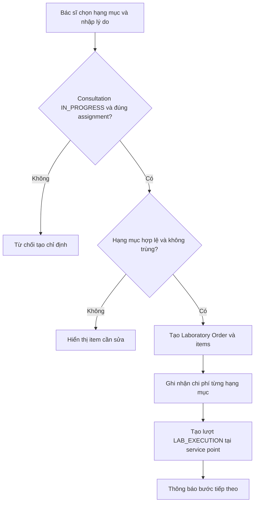
```mermaid
flowchart TD
    A["Bác sĩ chọn hạng mục và nhập lý do"] --> B{"Consultation IN_PROGRESS và đúng assignment?"}
    B -- "Không" --> X["Từ chối tạo chỉ định"]
    B -- "Có" --> C{"Hạng mục hợp lệ và không trùng?"}
    C -- "Không" --> Y["Hiển thị item cần sửa"]
    C -- "Có" --> D["Tạo Laboratory Order và items"]
    D --> E["Ghi nhận chi phí từng hạng mục"]
    E --> I["Tạo lượt LAB_EXECUTION tại service point"]
    I --> J["Thông báo bước tiếp theo"]
```

#### `UC-LAB-03` — Thực hiện, phát hành và đọc kết quả

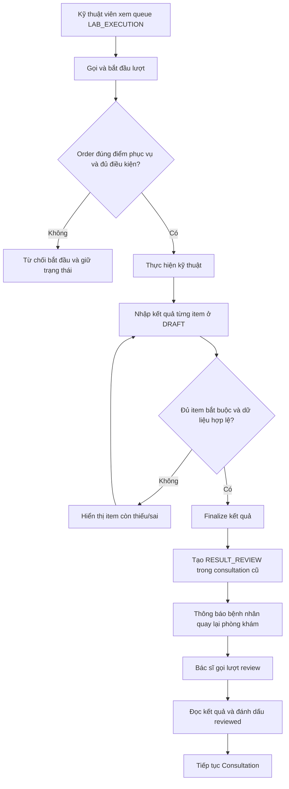
```mermaid
flowchart TD
    A["Kỹ thuật viên xem queue LAB_EXECUTION"] --> B["Gọi và bắt đầu lượt"]
    B --> C{"Order đúng điểm phục vụ và đủ điều kiện?"}
    C -- "Không" --> X["Từ chối bắt đầu và giữ trạng thái"]
    C -- "Có" --> D["Thực hiện kỹ thuật"]
    D --> E["Nhập kết quả từng item ở DRAFT"]
    E --> F{"Đủ item bắt buộc và dữ liệu hợp lệ?"}
    F -- "Không" --> G["Hiển thị item còn thiếu/sai"]
    G --> E
    F -- "Có" --> H["Finalize kết quả"]
    H --> I["Tạo RESULT_REVIEW trong consultation cũ"]
    I --> J["Thông báo bệnh nhân quay lại phòng khám"]
    J --> K["Bác sĩ gọi lượt review"]
    K --> L["Đọc kết quả và đánh dấu reviewed"]
    L --> M["Tiếp tục Consultation"]
```

#### `UC-PRE-01` — Kê toa, hẹn tái khám và hoàn tất

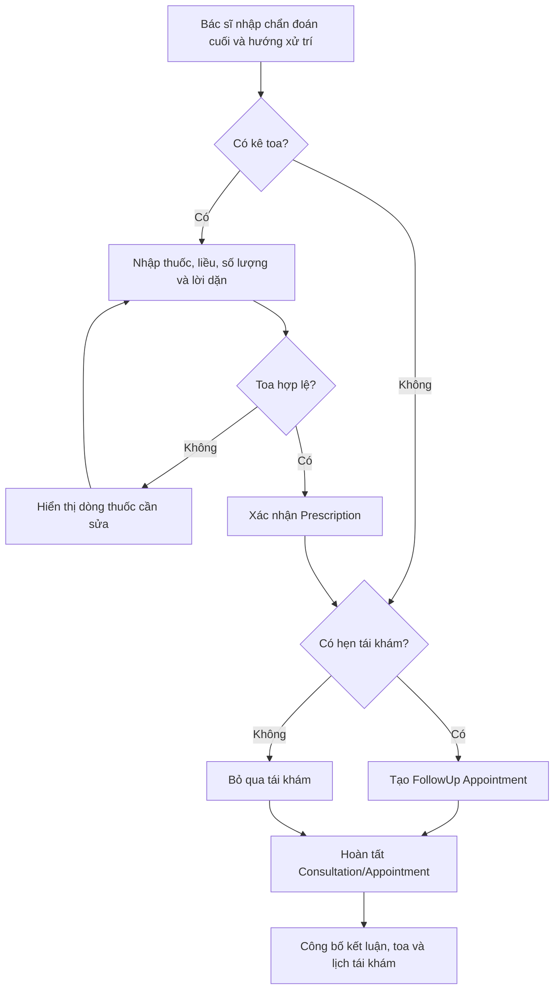
```mermaid
flowchart TD
    A["Bác sĩ nhập chẩn đoán cuối và hướng xử trí"] --> B{"Có kê toa?"}
    B -- "Có" --> C["Nhập thuốc, liều, số lượng và lời dặn"]
    C --> D{"Toa hợp lệ?"}
    D -- "Không" --> E["Hiển thị dòng thuốc cần sửa"]
    E --> C
    D -- "Có" --> F["Xác nhận Prescription"]
    B -- "Không" --> G{"Có hẹn tái khám?"}
    F --> G
    G -- "Có" --> H["Tạo FollowUp Appointment"]
    G -- "Không" --> I["Bỏ qua tái khám"]
    H --> J["Hoàn tất Consultation/Appointment"]
    I --> J
    J --> K["Công bố kết luận, toa và lịch tái khám"]
```

#### `UC-PHA-01` — Gọi lượt và phát thuốc

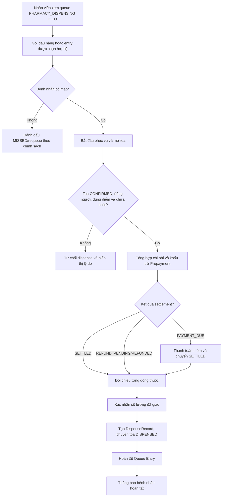
```mermaid
flowchart TD
    A["Nhân viên xem queue PHARMACY_DISPENSING FIFO"] --> B["Gọi đầu hàng hoặc entry được chọn hợp lệ"]
    B --> C{"Bệnh nhân có mặt?"}
    C -- "Không" --> D["Đánh dấu MISSED/requeue theo chính sách"]
    C -- "Có" --> E["Bắt đầu phục vụ và mở toa"]
    E --> F{"Toa CONFIRMED, đúng người, đúng điểm và chưa phát?"}
    F -- "Không" --> X["Từ chối dispense và hiển thị lý do"]
    F -- "Có" --> F1["Tổng hợp chi phí và khấu trừ Prepayment"]
    F1 --> F2{"Kết quả settlement?"}
    F2 -- "PAYMENT_DUE" --> F3["Thanh toán thêm và chuyển SETTLED"]
    F2 -- "SETTLED" --> G["Đối chiếu từng dòng thuốc"]
    F2 -- "REFUND_PENDING/REFUNDED" --> G
    F3 --> G
    G --> H["Xác nhận số lượng đã giao"]
    H --> I["Tạo DispenseRecord, chuyển toa DISPENSED"]
    I --> J["Hoàn tất Queue Entry"]
    J --> K["Thông báo bệnh nhân hoàn tất"]
```

### 3.4.3. Class Diagram phân tích

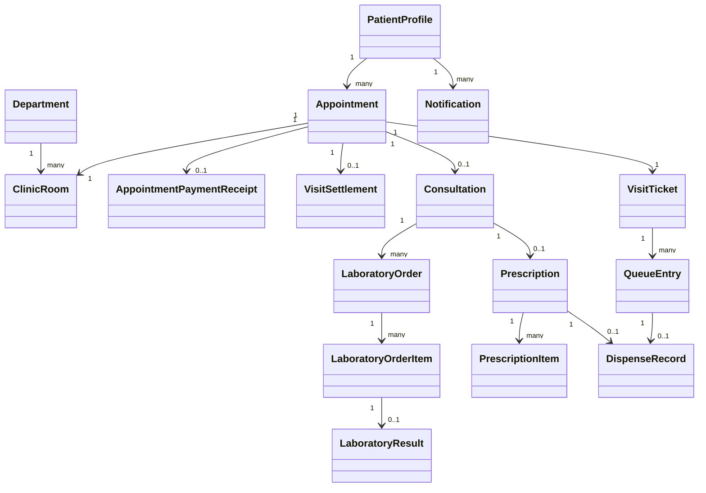
```mermaid
classDiagram
    class PatientProfile
    class Department
    class ClinicRoom
    class Appointment
    class AppointmentPaymentReceipt
    class VisitSettlement
    class VisitTicket
    class QueueEntry
    class Consultation
    class LaboratoryOrder
    class LaboratoryOrderItem
    class LaboratoryResult
    class Prescription
    class PrescriptionItem
    class DispenseRecord
    class Notification

    Department "1" --> "many" ClinicRoom
    PatientProfile "1" --> "many" Appointment
    Appointment "1" --> "1" ClinicRoom
    Appointment "1" --> "0..1" AppointmentPaymentReceipt
    Appointment "1" --> "0..1" VisitSettlement
    Appointment "1" --> "1" VisitTicket
    VisitTicket "1" --> "many" QueueEntry
    Appointment "1" --> "0..1" Consultation
    Consultation "1" --> "many" LaboratoryOrder
    LaboratoryOrder "1" --> "many" LaboratoryOrderItem
    LaboratoryOrderItem "1" --> "0..1" LaboratoryResult
    Consultation "1" --> "0..1" Prescription
    Prescription "1" --> "many" PrescriptionItem
    Prescription "1" --> "0..1" DispenseRecord
    QueueEntry "1" --> "0..1" DispenseRecord
    PatientProfile "1" --> "many" Notification
```

Đây là lớp khái niệm nghiệp vụ, chưa phải class Java hay bảng vật lý. Quan hệ
cho thấy `RESULT_REVIEW` và `PHARMACY_DISPENSING` là các Queue Entry tiếp theo
của cùng hành trình, không phải lịch khám mới.

Hai giai đoạn thanh toán được mô tả bằng `AppointmentPaymentReceipt` cho phí
khám trả trước và `VisitSettlement` cho quyết toán cuối lượt. Laboratory Order
chỉ cung cấp chi phí hạng mục; không có trạng thái thanh toán riêng. Cổng thanh
toán, hoàn tiền và sổ kế toán production thuộc hệ thống bên ngoài.

Để tránh dùng một Class Diagram tổng quát mà không truy vết được về Use Case,
các lớp tham gia được ánh xạ như sau:

| Use Case | Lớp khái niệm chính | Quan hệ/trách nhiệm cần thể hiện |
|---|---|---|
| `UC-APT-02` | PatientProfile, Department, ClinicRoom, Appointment, AppointmentPaymentReceipt, VisitTicket | hồ sơ đặt lịch; khoa có nhiều phòng; ghi nhận phí khám trả trước; lịch cấp một phiếu |
| `UC-QUE-02` | VisitTicket, QueueEntry, HospitalCheckInConfig, QueueAudit | QR phòng/phiên và geofence hợp lệ đưa ticket vào entry active |
| `UC-QUE-04` | ClinicRoom, QueueEntry | phòng chứa nhiều lượt; entry có lane, thời điểm và trạng thái |
| `UC-CON-01` | Appointment, QueueEntry, Consultation | phiên khám bắt đầu từ đúng lịch và lượt đã gọi |
| `UC-LAB-01` | Consultation, LaboratoryOrder | consultation tạo nhiều order/hạng mục khi cần |
| `UC-LAB-03` | LaboratoryOrder, LaboratoryResult, QueueEntry, Consultation | kết quả đầy đủ tạo lượt review và quay lại phiên cũ |
| `UC-PRE-01` | Consultation, Prescription, PrescriptionItem, Appointment | kết luận tạo toa và có thể tạo lịch tái khám |
| `UC-PHA-01` | Prescription, PrescriptionItem, QueueEntry, VisitSettlement | quyết toán cuối lượt; toa xác nhận gắn một lượt phát thuốc và bản ghi hoàn tất |

### 3.4.4. State Diagram

| Đối tượng | Use Case sử dụng | Nguồn biểu đồ | Quy tắc cần giữ |
|---|---|---|---|
| Appointment | `UC-APT-02`, `UC-PRE-01` | [DGM-STA-01](chapter-03/diagrams/state/dgm-sta-01-appointment.md) | payment Mobile không thêm state backend |
| Queue Entry | `UC-QUE-02`, `UC-QUE-04`, `UC-LAB-03`, `UC-PHA-01` | [DGM-STA-02](chapter-03/diagrams/state/dgm-sta-02-queue-entry.md) | chỉ lượt đã check-in/đủ điều kiện mới active |
| Consultation | `UC-CON-01`, `UC-LAB-01`, `UC-LAB-03`, `UC-PRE-01` | [DGM-STA-03](chapter-03/diagrams/state/dgm-sta-03-consultation.md) | review kết quả thuộc phiên hiện tại |
| Laboratory Order | `UC-LAB-01`, `UC-LAB-03` | [DGM-STA-04](chapter-03/diagrams/state/dgm-sta-04-laboratory-order.md) | thiếu item bắt buộc thì chưa hoàn tất |
| Prescription | `UC-PRE-01`, `UC-PHA-01` | [DGM-STA-05](chapter-03/diagrams/state/dgm-sta-05-prescription.md) | toa xác nhận mới tạo lượt phát thuốc |
| Visit Settlement (`DEMO_MOCK`) | `UC-PAY-01`, `UC-PHA-01` | [DGM-STA-06](chapter-03/diagrams/state/dgm-sta-06-visit-settlement.md) | số tiền không âm; chỉ `PAYMENT_DUE` chặn dispense |

## 3.5. Định nghĩa yêu cầu cho các thành phần CareFlow

### 3.5.1. Xác định thành phần tham gia từng Use Case

| Use Case | Thành phần giao diện | Thành phần nghiệp vụ tham gia |
|---|---|---|
| UC-APT-02 | Patient Mobile | Patient, Appointment, Queue, Notification, Mobile local payment adapter |
| UC-QUE-02 | Patient Mobile và Hospital Web hiển thị QR | Queue, Appointment, Notification |
| UC-QUE-04 | Hospital Web | Queue, Notification |
| UC-CON-01 | Hospital Web | Consultation/EMR, Queue, Patient |
| UC-LAB-01 | Hospital Web | Consultation, Laboratory Order, Queue |
| UC-LAB-03 | Hospital Web/Patient Mobile | Laboratory Order, Queue, Consultation, Notification |
| UC-PRE-01 | Hospital Web/Patient Mobile | Consultation, Prescription, Queue, Notification |
| UC-PHA-01 | Hospital Web/Patient Mobile | Queue, Prescription, Notification, Visit Settlement adapter/external payment boundary |

### 3.5.2. Xác định các đối tượng hỗ trợ bên ngoài

Thu ngân hoặc hệ thống thanh toán ngoài tham gia ở hai giai đoạn: ghi nhận phí
khám trả trước và quyết toán toàn bộ lượt khám trước khi phát thuốc. Chi phí cận
lâm sàng được cộng vào `totalVisitCost` nhưng không chặn việc tạo
`LAB_EXECUTION`. Trong MVP, thanh toán và hoàn tiền dùng adapter local/demo;
cổng thanh toán production, PACS/LIS, kho thuốc và dịch vụ SMS/email là các biên
tích hợp tương lai, không được mô tả như thành phần đã tham gia đầy đủ.

### 3.5.3. Xác định cách phối hợp giữa các thành phần

Từ yêu cầu của actor, giao diện gửi dữ liệu đến thành phần sở hữu nghiệp vụ.
Thành phần này thay đổi trạng thái và cung cấp kết quả trực tiếp; các thành phần
khác nhận thông tin cần thiết để tiếp tục hành trình. Ví dụ:

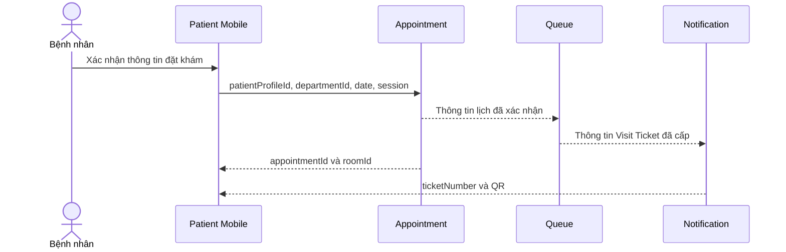
```mermaid
sequenceDiagram
    actor BN as Bệnh nhân
    participant M as Patient Mobile
    participant A as Appointment
    participant Q as Queue
    participant N as Notification
    BN->>M: Xác nhận thông tin đặt khám
    M->>A: patientProfileId, departmentId, date, session
    A-->>Q: Thông tin lịch đã xác nhận
    Q-->>N: Thông tin Visit Ticket đã cấp
    A-->>M: appointmentId và roomId
    N-->>M: ticketNumber và QR
```

Đây là phân rã thành phần ở mức yêu cầu. Endpoint, transaction, repository và
event envelope cụ thể được thiết kế tại Chương 4.

### 3.5.4. Yêu cầu thuộc tính và hành vi của từng thành phần

| Thành phần | Trách nhiệm | Dữ liệu vào | Dữ liệu ra/hành vi |
|---|---|---|---|
| Patient Mobile | thu thập yêu cầu và hiển thị hành trình | hồ sơ, khoa, ca, thao tác người bệnh | lịch, phiếu, queue, kết quả, toa, notification |
| Hospital Web | hỗ trợ thao tác tại điểm phục vụ | QR, room/session, dữ liệu khám/kết quả/toa | bảng queue, xác nhận nghiệp vụ và lỗi |
| Appointment | quản lý slot, khoa/phòng và lịch | patientId, departmentId, date, session | appointmentId, roomId, trạng thái |
| Queue | cấp phiếu và điều phối lượt | appointment/order/prescription, check-in, call | ticket, lane, recommendedNext, trạng thái lượt |
| Consultation/EMR | quản lý phiên khám và kết luận | lượt đã gọi, ghi chú, chẩn đoán | consultation state, chỉ định/kết luận |
| Laboratory Order | quản lý order, item, chi phí và kết quả | chỉ định, dữ liệu kỹ thuật | line amount, result state, kết quả FINAL |
| Prescription | quản lý toa và tái khám | chẩn đoán, dòng thuốc, follow-up | toa xác nhận và trạng thái dispense |
| Notification | lưu và phân phối cập nhật | sự kiện nghiệp vụ, recipient | inbox, read state và cập nhật realtime |
| Payment boundary/adapter | ghi nhận phí khám trả trước và quyết toán cuối lượt | visit reference, totalVisitCost, prepaidAmount | amountDue, refundDue và settlement status; không sở hữu sổ kế toán production |

Adapter trên chỉ mô phỏng trạng thái nghiệp vụ; CareFlow không sở hữu sổ kế
toán, hóa đơn, hoàn tiền hoặc đối soát ngân hàng production trong phạm vi đề tài.

## 3.6. Yêu cầu chất lượng

### 3.6.1. Yêu cầu từ môi trường nghiệp vụ

- Giao diện và thông báo dùng tiếng Việt, thể hiện số, phòng, trạng thái và
  hành động tiếp theo dễ hiểu.
- Active queue không chứa lượt khám ban đầu chưa `CHECKED_IN`.
- Ba lane giữ FIFO riêng và đề xuất Round Robin 1:1:1; bác sĩ vẫn là người bấm
  gọi.
- Cập nhật gọi lượt đến client đang kết nối trong vòng mục tiêu 5 giây.
- Người không dùng Mobile vẫn được phục vụ bằng thao tác của nhân viên.
- `amountDue` và `refundDue` không âm; chỉ `PAYMENT_DUE` chặn phát thuốc, còn
  `REFUND_PENDING` không chặn vì người bệnh không phải nộp thêm.

### 3.6.2. Yêu cầu từ môi trường vận hành

- Request phải được xác thực; role, ownership và assignment được kiểm tra tại
  mọi thao tác nhạy cảm.
- API thông thường trong môi trường demo phản hồi phần lớn trong 3 giây.
- Message redelivery không tạo dữ liệu trùng; lỗi Notification không rollback
  giao dịch nghiệp vụ đã thành công.
- Có health check, backup dữ liệu, retry/dead-letter và khả năng tải lại trạng
  thái khi WebSocket bị ngắt.
- Audit ghi actor, thời điểm, hành động và correlation ID.

### 3.6.3. Yêu cầu từ môi trường phát triển

- Service có contract, coding convention và có thể build/test/triển khai tương
  đối độc lập.
- Database migration chạy được từ database rỗng và có version.
- API/event có schema, mã lỗi, fixture và khả năng kiểm thử contract.
- Thành phần dùng chung chỉ chứa envelope, security/audit context và quy ước,
  không chứa nghiệp vụ của nhiều miền.
- Adapter Mobile có thể thay mock bằng backend contract mà không viết lại UI.

## 3.7. Ma trận truy vết yêu cầu

Phân tích được truy vết theo chuỗi:

```text
Vấn đề hiện trạng
  → Use Case
  → yêu cầu chức năng/chất lượng
  → thành phần CareFlow
  → thiết kế Chương 4
  → Test Case Chương 6
```

Mã yêu cầu và liên kết chi tiết được duy trì tại [03-traceability-matrix.md](chapter-03/03-traceability-matrix.md).
`FR-MOB-01..04` mô tả trải nghiệm Mobile. Yêu cầu thanh toán được truy vết qua
phí khám trả trước của `UC-APT-02` và quyết toán cuối lượt của `UC-PHA-01`;
`UC-LAB-01` chỉ ghi nhận chi phí để tổng hợp sau.

## 3.8. Kết luận chương

Chương 3 đã phân biệt rõ hiện trạng chưa có CareFlow, mô hình vận hành mới, các
Use Case nghiệp vụ, bốn nhóm biểu đồ phân tích và yêu cầu của các thành phần.
Các kết quả này là đầu vào trực tiếp cho Chương 4, nơi mỗi Use Case được thiết
kế theo lớp biên, lớp xử lý và lớp thực thể/dữ liệu.
