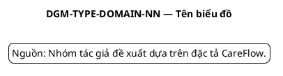

# Mẫu đặc tả và quy ước biểu đồ

## 1. Quy ước mã

| Nhóm | Tiền tố |
|---|---|
| Actor | `ACT-` |
| Use Case | `UC-<DOMAIN>-<NN>` |
| Business Rule | `BR-<DOMAIN>-<NN>` |
| Functional Requirement | `FR-<DOMAIN>-<NN>` |
| Non-functional Requirement | `NFR-<GROUP>-<NN>` |
| Diagram | `DGM-<TYPE>-<DOMAIN>-<NN>` |

Domain dùng trong mã: `AUTH`, `PAT`, `APT`, `MOB`, `QUE`, `CON`, `LAB`, `PRE`,
`NOT`, `CFG`. `AUTH` dùng cho yêu cầu nền tảng, không phải Use Case nghiệp vụ;
`MOB` chỉ dùng cho các yêu cầu/luồng trình diễn thuộc Patient
Mobile, không đại diện cho một backend service. Tên file dùng chữ thường, dấu
gạch ngang và mã Use Case, ví dụ
`uc-apt-02-book-appointment.puml`.

## 2. Mẫu bảng đặc tả Use Case

```markdown
### UC-XXX-NN — Tên Use Case

| Thuộc tính | Nội dung |
|---|---|
| Mã Use Case | `UC-XXX-NN` |
| Tên | ... |
| Mục tiêu | ... |
| Tác nhân chính | ... |
| Tác nhân phụ | ... |
| Kích hoạt | ... |
| Tiền điều kiện | ... |
| Hậu điều kiện thành công | ... |
| Hậu điều kiện thất bại | ... |
| Quy tắc nghiệp vụ | `BR-...` |

#### Luồng chính

| Bước | Tác nhân | Hệ thống |
|---:|---|---|
| 1 | ... | ... |

#### Luồng thay thế và ngoại lệ

| Mã luồng | Tại bước | Điều kiện | Xử lý |
|---|---:|---|---|
| A1 | ... | ... | ... |
| E1 | ... | ... | ... |
```

Đặc tả tập trung vào hành vi quan sát được và quy tắc nghiệp vụ, không mô tả
class, method hoặc câu lệnh SQL.

## 3. Khi nào dùng biểu đồ nào

| Biểu đồ | Mục đích | Quy tắc sử dụng |
|---|---|---|
| Use Case | Phạm vi chức năng và tác nhân | Một sơ đồ tổng quát và sơ đồ theo phân hệ nếu tổng thể quá dày |
| Activity | Luồng, nhánh và ngoại lệ | Một biểu đồ cho mỗi Use Case cốt lõi; không vẽ chi tiết HTTP |
| Sequence | Tương tác theo thời gian | Chỉ dùng cho luồng có nhiều client/service hoặc event |
| State Machine | Vòng đời aggregate | Vẽ theo Appointment, Queue Entry, Consultation, Lab Order, Prescription; nếu vẽ Prepayment/Visit Settlement phải ghi rõ `DEMO_MOCK` và không gộp vào state backend |
| Component | Cấu trúc hệ thống | Vẽ client, platform, service và hạ tầng; không trộn bảng dữ liệu |
| ERD | Cấu trúc dữ liệu | Vẽ riêng theo service; không tạo khóa ngoại xuyên service |
| Deployment | Môi trường triển khai | Vẽ container/node/network ở mức tổng quát, không chép Docker Compose |

## 4. Quy ước PlantUML



Quy ước chung:

- Tiêu đề biểu đồ bằng tiếng Việt; tên kỹ thuật/trạng thái giữ nguyên tiếng Anh.
- Actor dùng đúng tên trong `00-foundation.md`.
- Component dùng đúng tên service đầy đủ ở lần xuất hiện đầu tiên.
- Sequence Diagram phân biệt lời gọi REST đồng bộ và event bất đồng bộ.
- Mũi tên event ghi tên event ở dạng quá khứ, ví dụ `AppointmentConfirmed`.
- Không đưa access token, secret hoặc dữ liệu bệnh án thật vào ví dụ.
- Biểu đồ phải đọc được khi in A4; nếu quá rộng, tách theo nhánh nghiệp vụ.

## 5. Quy ước Sequence Diagram

Thứ tự lớp tham gia từ trái sang phải:

```text
Actor → Mobile/Web → API Gateway → Service sở hữu command
→ Service phụ thuộc/Broker → Consumer → Mobile/Web
```

- Lời gọi HTTP dùng mũi tên liền và ghi method/path ở mức cần thiết.
- Event qua RabbitMQ dùng mũi tên bất đồng bộ và ghi event type.
- Khối `alt` biểu diễn nhánh thành công/lỗi; `opt` cho bước tùy chọn; `loop` chỉ
  dùng khi có hành vi lặp thực sự.
- Không biến Sequence Diagram thành bản sao của source code.

## 6. Tiêu chí kiểm tra chéo

Trước khi chấp nhận một Use Case:

1. Tác nhân và mục tiêu có trong danh mục Use Case.
2. Tiền/hậu điều kiện khớp State Machine.
3. Activity Diagram khớp luồng chính và ngoại lệ trong đặc tả.
4. Sequence Diagram chỉ gọi service chịu trách nhiệm theo contract.
5. Event và trạng thái dùng đúng chính tả, đúng phiên bản mục tiêu.
6. Dữ liệu truy cập tuân thủ role và ownership.
7. Không mô tả phần `TARGET_DESIGN` như bằng chứng đã triển khai.

Sitemap, wireframe và ảnh giao diện không thuộc bộ biểu đồ bắt buộc của Chương
3. Các nội dung này được trình bày cùng phần xây dựng Patient Mobile và Hospital
Web trong Chương 4.
