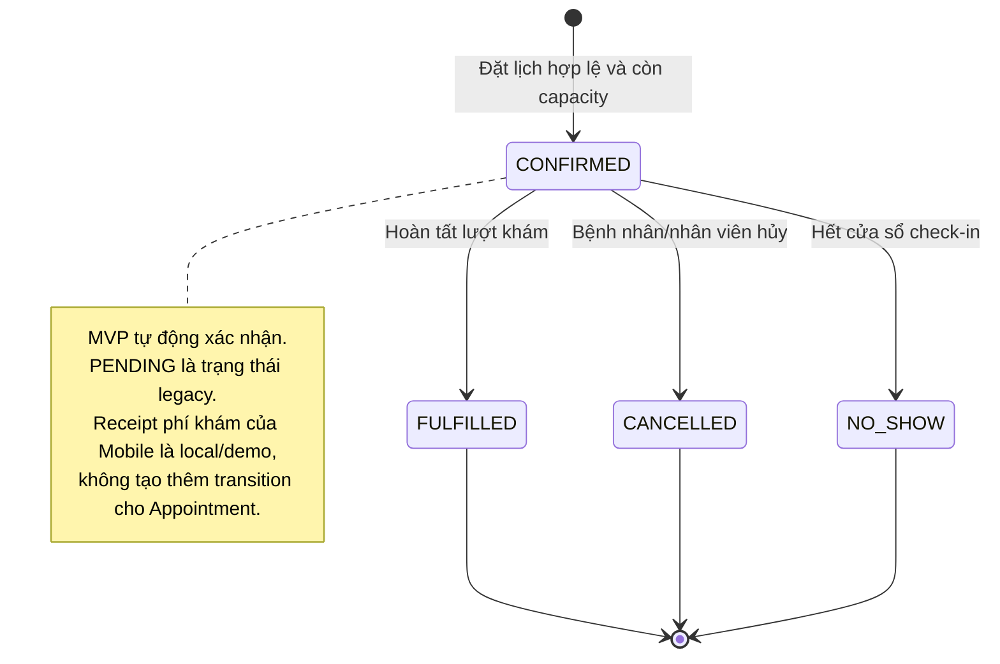

# DGM-STA-01 — Trạng thái Appointment

```mermaid
stateDiagram-v2
    [*] --> CONFIRMED: Đặt lịch hợp lệ và còn capacity
    CONFIRMED --> FULFILLED: Hoàn tất lượt khám
    CONFIRMED --> CANCELLED: Bệnh nhân/nhân viên hủy
    CONFIRMED --> NO_SHOW: Hết cửa sổ check-in
    FULFILLED --> [*]
    CANCELLED --> [*]
    NO_SHOW --> [*]

    note right of CONFIRMED
        MVP tự động xác nhận.
        PENDING là trạng thái legacy.
        Receipt phí khám của Mobile là local/demo,
        không tạo thêm transition cho Appointment.
    end note
```
