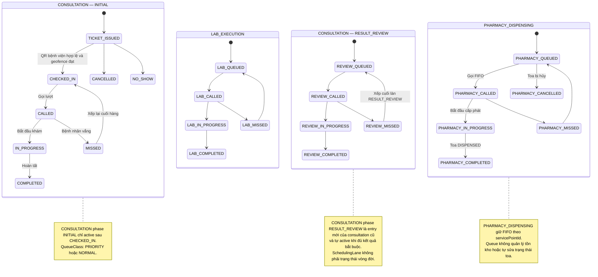

# DGM-STA-02 — Trạng thái Queue Entry theo loại lượt

```mermaid
stateDiagram-v2
    state "CONSULTATION — INITIAL" as Initial {
        [*] --> TICKET_ISSUED
        TICKET_ISSUED --> CHECKED_IN: QR bệnh viện hợp lệ và geofence đạt
        CHECKED_IN --> CALLED: Gọi lượt
        CALLED --> IN_PROGRESS: Bắt đầu khám
        IN_PROGRESS --> COMPLETED: Hoàn tất
        CALLED --> MISSED: Bệnh nhân vắng
        MISSED --> CHECKED_IN: Xếp lại cuối hàng
        TICKET_ISSUED --> CANCELLED
        TICKET_ISSUED --> NO_SHOW
    }

    state "LAB_EXECUTION" as LabQueue {
        [*] --> LAB_QUEUED
        LAB_QUEUED --> LAB_CALLED
        LAB_CALLED --> LAB_IN_PROGRESS
        LAB_IN_PROGRESS --> LAB_COMPLETED
        LAB_CALLED --> LAB_MISSED
        LAB_MISSED --> LAB_QUEUED
    }

    state "CONSULTATION — RESULT_REVIEW" as ReviewQueue {
        [*] --> REVIEW_QUEUED
        REVIEW_QUEUED --> REVIEW_CALLED
        REVIEW_CALLED --> REVIEW_IN_PROGRESS
        REVIEW_IN_PROGRESS --> REVIEW_COMPLETED
        REVIEW_CALLED --> REVIEW_MISSED
        REVIEW_MISSED --> REVIEW_QUEUED: Xếp cuối làn RESULT_REVIEW
    }

    state "PHARMACY_DISPENSING" as PharmacyQueue {
        [*] --> PHARMACY_QUEUED
        PHARMACY_QUEUED --> PHARMACY_CALLED: Gọi FIFO
        PHARMACY_CALLED --> PHARMACY_IN_PROGRESS: Bắt đầu cấp phát
        PHARMACY_IN_PROGRESS --> PHARMACY_COMPLETED: Toa DISPENSED
        PHARMACY_CALLED --> PHARMACY_MISSED
        PHARMACY_MISSED --> PHARMACY_QUEUED
        PHARMACY_QUEUED --> PHARMACY_CANCELLED: Toa bị hủy
    }

    note right of Initial
        CONSULTATION phase INITIAL chỉ active sau CHECKED_IN.
        QueueClass: PRIORITY hoặc NORMAL.
    end note

    note right of ReviewQueue
        CONSULTATION phase RESULT_REVIEW là entry mới của consultation cũ
        và tự active khi đủ kết quả bắt buộc.
        SchedulingLane không phải trạng thái vòng đời.
    end note

    note right of PharmacyQueue
        PHARMACY_DISPENSING giữ FIFO theo servicePointId.
        Queue không quản lý tồn kho hoặc tự sửa trạng thái toa.
    end note
```
