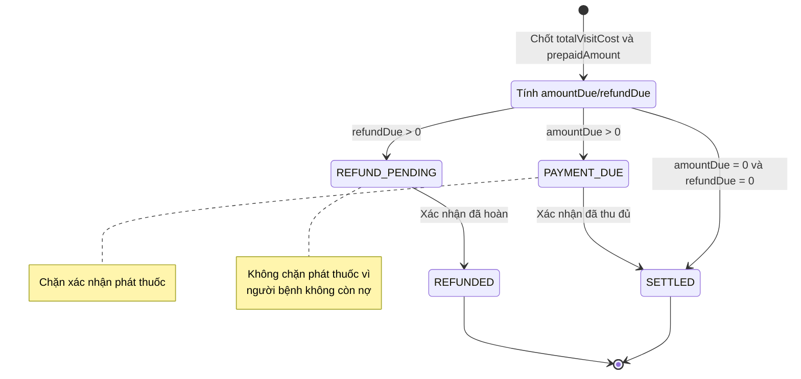

# DGM-STA-06 — Trạng thái Visit Settlement tự chi trả

```mermaid
stateDiagram-v2
    state "Tính amountDue/refundDue" as Calculate

    [*] --> Calculate: Chốt totalVisitCost và prepaidAmount
    Calculate --> PAYMENT_DUE: amountDue > 0
    Calculate --> SETTLED: amountDue = 0 và refundDue = 0
    Calculate --> REFUND_PENDING: refundDue > 0

    PAYMENT_DUE --> SETTLED: Xác nhận đã thu đủ
    REFUND_PENDING --> REFUNDED: Xác nhận đã hoàn

    SETTLED --> [*]
    REFUNDED --> [*]

    note right of PAYMENT_DUE
        Chặn xác nhận phát thuốc
    end note

    note right of REFUND_PENDING
        Không chặn phát thuốc vì
        người bệnh không còn nợ
    end note
```
