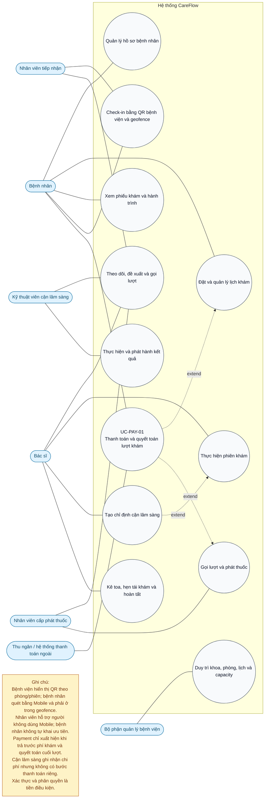

# DGM-UC-01 — Biểu đồ Use Case tổng quát của CareFlow

```mermaid
flowchart LR
    Patient([Bệnh nhân])
    Doctor([Bác sĩ])
    Reception([Nhân viên tiếp nhận])
    LabTech([Kỹ thuật viên cận lâm sàng])
    PharmacyStaff([Nhân viên cấp phát thuốc])
    Management([Bộ phận quản lý bệnh viện])
    Payment([Thu ngân / hệ thống thanh toán ngoài])

    subgraph CareFlow[Hệ thống CareFlow]
        direction TB
        UCProfile((Quản lý hồ sơ bệnh nhân))
        UCAppointment((Đặt và quản lý lịch khám))
        UCJourney((Xem phiếu khám và hành trình))
        UCCheckIn((Check-in bằng QR bệnh viện và geofence))
        UCQueue((Theo dõi, đề xuất và gọi lượt))
        UCConsultation((Thực hiện phiên khám))
        UCOrder((Tạo chỉ định cận lâm sàng))
        UCResult((Thực hiện và phát hành kết quả))
        UCPrescription((Kê toa, hẹn tái khám và hoàn tất))
        UCDispense((Gọi lượt và phát thuốc))
        UCConfig((Duy trì khoa, phòng, lịch và capacity))
        UCPayment((UC-PAY-01<br/>Thanh toán và quyết toán lượt khám))
    end

    Patient --- UCProfile
    Patient --- UCAppointment
    Patient --- UCJourney
    Patient --- UCCheckIn
    Patient --- UCPayment
    Reception --- UCCheckIn
    Reception --- UCQueue
    Doctor --- UCQueue
    Doctor --- UCConsultation
    Doctor --- UCOrder
    Doctor --- UCPrescription
    LabTech --- UCQueue
    LabTech --- UCResult
    PharmacyStaff --- UCQueue
    PharmacyStaff --- UCDispense
    Management --- UCConfig
    Payment --- UCPayment

    UCPayment -.->|extend| UCAppointment
    UCPayment -.->|extend| UCDispense
    UCOrder -.->|extend| UCConsultation

    Note["Ghi chú:<br/>Bệnh viện hiển thị QR theo phòng/phiên; bệnh nhân quét bằng Mobile và phải ở trong geofence.<br/>Nhân viên hỗ trợ người không dùng Mobile; bệnh nhân không tự khai ưu tiên.<br/>Payment chỉ xuất hiện khi trả trước phí khám và quyết toán cuối lượt.<br/>Cận lâm sàng ghi nhận chi phí nhưng không có bước thanh toán riêng.<br/>Xác thực và phân quyền là tiền điều kiện."]

    classDef actor fill:#E0F2FE,stroke:#0369A1,color:#0C4A6E
    classDef usecase fill:#F8FAFC,stroke:#334155,color:#0F172A
    classDef note fill:#FEF3C7,stroke:#B45309,color:#78350F
    class Patient,Doctor,Reception,LabTech,PharmacyStaff,Management,Payment actor
    class UCProfile,UCAppointment,UCJourney,UCCheckIn,UCQueue,UCConsultation,UCOrder,UCResult,UCPrescription,UCDispense,UCConfig,UCPayment usecase
    class Note note
```
