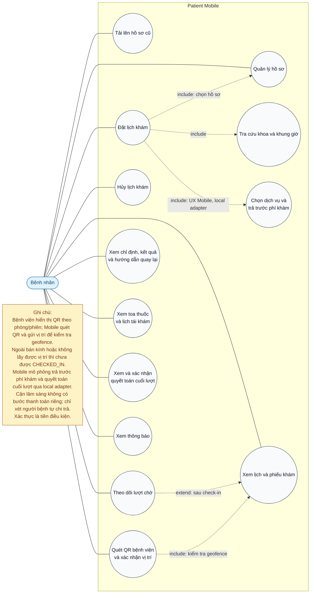

# DGM-UC-02 — Use Case phân hệ bệnh nhân

```mermaid
flowchart LR
    Patient([Bệnh nhân])

    subgraph Mobile[Patient Mobile]
        direction TB
        Profile((Quản lý hồ sơ))
        Upload((Tải lên hồ sơ cũ))
        Slots((Tra cứu khoa và khung giờ))
        Book((Đặt lịch khám))
        BookingPayment((Chọn dịch vụ và<br/>trả trước phí khám))
        ViewTicket((Xem lịch và phiếu khám))
        CheckIn((Quét QR bệnh viện<br/>và xác nhận vị trí))
        Cancel((Hủy lịch khám))
        TrackQueue((Theo dõi lượt chờ))
        ViewResult((Xem chỉ định, kết quả<br/>và hướng dẫn quay lại))
        ViewOutcome((Xem toa thuốc<br/>và lịch tái khám))
        Settlement((Xem và xác nhận<br/>quyết toán cuối lượt))
        Notification((Xem thông báo))
    end

    Patient --- Profile
    Patient --- Upload
    Patient --- Book
    Patient --- ViewTicket
    Patient --- CheckIn
    Patient --- Cancel
    Patient --- TrackQueue
    Patient --- ViewResult
    Patient --- ViewOutcome
    Patient --- Settlement
    Patient --- Notification

    Book -.->|include| Slots
    Book -.->|include: chọn hồ sơ| Profile
    Book -.->|include: UX Mobile, local adapter| BookingPayment
    TrackQueue -.->|extend: sau check-in| ViewTicket
    CheckIn -.->|include: kiểm tra geofence| ViewTicket

    Note["Ghi chú:<br/>Bệnh viện hiển thị QR theo phòng/phiên; Mobile quét QR và gửi vị trí để kiểm tra geofence.<br/>Ngoài bán kính hoặc không lấy được vị trí thì chưa được CHECKED_IN.<br/>Mobile mô phỏng trả trước phí khám và quyết toán cuối lượt qua local adapter.<br/>Cận lâm sàng không có bước thanh toán riêng; chỉ xét người bệnh tự chi trả.<br/>Xác thực là tiền điều kiện."]

    classDef actor fill:#E0F2FE,stroke:#0369A1,color:#0C4A6E
    classDef usecase fill:#F8FAFC,stroke:#334155,color:#0F172A
    classDef note fill:#FEF3C7,stroke:#B45309,color:#78350F
    class Patient actor
    class Profile,Upload,Slots,Book,BookingPayment,ViewTicket,CheckIn,Cancel,TrackQueue,ViewResult,ViewOutcome,Settlement,Notification usecase
    class Note note
```
