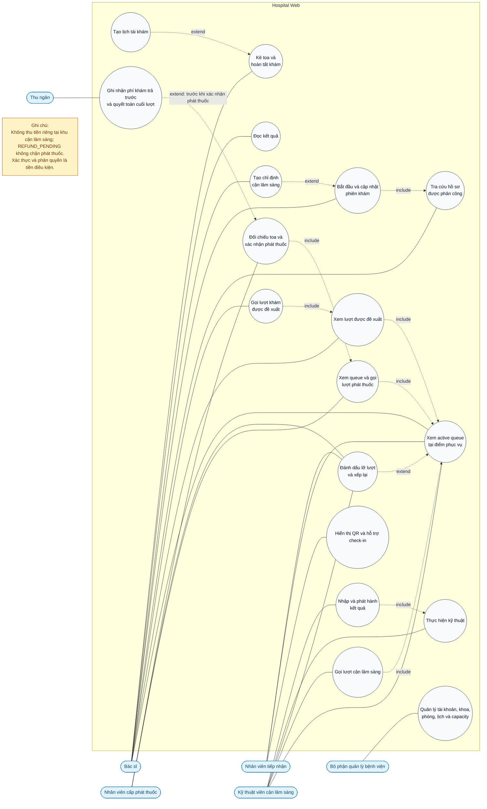

# DGM-UC-03 — Use Case phân hệ bác sĩ và nhân viên y tế

```mermaid
flowchart LR
    Doctor([Bác sĩ])
    Reception([Nhân viên tiếp nhận])
    LabTech([Kỹ thuật viên cận lâm sàng])
    PharmacyStaff([Nhân viên cấp phát thuốc])
    Cashier([Thu ngân])
    Management([Bộ phận quản lý bệnh viện])

    subgraph HospitalWeb[Hospital Web]
        direction TB
        CheckIn((Hiển thị QR và hỗ trợ check-in))
        ViewQueue((Xem active queue<br/>tại điểm phục vụ))
        Suggest((Xem lượt được đề xuất))
        CallClinic((Gọi lượt khám<br/>được đề xuất))
        CallLab((Gọi lượt cận lâm sàng))
        CallPharmacy((Xem queue và gọi<br/>lượt phát thuốc))
        Miss((Đánh dấu lỡ lượt<br/>và xếp lại))
        ViewPatient((Tra cứu hồ sơ<br/>được phân công))
        Consult((Bắt đầu và cập nhật<br/>phiên khám))
        Order((Tạo chỉ định<br/>cận lâm sàng))
        ExecuteLab((Thực hiện kỹ thuật))
        FinalizeResult((Nhập và phát hành<br/>kết quả))
        Review((Đọc kết quả))
        Complete((Kê toa và<br/>hoàn tất khám))
        FollowUp((Tạo lịch tái khám))
        Dispense((Đối chiếu toa và<br/>xác nhận phát thuốc))
        Settlement((Ghi nhận phí khám trả trước<br/>và quyết toán cuối lượt))
        Configure((Quản lý tài khoản, khoa,<br/>phòng, lịch và capacity))
    end

    Doctor --- ViewQueue
    Doctor --- Suggest
    Doctor --- CallClinic
    Doctor --- ViewPatient
    Doctor --- Consult
    Doctor --- Order
    Doctor --- Review
    Doctor --- Complete
    Reception --- CheckIn
    Reception --- ViewQueue
    Reception --- Miss
    LabTech --- ViewQueue
    LabTech --- CallLab
    LabTech --- Miss
    LabTech --- ExecuteLab
    LabTech --- FinalizeResult
    PharmacyStaff --- CallPharmacy
    PharmacyStaff --- Miss
    PharmacyStaff --- Dispense
    Cashier --- Settlement
    Management --- Configure

    Suggest -.->|include| ViewQueue
    CallClinic -.->|include| Suggest
    CallLab -.->|include| ViewQueue
    CallPharmacy -.->|include| ViewQueue
    Dispense -.->|include| CallPharmacy
    Settlement -.->|extend: trước khi xác nhận phát thuốc| Dispense
    Miss -.->|extend| ViewQueue
    Consult -.->|include| ViewPatient
    Order -.->|extend| Consult
    FinalizeResult -.->|include| ExecuteLab
    FollowUp -.->|extend| Complete

    Note["Ghi chú:<br/>Không thu tiền riêng tại khu cận lâm sàng; REFUND_PENDING không chặn phát thuốc.<br/>Xác thực và phân quyền là tiền điều kiện."]

    classDef actor fill:#E0F2FE,stroke:#0369A1,color:#0C4A6E
    classDef usecase fill:#F8FAFC,stroke:#334155,color:#0F172A
    classDef note fill:#FEF3C7,stroke:#B45309,color:#78350F
    class Doctor,Reception,LabTech,PharmacyStaff,Cashier,Management actor
    class CheckIn,ViewQueue,Suggest,CallClinic,CallLab,CallPharmacy,Miss,ViewPatient,Consult,Order,ExecuteLab,FinalizeResult,Review,Complete,FollowUp,Dispense,Settlement,Configure usecase
    class Note note
```
