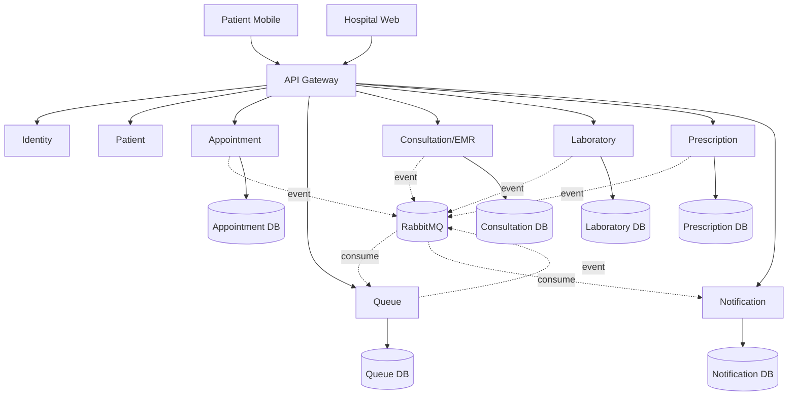
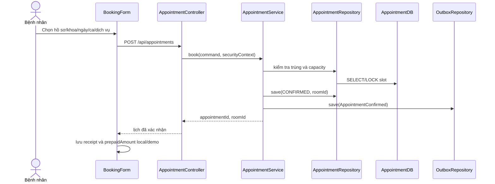
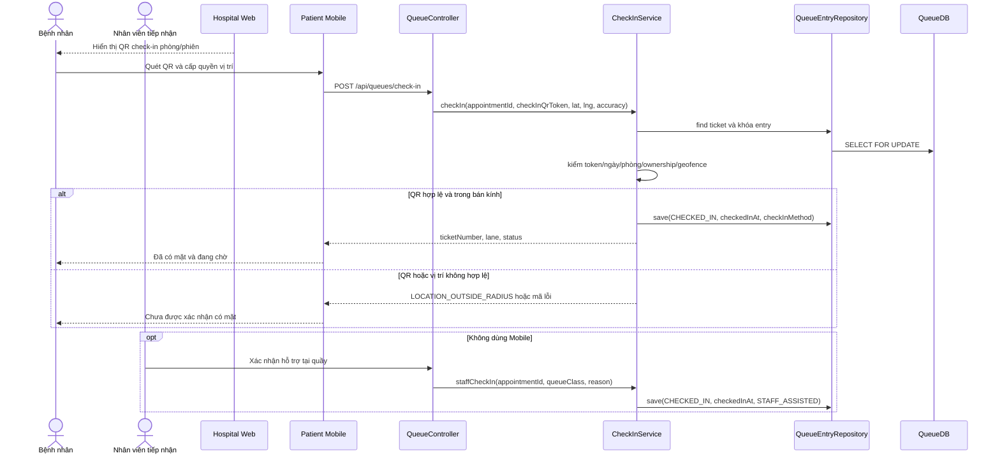
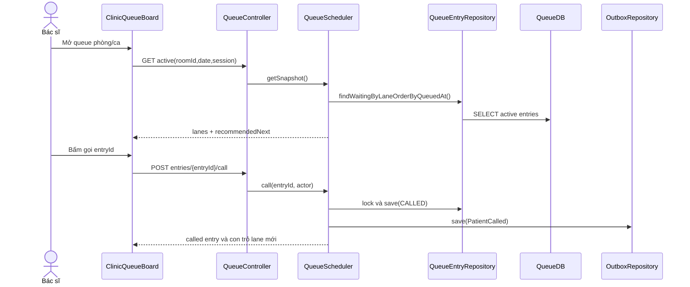
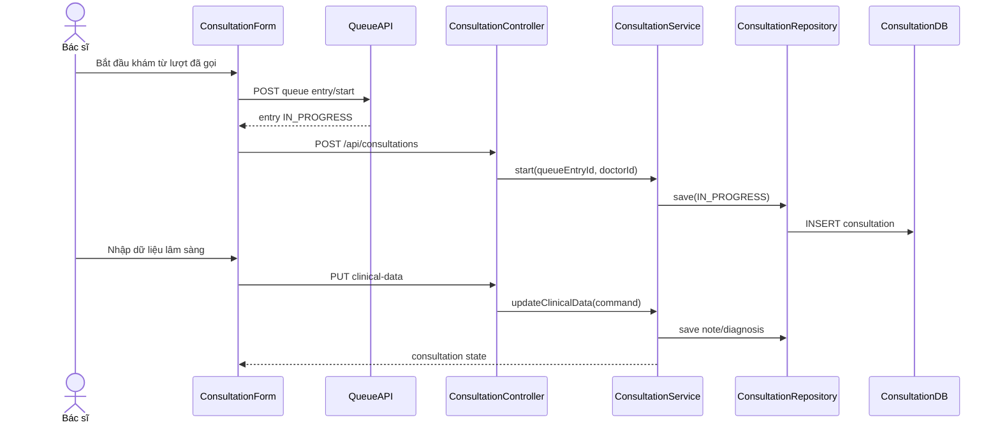
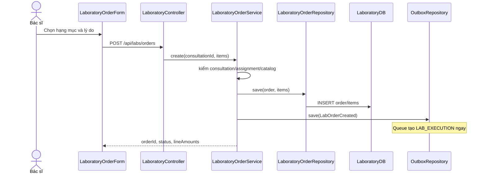
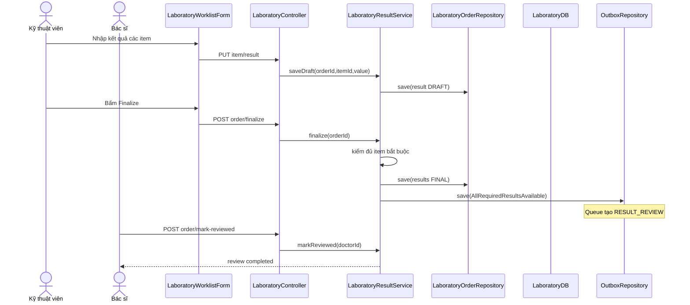
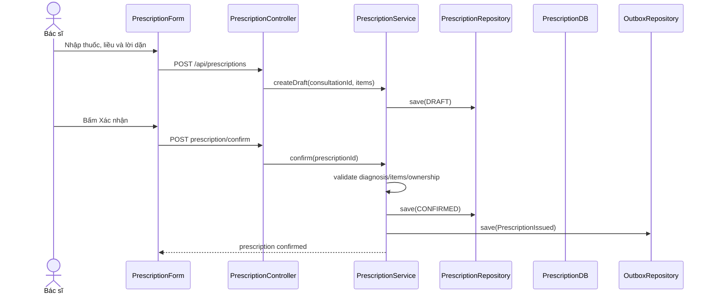
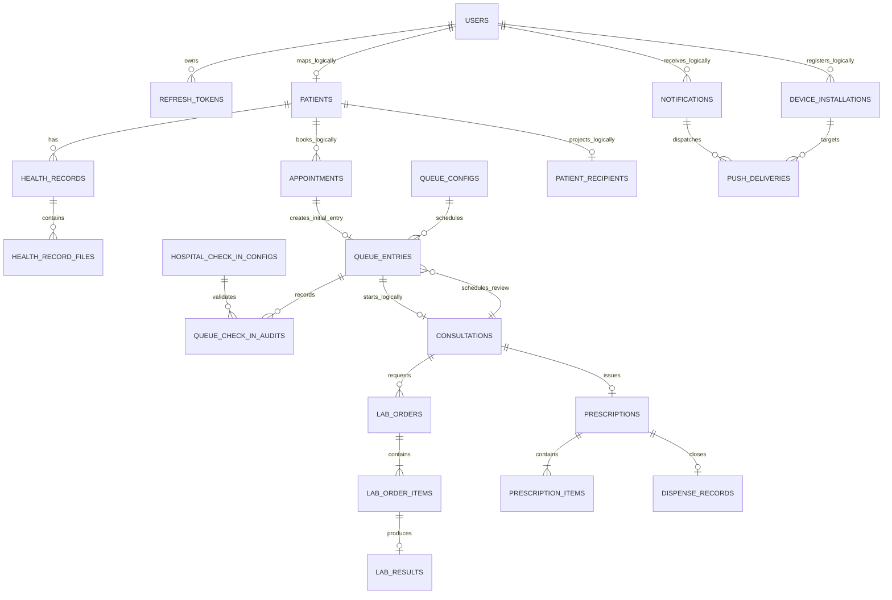

# CHƯƠNG 4. THIẾT KẾ PHẦN MỀM

Chương 3 đã xác định actor, Use Case, tương tác hộp đen, lớp khái niệm và yêu
cầu chất lượng. Chương này chuyển các kết quả đó thành thiết kế hộp trắng. Mỗi
Use Case cốt lõi được trình bày theo ba lớp Boundary/Interface,
Process/Control và Entity/Data, sau đó được liên kết với database và các cơ chế
đáp ứng yêu cầu chất lượng.

## 4.1. Thiết kế kiến trúc

### 4.1.1. Layering – Phân tầng

| Tầng | Thành phần CareFlow | Trách nhiệm |
|---|---|---|
| Boundary/Interface | Patient Mobile, Hospital Web, REST Controller, WebSocket endpoint | thu thập input, validation định dạng, hiển thị output và lỗi |
| Process/Control | Application Service, domain service, scheduler, event consumer/publisher | điều phối Use Case, quyền, transaction và state transition |
| Entity/Data | Aggregate, value object, JPA entity, repository và PostgreSQL | giữ dữ liệu, quan hệ, bất biến và lịch sử |

Giao diện không tự quyết định trạng thái nghiệp vụ; Controller không chứa thuật
toán queue; Repository không phát event. Việc phân tầng giúp cùng một Use Case
có thể được gọi từ Mobile hoặc Web mà vẫn dùng chung quy tắc miền.

### 4.1.2. Segmentation – Phân vùng

Hệ thống được phân vùng theo năng lực nghiệp vụ thay vì theo bảng dữ liệu dùng
chung:

| Phân vùng | Aggregate sở hữu | Trách nhiệm |
|---|---|---|
| Identity & Access | User, Role, RefreshToken | xác thực và security context |
| Patient | Patient, PatientProfile | hồ sơ và quyền sở hữu |
| Appointment | Department, ClinicRoom, Appointment, Slot | lịch, capacity và phân phòng |
| Queue | VisitTicket, QueueEntry, QueueSession, HospitalCheckInConfig | QR/geofence check-in, FIFO, Round Robin và gọi lượt |
| Consultation/EMR | Consultation, ClinicalNote, Diagnosis | phiên khám và kết luận |
| Laboratory | LaboratoryOrder, OrderItem, Result | chỉ định, thực hiện và phát hành kết quả |
| Prescription | Prescription, PrescriptionItem, FollowUp | toa, tái khám và dispense |
| Notification | Notification, Device, DeliveryStatus | inbox, WebSocket và trạng thái đọc |

Mỗi phân vùng có database/schema riêng và chỉ trao đổi qua REST hoặc event
contract. `Department 1:N ClinicRoom` thuộc Appointment; Queue chỉ lưu
`roomId` cần thiết để điều phối.

### 4.1.3. Factoring – Thành phần dùng chung

Các thành phần dùng chung chỉ chứa hạ tầng và quy ước, không chứa business rule
của nhiều miền:

- `ApiResponse`/error envelope: mã, thông điệp, dữ liệu và correlation ID;
- `EventEnvelope v1`: `eventId`, `eventType`, `occurredAt`, producer,
  correlation và payload có version;
- `SecurityContext`: trusted user ID, role và claim cần thiết;
- `AuditInformation`: actor, hành động, aggregate, thời điểm và lý do;
- idempotency key, clock và quy ước UTC;
- thư viện logging/observability và test fixture contract.

Queue Scheduler, capacity rule hoặc prescription validation không được đưa vào
shared library vì đó là nghiệp vụ thuộc service sở hữu.

### 4.1.4. Kiến trúc Microservices tổng thể



REST xử lý lệnh/truy vấn cần phản hồi ngay. RabbitMQ truyền sự thật đã xảy ra;
producer ghi outbox cùng transaction và consumer xử lý idempotent. Notification
đẩy STOMP/WebSocket đến client đang kết nối; REST vẫn là nguồn tải lại. Gateway
thực hiện routing, JWT boundary, CORS và correlation ID; service tiếp tục kiểm
tra role, ownership và assignment của resource.

## 4.2. Thiết kế chi tiết theo từng Use Case

Hai giai đoạn thanh toán của Chương 3 dùng cùng nguyên tắc tự chi trả: phí khám
được ghi nhận trước trong `AppointmentPaymentReceipt`, sau đó
`VisitSettlement` tổng hợp toàn bộ chi phí để quyết toán cuối lượt. Laboratory
Order chỉ cung cấp chi phí hạng mục và không chặn việc tạo lượt thực hiện. Thu
ngân/hệ thống viện phí production là external boundary, không tạo một Payment
microservice hay sổ kế toán trong CareFlow MVP.

### 4.2.1. `UC-APT-02` — Đặt lịch khám

| Lớp | Thiết kế |
|---|---|
| Boundary – `BookingForm` | Actor: Bệnh nhân. Control: chọn hồ sơ, khoa, ngày, ca, dịch vụ và xác nhận thanh toán trực tuyến; nút “Xác nhận đặt lịch”. Input: `patientProfileId`, `department`, `date`, `timeSlot`, `serviceCode`. Output: lịch, phòng, phiếu và receipt Mobile; QR check-in được Hospital Web hiển thị theo phòng/phiên; khoản phát sinh nếu có thuộc `VisitSettlement` cuối lượt. |
| Process – Appointment API | `GET /api/appointments/departments`, `GET /api/appointments/time-slots`, `POST /api/appointments`. `AppointmentApplicationService` kiểm ownership, slot/capacity, truy vấn phòng active, tạo Appointment và outbox `AppointmentConfirmed`. |
| Entity/Data | `PatientProfile`, `Department`, `ClinicRoom`, `Appointment`, `OutboxEvent`; unique slot theo chính sách, room phải thuộc department. `AppointmentPaymentReceipt` nằm ở local adapter, không thuộc Appointment DB. |



### 4.2.2. `UC-QUE-02` — Check-in bằng QR

| Lớp | Thiết kế |
|---|---|
| Boundary – `CheckInForm` | Actor chính: Bệnh nhân trên Patient Mobile; Nhân viên tiếp nhận là luồng hỗ trợ. Hospital Web hiển thị QR phòng/phiên. Mobile dùng camera, xin quyền vị trí và gửi `appointmentId`, `checkInQrToken`, `latitude`, `longitude`, `accuracyMeters`. Output: số vé, lane và trạng thái check-in. |
| Process – Queue API | `POST /api/queues/check-in`. `CheckInService` xác minh token QR, ngày, phiên, appointment ownership và tính khoảng cách tới `HospitalCheckInConfig`; chỉ khi trong bán kính mới chuyển entry sang `CHECKED_IN` và tạo outbox. `PRIORITY` chỉ được staff xác nhận cùng lý do. |
| Entity/Data | `VisitTicket`, `QueueEntry`, `HospitalCheckInConfig`, `QueueAudit`, `OutboxEvent`; audit lưu phương thức check-in, thời điểm, kết quả geofence và khoảng cách tối thiểu; QR không chứa PII/bệnh án. |



### 4.2.3. `UC-QUE-04` — Theo dõi, đề xuất và gọi lượt

| Lớp | Thiết kế |
|---|---|
| Boundary – `ClinicQueueBoard` | Actor: Bác sĩ. Ba cột `PRIORITY`, `NORMAL`, `RESULT_REVIEW`; badge `recommendedNext`; nút Gọi, Gọi lại, Lỡ lượt và Xếp lại. Input: room/date/session/entry. Output: snapshot và trạng thái gọi. |
| Process – Queue API | `GET /api/appointments/clinical-context/me`, `GET /api/queues/rooms/{roomId}/active`, `POST /api/queues/entries/{entryId}/call`, `POST .../call-next`. `QueueScheduler` tính Round Robin 1:1:1; `CallQueueEntryService` khóa entry, kiểm assignment và cập nhật `lastServedLane`. |
| Entity/Data | `QueueEntry`, `QueueSession`, `QueueAudit`, `ProcessedEvent`; FIFO theo `queuedAt`, optimistic version/lock ngăn gọi trùng. |



### 4.2.4. `UC-CON-01` — Bắt đầu và thực hiện phiên khám

| Lớp | Thiết kế |
|---|---|
| Boundary – `ConsultationForm` | Actor: Bác sĩ. Control: sinh hiệu, triệu chứng, khám thực thể, chẩn đoán sơ bộ, nút Lưu, Chỉ định, Chờ kết quả và Hoàn tất. |
| Process – Consultation API | `POST /api/queues/entries/{entryId}/start`, `POST /api/consultations`, `PUT /api/consultations/{id}/clinical-data`, `POST .../wait-for-results`, `POST .../complete`. Service kiểm queue state, doctor assignment và transition. |
| Entity/Data | `Consultation`, `ClinicalNote`, `Diagnosis`, `Amendment`, `OutboxEvent`; consultation liên kết một appointment và bác sĩ phụ trách. |



### 4.2.5. `UC-LAB-01` — Tạo chỉ định cận lâm sàng

| Lớp | Thiết kế |
|---|---|
| Boundary – `LaboratoryOrderForm` | Actor: Bác sĩ. Control: danh mục hạng mục, lý do, ghi chú, ưu tiên chuyên môn và nút Tạo chỉ định. Output: order, chi phí từng hạng mục và điểm phục vụ. |
| Process – Laboratory API | `POST /api/labs/orders`. `CreateLaboratoryOrderService` kiểm consultation, doctor assignment, item trùng và catalog; tạo order/items rồi phát event để Queue tạo `LAB_EXECUTION` ngay khi order hợp lệ. |
| Entity/Data | `LaboratoryOrder`, `LaboratoryOrderItem`, `OutboxEvent`; item thuộc đúng order, có trạng thái, đơn giá và thành tiền riêng. |



### 4.2.6. `UC-LAB-03` — Thực hiện, phát hành và đọc kết quả

| Lớp | Thiết kế |
|---|---|
| Boundary – `LaboratoryWorklistForm` và `ResultReviewForm` | Actor: Kỹ thuật viên/Bác sĩ. Control: queue điểm phục vụ, gọi/bắt đầu, ô kết quả item, tệp đính kèm, Finalize; phía bác sĩ có bảng kết quả và nút Đã đọc. |
| Process – Queue/Laboratory/Consultation API | Queue active/call/start; `POST /api/labs/orders/{id}/start`, `PUT .../items/{itemId}/result`, `POST .../finalize`, `POST .../mark-reviewed`, Consultation `resume`. Finalize chỉ phát event khi đủ item bắt buộc. |
| Entity/Data | `QueueEntry(LAB_EXECUTION/RESULT_REVIEW)`, `LaboratoryOrder`, `OrderItem`, `LaboratoryResult`, `ResultCorrection`, `Consultation`; FINAL không bị ghi đè trực tiếp. |



### 4.2.7. `UC-PRE-01` — Kê toa, hẹn tái khám và hoàn tất

| Lớp | Thiết kế |
|---|---|
| Boundary – `PrescriptionForm` | Actor: Bác sĩ. Control: thuốc, hàm lượng, liều, số lượng, cách dùng, lời dặn, ngày tái khám; nút Lưu nháp/Xác nhận/Hoàn tất. |
| Process – Prescription/Appointment/Consultation API | `POST /api/prescriptions`, `PUT /api/prescriptions/{id}`, `POST .../confirm`, `POST /api/appointments/follow-ups`, `POST /api/consultations/{id}/complete`. Confirm phát `PrescriptionIssued`. |
| Entity/Data | `Prescription`, `PrescriptionItem`, `FollowUpAppointment`, `Consultation`, `OutboxEvent`; toa CONFIRMED chỉ sửa bằng amendment/correction có audit. |



### 4.2.8. `UC-PHA-01` — Gọi lượt và phát thuốc

| Lớp | Thiết kế |
|---|---|
| Boundary – `PharmacyQueueForm` | Actor: Nhân viên cấp phát. Control: FIFO queue, số đang gọi, thông tin toa, tổng chi phí, khoản trả trước, còn phải trả/cần hoàn, trạng thái quyết toán và nút Gọi/Bắt đầu/Xác nhận đã phát. |
| Process – Queue/Prescription/Settlement adapter | Queue service-point active/call/start; adapter tính `amountDue`/`refundDue`; `POST /api/prescriptions/{id}/dispense`. Service kiểm assignment, queue đang phục vụ, toa CONFIRMED, chưa phát và settlement không còn `PAYMENT_DUE`; phát `PrescriptionDispensed`. |
| Entity/Data | `QueueEntry(PHARMACY_DISPENSING)`, `Prescription`, `VisitSettlement`, `DispenseRecord`, `QueueAudit`, `OutboxEvent`; một toa chỉ có một dispense thành công; số tiền không âm. |

Quyết toán cuối lượt được thực hiện trước khi xác nhận cấp phát. Adapter tính
`amountDue = max(0, totalVisitCost - prepaidAmount)` và
`refundDue = max(0, prepaidAmount - totalVisitCost)`. `PAYMENT_DUE` phải chuyển
sang `SETTLED` sau khi thu đủ; `REFUND_PENDING` có thể chuyển sang `REFUNDED`
nhưng không chặn phát thuốc. Dữ liệu demo này không thuộc Prescription DB.

```mermaid
sequenceDiagram
    actor NV as Nhân viên cấp phát
    participant F as PharmacyQueueForm
    participant Q as QueueAPI
    participant V as VisitSettlementAdapter
    participant C as PrescriptionController
    participant S as DispensePrescriptionService
    participant R as PrescriptionRepository
    participant DB as PrescriptionDB
    participant O as OutboxRepository
    NV->>F: Chọn đầu FIFO và bấm Gọi
    F->>Q: POST queue entry/call và start
    Q-->>F: entry IN_PROGRESS
    F->>V: calculate(totalVisitCost, prepaidAmount)
    V-->>F: amountDue, refundDue, status
    alt status = PAYMENT_DUE
        NV->>F: Xác nhận đã thu phần còn thiếu
        F->>V: markSettled()
        V-->>F: SETTLED
    else status = REFUND_PENDING
        Note over F,V: Ghi nhận khoản cần hoàn; không chặn dispense
    end
    NV->>F: Đối chiếu và xác nhận đã phát
    F->>C: POST prescription/dispense
    C->>S: dispense(prescriptionId, queueEntryId, actor)
    S->>R: lock prescription
    R->>DB: SELECT FOR UPDATE
    S->>S: kiểm CONFIRMED/chưa phát/đúng queue/không PAYMENT_DUE
    S->>R: save(DISPENSED, dispenseRecord)
    S->>O: save(PrescriptionDispensed)
    S-->>F: dispense completed
```

## 4.3. Thiết kế cơ sở dữ liệu

### 4.3.1. Database per Service

| Database/schema | Bảng chính | Trạng thái | Dữ liệu không được sở hữu |
|---|---|---|---|
| Identity DB (`identity`) | `users`, `refresh_tokens` | Đã có migration | hồ sơ bệnh nhân, lịch khám |
| Patient DB | `patients`, `health_records`, `health_record_files` | Đã có migration | appointment, kết quả khám phát sinh tại service khác |
| Appointment DB | `appointments`, `appointment_outbox_events` | Đã có migration | trạng thái hàng đợi, clinical note |
| Queue DB (`queue`) | `queue_configs`, `queue_entries`, `queue_number_sequences`, `service_point_sequences`, `idempotency_records`, `outbox_events`, `processed_events`; dự kiến thêm `hospital_check_in_configs`, `queue_check_in_audits` | Các bảng Queue chính đã có; cấu hình geofence/audit check-in chưa có migration | diagnosis, prescription item |
| Consultation DB | `consultations`, `clinical_notes`, `diagnoses`, `amendments` | Mô hình logic đích, chưa có migration | slot/capacity, queue scheduler |
| Laboratory DB | `lab_orders`, `lab_order_items`, `lab_results`, `result_corrections` | Mô hình logic đích, chưa có migration | consultation note đầy đủ |
| Prescription DB | `prescriptions`, `prescription_items`, `dispense_records`, `follow_ups` | Mô hình logic đích, chưa có migration | queue ordering |
| Notification DB (`notification`) | `patient_recipients`, `notifications`, `device_installations`, `push_deliveries`, `outbox_events` | Đã có migration | trạng thái nguồn của domain khác |

Định danh xuyên service được lưu dưới dạng ID tham chiếu và kiểm tra qua
contract/event; không tạo foreign key xuyên database. `AppointmentPaymentReceipt`
và `VisitSettlement` của MVP nằm ở adapter local/demo nên chưa tạo bảng payment
production trong các database trên.

### 4.3.2. ERD hoặc Class-to-Table

ERD tổng thể dưới đây mô tả xuyên suốt hành trình từ tài khoản, hồ sơ bệnh nhân,
đặt lịch, hàng đợi, khám, xét nghiệm, cấp thuốc đến thông báo. Đường liên kết
giữa hai database là **tham chiếu logic bằng UUID/event**, không phải foreign key
vật lý.



So với sơ đồ cũ, mô hình đã bổ sung Identity, hồ sơ sức khỏe, cấu hình hàng đợi,
cấu hình geofence/audit check-in, thông báo/push và quan hệ quay lại hàng đợi khi
bệnh nhân chờ đọc kết quả. Đồng thời, `PATIENT_PROFILE` được đổi thành bảng vật
lý `patients`; `VISIT_TICKET` không còn được vẽ như một bảng riêng vì số vé hiện
là dữ liệu của `queue_entries`. Khoa và phòng hiện được lưu dưới dạng mã/snapshot
trong `appointments` và `queue_configs`; chỉ tách thành
`departments`/`clinic_rooms` khi Appointment Service có migration danh mục tương
ứng.

Các bảng kỹ thuật `*_outbox_events`, `processed_events`, `idempotency_records`,
`queue_number_sequences` và `service_point_sequences` vẫn thuộc thiết kế dữ liệu
nhưng không đưa vào ERD nghiệp vụ để sơ đồ dễ đọc. Chúng được mô tả ở cuối từ
điển dữ liệu.

### 4.3.3. Từ điển dữ liệu

Quy ước: **PK** là khóa chính, **FK** là khóa ngoại trong cùng database, **UK**
là ràng buộc duy nhất, **CK** là ràng buộc kiểm tra và **LR** (logical reference)
là mã tham chiếu xuyên service, không tạo foreign key vật lý. Kiểu dữ liệu dưới
đây dùng theo PostgreSQL. Các bảng ghi “mô hình logic đích” cần được hiện thực
bằng Flyway migration trước khi công bố là chức năng chạy production.

#### Bảng `users` (Identity DB - đã triển khai)

| ID | Attribute | Type | Constraint | Note |
|---:|---|---|---|---|
| 1 | `id` | UUID | PK, NOT NULL | Mã tài khoản |
| 2 | `username` | VARCHAR(50) | UK không phân biệt hoa thường, NOT NULL | Tên đăng nhập |
| 3 | `email` | VARCHAR(255) | UK không phân biệt hoa thường, NOT NULL | Email đăng nhập |
| 4 | `password_hash` | VARCHAR(255) | NOT NULL | Mật khẩu đã băm, không lưu bản rõ |
| 5 | `role` | VARCHAR(20) | NOT NULL, DEFAULT `PATIENT`, CK | `PATIENT`, `DOCTOR`, `STAFF`, `LAB_TECHNICIAN`, `ADMIN` |
| 6 | `status` | VARCHAR(20) | NOT NULL, DEFAULT `ACTIVE`, CK | `ACTIVE`, `LOCKED`, `DISABLED` |
| 7 | `failed_login_attempts` | INTEGER | NOT NULL, DEFAULT 0, CK >= 0 | Số lần đăng nhập sai liên tiếp |
| 8 | `locked_until` | TIMESTAMPTZ | NULL | Thời điểm hết khóa tạm thời |
| 9 | `last_login_at` | TIMESTAMPTZ | NULL | Lần đăng nhập thành công gần nhất |
| 10 | `version` | BIGINT | NOT NULL, DEFAULT 0 | Khóa optimistic locking |
| 11 | `created_at` | TIMESTAMPTZ | NOT NULL | Thời điểm tạo |
| 12 | `updated_at` | TIMESTAMPTZ | NOT NULL | Thời điểm cập nhật |

#### Bảng `patients` (Patient DB - đã triển khai)

| ID | Attribute | Type | Constraint | Note |
|---:|---|---|---|---|
| 1 | `id` | UUID | PK, DEFAULT `gen_random_uuid()` | Mã bệnh nhân |
| 2 | `user_id` | UUID | UK, NOT NULL, LR -> `identity.users.id` | Tài khoản sở hữu hồ sơ |
| 3 | `full_name` | VARCHAR(100) | NOT NULL | Họ tên bệnh nhân |
| 4 | `date_of_birth` | DATE | NULL | Ngày sinh |
| 5 | `gender` | VARCHAR(10) | NULL | Giới tính |
| 6 | `phone` | VARCHAR(15) | NULL | Số điện thoại |
| 7 | `id_card_number` | VARCHAR(20) | UK, NULL | CCCD/giấy tờ định danh |
| 8 | `insurance_number` | VARCHAR(20) | NULL | Mã bảo hiểm y tế |
| 9 | `occupation` | VARCHAR(100) | NULL | Nghề nghiệp |
| 10 | `address` | VARCHAR(500) | NULL | Địa chỉ |
| 11 | `avatar_url` | VARCHAR(255) | NULL | Đường dẫn ảnh đại diện |
| 12 | `created_at` | TIMESTAMPTZ | NOT NULL, DEFAULT `now()` | Thời điểm tạo |
| 13 | `updated_at` | TIMESTAMPTZ | NOT NULL, DEFAULT `now()` | Thời điểm cập nhật |

#### Bảng `health_records` (Patient DB - đã triển khai)

| ID | Attribute | Type | Constraint | Note |
|---:|---|---|---|---|
| 1 | `id` | UUID | PK, DEFAULT `gen_random_uuid()` | Mã hồ sơ sức khỏe tải lên |
| 2 | `patient_id` | UUID | FK -> `patients.id`, NOT NULL, ON DELETE CASCADE | Bệnh nhân sở hữu |
| 3 | `title` | VARCHAR(255) | NOT NULL | Tên hồ sơ |
| 4 | `record_date` | DATE | NOT NULL | Ngày ghi nhận tại cơ sở y tế |
| 5 | `facility_name` | VARCHAR(255) | NOT NULL | Cơ sở phát hành |
| 6 | `notes` | TEXT | NULL | Ghi chú của bệnh nhân |
| 7 | `blood_sugar` | DECIMAL(5,2) | NULL | Đường huyết |
| 8 | `blood_pressure` | VARCHAR(10) | NULL | Huyết áp dạng tâm thu/tâm trương |
| 9 | `height_cm` | DECIMAL(5,1) | NULL | Chiều cao (cm) |
| 10 | `weight_kg` | DECIMAL(5,1) | NULL | Cân nặng (kg) |
| 11 | `bmi` | DECIMAL(4,1) | NULL | Chỉ số BMI |
| 12 | `waist_cm` | DECIMAL(5,1) | NULL | Vòng eo (cm) |
| 13 | `blood_type` | VARCHAR(5) | NULL | Nhóm máu |
| 14 | `pulse` | INTEGER | NULL | Mạch (lần/phút) |
| 15 | `temperature` | DECIMAL(4,1) | NULL | Nhiệt độ cơ thể |
| 16 | `respiratory_rate` | INTEGER | NULL | Nhịp thở (lần/phút) |
| 17 | `drug_allergy` | VARCHAR(15) | NULL | Tiền sử dị ứng thuốc |
| 18 | `chemical_allergy` | VARCHAR(15) | NULL | Tiền sử dị ứng hóa chất |
| 19 | `food_allergy` | VARCHAR(15) | NULL | Tiền sử dị ứng thực phẩm |
| 20 | `heart_disease` | VARCHAR(15) | NULL | Tiền sử gia đình về tim mạch |
| 21 | `hypertension` | VARCHAR(15) | NULL | Tiền sử gia đình về tăng huyết áp |
| 22 | `mental_illness` | VARCHAR(15) | NULL | Tiền sử gia đình về bệnh tâm thần |
| 23 | `cancer` | VARCHAR(15) | NULL | Tiền sử gia đình về ung thư |
| 24 | `asthma` | VARCHAR(15) | NULL | Tiền sử gia đình về hen |
| 25 | `epilepsy` | VARCHAR(15) | NULL | Tiền sử gia đình về động kinh |
| 26 | `tuberculosis` | VARCHAR(15) | NULL | Tiền sử gia đình về lao |
| 27 | `created_at` | TIMESTAMPTZ | NOT NULL, DEFAULT `now()` | Thời điểm tạo |
| 28 | `updated_at` | TIMESTAMPTZ | NOT NULL, DEFAULT `now()` | Thời điểm cập nhật |

#### Bảng `health_record_files` (Patient DB - đã triển khai)

| ID | Attribute | Type | Constraint | Note |
|---:|---|---|---|---|
| 1 | `id` | UUID | PK, DEFAULT `gen_random_uuid()` | Mã tệp |
| 2 | `health_record_id` | UUID | FK -> `health_records.id`, NOT NULL, ON DELETE CASCADE | Hồ sơ chứa tệp |
| 3 | `file_name` | VARCHAR(255) | NOT NULL | Tên tệp gốc |
| 4 | `stored_path` | VARCHAR(500) | NOT NULL | Đường dẫn lưu nội bộ |
| 5 | `file_size` | BIGINT | NULL | Kích thước byte |
| 6 | `content_type` | VARCHAR(100) | NULL | MIME type |
| 7 | `created_at` | TIMESTAMPTZ | NOT NULL, DEFAULT `now()` | Thời điểm tải lên |
| 8 | `updated_at` | TIMESTAMPTZ | NOT NULL, DEFAULT `now()` | Thời điểm cập nhật metadata |

#### Bảng `appointments` (Appointment DB - đã triển khai)

| ID | Attribute | Type | Constraint | Note |
|---:|---|---|---|---|
| 1 | `id` | UUID | PK, NOT NULL | Mã lịch khám |
| 2 | `patient_id` | UUID | NOT NULL, LR -> `patients.id` | Bệnh nhân được đặt lịch |
| 3 | `owner_user_id` | UUID | NOT NULL, LR -> `users.id` | Tài khoản thao tác/chính chủ |
| 4 | `patient_name` | VARCHAR(100) | NULL | Snapshot tên bệnh nhân |
| 5 | `department` | VARCHAR(30) | NOT NULL | Mã chuyên khoa tương thích phiên bản cũ |
| 6 | `department_id` | UUID | NOT NULL, LR | Mã khoa logic |
| 7 | `doctor_id` | UUID | NULL, LR -> `users.id` | Bác sĩ được phân công |
| 8 | `doctor_name` | VARCHAR(100) | NULL | Snapshot tên bác sĩ |
| 9 | `room_id` | VARCHAR(50) | NOT NULL | Mã phòng logic |
| 10 | `room_display_name` | VARCHAR(150) | NOT NULL | Snapshot tên phòng |
| 11 | `appointment_date` | DATE | NOT NULL | Ngày khám |
| 12 | `time_slot` | VARCHAR(20) | NOT NULL | Ca/khung giờ khám |
| 13 | `status` | VARCHAR(20) | NOT NULL, DEFAULT `PENDING` | Trạng thái lịch hẹn |
| 14 | `reason` | VARCHAR(500) | NULL | Lý do khám |
| 15 | `notes` | VARCHAR(1000) | NULL | Ghi chú |
| 16 | `queue_number` | VARCHAR(20) | NULL | Số thứ tự snapshot nếu đã cấp |
| 17 | `created_at` | TIMESTAMPTZ | NOT NULL, DEFAULT `now()` | Thời điểm tạo |
| 18 | `updated_at` | TIMESTAMPTZ | NOT NULL, DEFAULT `now()` | Thời điểm cập nhật |

#### Bảng `queue_configs` (Queue DB - đã triển khai)

| ID | Attribute | Type | Constraint | Note |
|---:|---|---|---|---|
| 1 | `id` | UUID | PK, NOT NULL | Mã cấu hình hàng đợi |
| 2 | `department_id` | UUID | UK, NOT NULL, LR | Khoa áp dụng |
| 3 | `department_name_snapshot` | VARCHAR(100) | NOT NULL | Snapshot tên khoa |
| 4 | `queue_prefix` | VARCHAR(10) | NOT NULL | Tiền tố số thứ tự |
| 5 | `room_code` | VARCHAR(50) | UK có điều kiện khi active, NULL | Mã phòng/điểm phục vụ |
| 6 | `priority_ratio_n` | INTEGER | NOT NULL, DEFAULT 2, CK > 0 | Số lượt ưu tiên trong chu kỳ |
| 7 | `normal_ratio_m` | INTEGER | NOT NULL, DEFAULT 1, CK > 0 | Số lượt thường trong chu kỳ |
| 8 | `avg_consultation_minutes` | INTEGER | NOT NULL, DEFAULT 15, CK > 0 | Thời gian khám trung bình |
| 9 | `near_turn_threshold` | INTEGER | NOT NULL, DEFAULT 3, CK > 0 | Ngưỡng gửi thông báo gần lượt |
| 10 | `missed_policy` | VARCHAR(30) | NOT NULL, CK | Chính sách xử lý lỡ lượt |
| 11 | `scheduler_date` | DATE | NULL | Ngày trạng thái scheduler có hiệu lực |
| 12 | `cycle_phase` | VARCHAR(20) | NOT NULL, CK | Pha Round Robin hiện tại |
| 13 | `served_in_phase` | INTEGER | NOT NULL, DEFAULT 0, CK >= 0 | Số lượt đã gọi trong pha |
| 14 | `normal_cursor` | VARCHAR(20) | NOT NULL, CK | Con trỏ `APPOINTMENT`/`WALK_IN` |
| 15 | `last_served_lane` | VARCHAR(30) | NULL, CK | Lane vừa được phục vụ |
| 16 | `is_active` | BOOLEAN | NOT NULL, DEFAULT TRUE | Cấu hình đang hoạt động |
| 17 | `version` | BIGINT | NOT NULL, DEFAULT 0 | Khóa optimistic locking |
| 18 | `created_at` | TIMESTAMPTZ | NOT NULL | Thời điểm tạo |
| 19 | `updated_at` | TIMESTAMPTZ | NOT NULL | Thời điểm cập nhật |

#### Bảng `queue_entries` (Queue DB - đã triển khai)

| ID | Attribute | Type | Constraint | Note |
|---:|---|---|---|---|
| 1 | `id` | UUID | PK, NOT NULL | Mã lượt hàng đợi |
| 2 | `queue_config_id` | UUID | FK -> `queue_configs.id`, NULL theo loại queue | Cấu hình hàng đợi khám |
| 3 | `department_id` | UUID | LR, NULL theo loại queue | Khoa khám |
| 4 | `appointment_id` | UUID | UK, NULL, LR -> `appointments.id` | Lịch hẹn nguồn |
| 5 | `patient_id` | UUID | NOT NULL, LR -> `patients.id` | Bệnh nhân |
| 6 | `user_id` | UUID | NULL, LR -> `users.id` | Tài khoản bệnh nhân |
| 7 | `queue_date` | DATE | NOT NULL | Ngày xếp hàng |
| 8 | `sequence_number` | INTEGER | NOT NULL, CK > 0 | Số tăng nội bộ |
| 9 | `queue_number` | VARCHAR(20) | NOT NULL, UK theo cấu hình/ngày | Số hiển thị |
| 10 | `priority_level` | VARCHAR(20) | NOT NULL, CK | `EMERGENCY`, `PRIORITY`, `APPOINTMENT`, `WALK_IN` |
| 11 | `queue_type` | VARCHAR(30) | NOT NULL, CK | `CONSULTATION`, `LAB_EXECUTION`, `PHARMACY_DISPENSING` |
| 12 | `consultation_phase` | VARCHAR(30) | NULL, CK | `INITIAL` hoặc `RESULT_REVIEW` |
| 13 | `queue_class` | VARCHAR(20) | NULL, CK | `NORMAL` hoặc `PRIORITY` |
| 14 | `service_point_id` | VARCHAR(80) | NULL | Điểm xét nghiệm/cấp thuốc |
| 15 | `consultation_id` | UUID | NULL, LR | Phiên khám liên quan |
| 16 | `lab_order_id` | UUID | NULL, LR | Chỉ định xét nghiệm liên quan |
| 17 | `prescription_id` | UUID | NULL, LR | Toa thuốc liên quan |
| 18 | `status` | VARCHAR(20) | NOT NULL, CK | Trạng thái vòng đời hàng đợi |
| 19 | `department_code` | VARCHAR(50) | NULL | Snapshot mã khoa |
| 20 | `time_slot` | VARCHAR(20) | NULL | Snapshot ca khám |
| 21 | `room_display_name_snapshot` | VARCHAR(150) | NULL | Snapshot tên phòng |
| 22 | `scheduled_start_at` | TIMESTAMPTZ | NULL | Thời điểm dự kiến của lịch hẹn |
| 23 | `checked_in_by_user_id` | UUID | NULL, LR -> `users.id` | Người xác nhận check-in |
| 24 | `called_by_user_id` | UUID | NULL, LR -> `users.id` | Người gọi lượt |
| 25 | `priority_reason_code` | VARCHAR(50) | NULL | Lý do ưu tiên |
| 26 | `checked_in_at` | TIMESTAMPTZ | NULL | Thời điểm check-in |
| 27 | `eligible_since_at` | TIMESTAMPTZ | NULL | Thời điểm đủ điều kiện được gọi |
| 28 | `called_at` | TIMESTAMPTZ | NULL | Thời điểm gọi |
| 29 | `started_at` | TIMESTAMPTZ | NULL | Thời điểm bắt đầu phục vụ |
| 30 | `completed_at` | TIMESTAMPTZ | NULL | Thời điểm hoàn tất |
| 31 | `missed_at` | TIMESTAMPTZ | NULL | Thời điểm lỡ lượt |
| 32 | `cancelled_at` | TIMESTAMPTZ | NULL | Thời điểm hủy |
| 33 | `call_attempts` | INTEGER | NOT NULL, DEFAULT 0, CK >= 0 | Số lần gọi |
| 34 | `missed_count` | INTEGER | NOT NULL, DEFAULT 0, CK >= 0 | Số lần lỡ lượt |
| 35 | `estimated_wait_minutes` | INTEGER | NULL, CK >= 0 | Thời gian chờ ước tính |
| 36 | `near_turn_notified_at` | TIMESTAMPTZ | NULL | Lần gửi cảnh báo gần lượt |
| 37 | `version` | BIGINT | NOT NULL, DEFAULT 0 | Khóa optimistic locking |
| 38 | `created_at` | TIMESTAMPTZ | NOT NULL | Thời điểm tạo |
| 39 | `updated_at` | TIMESTAMPTZ | NOT NULL | Thời điểm cập nhật |

#### Bảng `hospital_check_in_configs` (Queue DB - mô hình logic đích)

| ID | Attribute | Type | Constraint | Note |
|---:|---|---|---|---|
| 1 | `id` | UUID | PK, NOT NULL | Mã cấu hình check-in bệnh viện |
| 2 | `facility_code` | VARCHAR(50) | UK, NOT NULL | Mã cơ sở khám |
| 3 | `facility_name` | VARCHAR(160) | NOT NULL | Tên cơ sở |
| 4 | `latitude` | DECIMAL(9,6) | NOT NULL, CK từ -90 đến 90 | Vĩ độ tâm geofence |
| 5 | `longitude` | DECIMAL(9,6) | NOT NULL, CK từ -180 đến 180 | Kinh độ tâm geofence |
| 6 | `allowed_radius_meters` | INTEGER | NOT NULL, CK > 0 | Bán kính chấp nhận check-in |
| 7 | `max_accuracy_meters` | INTEGER | NOT NULL, CK > 0 | Sai số GPS tối đa chấp nhận |
| 8 | `qr_key_id` | VARCHAR(100) | NOT NULL | ID khóa dùng xác minh chữ ký QR; không lưu secret bản rõ |
| 9 | `qr_token_ttl_seconds` | INTEGER | NOT NULL, CK > 0 | Thời hạn token QR |
| 10 | `is_active` | BOOLEAN | NOT NULL, DEFAULT TRUE | Cấu hình đang áp dụng |
| 11 | `version` | BIGINT | NOT NULL, DEFAULT 0 | Khóa optimistic locking |
| 12 | `created_at` | TIMESTAMPTZ | NOT NULL | Thời điểm tạo |
| 13 | `updated_at` | TIMESTAMPTZ | NOT NULL | Thời điểm cập nhật |

#### Bảng `queue_check_in_audits` (Queue DB - mô hình logic đích)

| ID | Attribute | Type | Constraint | Note |
|---:|---|---|---|---|
| 1 | `id` | UUID | PK, NOT NULL | Mã bản ghi audit |
| 2 | `queue_entry_id` | UUID | FK -> `queue_entries.id`, NOT NULL | Lượt được yêu cầu check-in |
| 3 | `check_in_config_id` | UUID | FK -> `hospital_check_in_configs.id`, NULL | Cấu hình geofence đã dùng; NULL với staff-assisted |
| 4 | `actor_user_id` | UUID | NOT NULL, LR -> `users.id` | Người thực hiện |
| 5 | `method` | VARCHAR(30) | NOT NULL, CK | `MOBILE_QR_GEOFENCE` hoặc `STAFF_ASSISTED` |
| 6 | `result` | VARCHAR(30) | NOT NULL, CK | `ACCEPTED` hoặc mã nhóm từ chối |
| 7 | `latitude` | DECIMAL(9,6) | NULL | Vĩ độ thiết bị gửi lên |
| 8 | `longitude` | DECIMAL(9,6) | NULL | Kinh độ thiết bị gửi lên |
| 9 | `accuracy_meters` | DECIMAL(8,2) | NULL, CK >= 0 | Sai số vị trí do thiết bị báo |
| 10 | `calculated_distance_meters` | DECIMAL(10,2) | NULL, CK >= 0 | Khoảng cách tính đến tâm geofence |
| 11 | `qr_token_id_hash` | VARCHAR(64) | NULL | Hash định danh token để chống phát lại, không lưu token gốc |
| 12 | `reason_code` | VARCHAR(50) | NULL | Lý do hỗ trợ/từ chối |
| 13 | `created_at` | TIMESTAMPTZ | NOT NULL | Thời điểm ghi audit, chỉ append |

Tọa độ check-in là dữ liệu nhạy cảm: chỉ lưu khi cần chứng minh kết quả geofence,
giới hạn thời gian lưu, phân quyền đọc và không phát tọa độ thô qua domain event.

#### Bảng `consultations` (Consultation DB - mô hình logic đích)

| ID | Attribute | Type | Constraint | Note |
|---:|---|---|---|---|
| 1 | `id` | UUID | PK, NOT NULL | Mã phiên khám |
| 2 | `appointment_id` | UUID | UK, NOT NULL, LR | Lịch khám nguồn |
| 3 | `source_queue_entry_id` | UUID | UK, NOT NULL, LR | Lượt khám ban đầu đã được claim |
| 4 | `patient_id` | UUID | NOT NULL, LR | Bệnh nhân |
| 5 | `doctor_id` | UUID | NOT NULL, LR | Bác sĩ được phân công |
| 6 | `status` | VARCHAR(30) | NOT NULL, CK | `IN_PROGRESS`, `WAITING_FOR_RESULTS`, `WAITING_FOR_REVIEW`, `COMPLETED` |
| 7 | `symptoms` | TEXT | NULL | Triệu chứng |
| 8 | `examination_findings` | TEXT | NULL | Kết quả khám lâm sàng |
| 9 | `diagnosis_summary` | TEXT | NULL | Tóm tắt chẩn đoán |
| 10 | `conclusion` | TEXT | NULL | Kết luận điều trị |
| 11 | `started_at` | TIMESTAMPTZ | NOT NULL | Thời điểm bắt đầu |
| 12 | `completed_at` | TIMESTAMPTZ | NULL | Thời điểm hoàn tất |
| 13 | `version` | BIGINT | NOT NULL, DEFAULT 0 | Khóa optimistic locking |
| 14 | `created_at` | TIMESTAMPTZ | NOT NULL | Thời điểm tạo |
| 15 | `updated_at` | TIMESTAMPTZ | NOT NULL | Thời điểm cập nhật |

#### Bảng `lab_orders` (Laboratory DB - mô hình logic đích)

| ID | Attribute | Type | Constraint | Note |
|---:|---|---|---|---|
| 1 | `id` | UUID | PK, NOT NULL | Mã chỉ định |
| 2 | `consultation_id` | UUID | NOT NULL, LR | Phiên khám yêu cầu |
| 3 | `patient_id` | UUID | NOT NULL, LR | Bệnh nhân |
| 4 | `ordered_by_doctor_id` | UUID | NOT NULL, LR | Bác sĩ chỉ định |
| 5 | `source_queue_entry_id` | UUID | NOT NULL, LR | Lượt khám ban đầu |
| 6 | `status` | VARCHAR(30) | NOT NULL, CK | Trạng thái chỉ định |
| 7 | `clinical_note` | TEXT | NULL | Ghi chú/lý do chỉ định |
| 8 | `ordered_at` | TIMESTAMPTZ | NOT NULL | Thời điểm chỉ định |
| 9 | `completed_at` | TIMESTAMPTZ | NULL | Thời điểm hoàn tất toàn bộ item |
| 10 | `version` | BIGINT | NOT NULL, DEFAULT 0 | Khóa optimistic locking |

#### Bảng `lab_order_items` (Laboratory DB - mô hình logic đích)

| ID | Attribute | Type | Constraint | Note |
|---:|---|---|---|---|
| 1 | `id` | UUID | PK, NOT NULL | Mã dòng xét nghiệm |
| 2 | `order_id` | UUID | FK -> `lab_orders.id`, NOT NULL | Chỉ định cha |
| 3 | `service_code` | VARCHAR(50) | NOT NULL | Mã dịch vụ xét nghiệm |
| 4 | `service_name` | VARCHAR(160) | NOT NULL | Snapshot tên xét nghiệm |
| 5 | `service_point_id` | VARCHAR(80) | NOT NULL | Điểm thực hiện |
| 6 | `required` | BOOLEAN | NOT NULL, DEFAULT TRUE | Có bắt buộc hoàn tất trước khi review không |
| 7 | `status` | VARCHAR(30) | NOT NULL, CK | Trạng thái dòng xét nghiệm |
| 8 | `created_at` | TIMESTAMPTZ | NOT NULL | Thời điểm tạo |

#### Bảng `lab_results` (Laboratory DB - mô hình logic đích)

| ID | Attribute | Type | Constraint | Note |
|---:|---|---|---|---|
| 1 | `id` | UUID | PK, NOT NULL | Mã kết quả |
| 2 | `order_item_id` | UUID | UK, FK -> `lab_order_items.id`, NOT NULL | Mỗi item có một kết quả hiện hành |
| 3 | `result_value` | TEXT | NOT NULL | Giá trị hoặc mô tả kết quả |
| 4 | `unit` | VARCHAR(50) | NULL | Đơn vị đo |
| 5 | `reference_range` | VARCHAR(100) | NULL | Khoảng tham chiếu |
| 6 | `abnormal_flag` | VARCHAR(20) | NULL, CK | Cờ bất thường |
| 7 | `status` | VARCHAR(30) | NOT NULL, CK | `DRAFT`, `FINAL`, `CORRECTED` |
| 8 | `performed_by_user_id` | UUID | NULL, LR | Người thực hiện/nhập kết quả |
| 9 | `released_at` | TIMESTAMPTZ | NULL | Thời điểm phát hành |

#### Bảng `prescriptions` (Prescription DB - mô hình logic đích)

| ID | Attribute | Type | Constraint | Note |
|---:|---|---|---|---|
| 1 | `id` | UUID | PK, NOT NULL | Mã toa thuốc |
| 2 | `consultation_id` | UUID | UK, NOT NULL, LR | Phiên khám phát hành toa |
| 3 | `patient_id` | UUID | NOT NULL, LR | Bệnh nhân |
| 4 | `doctor_id` | UUID | NOT NULL, LR | Bác sĩ kê toa |
| 5 | `status` | VARCHAR(30) | NOT NULL, CK | `DRAFT`, `CONFIRMED`, `CANCELLED`, `DISPENSED` |
| 6 | `advice` | TEXT | NULL | Lời dặn dùng thuốc |
| 7 | `confirmed_at` | TIMESTAMPTZ | NULL | Thời điểm xác nhận |
| 8 | `cancelled_at` | TIMESTAMPTZ | NULL | Thời điểm hủy |
| 9 | `cancel_reason` | VARCHAR(500) | NULL | Lý do hủy |
| 10 | `version` | BIGINT | NOT NULL, DEFAULT 0 | Khóa optimistic locking |
| 11 | `created_at` | TIMESTAMPTZ | NOT NULL | Thời điểm tạo |
| 12 | `updated_at` | TIMESTAMPTZ | NOT NULL | Thời điểm cập nhật |

#### Bảng `prescription_items` (Prescription DB - mô hình logic đích)

| ID | Attribute | Type | Constraint | Note |
|---:|---|---|---|---|
| 1 | `id` | UUID | PK, NOT NULL | Mã dòng thuốc |
| 2 | `prescription_id` | UUID | FK -> `prescriptions.id`, NOT NULL | Toa thuốc cha |
| 3 | `medicine_code` | VARCHAR(50) | NOT NULL | Mã thuốc |
| 4 | `medicine_name` | VARCHAR(160) | NOT NULL | Snapshot tên thuốc |
| 5 | `dose` | VARCHAR(100) | NOT NULL | Liều dùng mỗi lần |
| 6 | `route` | VARCHAR(50) | NULL | Đường dùng |
| 7 | `frequency` | VARCHAR(100) | NOT NULL | Tần suất sử dụng |
| 8 | `duration_days` | INTEGER | NULL, CK > 0 | Số ngày dùng |
| 9 | `quantity` | DECIMAL(10,2) | NOT NULL, CK > 0 | Tổng số lượng cấp |
| 10 | `instructions` | VARCHAR(500) | NULL | Hướng dẫn bổ sung |

#### Bảng `dispense_records` (Prescription DB - mô hình logic đích)

| ID | Attribute | Type | Constraint | Note |
|---:|---|---|---|---|
| 1 | `id` | UUID | PK, NOT NULL | Mã lần cấp thuốc |
| 2 | `prescription_id` | UUID | UK, FK -> `prescriptions.id`, NOT NULL | Toa đã cấp |
| 3 | `queue_entry_id` | UUID | UK, NOT NULL, LR | Lượt cấp thuốc đã bắt đầu |
| 4 | `actor_id` | UUID | NOT NULL, LR -> `users.id` | Nhân sự xác nhận cấp |
| 5 | `dispensed_at` | TIMESTAMPTZ | NOT NULL | Thời điểm cấp |
| 6 | `note` | VARCHAR(500) | NULL | Ghi chú cấp phát |

#### Bảng `notifications` (Notification DB - đã triển khai)

| ID | Attribute | Type | Constraint | Note |
|---:|---|---|---|---|
| 1 | `id` | UUID | PK, NOT NULL | Mã thông báo |
| 2 | `recipient_user_id` | UUID | NOT NULL, LR -> `users.id` | Người nhận |
| 3 | `source_event_id` | UUID | NOT NULL | Event nguồn |
| 4 | `source_event_type` | VARCHAR(100) | NOT NULL | Loại event nguồn |
| 5 | `notification_type` | VARCHAR(50) | NOT NULL, CK | Loại thông báo nghiệp vụ |
| 6 | `title` | VARCHAR(160) | NOT NULL | Tiêu đề |
| 7 | `body` | VARCHAR(500) | NOT NULL | Nội dung |
| 8 | `action_type` | VARCHAR(50) | NULL | Hành động khi người dùng mở thông báo |
| 9 | `resource_id` | VARCHAR(100) | NULL | ID đối tượng đích |
| 10 | `status` | VARCHAR(20) | NOT NULL, CK | `PENDING`, `DELIVERED`, `READ`, `FAILED` |
| 11 | `created_at` | TIMESTAMPTZ | NOT NULL | Thời điểm tạo |
| 12 | `read_at` | TIMESTAMPTZ | NULL | Thời điểm đọc |
| 13 | `(source_event_id, recipient_user_id, notification_type)` | - | UK | Chống tạo thông báo trùng |

#### Bảng `device_installations` (Notification DB - đã triển khai)

| ID | Attribute | Type | Constraint | Note |
|---:|---|---|---|---|
| 1 | `id` | UUID | PK, NOT NULL | Mã cài đặt thiết bị |
| 2 | `user_id` | UUID | NOT NULL, LR -> `users.id` | Chủ thiết bị |
| 3 | `device_id` | VARCHAR(160) | NOT NULL, UK cùng `user_id` | Định danh thiết bị |
| 4 | `registration_token` | VARCHAR(512) | UK, NOT NULL | Firebase registration token |
| 5 | `platform` | VARCHAR(20) | NOT NULL, CK | `ANDROID`, `IOS`, `WEB` |
| 6 | `app_version` | VARCHAR(40) | NULL | Phiên bản ứng dụng |
| 7 | `enabled` | BOOLEAN | NOT NULL, DEFAULT TRUE | Cho phép nhận push |
| 8 | `created_at` | TIMESTAMPTZ | NOT NULL | Thời điểm đăng ký |
| 9 | `updated_at` | TIMESTAMPTZ | NOT NULL | Thời điểm cập nhật |
| 10 | `last_seen_at` | TIMESTAMPTZ | NOT NULL | Lần hoạt động gần nhất |

#### Bảng `push_deliveries` (Notification DB - đã triển khai)

| ID | Attribute | Type | Constraint | Note |
|---:|---|---|---|---|
| 1 | `id` | UUID | PK, NOT NULL | Mã lần gửi push |
| 2 | `notification_id` | UUID | FK -> `notifications.id`, NOT NULL, ON DELETE CASCADE | Thông báo nguồn |
| 3 | `device_installation_id` | UUID | FK -> `device_installations.id`, NOT NULL, ON DELETE CASCADE | Thiết bị đích |
| 4 | `registration_token` | VARCHAR(512) | NOT NULL | Snapshot token tại thời điểm gửi |
| 5 | `status` | VARCHAR(20) | NOT NULL, CK | `PENDING`, `SENT`, `FAILED`, `DEAD` |
| 6 | `attempts` | INTEGER | NOT NULL, DEFAULT 0, CK >= 0 | Số lần thử |
| 7 | `next_attempt_at` | TIMESTAMPTZ | NOT NULL | Thời điểm retry tiếp theo |
| 8 | `created_at` | TIMESTAMPTZ | NOT NULL | Thời điểm tạo |
| 9 | `sent_at` | TIMESTAMPTZ | NULL | Thời điểm gửi thành công |
| 10 | `last_error` | TEXT | NULL | Lỗi gần nhất |
| 11 | `(notification_id, device_installation_id)` | - | UK | Mỗi thông báo chỉ có một delivery trên một thiết bị |

#### Các bảng kỹ thuật và bảng hỗ trợ

| Bảng | Khóa/thuộc tính chính | Mục đích và ràng buộc chính |
|---|---|---|
| `refresh_tokens` | `id`, `user_id`, `token_hash`, `expires_at`, `revoked_at`, `replaced_by_token_hash` | Rotation/revoke phiên đăng nhập; `token_hash` duy nhất; FK nội bộ đến `users` |
| `patient_recipients` | `patient_id`, `user_id`, `updated_at` | Projection ánh xạ bệnh nhân - tài khoản để định tuyến thông báo; cả hai mã duy nhất |
| `queue_number_sequences` | `queue_config_id`, `queue_date`, `last_number`, `version` | Cấp số nguyên tử theo cấu hình và ngày |
| `service_point_sequences` | `service_point_id`, `queue_date`, `last_number`, `version` | Cấp số tại điểm xét nghiệm/cấp thuốc |
| `idempotency_records` | `command_name`, `scope_id`, `idempotency_key`, `request_fingerprint`, `result_entry_id` | Chống thực thi lặp command Queue; bộ ba command/scope/key duy nhất |
| `appointment_outbox_events`, `queue.outbox_events`, `notification.outbox_events` | event/aggregate, routing, payload, status, attempts, retry timestamps | Transactional Outbox; dữ liệu nghiệp vụ và event được ghi cùng transaction |
| `processed_events` | `event_id`, `consumer_name`, `processed_at` | Inbox/idempotent consumer; PK ghép event và consumer |

### 4.3.4. Chuẩn hóa và mô tả bảng

Trong phạm vi từng database, các bảng được chuẩn hóa tối thiểu đến 3NF: dòng
thuốc tách khỏi toa, kết quả tách theo item xét nghiệm, tệp tách khỏi hồ sơ sức
khỏe, audit/outbox tách khỏi aggregate nhưng được ghi cùng transaction. Các cột
`patient_name`, `doctor_name`, `department_name_snapshot` và
`room_display_name_snapshot` là **phi chuẩn hóa có chủ đích** để lưu ảnh chụp tên
hiển thị và tránh join xuyên service; chúng không phải nguồn dữ liệu danh mục.

| Bảng | Khóa/thuộc tính chính | Ràng buộc nghiệp vụ |
|---|---|---|
| `appointments` | id, patient_id, owner_user_id, department_id, room_id, appointment_date, time_slot, status | một bệnh nhân không có hai lịch active trùng ngày/ca; snapshot không thay thế dữ liệu danh mục |
| `queue_entries` | id, appointment_id, service_point_id, queue_type, consultation_phase, status, eligible_since_at, version | không tạo phase active trùng; unique theo ngữ cảnh; version/row lock chống gọi đồng thời |
| `consultations` | id, appointment_id, source_queue_entry_id, doctor_id, status | một phiên chính cho lịch; lượt review tham chiếu lại cùng consultation |
| `lab_order_items` | id, order_id, service_code, required, status | item thuộc đúng order; mọi item required phải `FINAL` trước khi hoàn tất |
| `prescription_items` | id, prescription_id, medicine_code, dose, quantity | số lượng/liều hợp lệ; item thuộc đúng toa |
| `dispense_records` | id, prescription_id, queue_entry_id, actor_id, dispensed_at | mỗi toa và lượt cấp thuốc chỉ được xác nhận một lần |

### 4.3.5. Repository và truy vấn dữ liệu

| Repository/truy vấn | Mục đích | Chỉ mục hỗ trợ |
|---|---|---|
| `AppointmentRepository.findByDepartmentAndAppointmentDateOrderByTimeSlot` | đọc lịch theo khoa/ngày để tính khả dụng | `(department, appointment_date)` |
| `AppointmentRepository.existsByPatientIdAndAppointmentDateAndTimeSlotAndStatusNot` | chống đặt trùng lịch active | `(patient_id, appointment_date, time_slot, status)`; cần bổ sung index ghép nếu tải tăng |
| `QueueEntryRepository.findByQueueConfigIdAndQueueDateAndStatusInOrderByEligibleSinceAtAscSequenceNumberAsc` | đọc FIFO hàng đợi khám | `idx_queue_next_candidate` |
| `QueueEntryRepository.findByServicePointIdAndQueueDateAndStatusInOrderByEligibleSinceAtAscSequenceNumberAsc` | đọc FIFO tại xét nghiệm/cấp thuốc | `idx_queue_service_point_active` |
| `QueueEntryRepository.findFirstById` | khóa bi quan khi gọi/chuyển trạng thái lượt | primary key + `PESSIMISTIC_WRITE` + version |
| `NotificationRepository.findByRecipientUserIdAndStatusOrderByCreatedAtDesc` | inbox/unread theo người nhận | `(recipient_user_id, status, created_at DESC)` |

Repository trả aggregate hoặc projection cần thiết, không trả JPA entity trực
tiếp ra Controller.

### 4.3.6. Stored Procedure nếu thực tế có sử dụng

CareFlow không dùng Stored Procedure cho business rule của MVP. State
transition, authorization và outbox cần nằm trong application transaction để
có cùng cách kiểm thử và audit. Báo cáo không tự tạo procedure chỉ để đủ đề mục.

### 4.3.7. Trigger, constraint và migration

Flyway quản lý migration có version. Database dùng primary/foreign key trong
cùng service, unique, check constraint, not-null và optimistic version. Trigger
chỉ được dùng cho audit kỹ thuật nếu cần bảo vệ dữ liệu trước nhiều client;
không dùng trigger để gọi service khác hoặc phát RabbitMQ event.

Các transaction quan trọng gồm:

- giữ capacity, tạo Appointment và ghi outbox;
- check-in/gọi lượt, cập nhật QueueSession và ghi audit/outbox;
- finalize đủ kết quả và ghi event;
- xác nhận toa/dispense và ghi outbox.

Consumer lưu `processed_event(event_id)` để message at-least-once không tạo dữ
liệu trùng.

## 4.4. Thiết kế đáp ứng yêu cầu chất lượng

| Yêu cầu | Quyết định thiết kế |
|---|---|
| Xác thực/phân quyền | JWT tại Gateway; service kiểm role, ownership và assignment |
| Bảo vệ dữ liệu y tế | DTO tối thiểu, QR ký số không chứa PII, TLS khi triển khai, không đưa clinical data vào queue snapshot |
| Công bằng queue | FIFO từng lane, Round Robin 1:1:1, bỏ qua lane rỗng, bác sĩ chủ động gọi |
| Đồng thời | row lock/optimistic version trên Queue Entry, Queue Session, capacity và Prescription |
| Tin cậy event | transactional outbox, retry/backoff, dead-letter, idempotent consumer |
| Truy vết | correlation ID, audit actor/thời điểm/lý do, correction thay vì ghi đè |
| Realtime và mất mạng | WebSocket cập nhật nhanh; REST/inbox lưu bền vững để tải lại |
| Khả năng mở rộng | `Department 1:N ClinicRoom`, database per service và contract versioning |
| Payment MVP | receipt phí khám trả trước và quyết toán cuối lượt ở adapter local/demo; không thanh toán riêng cho Lab và không tạo Payment microservice production |

## 4.5. Truy vết từ phân tích sang thiết kế

| Use Case Chương 3 | Thiết kế Chương 4 | Nhóm kiểm thử Chương 6 |
|---|---|---|
| UC-APT-02 | 4.2.1, Appointment/ClinicRoom DB | unit capacity, functional booking, API ownership |
| UC-QUE-02 | 4.2.2, VisitTicket/QueueEntry/HospitalCheckInConfig | QR, geofence, idempotency và wrong-room |
| UC-QUE-04 | 4.2.3, QueueScheduler/QueueSession | FIFO, Round Robin và concurrency |
| UC-CON-01 | 4.2.4, Consultation state | transition và assignment |
| UC-LAB-01 | 4.2.5, Laboratory Order | order validation và event tạo queue |
| UC-LAB-03 | 4.2.6, Result/RESULT_REVIEW | partial/final result và correction |
| UC-PRE-01 | 4.2.7, Prescription/FollowUp | confirmation, amendment và event |
| UC-PHA-01 | 4.2.8, VisitSettlement/DispenseRecord | công thức quyết toán, refund, FIFO, đối chiếu và chống phát hai lần |

## 4.6. Kết luận chương

Chương 4 đã thiết kế CareFlow theo Layering, Segmentation và Factoring; đồng
thời cụ thể hóa từng Use Case bằng Form, API/Service, Entity/Data và Sequence
Diagram hộp trắng. Thiết kế database và yêu cầu chất lượng tạo đầu vào trực tiếp
cho phần hiện thực ở Chương 5 và Test Case ở Chương 6.
