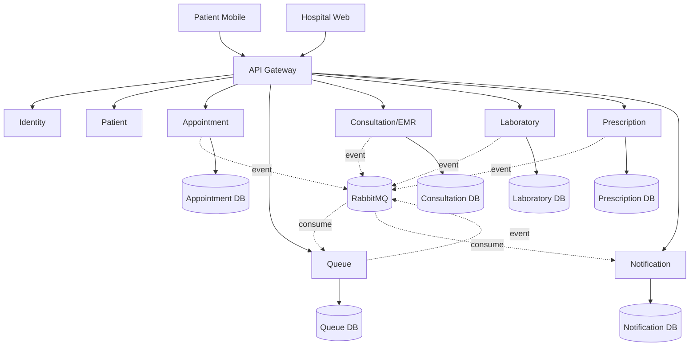
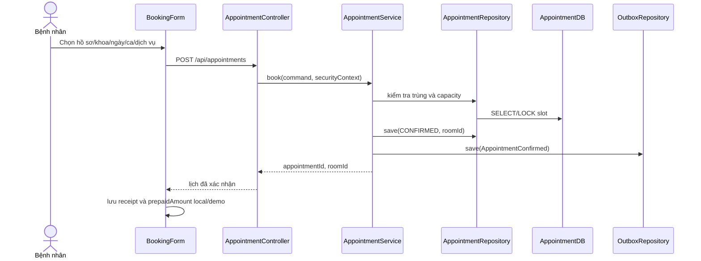
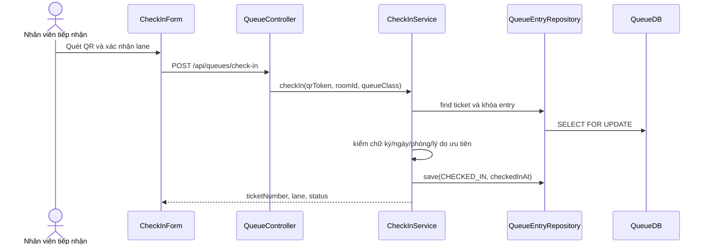
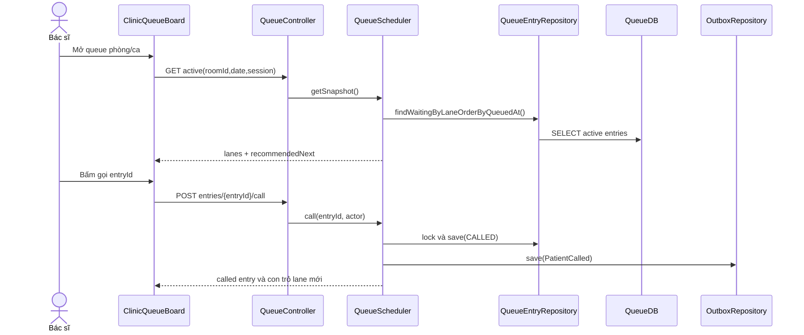
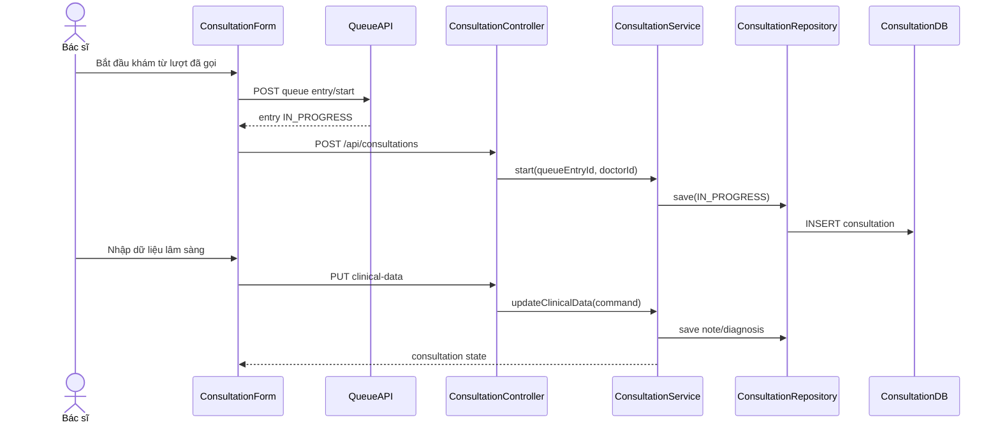
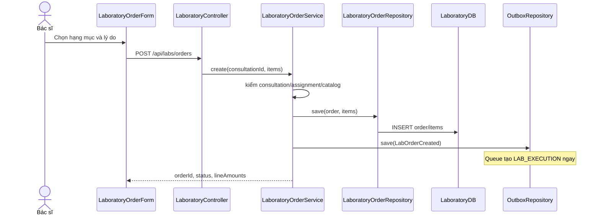
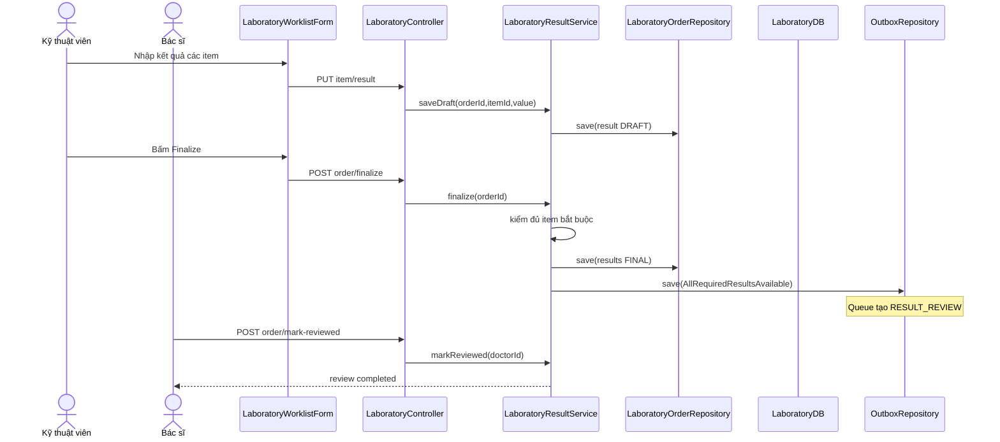
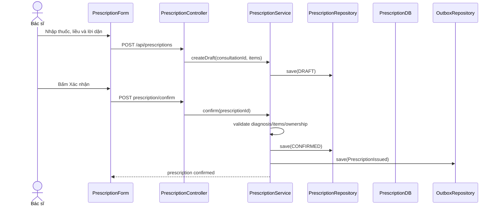
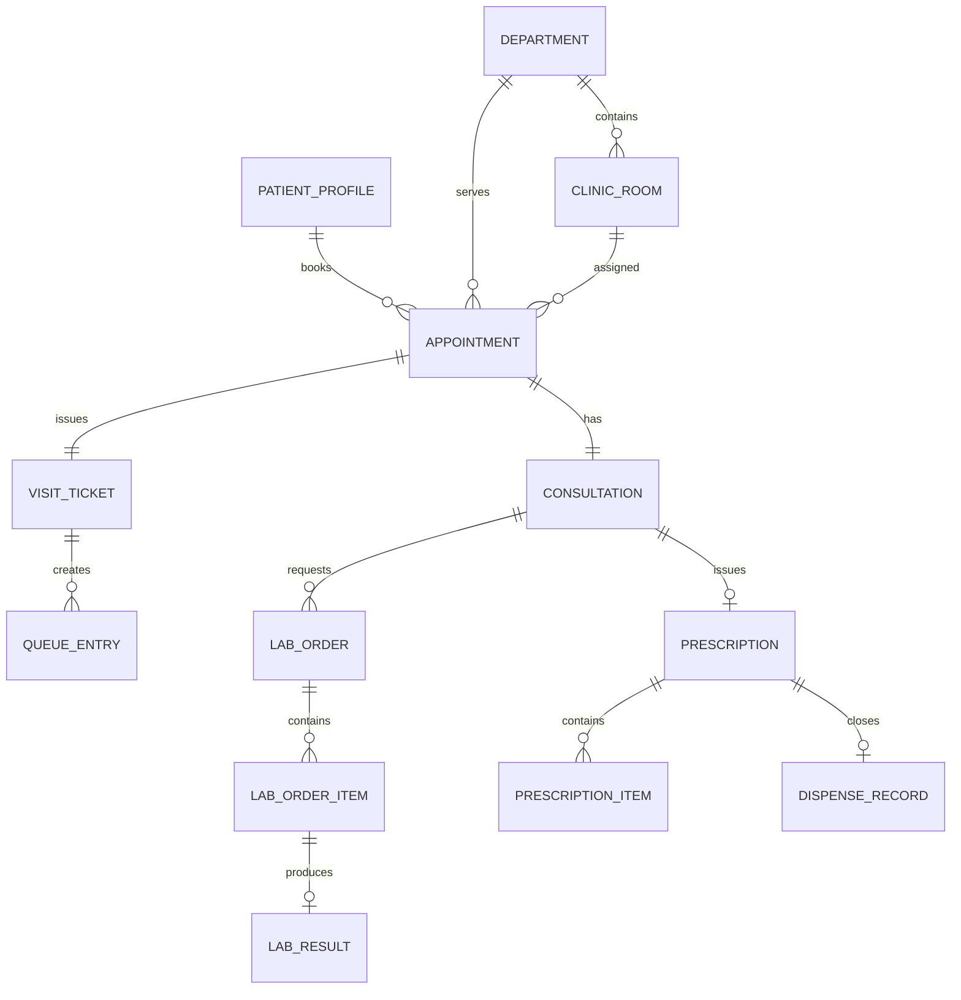

# CHƯƠNG 4. THIẾT KẾ PHẦN MỀM

Chương 3 đã xác định actor, Use Case, tương tác hộp đen, lớp khái niệm và yêu
cầu chất lượng. Chương này chuyển các kết quả đó thành thiết kế hộp trắng. Mỗi
Use Case cốt lõi được trình bày theo ba lớp Boundary/Interface,
Process/Control và Entity/Data, sau đó được liên kết với database và các cơ chế
đáp ứng yêu cầu chất lượng.

## 4.1. Thiết kế kiến trúc

### 4.1.1. Layering – Phân tầng

| Tầng | Thành phần CareFlow | Trách nhiệm |
|---|---|---|
| Boundary/Interface | Patient Mobile, Hospital Web, REST Controller, WebSocket endpoint | thu thập input, validation định dạng, hiển thị output và lỗi |
| Process/Control | Application Service, domain service, scheduler, event consumer/publisher | điều phối Use Case, quyền, transaction và state transition |
| Entity/Data | Aggregate, value object, JPA entity, repository và PostgreSQL | giữ dữ liệu, quan hệ, bất biến và lịch sử |

Giao diện không tự quyết định trạng thái nghiệp vụ; Controller không chứa thuật
toán queue; Repository không phát event. Việc phân tầng giúp cùng một Use Case
có thể được gọi từ Mobile hoặc Web mà vẫn dùng chung quy tắc miền.

### 4.1.2. Segmentation – Phân vùng

Hệ thống được phân vùng theo năng lực nghiệp vụ thay vì theo bảng dữ liệu dùng
chung:

| Phân vùng | Aggregate sở hữu | Trách nhiệm |
|---|---|---|
| Identity & Access | User, Role, RefreshToken | xác thực và security context |
| Patient | Patient, PatientProfile | hồ sơ và quyền sở hữu |
| Appointment | Department, ClinicRoom, Appointment, Slot | lịch, capacity và phân phòng |
| Queue | VisitTicket, QueueEntry, QueueSession | check-in, FIFO, Round Robin và gọi lượt |
| Consultation/EMR | Consultation, ClinicalNote, Diagnosis | phiên khám và kết luận |
| Laboratory | LaboratoryOrder, OrderItem, Result | chỉ định, thực hiện và phát hành kết quả |
| Prescription | Prescription, PrescriptionItem, FollowUp | toa, tái khám và dispense |
| Notification | Notification, Device, DeliveryStatus | inbox, WebSocket và trạng thái đọc |

Mỗi phân vùng có database/schema riêng và chỉ trao đổi qua REST hoặc event
contract. `Department 1:N ClinicRoom` thuộc Appointment; Queue chỉ lưu
`roomId` cần thiết để điều phối.

### 4.1.3. Factoring – Thành phần dùng chung

Các thành phần dùng chung chỉ chứa hạ tầng và quy ước, không chứa business rule
của nhiều miền:

- `ApiResponse`/error envelope: mã, thông điệp, dữ liệu và correlation ID;
- `EventEnvelope v1`: `eventId`, `eventType`, `occurredAt`, producer,
  correlation và payload có version;
- `SecurityContext`: trusted user ID, role và claim cần thiết;
- `AuditInformation`: actor, hành động, aggregate, thời điểm và lý do;
- idempotency key, clock và quy ước UTC;
- thư viện logging/observability và test fixture contract.

Queue Scheduler, capacity rule hoặc prescription validation không được đưa vào
shared library vì đó là nghiệp vụ thuộc service sở hữu.

### 4.1.4. Kiến trúc Microservices tổng thể



REST xử lý lệnh/truy vấn cần phản hồi ngay. RabbitMQ truyền sự thật đã xảy ra;
producer ghi outbox cùng transaction và consumer xử lý idempotent. Notification
đẩy STOMP/WebSocket đến client đang kết nối; REST vẫn là nguồn tải lại. Gateway
thực hiện routing, JWT boundary, CORS và correlation ID; service tiếp tục kiểm
tra role, ownership và assignment của resource.

## 4.2. Thiết kế chi tiết theo từng Use Case

Hai giai đoạn thanh toán của Chương 3 dùng cùng nguyên tắc tự chi trả: phí khám
được ghi nhận trước trong `AppointmentPaymentReceipt`, sau đó
`VisitSettlement` tổng hợp toàn bộ chi phí để quyết toán cuối lượt. Laboratory
Order chỉ cung cấp chi phí hạng mục và không chặn việc tạo lượt thực hiện. Thu
ngân/hệ thống viện phí production là external boundary, không tạo một Payment
microservice hay sổ kế toán trong CareFlow MVP.

### 4.2.1. `UC-APT-02` — Đặt lịch khám

| Lớp | Thiết kế |
|---|---|
| Boundary – `BookingForm` | Actor: Bệnh nhân. Control: chọn hồ sơ, khoa, ngày, ca, dịch vụ và phương thức phí khám; nút “Xác nhận đặt lịch”. Input: `patientProfileId`, `department`, `date`, `timeSlot`, `serviceCode`. Output: lịch, phòng, phiếu/QR và receipt Mobile; `CASH_AT_HOSPITAL` hiển thị còn phải nộp tại bước tiếp nhận. |
| Process – Appointment API | `GET /api/appointments/departments`, `GET /api/appointments/time-slots`, `POST /api/appointments`. `AppointmentApplicationService` kiểm ownership, slot/capacity, truy vấn phòng active, tạo Appointment và outbox `AppointmentConfirmed`. |
| Entity/Data | `PatientProfile`, `Department`, `ClinicRoom`, `Appointment`, `OutboxEvent`; unique slot theo chính sách, room phải thuộc department. `AppointmentPaymentReceipt` nằm ở local adapter, không thuộc Appointment DB. |



### 4.2.2. `UC-QUE-02` — Check-in bằng QR

| Lớp | Thiết kế |
|---|---|
| Boundary – `CheckInForm` | Actor: Nhân viên tiếp nhận. Control: camera/ô QR, phòng, loại `NORMAL/PRIORITY`, lý do ưu tiên và nút xác nhận. Output: số vé, lane và trạng thái check-in. |
| Process – Queue API | `POST /api/queues/check-in`. `CheckInService` xác minh chữ ký QR, ngày, ticket, room, role và `priorityReasonCode`; chuyển entry sang `CHECKED_IN` và tạo outbox. |
| Entity/Data | `VisitTicket`, `QueueEntry`, `QueueAudit`, `OutboxEvent`; một ticket chỉ check-in một lần, QR không chứa PII/bệnh án. |



### 4.2.3. `UC-QUE-04` — Theo dõi, đề xuất và gọi lượt

| Lớp | Thiết kế |
|---|---|
| Boundary – `ClinicQueueBoard` | Actor: Bác sĩ. Ba cột `PRIORITY`, `NORMAL`, `RESULT_REVIEW`; badge `recommendedNext`; nút Gọi, Gọi lại, Lỡ lượt và Xếp lại. Input: room/date/session/entry. Output: snapshot và trạng thái gọi. |
| Process – Queue API | `GET /api/appointments/clinical-context/me`, `GET /api/queues/rooms/{roomId}/active`, `POST /api/queues/entries/{entryId}/call`, `POST .../call-next`. `QueueScheduler` tính Round Robin 1:1:1; `CallQueueEntryService` khóa entry, kiểm assignment và cập nhật `lastServedLane`. |
| Entity/Data | `QueueEntry`, `QueueSession`, `QueueAudit`, `ProcessedEvent`; FIFO theo `queuedAt`, optimistic version/lock ngăn gọi trùng. |



### 4.2.4. `UC-CON-01` — Bắt đầu và thực hiện phiên khám

| Lớp | Thiết kế |
|---|---|
| Boundary – `ConsultationForm` | Actor: Bác sĩ. Control: sinh hiệu, triệu chứng, khám thực thể, chẩn đoán sơ bộ, nút Lưu, Chỉ định, Chờ kết quả và Hoàn tất. |
| Process – Consultation API | `POST /api/queues/entries/{entryId}/start`, `POST /api/consultations`, `PUT /api/consultations/{id}/clinical-data`, `POST .../wait-for-results`, `POST .../complete`. Service kiểm queue state, doctor assignment và transition. |
| Entity/Data | `Consultation`, `ClinicalNote`, `Diagnosis`, `Amendment`, `OutboxEvent`; consultation liên kết một appointment và bác sĩ phụ trách. |



### 4.2.5. `UC-LAB-01` — Tạo chỉ định cận lâm sàng

| Lớp | Thiết kế |
|---|---|
| Boundary – `LaboratoryOrderForm` | Actor: Bác sĩ. Control: danh mục hạng mục, lý do, ghi chú, ưu tiên chuyên môn và nút Tạo chỉ định. Output: order, chi phí từng hạng mục và điểm phục vụ. |
| Process – Laboratory API | `POST /api/labs/orders`. `CreateLaboratoryOrderService` kiểm consultation, doctor assignment, item trùng và catalog; tạo order/items rồi phát event để Queue tạo `LAB_EXECUTION` ngay khi order hợp lệ. |
| Entity/Data | `LaboratoryOrder`, `LaboratoryOrderItem`, `OutboxEvent`; item thuộc đúng order, có trạng thái, đơn giá và thành tiền riêng. |



### 4.2.6. `UC-LAB-03` — Thực hiện, phát hành và đọc kết quả

| Lớp | Thiết kế |
|---|---|
| Boundary – `LaboratoryWorklistForm` và `ResultReviewForm` | Actor: Kỹ thuật viên/Bác sĩ. Control: queue điểm phục vụ, gọi/bắt đầu, ô kết quả item, tệp đính kèm, Finalize; phía bác sĩ có bảng kết quả và nút Đã đọc. |
| Process – Queue/Laboratory/Consultation API | Queue active/call/start; `POST /api/labs/orders/{id}/start`, `PUT .../items/{itemId}/result`, `POST .../finalize`, `POST .../mark-reviewed`, Consultation `resume`. Finalize chỉ phát event khi đủ item bắt buộc. |
| Entity/Data | `QueueEntry(LAB_EXECUTION/RESULT_REVIEW)`, `LaboratoryOrder`, `OrderItem`, `LaboratoryResult`, `ResultCorrection`, `Consultation`; FINAL không bị ghi đè trực tiếp. |



### 4.2.7. `UC-PRE-01` — Kê toa, hẹn tái khám và hoàn tất

| Lớp | Thiết kế |
|---|---|
| Boundary – `PrescriptionForm` | Actor: Bác sĩ. Control: thuốc, hàm lượng, liều, số lượng, cách dùng, lời dặn, ngày tái khám; nút Lưu nháp/Xác nhận/Hoàn tất. |
| Process – Prescription/Appointment/Consultation API | `POST /api/prescriptions`, `PUT /api/prescriptions/{id}`, `POST .../confirm`, `POST /api/appointments/follow-ups`, `POST /api/consultations/{id}/complete`. Confirm phát `PrescriptionIssued`. |
| Entity/Data | `Prescription`, `PrescriptionItem`, `FollowUpAppointment`, `Consultation`, `OutboxEvent`; toa CONFIRMED chỉ sửa bằng amendment/correction có audit. |



### 4.2.8. `UC-PHA-01` — Gọi lượt và phát thuốc

| Lớp | Thiết kế |
|---|---|
| Boundary – `PharmacyQueueForm` | Actor: Nhân viên cấp phát. Control: FIFO queue, số đang gọi, thông tin toa, tổng chi phí, khoản trả trước, còn phải trả/cần hoàn, trạng thái quyết toán và nút Gọi/Bắt đầu/Xác nhận đã phát. |
| Process – Queue/Prescription/Settlement adapter | Queue service-point active/call/start; adapter tính `amountDue`/`refundDue`; `POST /api/prescriptions/{id}/dispense`. Service kiểm assignment, queue đang phục vụ, toa CONFIRMED, chưa phát và settlement không còn `PAYMENT_DUE`; phát `PrescriptionDispensed`. |
| Entity/Data | `QueueEntry(PHARMACY_DISPENSING)`, `Prescription`, `VisitSettlement`, `DispenseRecord`, `QueueAudit`, `OutboxEvent`; một toa chỉ có một dispense thành công; số tiền không âm. |

Quyết toán cuối lượt được thực hiện trước khi xác nhận cấp phát. Adapter tính
`amountDue = max(0, totalVisitCost - prepaidAmount)` và
`refundDue = max(0, prepaidAmount - totalVisitCost)`. `PAYMENT_DUE` phải chuyển
sang `SETTLED` sau khi thu đủ; `REFUND_PENDING` có thể chuyển sang `REFUNDED`
nhưng không chặn phát thuốc. Dữ liệu demo này không thuộc Prescription DB.

```mermaid
sequenceDiagram
    actor NV as Nhân viên cấp phát
    participant F as PharmacyQueueForm
    participant Q as QueueAPI
    participant V as VisitSettlementAdapter
    participant C as PrescriptionController
    participant S as DispensePrescriptionService
    participant R as PrescriptionRepository
    participant DB as PrescriptionDB
    participant O as OutboxRepository
    NV->>F: Chọn đầu FIFO và bấm Gọi
    F->>Q: POST queue entry/call và start
    Q-->>F: entry IN_PROGRESS
    F->>V: calculate(totalVisitCost, prepaidAmount)
    V-->>F: amountDue, refundDue, status
    alt status = PAYMENT_DUE
        NV->>F: Xác nhận đã thu phần còn thiếu
        F->>V: markSettled()
        V-->>F: SETTLED
    else status = REFUND_PENDING
        Note over F,V: Ghi nhận khoản cần hoàn; không chặn dispense
    end
    NV->>F: Đối chiếu và xác nhận đã phát
    F->>C: POST prescription/dispense
    C->>S: dispense(prescriptionId, queueEntryId, actor)
    S->>R: lock prescription
    R->>DB: SELECT FOR UPDATE
    S->>S: kiểm CONFIRMED/chưa phát/đúng queue/không PAYMENT_DUE
    S->>R: save(DISPENSED, dispenseRecord)
    S->>O: save(PrescriptionDispensed)
    S-->>F: dispense completed
```

## 4.3. Thiết kế cơ sở dữ liệu

### 4.3.1. Database per Service

| Database/schema | Bảng chính | Dữ liệu không được sở hữu |
|---|---|---|
| Patient DB | patient, patient_profile | appointment, clinical result |
| Appointment DB | department, clinic_room, appointment, slot, outbox_event | queue state, clinical note |
| Queue DB | visit_ticket, queue_entry, queue_session, queue_audit, processed_event | diagnosis, prescription item |
| Consultation DB | consultation, clinical_note, diagnosis, amendment | slot/capacity, queue scheduler |
| Laboratory DB | lab_order, lab_order_item, lab_result, result_correction | consultation note đầy đủ |
| Prescription DB | prescription, prescription_item, dispense_record, follow_up | queue ordering |
| Notification DB | notification, device, delivery_attempt, processed_event | trạng thái nguồn của domain khác |

Định danh xuyên service được lưu dưới dạng ID tham chiếu và kiểm tra qua
contract/event; không tạo foreign key xuyên database. `AppointmentPaymentReceipt`
và `VisitSettlement` của MVP nằm ở adapter local/demo nên chưa tạo bảng payment
production trong các database trên.

### 4.3.2. ERD hoặc Class-to-Table



ERD trên là mô hình quan hệ logic xuyên hành trình. Khi triển khai, các quan hệ
xuyên service dùng ID/event thay cho foreign key vật lý.

### 4.3.3. Chuẩn hóa và mô tả bảng

Các bảng được chuẩn hóa tối thiểu đến 3NF: dữ liệu khoa/phòng không lặp trong
mọi appointment; dòng thuốc tách khỏi prescription; result tách theo order item;
audit và outbox tách khỏi aggregate nhưng cùng transaction.

| Bảng | Khóa/thuộc tính chính | Ràng buộc nghiệp vụ |
|---|---|---|
| `clinic_room` | id, department_id, code, active | phòng thuộc đúng một khoa; code duy nhất trong khoa |
| `appointment` | id, patient_id, department_id, room_id, visit_date, slot, status | room thuộc department; không vượt capacity |
| `queue_entry` | id, ticket_id, service_point_id, queue_type, phase, status, queued_at, version | không tạo phase trùng; version chống gọi đồng thời |
| `consultation` | id, appointment_id, doctor_id, status | một phiên chính cho hành trình; review nối phiên cũ |
| `lab_order_item` | id, order_id, service_code, required, status | item thuộc order; required phải FINAL trước hoàn tất |
| `prescription_item` | id, prescription_id, medicine_code, dose, quantity | quantity/liều hợp lệ; thuộc đúng toa |
| `dispense_record` | id, prescription_id, queue_entry_id, actor_id, dispensed_at | unique prescription và queue entry |

### 4.3.4. Repository và truy vấn dữ liệu

| Repository/truy vấn | Mục đích | Chỉ mục hỗ trợ |
|---|---|---|
| `AppointmentRepository.findAvailability` | tính slot/capacity theo khoa/ngày | `(department_id, visit_date, status)` |
| `ClinicRoomRepository.findActiveByDepartment` | suy ra phòng khi đặt lịch | `(department_id, active)` |
| `QueueEntryRepository.findActiveByLane` | đọc FIFO từng lane | `(service_point_id, date, phase, status, queued_at)` |
| `QueueEntryRepository.lockById` | gọi lượt nguyên tử | primary key + version/row lock |
| `LaboratoryOrderRepository.findByConsultation` | đọc order và item của phiên | `(consultation_id, status)` |
| `NotificationRepository.findInbox` | inbox/unread theo người nhận | `(recipient_id, read, created_at)` |

Repository trả aggregate hoặc projection cần thiết, không trả JPA entity trực
tiếp ra Controller.

### 4.3.5. Stored Procedure nếu thực tế có sử dụng

CareFlow không dùng Stored Procedure cho business rule của MVP. State
transition, authorization và outbox cần nằm trong application transaction để
có cùng cách kiểm thử và audit. Báo cáo không tự tạo procedure chỉ để đủ đề mục.

### 4.3.6. Trigger, constraint và migration

Flyway quản lý migration có version. Database dùng primary/foreign key trong
cùng service, unique, check constraint, not-null và optimistic version. Trigger
chỉ được dùng cho audit kỹ thuật nếu cần bảo vệ dữ liệu trước nhiều client;
không dùng trigger để gọi service khác hoặc phát RabbitMQ event.

Các transaction quan trọng gồm:

- giữ capacity, tạo Appointment và ghi outbox;
- check-in/gọi lượt, cập nhật QueueSession và ghi audit/outbox;
- finalize đủ kết quả và ghi event;
- xác nhận toa/dispense và ghi outbox.

Consumer lưu `processed_event(event_id)` để message at-least-once không tạo dữ
liệu trùng.

## 4.4. Thiết kế đáp ứng yêu cầu chất lượng

| Yêu cầu | Quyết định thiết kế |
|---|---|
| Xác thực/phân quyền | JWT tại Gateway; service kiểm role, ownership và assignment |
| Bảo vệ dữ liệu y tế | DTO tối thiểu, QR ký số không chứa PII, TLS khi triển khai, không đưa clinical data vào queue snapshot |
| Công bằng queue | FIFO từng lane, Round Robin 1:1:1, bỏ qua lane rỗng, bác sĩ chủ động gọi |
| Đồng thời | row lock/optimistic version trên Queue Entry, Queue Session, capacity và Prescription |
| Tin cậy event | transactional outbox, retry/backoff, dead-letter, idempotent consumer |
| Truy vết | correlation ID, audit actor/thời điểm/lý do, correction thay vì ghi đè |
| Realtime và mất mạng | WebSocket cập nhật nhanh; REST/inbox lưu bền vững để tải lại |
| Khả năng mở rộng | `Department 1:N ClinicRoom`, database per service và contract versioning |
| Payment MVP | receipt phí khám trả trước và quyết toán cuối lượt ở adapter local/demo; không thanh toán riêng cho Lab và không tạo Payment microservice production |

## 4.5. Truy vết từ phân tích sang thiết kế

| Use Case Chương 3 | Thiết kế Chương 4 | Nhóm kiểm thử Chương 6 |
|---|---|---|
| UC-APT-02 | 4.2.1, Appointment/ClinicRoom DB | unit capacity, functional booking, API ownership |
| UC-QUE-02 | 4.2.2, VisitTicket/QueueEntry | QR, idempotency và wrong-room |
| UC-QUE-04 | 4.2.3, QueueScheduler/QueueSession | FIFO, Round Robin và concurrency |
| UC-CON-01 | 4.2.4, Consultation state | transition và assignment |
| UC-LAB-01 | 4.2.5, Laboratory Order | order validation và event tạo queue |
| UC-LAB-03 | 4.2.6, Result/RESULT_REVIEW | partial/final result và correction |
| UC-PRE-01 | 4.2.7, Prescription/FollowUp | confirmation, amendment và event |
| UC-PHA-01 | 4.2.8, VisitSettlement/DispenseRecord | công thức quyết toán, refund, FIFO, đối chiếu và chống phát hai lần |

## 4.6. Kết luận chương

Chương 4 đã thiết kế CareFlow theo Layering, Segmentation và Factoring; đồng
thời cụ thể hóa từng Use Case bằng Form, API/Service, Entity/Data và Sequence
Diagram hộp trắng. Thiết kế database và yêu cầu chất lượng tạo đầu vào trực tiếp
cho phần hiện thực ở Chương 5 và Test Case ở Chương 6.
