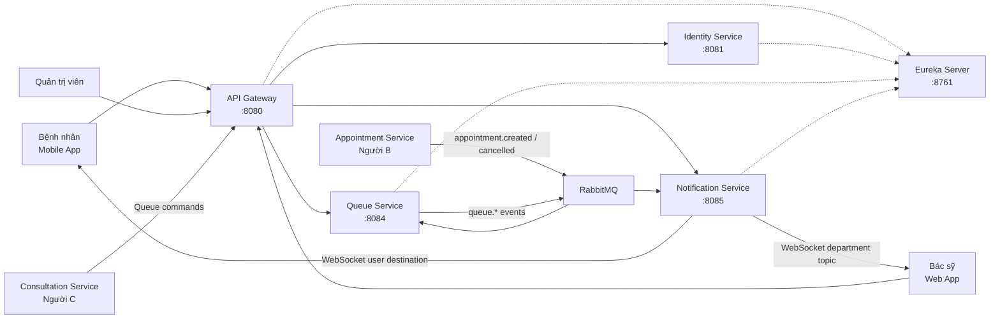
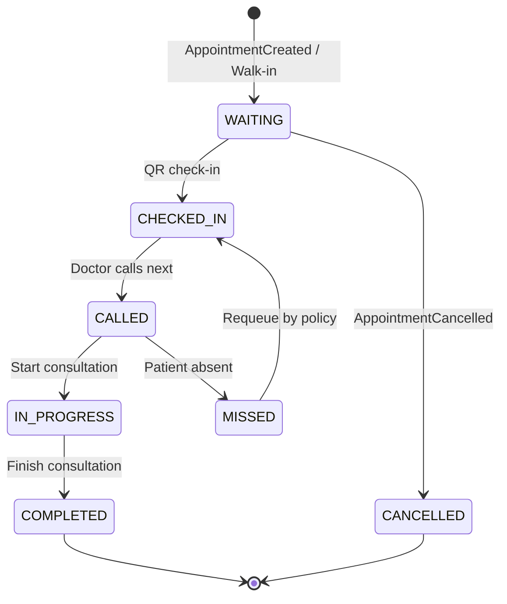
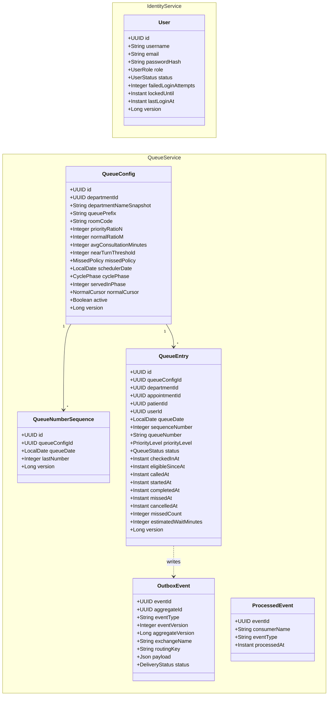
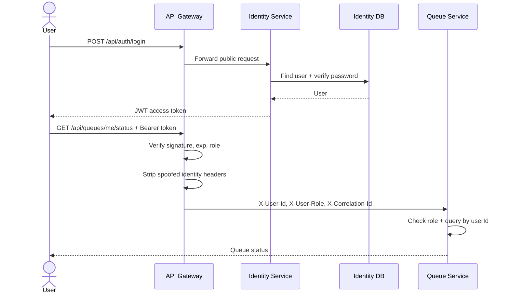
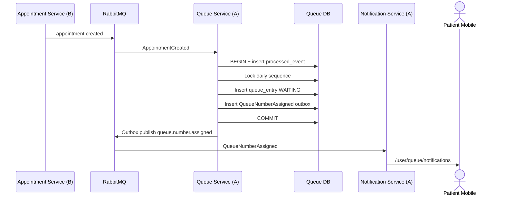
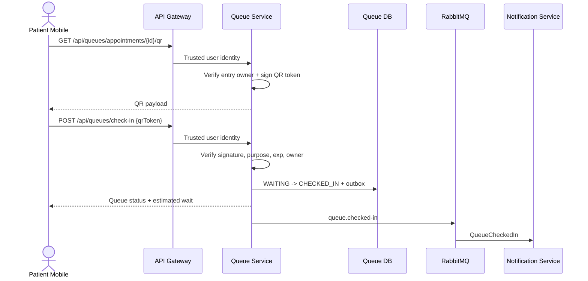
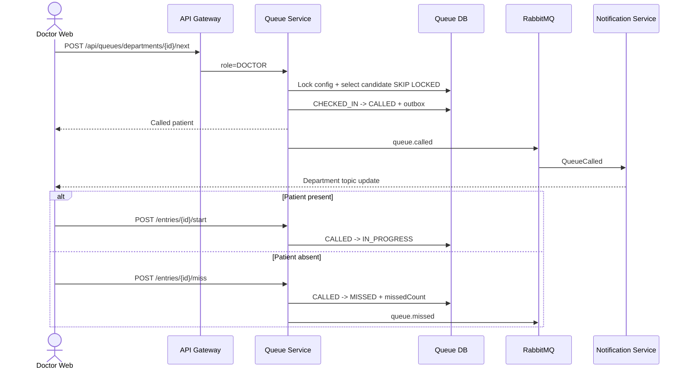

# Phân tích và Thiết kế OOAD - Phân hệ Hệ thống (Người A)

> Tài liệu phân tích và thiết kế hướng đối tượng cho phần việc của Người A trong dự án CareFlow.
>
> **Trạng thái:** Thiết kế mục tiêu để triển khai. Source hiện tại mới ở mức skeleton service; các API, bảng và event trong tài liệu này chưa được xem là đã code xong.

## Phạm vi

| Mục | Chi tiết |
|-----|----------|
| **Phân hệ** | Core System / Infrastructure |
| **Service sở hữu** | API Gateway, Identity & Auth, Queue Management, Notification |
| **Hạ tầng sở hữu** | Eureka Server, RabbitMQ, Docker Compose, common library |
| **Database** | `careflow_identity`, `careflow_queue` |
| **Frontend** | Không có UI riêng; cung cấp API/WebSocket cho Mobile của B và Web của C |
| **Điểm nhấn** | Hàng đợi đa ưu tiên P0-P3, xen kẽ N:M, QR check-in, thông báo real-time |
| **Không thuộc A** | Patient, Appointment, EMR, Consultation, Prescription, Lab, AI |
| **DBML** | [careflow-person-a.dbml](docs/database/careflow-person-a.dbml) |

### Service và cổng

| Thành phần | Cổng | Persistence | Vai trò |
|------------|------|-------------|---------|
| Eureka Server | `8761` | Không | Service discovery |
| API Gateway | `8080` | Không | Entry point, routing, JWT filter, correlation ID |
| Identity Service | `8081` | `careflow_identity` | Đăng ký, đăng nhập, tài khoản, JWT |
| Queue Service | `8084` | `careflow_queue` | Số thứ tự, check-in, gọi lượt, N:M |
| Notification Service | `8085` | Không | RabbitMQ -> WebSocket/STOMP |
| RabbitMQ | `5672` / `15672` | Broker | Event-driven integration |

---

# PHASE 1: PHÂN TÍCH

## 1.1 Bối cảnh và ranh giới hệ thống



### Ranh giới ownership

| Dữ liệu / hành vi | Service sở hữu | A được làm gì |
|-------------------|----------------|---------------|
| Tài khoản, mật khẩu, role | Identity | Toàn quyền |
| Hồ sơ bệnh nhân | Patient (B) | Chỉ dùng `userId`/`patientId` theo contract |
| Lịch hẹn, chuyên khoa, ca khám | Appointment (B) | Nhận snapshot qua event, không sửa DB của B |
| Trạng thái hàng đợi | Queue | Toàn quyền |
| Chẩn đoán và buổi khám | Consultation (C) | Nhận command bắt đầu/kết thúc hàng đợi |
| Thông báo real-time | Notification | Push dữ liệu, không phải source of truth |

> [!IMPORTANT]
> `patient_id`, `appointment_id` và `department_id` trong Queue DB là **logical reference**. Không tạo foreign key sang database của B/C.

## 1.2 Actor

| Actor | Loại | Mô tả | Service tương tác |
|-------|------|-------|-------------------|
| **Bệnh nhân** | Primary | Đăng ký/đăng nhập, lấy QR, check-in, theo dõi lượt | Gateway, Identity, Queue, Notification |
| **Bác sỹ** | Primary | Xem hàng chờ, gọi tiếp theo, đánh dấu lỡ lượt, bắt đầu/kết thúc khám | Gateway, Queue, Notification |
| **Quản trị viên** | Primary | Quản lý tài khoản/cấu hình; kiêm tiếp nhận P0/P1/P3 trong MVP | Identity, Queue |
| **Appointment Service** | Secondary system | Phát event tạo/hủy lịch | Queue qua RabbitMQ |
| **Consultation Service** | Secondary system | Gọi API bắt đầu/kết thúc lượt khám | Queue qua Gateway |
| **RabbitMQ** | Supporting system | Giao event bền vững giữa các service | Queue, Notification |
| **Eureka** | Supporting system | Đăng ký và tìm service | Tất cả backend service |

## 1.3 Danh sách Use Case

### API Gateway

| Mã | Use Case | Actor | Ưu tiên |
|----|----------|-------|---------|
| UC-G01 | Route request tới đúng service | Mọi client | P0 |
| UC-G02 | Xác thực JWT và truyền trusted identity headers | Mọi client | P0 |
| UC-G03 | Tạo/lan truyền correlation ID | Mọi request | P1 |
| UC-G04 | Health check và route discovery | Hệ thống | P1 |

### Identity & Auth

| Mã | Use Case | Actor | Ưu tiên |
|----|----------|-------|---------|
| UC-I01 | Đăng ký tài khoản bệnh nhân | Bệnh nhân | P0 |
| UC-I02 | Đăng nhập và nhận JWT | Bệnh nhân/Bác sỹ/Admin | P0 |
| UC-I03 | Xem thông tin tài khoản hiện tại | Người dùng đã đăng nhập | P0 |
| UC-I04 | Khóa/mở khóa tài khoản | Admin | P1 |

### Queue Management

| Mã | Use Case | Actor | Ưu tiên |
|----|----------|-------|---------|
| UC-Q01 | Nhận lịch hẹn và cấp số thứ tự | Appointment Service | P0 |
| UC-Q02 | Nhận hủy lịch và hủy queue entry | Appointment Service | P0 |
| UC-Q03 | Sinh và xác thực QR check-in | Bệnh nhân | P0 |
| UC-Q04 | Theo dõi trạng thái hàng đợi của tôi | Bệnh nhân | P0 |
| UC-Q05 | Xem dashboard hàng chờ theo khoa | Bác sỹ | P0 |
| UC-Q06 | Gọi bệnh nhân tiếp theo theo N:M | Bác sỹ | P0 |
| UC-Q07 | Đánh dấu lỡ lượt và xếp lại | Bác sỹ | P0 |
| UC-Q08 | Bắt đầu/kết thúc lượt khám | Bác sỹ/Consultation Service | P0 |
| UC-Q09 | Cấu hình tỉ lệ, thời gian và chính sách lỡ lượt | Admin | P1 |
| UC-Q10 | Tiếp nhận thủ công ca cấp cứu/ưu tiên/walk-in | Admin | P0 |

### Notification

| Mã | Use Case | Actor | Ưu tiên |
|----|----------|-------|---------|
| UC-N01 | Kết nối WebSocket có xác thực | Bệnh nhân/Bác sỹ | P0 |
| UC-N02 | Gửi số thứ tự và thời gian chờ | Queue Service | P0 |
| UC-N03 | Gửi thông báo check-in/gọi/lỡ lượt | Queue Service | P0 |
| UC-N04 | Khôi phục trạng thái sau reconnect | Client + Queue API | P1 |

## 1.4 Đặc tả Use Case chính

### UC-I01: Đăng ký tài khoản bệnh nhân

| Mục | Chi tiết |
|-----|----------|
| **Actor** | Bệnh nhân |
| **Tiền điều kiện** | Chưa đăng nhập |
| **Hậu điều kiện** | Một `User` role `PATIENT`, status `ACTIVE` được tạo |
| **Endpoint** | `POST /api/auth/register` |

**Luồng chính:**

1. Client gửi username, email và password.
2. Identity chuẩn hóa username/email và validate password.
3. Kiểm tra username/email chưa tồn tại.
4. Hash password bằng BCrypt hoặc Argon2.
5. Tạo tài khoản với role cố định `PATIENT`.
6. Trả `201 Created`; bệnh nhân tiếp tục tạo Patient Profile ở service của B.

**Ngoại lệ:**

- Username/email trùng: `409 Conflict`.
- Dữ liệu hoặc password không đạt policy: `400 Bad Request`.
- Public register gửi role `DOCTOR`/`ADMIN`: bỏ qua hoặc từ chối; không cho tự nâng quyền.

### UC-I02: Đăng nhập và nhận JWT

| Mục | Chi tiết |
|-----|----------|
| **Actor** | Bệnh nhân, Bác sỹ, Admin |
| **Tiền điều kiện** | Tài khoản tồn tại và không bị vô hiệu hóa |
| **Hậu điều kiện** | Trả access token; cập nhật `last_login_at` |
| **Endpoint** | `POST /api/auth/login` |

**Luồng chính:**

1. Tìm tài khoản bằng username hoặc email đã chuẩn hóa.
2. Kiểm tra `status` và `locked_until`.
3. So khớp password hash.
4. Reset `failed_login_attempts`, cập nhật `last_login_at`.
5. Ký JWT bằng secret từ environment.
6. Trả token, thời hạn và thông tin user tối thiểu.

**Ngoại lệ:**

- Sai thông tin: trả `401` với thông báo chung, không tiết lộ username có tồn tại.
- Sai nhiều lần: tăng counter; có thể khóa tạm 15 phút sau 5 lần.
- `DISABLED`: `403 Forbidden`.

### UC-G02: Xác thực request tại Gateway

| Mục | Chi tiết |
|-----|----------|
| **Actor** | Mọi client |
| **Tiền điều kiện** | Request đi qua Gateway |
| **Hậu điều kiện** | Request hợp lệ được route kèm trusted headers |

**Luồng chính:**

1. Gateway cho phép public path: `/api/auth/register`, `/api/auth/login`, health.
2. Với protected path, lấy Bearer token.
3. Verify chữ ký, issuer, `exp` và role.
4. Xóa mọi `X-User-Id`, `X-User-Role` do client tự gửi.
5. Gắn `X-User-Id` từ JWT `sub`, `X-User-Role` và `X-Correlation-Id`.
6. Route bằng Eureka service ID.

> Gateway là lớp kiểm tra đầu tiên. Service đích vẫn phải kiểm tra role và ownership cho hành vi nhạy cảm.

### UC-Q01: Nhận lịch hẹn và cấp số thứ tự

| Mục | Chi tiết |
|-----|----------|
| **Actor** | Appointment Service |
| **Trigger** | Event `AppointmentCreated` |
| **Tiền điều kiện** | Khoa có `QueueConfig` active |
| **Hậu điều kiện** | Có một `QueueEntry` và event `QueueNumberAssigned` |

**Luồng transaction:**

1. Consumer validate event envelope/version.
2. Insert `processed_events(eventId, consumerName)`.
3. Nếu khóa đã tồn tại, ACK và kết thúc; không cấp số lần hai.
4. Tìm QueueConfig theo `departmentId`.
5. Khóa `queue_number_sequences` theo config và ngày.
6. Tăng `last_number`, tạo `queueNumber = prefix + number`.
7. Tạo QueueEntry status `WAITING`, priority `APPOINTMENT`.
8. Ghi `QueueNumberAssigned` vào `outbox_events`.
9. Commit; outbox publisher gửi event sau commit.

**Ngoại lệ:**

- Không có config active: retry hữu hạn rồi DLQ.
- Appointment đã có queue entry: xử lý idempotent.
- Event thiếu `userId`/`patientId`: DLQ vì không thể gửi notification đúng người.

### UC-Q02: Nhận hủy lịch

1. Consume `AppointmentCancelled` idempotently.
2. Tìm QueueEntry bằng `appointmentId`.
3. Nếu entry đang `WAITING`, chuyển `CANCELLED` và đặt `cancelledAt`.
4. Nếu entry đã `CHECKED_IN`/`CALLED`/`IN_PROGRESS`/`COMPLETED`, ghi log cảnh báo và không đảo trạng thái; việc hủy lịch sau check-in phải được xử lý như ngoại lệ nghiệp vụ ở service của B.
5. Ghi event thông báo vào outbox nếu cần.

### UC-Q10: Tiếp nhận thủ công P0/P1/P3

1. Admin chọn bệnh nhân, khoa và mức `EMERGENCY`, `PRIORITY` hoặc `WALK_IN`.
2. Queue validate patient/user ID theo request; không cho client tạo mức `APPOINTMENT` bằng API này.
3. Khóa daily sequence, cấp `queueNumber`, tạo entry đã `CHECKED_IN` vì bệnh nhân đang có mặt.
4. Đặt `checkedInAt = eligibleSinceAt = now`.
5. Ghi `QueueCheckedIn` vào outbox và trả queue entry cùng số thứ tự trong response.

Trong MVP, role `ADMIN` kiêm nghiệp vụ tiếp nhận/triage. Khi hệ thống cần phân quyền chi tiết hơn, thêm role `RECEPTIONIST`/`TRIAGE` mà không đổi domain Queue.

### UC-Q03: QR check-in

| Mục | Chi tiết |
|-----|----------|
| **Actor** | Bệnh nhân |
| **Tiền điều kiện** | Queue entry thuộc user hiện tại, đúng ngày, status `WAITING` |
| **Hậu điều kiện** | Status `CHECKED_IN` và phát `QueueCheckedIn` |

**Thiết kế QR tối giản:**

- QR là token ký HMAC/JWT chứa `appointmentId`, `userId`, `purpose=QUEUE_CHECK_IN` và `exp`.
- Không lưu bảng QR token trong MVP.
- Replay idempotent: entry đã `CHECKED_IN` trả trạng thái hiện tại, không tạo bản ghi mới.

**Ngoại lệ:**

- Token sai chữ ký/mục đích: `401`.
- Token hết hạn hoặc sai ngày: `422`.
- Token thuộc user khác: `403`.
- Appointment đã hủy: `409`.

### UC-Q04: Theo dõi hàng đợi của tôi

1. Gateway truyền `X-User-Id` từ JWT.
2. Queue tìm entry theo `user_id` và ngày hiện tại.
3. Mô phỏng thứ tự gọi theo N:M để tính vị trí hiệu dụng.
4. Trả số thứ tự, status, vị trí, thời gian chờ, khoa và phòng.

Không nhận `patientId` từ query của Mobile; tránh xem lượt của người khác.

### UC-Q06: Gọi bệnh nhân tiếp theo

| Mục | Chi tiết |
|-----|----------|
| **Actor** | Bác sỹ |
| **Tiền điều kiện** | Role `DOCTOR`, queue config active |
| **Hậu điều kiện** | Đúng một entry chuyển `CHECKED_IN -> CALLED` |

**Luồng transaction:**

1. Khóa QueueConfig để đọc/cập nhật scheduler state.
2. Tìm P0 `EMERGENCY` đã check-in; nếu có luôn chọn ca cũ nhất.
3. Nếu không có P0, chọn theo `cyclePhase`, `servedInPhase` và N:M.
4. Trong nhóm normal, luân phiên `APPOINTMENT` và `WALK_IN` bằng `normalCursor`.
5. Khóa candidate bằng `FOR UPDATE SKIP LOCKED`.
6. Chuyển entry thành `CALLED`, đặt `calledAt`.
7. Cập nhật scheduler state.
8. Ghi `QueueCalled` vào outbox và commit.

Nếu không có bệnh nhân `CHECKED_IN`, trả `204 No Content`.

### UC-Q07: Lỡ lượt và xếp lại

1. Bác sỹ đánh dấu entry `CALLED -> MISSED`.
2. Queue tăng `missedCount`, đặt `missedAt` và phát `QueueMissed`.
3. Khi bệnh nhân quay lại, thực hiện requeue:
   - `REQUEUE_FRONT`: giữ `eligibleSinceAt` ban đầu để trở lại đầu nhóm tương ứng.
   - `REQUEUE_BACK`: đặt `eligibleSinceAt = now` để về cuối nhóm.
   - `REQUIRE_MANUAL`: chỉ Admin/Doctor được xác nhận và phải chọn vị trí `FRONT` hoặc `BACK`.
4. Entry chuyển `MISSED -> CHECKED_IN`; không tạo entry mới và không đổi `queueNumber`.

### UC-Q08: Bắt đầu và kết thúc lượt khám

1. Bắt đầu: `CALLED -> IN_PROGRESS`, đặt `startedAt`.
2. Kết thúc: `IN_PROGRESS -> COMPLETED`, đặt `completedAt`.
3. Tính thời lượng thực tế.
4. Cập nhật `avgConsultationMinutes` từ tối đa 20 entry hoàn thành gần nhất.
5. Phát event để Mobile/Web cập nhật.

### UC-N02/N03: Thông báo real-time

1. Notification kết nối RabbitMQ và bind các routing key `queue.*` cần thiết.
2. Dùng `recipientUserId` để gửi tới `/user/queue/notifications`.
3. Dùng `departmentId` để gửi cập nhật dashboard tới topic bác sỹ.
4. WebSocket chỉ là kênh realtime; Queue API là source of truth.
5. Sau reconnect, client gọi lại Queue API để đồng bộ, không dựa vào message cũ.

## 1.5 Quy tắc nghiệp vụ Queue

### Bốn mức ưu tiên

| Mức | Enum | Ý nghĩa | Quy tắc |
|-----|------|---------|---------|
| P0 | `EMERGENCY` | Cấp cứu | Luôn trước; không làm thay đổi chu kỳ N:M |
| P1 | `PRIORITY` | Người già, trẻ nhỏ, thai phụ, đối tượng ưu tiên | Nhóm priority trong N:M |
| P2 | `APPOINTMENT` | Có lịch hẹn | Nhóm normal, luân phiên P2/P3 |
| P3 | `WALK_IN` | Đến trực tiếp | Nhóm normal, luân phiên P2/P3 |

Chỉ entry status `CHECKED_IN` mới đủ điều kiện cho `call next`.

### Scheduler N:M

Ví dụ N:M = 2:1:

```text
P1, P1, P2, P1, P1, P3, P1, P1, P2, ...
```

Runtime state được lưu trong QueueConfig:

- `schedulerDate`: ngày nghiệp vụ hiện tại của state; đổi ngày thì reset state.
- `cyclePhase`: `PRIORITY` hoặc `NORMAL`.
- `servedInPhase`: số lượt đã phục vụ trong phase hiện tại.
- `normalCursor`: normal tiếp theo ưu tiên P2 hay P3.

```text
function callNext(config):
    lock config

    if config.schedulerDate != businessDate:
        schedulerDate = businessDate
        cyclePhase = PRIORITY
        servedInPhase = 0
        normalCursor = APPOINTMENT

    emergency = oldestCheckedIn(EMERGENCY)
    if emergency exists:
        return call(emergency)       // không đổi N:M state

    if config.cyclePhase == PRIORITY:
        candidate = oldestCheckedIn(PRIORITY)
        if candidate exists:
            servedInPhase += 1
            if servedInPhase == N:
                cyclePhase = NORMAL
                servedInPhase = 0
            return call(candidate)
        cyclePhase = NORMAL
        servedInPhase = 0

    candidate = chooseNormalByCursor(APPOINTMENT, WALK_IN)
    if candidate exists:
        toggle normalCursor
        servedInPhase += 1
        if servedInPhase == M:
            cyclePhase = PRIORITY
            servedInPhase = 0
        return call(candidate)

    // normal trống: quay lại priority, không để queue đứng
    candidate = oldestCheckedIn(PRIORITY)
    if candidate exists:
        cyclePhase = PRIORITY
        servedInPhase = 1
        if servedInPhase == N:
            cyclePhase = NORMAL
            servedInPhase = 0
        return call(candidate)

    return NONE
```

### Bất biến phải giữ

1. Một appointment chỉ có tối đa một queue entry.
2. Một số thứ tự chỉ duy nhất trong một queue/ngày.
3. Hai request `call next` đồng thời không được gọi cùng entry.
4. Event trùng không tạo queue entry hoặc notification domain event lần hai.
5. `EMERGENCY` không bị chặn bởi chu kỳ.
6. Nếu một nhóm trống, scheduler phải phục vụ nhóm còn lại.
7. Candidate trong cùng mức được xếp theo `eligibleSinceAt`, sau đó `sequenceNumber`.
8. `queueNumber` không đổi khi requeue; `positionInQueue` là dữ liệu tính toán, không lưu cố định.

### Ước tính thời gian chờ

```text
estimatedWait =
    remainingCurrentConsultation
    + max(effectivePosition - 1, 0) * avgConsultationMinutes
```

- `effectivePosition` được mô phỏng theo đúng N:M, không chỉ `COUNT(*)`.
- Nếu không biết thời gian còn lại của ca đang khám, dùng một lần average.
- `avgConsultationMinutes` là trung bình của tối đa 20 ca `COMPLETED` gần nhất; mặc định 15 phút khi chưa đủ dữ liệu.

## 1.6 State Machine



Không dùng transition `MISSED -> WAITING` vì bệnh nhân đã check-in tại bệnh viện.

---

# PHASE 2: THIẾT KẾ

## 2.1 Domain Model



### Enum

| Enum | Giá trị |
|------|---------|
| `UserRole` | `PATIENT`, `DOCTOR`, `ADMIN` |
| `UserStatus` | `ACTIVE`, `LOCKED`, `DISABLED` |
| `PriorityLevel` | `EMERGENCY`, `PRIORITY`, `APPOINTMENT`, `WALK_IN` |
| `QueueStatus` | `WAITING`, `CHECKED_IN`, `CALLED`, `IN_PROGRESS`, `COMPLETED`, `MISSED`, `CANCELLED` |
| `MissedPolicy` | `REQUEUE_FRONT`, `REQUEUE_BACK`, `REQUIRE_MANUAL` |
| `CyclePhase` | `PRIORITY`, `NORMAL` |
| `NormalCursor` | `APPOINTMENT`, `WALK_IN` |

## 2.2 Sequence Diagram

### Đăng nhập và gọi protected API



### AppointmentCreated -> cấp số -> notification



### QR check-in



### Gọi tiếp theo và xử lý lỡ lượt



## 2.3 Database Design

Nguồn chi tiết: [docs/database/careflow-person-a.dbml](docs/database/careflow-person-a.dbml).

### Identity DB

| Bảng | Mục đích | Khóa/ràng buộc chính |
|------|----------|-----------------------|
| `identity.users` | Tài khoản, password hash, role, lockout | username/email unique; role/status enum |

### Queue DB

| Bảng | Mục đích | Khóa/ràng buộc chính |
|------|----------|-----------------------|
| `queue.queue_configs` | Cấu hình + runtime scheduler theo khoa/ngày | department unique; N/M > 0 |
| `queue.queue_number_sequences` | Sinh số tăng dần theo queue/ngày | unique config + date |
| `queue.queue_entries` | Trạng thái và thứ tự gọi | appointment nullable unique; queue number unique/ngày |
| `queue.outbox_events` | Publish event tin cậy | eventId PK; retry state |
| `queue.processed_events` | Consumer idempotency | PK eventId + consumerName |

### Transaction quan trọng

| Hành vi | Cùng transaction |
|---------|------------------|
| Nhận AppointmentCreated | processed event + sequence + queue entry + outbox |
| Nhận AppointmentCancelled | processed event + entry CANCELLED + outbox |
| Tiếp nhận P0/P1/P3 | sequence + CHECKED_IN entry + QueueCheckedIn outbox |
| Call next | lock config + lock candidate + CALLED + scheduler state + outbox |
| Check-in | verify token + CHECKED_IN + outbox |
| Complete | COMPLETED + timestamps + average + outbox |

### Vì sao không có thêm bảng?

- Không có `refresh_tokens`: access-token-only đủ cho MVP.
- Không có `qr_tokens`: QR được ký stateless và check-in idempotent.
- Không có `queue_status_history`: timestamp hiện tại đủ cho demo; thêm audit history khi có yêu cầu.
- Notification/Gateway/Eureka không cần database.

## 2.4 API Contract

### Response wrapper

Khớp với `careflow-common/ApiResponse`:

```json
{
  "status": 200,
  "message": "Success",
  "data": {},
  "timestamp": "2026-07-20T03:30:00Z"
}
```

### Identity API

| Method | Path | Role | Mô tả |
|--------|------|------|-------|
| POST | `/api/auth/register` | Public | Đăng ký PATIENT |
| POST | `/api/auth/login` | Public | Nhận access token |
| GET | `/api/auth/me` | Authenticated | Thông tin tài khoản hiện tại |
| PATCH | `/api/users/{id}/status` | ADMIN | Khóa/mở/vô hiệu hóa tài khoản |

**Register request:**

```json
{
  "username": "nguyenvana",
  "email": "vana@example.com",
  "password": "StrongPassword123!"
}
```

**Login response:**

```json
{
  "status": 200,
  "message": "Đăng nhập thành công",
  "data": {
    "accessToken": "jwt",
    "tokenType": "Bearer",
    "expiresInSeconds": 86400,
    "user": {
      "id": "user-uuid",
      "username": "nguyenvana",
      "role": "PATIENT"
    }
  },
  "timestamp": "2026-07-20T03:30:00Z"
}
```

### Queue API

| Method | Path | Role | Mô tả |
|--------|------|------|-------|
| GET | `/api/queues/me/status` | PATIENT | Lượt hiện tại theo JWT userId |
| POST | `/api/queues/entries` | ADMIN | Tiếp nhận thủ công P0/P1/P3 |
| GET | `/api/queues/appointments/{id}/qr` | PATIENT | Sinh QR token cho entry của mình |
| POST | `/api/queues/check-in` | PATIENT | Check-in bằng QR |
| GET | `/api/queues/departments/{id}/dashboard` | DOCTOR, ADMIN | Danh sách hàng chờ |
| POST | `/api/queues/departments/{id}/next` | DOCTOR | Gọi tiếp theo theo N:M |
| POST | `/api/queues/entries/{id}/miss` | DOCTOR | Đánh dấu lỡ lượt |
| POST | `/api/queues/entries/{id}/requeue` | DOCTOR, ADMIN | Xếp lại theo policy |
| POST | `/api/queues/entries/{id}/start` | DOCTOR | Bắt đầu khám |
| POST | `/api/queues/entries/{id}/complete` | DOCTOR | Kết thúc khám |
| GET | `/api/queues/configs/{departmentId}` | ADMIN | Xem cấu hình |
| PUT | `/api/queues/configs/{departmentId}` | ADMIN | Cập nhật N:M/average/policy |

**Check-in request:**

```json
{
  "qrToken": "signed-token"
}
```

**Manual intake request:**

```json
{
  "patientId": "patient-uuid",
  "userId": "user-uuid",
  "departmentId": "department-uuid",
  "priorityLevel": "WALK_IN"
}
```

Chỉ chấp nhận `EMERGENCY`, `PRIORITY` hoặc `WALK_IN`; `APPOINTMENT` phải đi từ event của service B.

**Patient queue status:**

```json
{
  "status": 200,
  "message": "Success",
  "data": {
    "entryId": "queue-entry-uuid",
    "appointmentId": "appointment-uuid",
    "departmentId": "department-uuid",
    "departmentName": "Nội khoa",
    "roomCode": "P302",
    "queueNumber": "NOI-042",
    "priorityLevel": "APPOINTMENT",
    "queueStatus": "CHECKED_IN",
    "effectivePosition": 4,
    "estimatedWaitMinutes": 45
  },
  "timestamp": "2026-07-20T03:30:00Z"
}
```

### Status code

| Code | Khi dùng |
|------|----------|
| `200` | Thành công |
| `201` | Tạo user/config/manual queue entry |
| `204` | Call next nhưng không có candidate |
| `400` | Request/transition không hợp lệ |
| `401` | Thiếu/sai JWT hoặc QR signature |
| `403` | Sai role/ownership |
| `404` | Không tìm thấy user/entry/config |
| `409` | Trùng tài khoản, trạng thái xung đột |
| `422` | QR hết hạn/sai ngày, payload event không hợp lệ |

## 2.5 JWT và Gateway

### JWT claim chuẩn

```json
{
  "sub": "user-uuid",
  "role": "PATIENT",
  "iss": "careflow-identity",
  "jti": "token-uuid",
  "iat": 1784518200,
  "exp": 1784604600
}
```

Không nhét `patientId` hoặc `doctorId` vào token MVP. `sub` là định danh ổn định; Queue nhận `userId` từ AppointmentCreated và lưu trong QueueEntry.

### Route mục tiêu

| Path | Service |
|------|---------|
| `/api/auth/**`, `/api/users/**` | Identity |
| `/api/patients/**` | Patient |
| `/api/appointments/**` | Appointment |
| `/api/queues/**` | Queue |
| `/api/notifications/**`, `/ws/**` | Notification |
| `/api/consultations/**` | Consultation |
| `/api/prescriptions/**` | Prescription |
| `/api/emr/**` | EMR |
| `/api/labs/**` | Lab |
| `/api/ai/**` | AI |

### Trusted headers

| Header | Nguồn | Ý nghĩa |
|--------|-------|---------|
| `X-User-Id` | Gateway từ JWT `sub` | User đang gọi |
| `X-User-Role` | Gateway từ JWT role | Phân quyền |
| `X-Correlation-Id` | Gateway tạo/validate | Trace xuyên service |

Gateway phải xóa giá trị client tự gửi trước khi gắn trusted headers.

## 2.6 Event Design

### Event envelope chung

```json
{
  "eventId": "event-uuid",
  "eventType": "APPOINTMENT_CREATED",
  "eventVersion": 1,
  "aggregateId": "appointment-uuid",
  "aggregateVersion": 1,
  "occurredAt": "2026-07-20T03:30:00Z",
  "producer": "appointment-service",
  "correlationId": "trace-uuid",
  "payload": {}
}
```

### Topology

```mermaid
flowchart LR
    AP["Appointment Service"]
    AX["appointment.exchange<br/>topic"]
    QC["queue.appointment.created"]
    QX["queue.exchange<br/>topic"]
    Q["Queue Service"]
    NQ["notification.queue.events"]
    N["Notification Service"]

    AP -->|"appointment.created / cancelled"| AX
    AX --> QC
    QC --> Q
    Q -->|"queue.number.assigned / checked-in / called / missed"| QX
    QX --> NQ
    NQ --> N
```



### Event matrix

| Event | Exchange | Routing key | Producer | Consumer | Hành vi |
|-------|----------|-------------|----------|----------|---------|
| AppointmentCreated | `appointment.exchange` | `appointment.created` | Appointment B | Queue A | Cấp số |
| AppointmentCancelled | `appointment.exchange` | `appointment.cancelled` | Appointment B | Queue A | Hủy entry |
| QueueNumberAssigned | `queue.exchange` | `queue.number.assigned` | Queue A | Appointment B, Notification A | Confirm + notify |
| QueueCheckedIn | `queue.exchange` | `queue.checked-in` | Queue A | Notification A, Web C | Notify doctor |
| QueueCalled | `queue.exchange` | `queue.called` | Queue A | Notification A | Gọi bệnh nhân |
| QueueMissed | `queue.exchange` | `queue.missed` | Queue A | Notification A | Báo lỡ lượt |
| QueueCompleted | `queue.exchange` | `queue.completed` | Queue A | Notification/Analytics | Kết thúc |

### AppointmentCreated payload bắt buộc

```json
{
  "eventId": "event-uuid",
  "eventType": "APPOINTMENT_CREATED",
  "eventVersion": 1,
  "aggregateId": "appointment-uuid",
  "aggregateVersion": 1,
  "occurredAt": "2026-07-20T03:30:00Z",
  "producer": "appointment-service",
  "correlationId": "trace-uuid",
  "payload": {
    "appointmentId": "appointment-uuid",
    "patientId": "patient-uuid",
    "userId": "user-uuid",
    "departmentId": "department-uuid",
    "departmentName": "Nội khoa",
    "appointmentDate": "2026-07-20",
    "priorityLevel": "APPOINTMENT"
  }
}
```

`userId` là bắt buộc để Notification gửi tới authenticated user destination mà không cần giữ Patient DB.

### QueueCalled payload

```json
{
  "eventId": "event-uuid",
  "eventType": "QUEUE_CALLED",
  "eventVersion": 1,
  "aggregateId": "queue-entry-uuid",
  "aggregateVersion": 4,
  "occurredAt": "2026-07-20T04:10:00Z",
  "producer": "queue-service",
  "correlationId": "trace-uuid",
  "payload": {
    "queueEntryId": "queue-entry-uuid",
    "appointmentId": "appointment-uuid",
    "patientId": "patient-uuid",
    "recipientUserId": "user-uuid",
    "departmentId": "department-uuid",
    "queueNumber": "NOI-042",
    "roomCode": "P302"
  }
}
```

### Delivery rule

1. Queue ghi domain change và outbox trong cùng transaction.
2. Outbox publisher dùng publisher confirm.
3. Consumer manual ACK chỉ sau commit.
4. `processed_events` bảo đảm idempotency theo `eventId + consumerName`.
5. Retry có backoff hữu hạn; lỗi schema/config đi DLQ.
6. Notification không có DB nên WebSocket là best-effort; client reconnect phải gọi Queue API.

### Constant cần bổ sung vào common

Repo đã có exchange chính và các key `appointment.created`, `queue.number.assigned`, `queue.called`, `queue.missed`. Cần thêm:

```text
appointment.cancelled
queue.checked-in
queue.completed
```

## 2.7 Notification/WebSocket Contract

| Mục | Giá trị |
|-----|---------|
| Handshake endpoint | `/ws` |
| Patient destination | `/user/queue/notifications` |
| Doctor topic | `/topic/queues/departments/{departmentId}` |
| Authentication | Bearer token trong handshake/STOMP CONNECT |
| Source of truth | Queue REST API |

**Message:**

```json
{
  "eventId": "event-uuid",
  "type": "QUEUE_CALLED",
  "entryId": "queue-entry-uuid",
  "departmentId": "department-uuid",
  "queueNumber": "NOI-042",
  "roomCode": "P302",
  "estimatedWaitMinutes": 0,
  "occurredAt": "2026-07-20T04:10:00Z"
}
```

Security:

- Patient chỉ subscribe user destination của chính JWT user.
- Topic khoa chỉ cho `DOCTOR`/`ADMIN`.
- Không dùng public topic chứa toàn bộ patientId.
- Message không chứa CCCD, BHYT, chẩn đoán hoặc dữ liệu EMR.
- Client có thể dùng `eventId` để bỏ qua message giao lặp.

## 2.8 Phân quyền

| Hành vi | PATIENT | DOCTOR | ADMIN | Internal Event |
|---------|---------|--------|-------|----------------|
| Register/login/me | Có | Có | Có | Không |
| Queue status của tôi | Có | Không | Không | Không |
| QR/check-in của tôi | Có | Không | Không | Không |
| Queue dashboard | Không | Có | Có | Không |
| Call/miss/start/complete | Không | Có | Có | Consultation có thể gọi start/complete |
| Queue config | Không | Không | Có | Không |
| Tạo entry P0/P1/P3 | Không | Không | Có | Không |
| Tạo/hủy entry lịch hẹn | Không | Không | Không | Appointment event |

## 2.9 Failure, concurrency và recovery

| Tình huống | Cách xử lý |
|------------|------------|
| AppointmentCreated gửi trùng | `processed_events` + unique appointmentId |
| Queue DB commit nhưng RabbitMQ lỗi | Outbox retry |
| Hai bác sỹ call next cùng lúc | Lock config + `FOR UPDATE SKIP LOCKED` + version |
| Hai request cấp số cùng lúc | Lock daily sequence hoặc optimistic retry |
| Queue restart giữa chu kỳ | Scheduler state đã nằm trong QueueConfig |
| Notification/WebSocket rớt | Auto reconnect + GET queue status |
| Event không có config khoa | Retry rồi DLQ, không ACK vô hạn |
| AppointmentCancelled đến muộn | Chỉ cancel trạng thái cho phép |
| QR replay | Check-in idempotent |
| JWT secret lộ | Rotate secret; không commit secret vào repo |

## 2.10 Non-functional Requirements

| Nhóm | Yêu cầu |
|------|---------|
| Security | Password hash; JWT signature/expiry; RBAC; trusted headers; WS auth; service port chỉ ở internal network |
| Consistency | Transaction + optimistic/pessimistic locking |
| Reliability | Outbox/inbox, retry, DLQ, manual ACK |
| Performance | Composite index cho next candidate; không scan toàn bảng |
| Observability | Correlation ID, structured logs, Actuator health/info |
| Time | UTC trong DB/event; `Asia/Ho_Chi_Minh` cho queueDate |
| Privacy | Không log token, password, CCCD/BHYT/EMR |

## 2.11 Test Plan

### Identity/Gateway

- Register thành công.
- Username/email trùng.
- Public register không tạo được DOCTOR/ADMIN.
- Login đúng/sai password.
- Lockout và disabled account.
- JWT hết hạn, sai chữ ký, sai role.
- Client giả `X-User-Id` bị Gateway xóa.
- Route tới đúng Eureka service.

### Queue algorithm

- Queue trống.
- Chỉ có P0; P0 luôn trước.
- N:M = 2:1 đúng chuỗi.
- P1 trống, normal vẫn chạy.
- Normal trống, P1 không bị đứng.
- P2/P3 luân phiên, không starvation.
- Event trùng không tạo entry thứ hai.
- Hai luồng call-next không chọn cùng entry.
- Hủy trước check-in thành công; sau check-in/event đến muộn không đảo trạng thái.
- Manual intake chỉ nhận P0/P1/P3 và tạo entry đã check-in.
- Lỡ lượt với cả ba policy.
- Restart giữ đúng scheduler state.
- Đổi ngày nghiệp vụ reset scheduler state.

### QR/Notification

- QR hợp lệ, hết hạn, sửa payload, sai user.
- Check-in replay.
- Patient không subscribe topic người khác.
- Doctor subscribe topic khoa.
- Reconnect và resync REST.

### End-to-end bắt buộc

```text
Register/Login
  -> AppointmentCreated
  -> QueueNumberAssigned
  -> QR Check-in
  -> QueueCheckedIn
  -> Doctor Call Next
  -> QueueCalled notification
  -> Start
  -> Complete
```

## 2.12 Phối hợp với B và C

### Với Người B

| Contract | A cần B cung cấp |
|----------|------------------|
| AppointmentCreated | eventId, appointmentId, patientId, userId, departmentId/name, date |
| AppointmentCancelled | eventId, appointmentId, patientId, userId, reason |
| QueueNumberAssigned | B consume để Appointment chuyển PENDING -> CONFIRMED |
| Mobile WebSocket | Dùng JWT user destination; reconnect gọi Queue status |
| QR | Mobile hiển thị/quét token do Queue phát |

### Với Người C

| Contract | A cung cấp |
|----------|------------|
| Dashboard | Danh sách CHECKED_IN/CALLED/IN_PROGRESS theo khoa |
| Call next | Endpoint atomic theo N:M |
| Miss/requeue | Transition và policy rõ ràng |
| Start/complete | Endpoint/role và idempotency |
| WebSocket | Topic khoa cho check-in và queue update |

### Quyết định chung phải chốt

1. Event envelope và version.
2. Tên exchange, queue, routing key, DLQ.
3. `userId` trong AppointmentCreated.
4. Department ID và queue config seed.
5. Role/ownership của doctor theo khoa.
6. UTC/event time và ngày nghiệp vụ Việt Nam.

## 2.13 Checklist triển khai

- [ ] Chốt Java version: parent POM hiện dùng Java 21, tài liệu kế hoạch cũ ghi Java 17
- [ ] Implement User entity/repository/service/controller và password encoder
- [ ] Implement JWT issue/verify và Gateway authentication filter
- [ ] Strip trusted headers từ client, thêm correlation ID
- [ ] Tạo Flyway migration cho `careflow_identity` và `careflow_queue`
- [ ] Implement QueueConfig, QueueNumberSequence, QueueEntry
- [ ] Implement scheduler N:M cùng row locking
- [ ] Implement manual intake cho P0/P1/P3 và ordering khi requeue
- [ ] Consume AppointmentCreated/Cancelled idempotently
- [ ] Implement outbox publisher và DLQ
- [ ] Implement QR sign/verify và check-in
- [ ] Implement Queue REST APIs và role checks
- [ ] Implement Notification Rabbit consumers + authenticated STOMP
- [ ] Bổ sung missing routing keys vào `AppConstants`
- [ ] Viết unit test thuật toán và integration test RabbitMQ/PostgreSQL
- [ ] Cấu hình secret, DB URL, RabbitMQ bằng environment variables
- [ ] Hoàn thiện Docker Compose và health checks

---

## Kết luận thiết kế

Phần việc Người A chỉ cần hai database và sáu bảng trong MVP. Trọng tâm không nằm ở số lượng CRUD mà ở bốn tính chất:

1. JWT/Gateway không cho giả mạo identity.
2. Queue N:M đúng, công bằng và an toàn khi gọi đồng thời.
3. Event không mất và không xử lý trùng.
4. WebSocket realtime nhưng REST/DB vẫn là source of truth.
